# Reconciliation workflow — discussion

**Type:** discussion  
**Status:** **in_progress** — intake folder is **not** “done”; Phase 0 was repo gap assessment, not full placeholder reconciliation.

**Current playbook (supersedes ad-hoc steps):** [interim_intake_instructions.md](./interim_intake_instructions.md) + [wip-intake-principles.md](./wip-intake-principles.md). **Review target:** [plan-ready/00-index.md](./plan-ready/00-index.md).

---

## What you expected vs what happened

| You expected | What the agent did earlier |
|--------------|----------------------------|
| Keep reconciling ChatGPT exports against **real** infra | Phase 0 compared repo **code** to intake |
| Replace placeholders (Ollama, sample models) with **your** choices | Left many intake strings unchanged in archive files |
| Infra Ansible **first**, then model selection, then Cursor/Langfuse integration | Jumped to “Phase 2 ready” for a plan slug |
| Capture context in `-discussion` / `-evaluation` docs | Only `ASSESSMENT.md` + layer model |

This folder’s job until you say otherwise:

1. **Understand** what each intake fragment meant (capability, not literal name)  
2. **Map** to inventory hosts and shipped roles  
3. **Research** gaps (vLLM setup, model-fit)  
4. **Document** decisions and boundaries (third node, storage vs GPU lane drift)  
5. **Then** promote a **narrow** Phase 2 plan for infra — not execute model catalog or RIPI app yet  

---

## Workstreams (parallel tracks)

```mermaid
flowchart LR
  subgraph reconcile [Reconciliation — NOW]
    H[host-role-reconciliation-discussion]
    G[gpu-host-inventory-evaluation]
    V[vllm-architecture-discussion]
    P[placeholder-to-implementation-reconciliation-evaluation]
  end

  subgraph infra [Infra plan — AFTER reconcile gate]
    A[Ansible roles: vLLM HF GPU verify]
    N[NetBox seeds when URL stable]
    L[LiteLLM alias wiring]
  end

  subgraph product [Product — LATER]
    M[Model catalog / lane pinning]
    C[Cursor + OpenClaw + Langfuse cookbooks]
    R[RIPI / eval dashboard]
  end

  reconcile --> infra
  infra --> product
```

| Track | Deliverables | Execute on homelab? |
|-------|--------------|---------------------|
| **A. Reconciliation docs** | `*-discussion.md`, `*-evaluation.md` | No |
| **B. Infra incomplete plan** | `docs/plans/…-ai-homelab-gpu-litellm-ansible-incomplete/` | Only after you approve plan |
| **C. Model / IDE integration** | LiteLLM config, Langfuse metadata, Mac env | After B has vLLM URL |
| **D. Product future-state** | RIPI, HD-01, heavy RAG | Deferred |

---

## Suggested order (aligned with your message)

| Step | Work | Output |
|------|------|--------|
| 1 | Finish host + GPU truth | [gpu-host-inventory-evaluation.md](./gpu-host-inventory-evaluation.md), [host-role-reconciliation-discussion.md](./host-role-reconciliation-discussion.md) |
| 2 | vLLM education + placement | [vllm-architecture-discussion.md](./vllm-architecture-discussion.md) |
| 3 | Placeholder replacement table | [placeholder-to-implementation-reconciliation-evaluation.md](./placeholder-to-implementation-reconciliation-evaluation.md) |
| 4 | **You confirm:** storage-lane migration vs keep k3s-02 services | Decision line in host-role doc |
| 5 | Draft **infra-only** Phase 2 plan (diagram gate) | `docs/plans/…-incomplete/` |
| 6 | Model pinning workshop | Update plan defaults + LiteLLM `model_list` |
| 7 | Mac/Cursor/OpenClaw + Langfuse cookbooks | Dev playbook extension |

---

## Explicit non-goals (this reconciliation slice)

- Full integration of **`dev-workstation-win`**  
- Enterprise multi-agent platform  
- RIPI V0 application deploy  
- NetBox seeds for endpoints that do not exist yet  
- Creating `roles/ai_*` directories without a rename decision  

---

## Document index (`-discussion` / `-evaluation`)

| File | Type |
|------|------|
| **[capability-requirements-to-resources-evaluation.md](./capability-requirements-to-resources-evaluation.md)** | **evaluation — PRIMARY** (all generic 1.1.0 capabilities → real resources) |
| [agent-workflow-phase2-planning-discussion.md](./agent-workflow-phase2-planning-discussion.md) | discussion (planner/coder/tester first five) |
| [ASSESSMENT.md](./ASSESSMENT.md) | Phase 0 assessment (repo gap) |
| [host-role-reconciliation-discussion.md](./host-role-reconciliation-discussion.md) | discussion |
| [vllm-architecture-discussion.md](./vllm-architecture-discussion.md) | discussion |
| [reconciliation-workflow-discussion.md](./reconciliation-workflow-discussion.md) | discussion (this file) |
| [gpu-host-inventory-evaluation.md](./gpu-host-inventory-evaluation.md) | evaluation |
| [placeholder-to-implementation-reconciliation-evaluation.md](./placeholder-to-implementation-reconciliation-evaluation.md) | evaluation (name map + Ollama→vLLM) |
| [phase-1-GROUP-A-product-lab-intent-synthesis.md](./phase-1-GROUP-A-product-lab-intent-synthesis.md) | synthesis (unchanged archives) |
| [phase-1-GROUP-B-infra-deployment-synthesis.md](./phase-1-GROUP-B-infra-deployment-synthesis.md) | synthesis |

ChatGPT **archive** files (`1.0.0`–`2.3.0`) stay as provenance — do not edit heavily; point to reconciliation docs instead.
