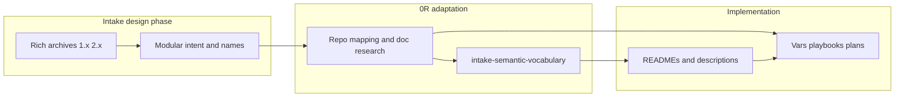
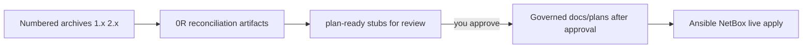

# WIP — Intake principles (external design → this repo)

**Status:** interim guidance — not global project law  
**Companion:** [interim_intake_instructions.md](./interim_intake_instructions.md) (how to execute)  
**Scope:** Work brought in from ChatGPT / other AI sessions with placeholders, generalities, and names that do not match live inventory.

---

## Why this document exists

You often work out ideas **outside** the repo (another AI, no inventory, no naming schema), then bring exports here. That is a **multi-step** path to repo-ready work — not the only way all work enters the project, but it covers most “external brainstorm → homelab implementation” flows.

**Goal:** Turn adapted intake into **reviewable plan slices** with change contracts — so you can score, suggest, and approve before anything is built.

---

## Core principles

### 1. Capabilities first, names second

Intake describes **what** the lab should do. The agent extracts capabilities, then maps each to **existing** repo surfaces or a **named gap** (plan slice). Never deploy from export filenames or ChatGPT role prefixes alone.

### 2. Fresh documentation check for every NEW surface

When intake implies a **new** integration the repo does not already implement (Langfuse feature, LiteLLM router mode, vLLM option, IDE client pattern, NetBox object type):

1. Use your **general guidance** (this folder, layer model, operator host truth).
2. **Research in scope** from authoritative sources — not training memory alone.
3. Record **what pattern you chose** and **which doc/recipe** justified it.

| Surface | Research path (use before design rows) |
|---------|--------------------------------------|
| **Langfuse** | Repo [langfuse skill](../../../../.cursor/skills-cursor/langfuse/SKILL.md) — `llms.txt` index, WebFetch langfuse.com, LiteLLM↔Langfuse integration pages; [1.4.0](./1.4.0-langfuse-cookbook-patterns-REFERENCE.md) as intake provenance only |
| **LiteLLM** | [proxy config](https://docs.litellm.ai/docs/proxy/configs), [vLLM provider](https://docs.litellm.ai/docs/providers/vllm); `roles/k3s_litellm_gateway/` |
| **vLLM** | Repo vLLM plans under `docs/plans/2026-05-19--*` and `2026-05-28--*`; [vllm-architecture-discussion.md](./vllm-architecture-discussion.md) |
| **Ansible shape** | `ansible-mcp` / `list_tasks`, [ASSESSMENT.md](./ASSESSMENT.md), [capability_introduction_checklist.md](../../codex_framework/capability_introduction_checklist.md) |
| **Naming** | `docs/reference/naming-standards/` |

**Gate:** No reconciliation row marked `design-complete` without a **Sources checked** line for that surface.

### 2.5 Expert fill gate for brainstormed requirements

Imported brainstorms often define **needs and capabilities** more clearly than
they define exact resources. That is expected. It is also a binding research
trigger.

When a slice includes open-ended choices such as model candidates, GPU/runtime
placement, host assignment, model downloads, NetBox metadata shape, privacy
routing, or IDE/client behavior:

1. Preserve the intake need and friendly purpose names.
2. Run a **source-backed expert research pass** for the resource family before
   pinning implementation values.
3. Run **read-only live probes** for the target lab surface before assigning the
   resource to a host, guest, GPU, service, NetBox object, or inventory group.
4. Record why each chosen value fits the need, including blockers and deferred
   candidates.

For AI model work, the research pass must cover at least:

| Choice | Required research / evidence before pinning |
|--------|---------------------------------------------|
| HF model candidate | Model card or primary source, license/use limits, quantization format, context length, serving notes |
| Runtime fit | vLLM support/compatibility, memory and VRAM expectations, concurrency or embedding support as relevant |
| Host placement | Read-only GPU inventory/VRAM probe, host/guest reachability, existing K3s or Docker runtime state |
| Catalog row | Storage location, expected size, download/cache strategy, status (`candidate`, `downloaded`, `served`, `deferred`) |
| LiteLLM alias | Purpose, routing policy, privacy class, upstream model/backend, `api_base` readiness |
| NetBox metadata | Native field/tag/config-context decision, repo registry row, consistency gate path |

**Gate:** Do not mark a plan-ready or governed plan as buildable for such a
slice until it has an **Expert research and live probe receipt** or a blocking
row explaining which research/probe is missing.

### 2.6 Suggestion review and trajectory gate

For pattern-heavy intake, especially cookbook/eval/reference material, the agent
must review **each suggestion**. "Not implementing now" is not enough.

Each suggestion needs a disposition:

| Disposition | Meaning | Required output |
|-------------|---------|-----------------|
| `implement-now` | Fits the current slice and prerequisites are met | Change contract + verification row |
| `extract-knowledge` | Useful idea, but not a task | README/glossary/schema wording target |
| `defer-with-trajectory` | Useful but too broad or blocked | Follow-on plan/issue target, prerequisite, first concrete next step |
| `reject` | Does not fit repo truth or product direction | Reason and replacement path if any |

**Gate:** A cookbook, eval, or brainstorm suggestion is not processed until it
has one of those dispositions and, for partial adoption, a trajectory to full
implementation later.

### 2.7 On-deck decision gate

When you explicitly decide an item during review, that decision becomes part of
the active work immediately. The agent must add it to the bottom of the relevant
plan or plan-ready stub under:

```markdown
## On Deck — user decisions to integrate
```

This is allowed as a short holding area while a broad decision touches multiple
plans. It is not allowed to remain vague before build.

**Gate:** No plan from this intake folder may proceed to build/execute while it
has unresolved on-deck rows. Each row must be integrated into the plan body,
checklist, dependency graph, and verification receipt; routed to a named sibling
plan; or closed by a later operator correction.

Sequencing may say which task runs first, but it must not narrow scope. If the
operator decides "implement several agent types and model lanes now", the plan
chain must carry the full agent/model purpose set even when some rows are
blocked on research, probes, or secondary runtime commissioning.

### 3. Multi-layer stack (do not collapse)

Each intake **job** may need **multiple rows** — one per layer touched:

| Layer | Question | Typical repo owner |
|-------|----------|-------------------|
| **Catalog / weights** | Which HF id, where on disk? | Storage share manifest (future) |
| **vLLM (runner)** | Which model loaded, which OpenAI URL? | `k3s_vllm_runtime` |
| **LiteLLM (gateway)** | Friendly alias → `model_name`, `litellm_params`, `api_base`? | `k3s_litellm_gateway` |
| **Langfuse (observability)** | Which trace fields, callbacks, projects? | `k3s_langfuse_platform`, LiteLLM `success_callback` |
| **IDE / operator client** | Base URL, env vars, which alias? | `deploy_development_nodes`, Mac hosts file |

LiteLLM fields (`model_name`, `litellm_params.model`, `api_base`) **remain** the mature contract for model lanes — they live in `k3s_litellm_gateway_model_list` and schema registry rows, not in intake prose.

### 4. Two promotion paths

| Promote to SSOT | Do not promote |
|-----------------|----------------|
| Model lane slugs (`code-deep`), routing policies, LiteLLM/Helm config | Intake GPU lane **titles** (`5090 lane`) as registry IDs |
| Inventory host/guest names, service slugs (`vlm`, `llm`) | Raw `ai_*` paths without mapping to shipped roles |
| Langfuse metadata keys aligned to aliases | Duplicate NetBox taxonomy for chat vocabulary |

### 5. `ai_*` names — evaluate modularity, do not only reject

ChatGPT proposed roles like `ai_litellm_gateway`, `ai_vllm_runtime`. Repo ships `k3s_litellm_gateway`, etc.

**Required evaluation** (see [plan-ready/ansible-modularity-and-ai-role-names.md](./plan-ready/ansible-modularity-and-ai-role-names.md)):

- Was the **separation of concerns** in intake better than a bloated monolith playbook?
- Should any intake **capability labels** become schema vocabulary or a **future cleanup** issue (split playbook, extract role)?
- Capture good names in a **candidate table** even when implementation extends existing `k3s_*` roles.

### 6. Plans are the handoff — with change contracts

Reconciliation output should reach **plan-ready** stubs under [plan-ready/](./plan-ready/) with:

- Apply / Verify / Undo / Change class  
- Dependencies (e.g. vLLM URL before LiteLLM aliases)  
- Obligation IDs for your review  

**Live apply** only after you approve a governed `docs/plans/YYYY-MM-DD--slug/` packet — not from raw chat exports.

### 7. Operator truth wins on hosts

| Role | Host |
|------|------|
| Primary GPU / vLLM primary | `hom-lab-ctl-hvh-02` → `hom-lab-ctl-k3s-02` |
| Storage / second GPU jobs | `hom-lab-ctl-hvh-01` |
| Third desktop | `dev-workstation-win` — design/stub only |

Service **placement drift** (Langfuse on k3s-02 today vs hvh-01 intent) is a **decision**, not silent SSOT.

### 8. Placeholders are provenance

Ollama, `second-gpu-host`, `node_classes` without inventory mapping — **replace** in technical mapping tables; keep original only in archive files.

### 9. Preserve rich intake meaning in what we ship (do not strip to IDs only)

The numbered archives (`1.0.0`–`2.3.0`) are **modular design writing**: clear names, job descriptions, workflow steps, and high-level intent. Reconciliation adds repo truth (hosts, `model_list` rows, doc checks). **Both belong in sequence** — design intake first, research and implementation second.

**Do not** reduce implementation artifacts to bare slugs with no context. Carry forward:

| Where humans read | What to preserve from intake |
|-------------------|------------------------------|
| Role `README.md` | Capability purpose, who calls it, workflow step it supports |
| Playbook `name:` / tags | Intake capability label in the **task name** (e.g. “Deploy LiteLLM model lane gateway”) |
| `defaults/main.yml` comments | Plain-language job (“heavy coding”, “private reasoning”) beside technical vars |
| `argument_specs` / parameter descriptions | Intake phrase + repo mapping in `description:` |
| Plan packets | “What this slice delivers” prose from intake — not only checklist IDs |
| Schema / registry `description` fields | Friendly meaning; slug stays compact |

**Living glossary:** [intake-semantic-vocabulary.md](./intake-semantic-vocabulary.md) — intake term → repo artifact → still-open definition.

Rich intake also **surfaces gaps**: terms that need new schema rows, README sections, or plan slices appear when you compare prose to repo — that is a feature, not noise.



**Rule:** Every plan-ready stub and promoted plan must include a short **“Intake intent (preserved)”** section quoting or paraphrasing the source archive — with a link to the numbered file and line/section when possible.

---

## What “done” looks like for this WIP folder



You review **plan-ready/** and evaluations — suggest cuts or changes — then direct **build** on approved slices only.

---

## Related repo docs

- [ai-homelab-layer-model.md](../../reference/ai-homelab-layer-model.md)
- [framework-partner-process.md](../../codex_framework/partner_process.md)
- [capability_introduction_checklist.md](../../codex_framework/capability_introduction_checklist.md)
