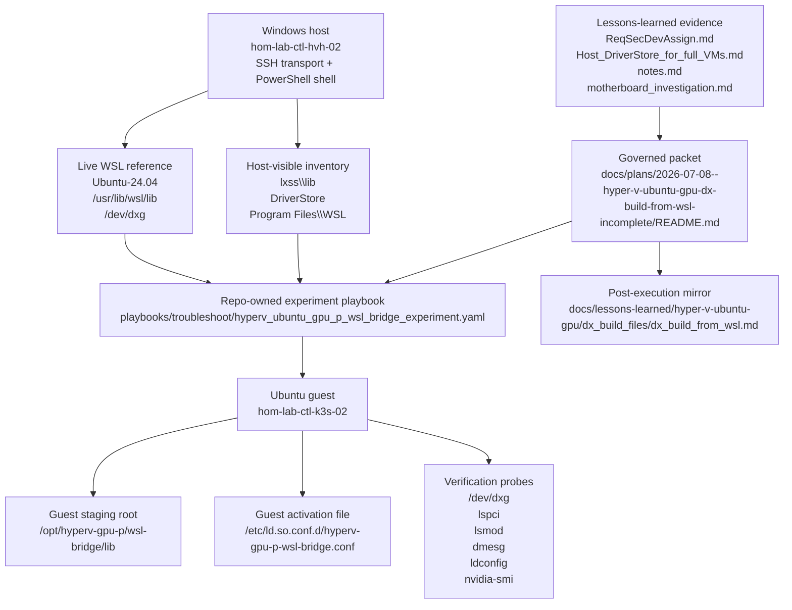
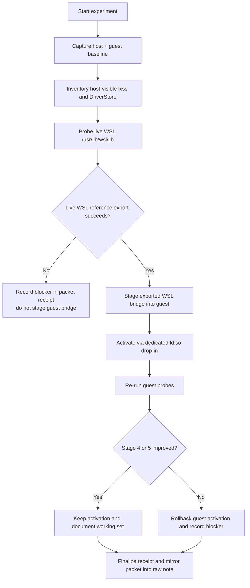
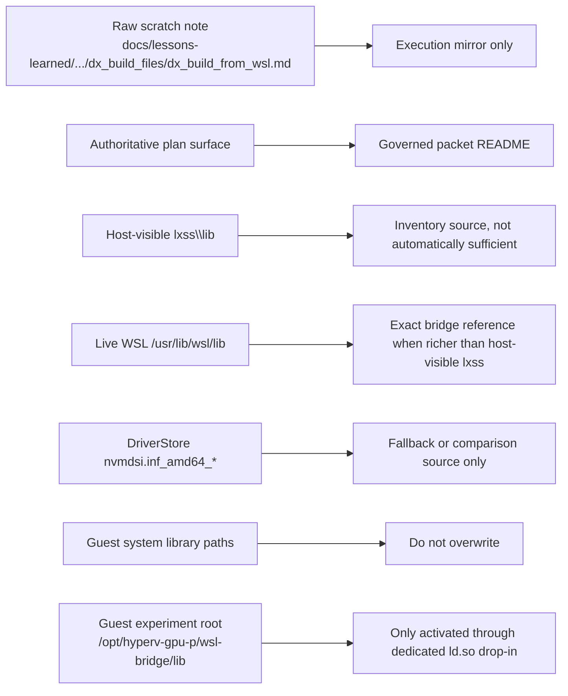

# Hyper-V Ubuntu GPU-P WSL Bridge Experiment Packet

## Summary

This packet governs a bounded troubleshooting experiment for `hom-lab-ctl-k3s-02`: use the host's working WSL GPU bridge layout as the reference model for a full Ubuntu Hyper-V VM that already passes host-side GPU-P attach and boot, but still fails to expose a usable guest GPU interface.

Baseline truth before execution:

- Host can partition the RTX 5090.
- `hom-lab-ctl-k3s-02` can receive the GPU partition adapter.
- `hom-lab-ctl-k3s-02` can boot with it attached.
- Ubuntu guest does not expose `/dev/dxg`, does not show an NVIDIA PCI device, and only shows the Microsoft Basic Render path.
- Host-side WSL bridge evidence exists and must be inventoried before any guest staging.

This README is the authoritative packet. The mirrored lesson note at `docs/lessons-learned/hyper-v-ubuntu-gpu/dx_build_files/dx_build_from_wsl.md` remains an execution mirror only and must be backfilled from this packet after the run is complete.

## Capability Packet Boundary

| Field | Value |
|-------|-------|
| Capability identifier | `hyperv_ubuntu_gpu_p_wsl_bridge_experiment` |
| Owner manifest | None; this is a governed experimental troubleshooting packet, not a manifest-backed capability |
| Owned files | This packet README, the repo-owned experiment playbook, and the post-execution mirror note at `docs/lessons-learned/hyper-v-ubuntu-gpu/dx_build_files/dx_build_from_wsl.md` |
| Integration anchors | Existing Hyper-V Ubuntu GPU-P evidence under `docs/lessons-learned/hyper-v-ubuntu-gpu/`, inventory connection surfaces for `hom-lab-ctl-hvh-02` and `hom-lab-ctl-k3s-02`, and the host's WSL/NVIDIA library paths |
| Update behavior | Re-runnable experiment packet with explicit snapshot, stage, activate, verify, rollback, and receipt phases |
| Removal behavior | Delete the experiment playbook and packet; remove any guest linker override and staged guest libraries if present; keep historical lessons unless explicitly retired |

## Apply / Verify / Undo / Change Class

| Field | Value |
|---|---|
| Apply | Run `playbooks/troubleshoot/hyperv_ubuntu_gpu_p_wsl_bridge_experiment.yaml` to gather a WSL reference snapshot on `hom-lab-ctl-hvh-02`, stage a Linux GPU bridge set into `hom-lab-ctl-k3s-02`, and record the outcome |
| Verify | Re-check the five-stage ladder: partitionable host GPU, VM adapter present, VM boots, guest exposes `/dev/dxg` or equivalent guest GPU path, guest can resolve and call the staged GPU runtime |
| Undo | Remove the guest linker drop-in and staged library tree, rerun `ldconfig`, and prove the guest returned to its pre-experiment state |
| Change class | Experimental live host/guest troubleshooting with explicit rollback |

## Public Interfaces / Types

- Governing packet: `docs/plans/2026-07-08--hyper-v-ubuntu-gpu-dx-build-from-wsl-incomplete/README.md`
- Repo-owned execution entrypoint: `playbooks/troubleshoot/hyperv_ubuntu_gpu_p_wsl_bridge_experiment.yaml`
- Guest staging contract:
  - guest root: `/opt/hyperv-gpu-p/wsl-bridge`
  - guest library dir: `/opt/hyperv-gpu-p/wsl-bridge/lib`
  - guest linker drop-in: `/etc/ld.so.conf.d/hyperv-gpu-p-wsl-bridge.conf`
- Receipt evidence contract:
  - Hyper-V host GPU-P state
  - host-visible `lxss` and DriverStore inventory
  - live WSL `/usr/lib/wsl/lib` reference snapshot
  - guest baseline / post-activation / post-rollback probes
  - final five-stage ladder classification

## Key Changes

### 1. Establish the authoritative packet and mirror rule

- Use this packet as the execution authority; do not execute from the empty raw note.
- Treat `dx_build_from_wsl.md` as a post-execution mirror target only.
- Backfill the raw note from this packet after receipt completion.

### 2. Build the WSL reference set before touching the guest

- Inventory:
  - `C:\Windows\System32\lxss\lib`
  - `C:\Program Files\WSL`
  - `C:\Windows\System32\DriverStore\FileRepository\nvmdsi.inf_amd64_e82263d194ad754a`
- If callable, inspect the live WSL distro for:
  - `/dev/dxg`
  - `ldconfig -p | egrep 'cuda|nvidia|dxcore|d3d12'`
  - the exact `/usr/lib/wsl/lib` filenames and symlink relationships
- Use the live WSL bridge as the exact reference set when it exposes files not visible through the host-side `lxss` path.

### 3. Stage a bounded guest activation experiment

- Export the live WSL bridge set from the host.
- Stage it under `/opt/hyperv-gpu-p/wsl-bridge/lib` on `hom-lab-ctl-k3s-02`.
- Activate it only through a dedicated linker drop-in.
- Do not overwrite distro-owned guest library paths.

### 4. Lock verification and stop conditions

- Baseline and post-activation probes must cover:
  - `/dev/dxg`
  - `/dev/nvidia*`
  - `lsmod`
  - `lspci`
  - `dmesg`
  - `ldconfig -p`
  - `nvidia-smi`
  - a minimal `ctypes` load test for `libdxcore.so`, `libd3d12.so`, `libcuda.so.1`, and `libnvidia-ml.so.1`
- If the guest still shows no usable stage 4 or 5 improvement, roll back immediately and record the blocker.

### 5. Record rollback and final state

- Rollback is mandatory when the guest still lacks a usable GPU interface after activation.
- Receipt status may be `blocked` or `fail`, but not `implemented`, if the guest still cannot reach stage 4 or 5.

### 6. Stable return note

- If the experiment needs to be abandoned and the VM returned to the pre-staging state, use the rollback path encoded in `playbooks/troubleshoot/hyperv_ubuntu_gpu_p_wsl_bridge_experiment.yaml`.
- The stable-return steps are:
  - remove the staged WSL bridge files
  - remove the linker drop-in
  - rerun `ldconfig`
  - verify the guest is back to the pre-experiment library state
- This is an experiment rollback, not a full Hyper-V VM snapshot or restore point.

## Architecture/Structure Diagram

## Capability Routing Diagram

## Naming/Modeling Diagram

## Test Plan

- Verify the packet records the current baseline correctly: host stages 1-3 pass and guest stages 4-5 fail before activation.
- Verify the host reference inventory distinguishes:
  - host-visible `lxss` bridge files
  - live WSL bridge files
  - DriverStore fallback files
- Verify staged guest files are placed only under `/opt/hyperv-gpu-p/wsl-bridge/lib`.
- Verify the activation path uses only `/etc/ld.so.conf.d/hyperv-gpu-p-wsl-bridge.conf`.
- Verify post-activation probes explicitly test:
  - `/dev/dxg`
  - `lspci | grep -i nvidia`
  - `lsmod`
  - `dmesg`
  - `ldconfig -p`
  - `nvidia-smi`
  - the Python `ctypes` load test
- Verify rollback returns the guest to the pre-experiment state when the activation fails to unlock a usable stage 4 or 5 result.
- Verify the packet receipt classifies the final result on the five-stage ladder.
- Verify the finalized packet body is copied into `docs/lessons-learned/hyper-v-ubuntu-gpu/dx_build_files/dx_build_from_wsl.md` after execution.

## Assumptions And Defaults

- The raw `dx_build_from_wsl.md` file is intentionally treated as empty scratch space at the start of this slice.
- The governed packet under `docs/plans/**` is the official plan home for this effort.
- The live WSL distro is allowed to refine the host bridge source set when it exposes files that are not visible through simple host-side `lxss` inspection.
- This slice is an experiment to unlock guest stage 4 or 5, not a guarantee that a WSL-derived bridge will make a full Ubuntu Hyper-V VM behave like WSL.

## Diagram gate receipt

- [x] Architecture/Structure: repo paths, external resources, data/control flow, naming scheme, variable SSOT sources, tag/playbook wiring
- [x] Capability Routing: included
- [x] Naming/Modeling: included
- [x] Diagram Inventory lists every required section above, not only diagrams actually drawn

## Plan verification receipt

Execution outcome now proven by the follow-on `dxgkrnl-dkms` adoption slice.

What this packet proved:

- The live WSL library bridge was a valid source for guest `/usr/lib/wsl/lib`.
- That library set was enough to help unlock stage 4:
  - `/dev/dxg`
  - `dxgkrnl` module load
  - render device bound to `dxgkrnl`

What this packet alone was not enough to prove:

- Stage 5 did not close until the guest also had the exact traced NVIDIA DriverStore subtree under:
  - `/usr/lib/wsl/drivers/nvmdsi.inf_amd64_e82263d194ad754a`

Decisive follow-on evidence:

- Guest `strace` on `nvidia-smi` showed an `ENOENT` for:
  - `/usr/lib/wsl/drivers/nvmdsi.inf_amd64_e82263d194ad754a/libnvidia-ml.so.1`
- After that exact subtree was populated, `nvidia-smi` succeeded and reported the RTX 5090.

Implication for future automation:

- This packet's staged-library method remains the right model for `/usr/lib/wsl/lib`.
- A complete automation path must also handle the exact runtime-reported DriverStore subtree under `/usr/lib/wsl/drivers`, not just the library bridge set.

## Diagram Inventory

- **Architecture/Structure Diagram**: included
- **Capability Routing Diagram**: included
- **Naming/Modeling Diagram**: included
- **Sequence Diagram**: not included; the routing diagram covers the ordered experiment flow for this slice
- **State Diagram**: not included; the five-stage ladder and receipt classify the outcome
