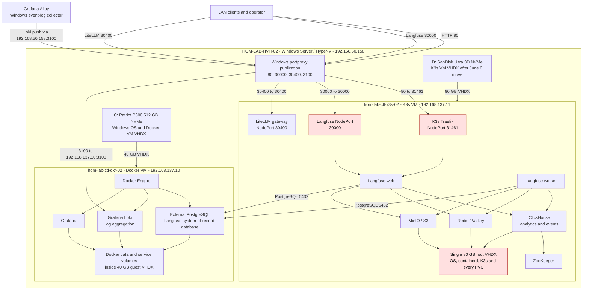
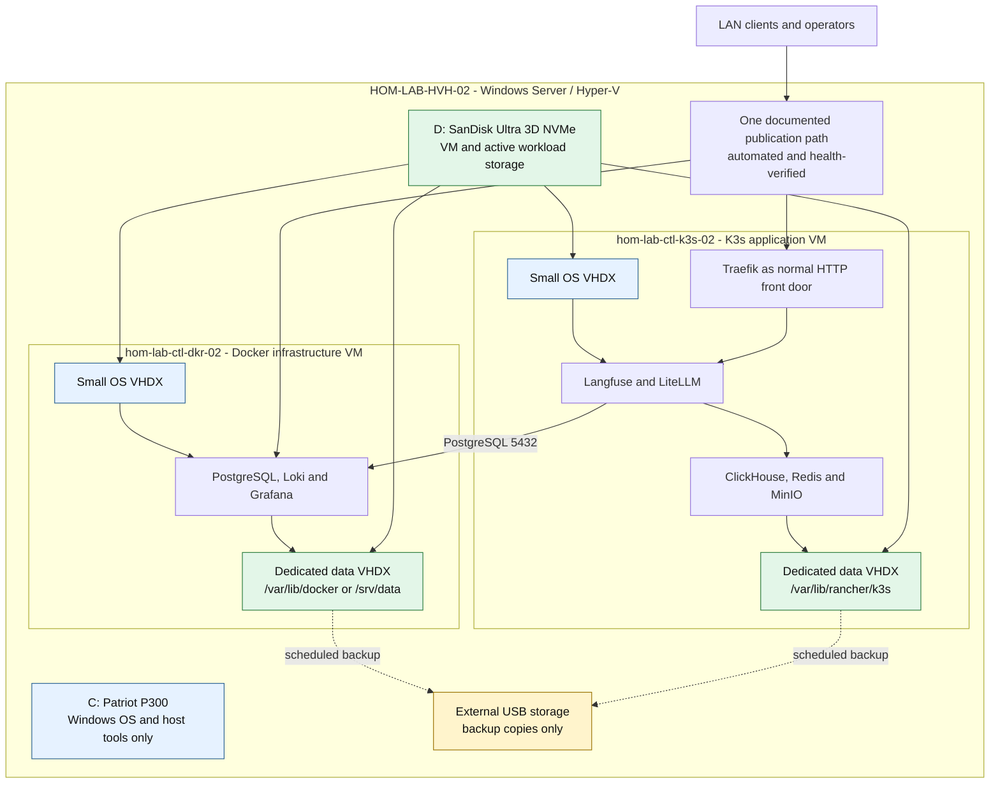

# Langfuse Two-Server Infrastructure Retrospective

## Scope

This retrospective maps the Langfuse-related services across the two Linux
guests hosted by `HOM-LAB-HVH-02`. It combines repo-declared topology with
live troubleshooting evidence gathered after the Windows host experienced a
slow login, a prolonged black screen, and a stalled Server Manager splash.

There are exactly two Linux guests on this 5090 Hyper-V host: the Docker guest
`hom-lab-ctl-dkr-02` and the K3s guest `hom-lab-ctl-k3s-02`. Loki, Grafana, and
Langfuse's external PostgreSQL database run on the Docker guest. The Langfuse
web/worker application and its K3s-side dependencies run on the K3s guest.
They behave like separate servers at the service layer, but both depend on the
same physical Windows Hyper-V host. During the incident both VM disks shared
`C:`; after the immediate repair, the Docker VM remains on `C:` and the K3s VM
runs from `D:`.

## Current Layout After Immediate Repair

### What The Incident Proved

- `hom-lab-ctl-k3s-02.vhdx` continuously read at roughly 135 MB/s from the
  Windows `C:` drive while ClickHouse repeatedly attempted MergeTree merges.
- ClickHouse was near its former 1536 MiB memory limit, had been OOM-killed,
  and accumulated thousands of failed readiness probes.
- Scaling ClickHouse to zero stopped the VHDX reads and immediately returned
  Windows storage queue depth and guest I/O wait to normal.
- Before the immediate repair, the Windows host, both Linux guests, and all K3s
  persistent volumes competed for the same Patriot P300 system disk.
- On June 6, 2026, the entire K3s VHDX was moved from `C:` to `D:`. The Docker
  guest remains on `C:`, and the K3s OS, containerd, and PVCs remain combined
  inside one VHDX on `D:`.
- After the move, `D:` has roughly 14 GB free. ClickHouse no longer saturates
  the Windows system disk, but its accumulated merge backlog still encounters
  memory-limit rejections. Increasing memory further is not safe without a
  separate capacity and ClickHouse tuning decision.
- The healthy Toshiba external USB disk is mounted as `E:` with label
  `backups`, and no active VM VHDX uses it. A native-host-recovery backup task
  targets `E:`, but its latest scheduled result is `1` (failed), so backups
  must not be treated as verified until that task is repaired and a restore is
  tested.

## Redundancy And Layout Findings

| Finding | Assessment | Correction |
| --- | --- | --- |
| Langfuse is published through both a dedicated NodePort and Traefik | Redundant publication paths increase configuration and troubleshooting surface | Select Traefik as the normal HTTP front door; retain a direct NodePort only as an explicitly documented recovery path |
| Windows portproxy fronts Docker and K3s services | Necessary with the current routed-private guest layout, but it is a publication single point and stale-listener risk | Keep it automated and verified; prefer direct routed guest access or a dedicated ingress/load-balancer address as the network matures |
| Docker and K3s each provide service, storage, and publication surfaces | Intentional platform separation can be useful, but it duplicates operations and capacity overhead | Keep Docker for shared infrastructure and K3s for clustered application workloads; document ownership and avoid deploying the same service in both |
| PostgreSQL runs on Docker while Langfuse runs on K3s | Reasonable separation of durable database and application lifecycle, but creates a cross-guest dependency | Keep only if PostgreSQL has explicit backup, readiness, and network verification |
| Loki used an impossible in-container shell-and-`wget` healthcheck | Incorrect: the distroless Loki image contains neither a shell nor `wget`, so Docker reported a false unhealthy state | Clear the invalid Docker healthcheck and perform the official `/ready` probe from the Docker host with a recurring systemd timer |
| Both VM VHDXs lived on Windows `C:` during the incident | Incorrect for sustained database and container I/O; the K3s VHDX has now been moved to `D:` | Keep active K3s storage off `C:` and separately evaluate the Docker VM placement |
| K3s root, containerd, and all PVCs share one VHDX | High blast radius and no I/O isolation; ClickHouse activity can stall the guest and Windows host | Split guest OS and workload data into separate VHDXs and mounts |
| ClickHouse used an undersized memory limit | Incorrect for the observed merge workload; caused OOM and recovery churn | Use explicit requests and limits, monitor merges, and size from observed workload |

## Recommended Target Layout

## Recommended Sequence

1. Stabilize ClickHouse and verify it no longer creates sustained disk queueing.
2. Back up both guests and confirm recovery procedures.
3. Completed June 6, 2026: during a controlled outage, move the K3s guest VHDX
   from `C:` to `D:` as the immediate performance correction.
4. Add separate data VHDXs and migrate Docker and K3s workload data to their
   dedicated mounts.
5. Consolidate Langfuse publication around Traefik and document any retained
   direct NodePort as recovery-only.
6. Add capacity, disk-latency, ClickHouse-merge, and endpoint-readiness
   monitoring before expanding the AI service stack.

## Evidence Surfaces

- `inventory/host_vars/HOM-LAB-HVH-02.yaml`
- `inventory/host_vars/hom-lab-ctl-dkr-02.yaml`
- `inventory/host_vars/hom-lab-ctl-k3s-02.yaml`
- `roles/hyperv_ubuntu_vm/defaults/main.yml`
- `roles/k3s_langfuse_platform/`
- `roles/logging_loki/`
- Live Hyper-V VHDX counters, Windows disk counters, K3s pod state, and
  ClickHouse logs gathered during the incident.
