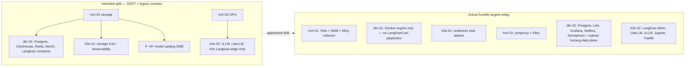
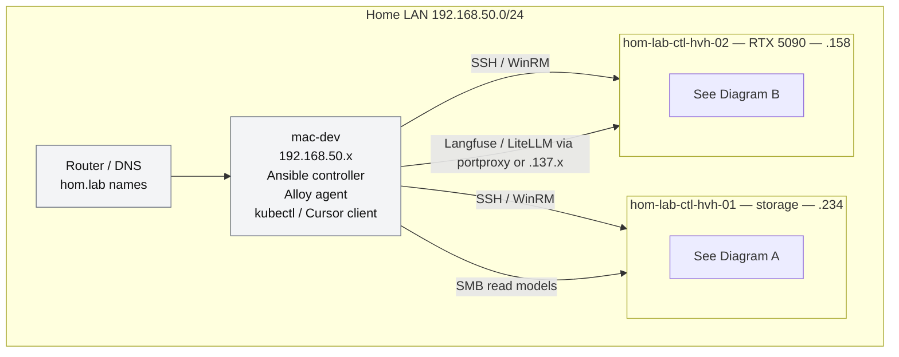
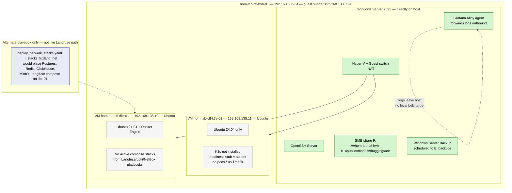
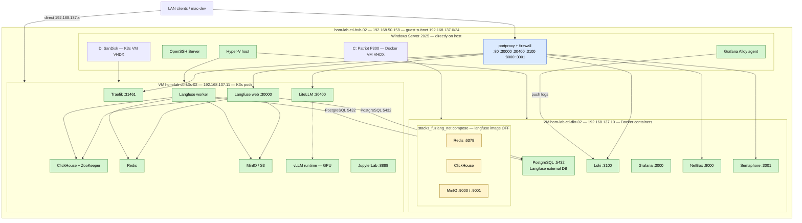
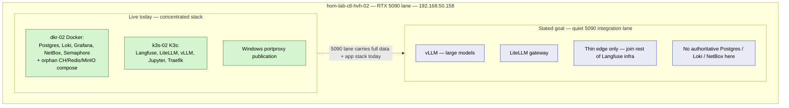

# Two Physical Servers — Langfuse & Dependent Services Distribution

## Scope

Read-only retrospective: where Langfuse and its dependency graph are **declared**
to live vs where Ansible playbooks **actually target** today. No changes applied.

**Physical hosts**

| Host | Role (repo) | LAN IP | Guest subnet |
|------|-------------|--------|--------------|
| `hom-lab-ctl-hvh-01` | storage / observability (`hyperv_lane_storage`) | `192.168.50.234` | `192.168.138.0/24` |
| `hom-lab-ctl-hvh-02` | primary GPU / execution (`hyperv_lane_gpu`, RTX 5090) | `192.168.50.158` | `192.168.137.0/24` |

**Linux guests**

| Guest | Physical parent | Guest IP | Lane intent |
|-------|-----------------|----------|-------------|
| `hom-lab-ctl-dkr-01` | hvh-01 | `192.168.138.10` | Storage Docker engine |
| `hom-lab-ctl-k3s-01` | hvh-01 | `192.168.138.11` | Storage K3s stub |
| `hom-lab-ctl-dkr-02` | hvh-02 | `192.168.137.10` | GPU-lane Docker |
| `hom-lab-ctl-k3s-02` | hvh-02 | `192.168.137.11` | GPU-lane K3s |

Related prior work (5090 guests only, incident-driven):
[Singlegeneral-review-single-server-langfuse-two-server-infrastructure-retrospective.md](./Singlegeneral-review-single-server-langfuse-two-server-infrastructure-retrospective.md)

Layer vocabulary: [docs/reference/ai-homelab-layer-model.md](../../reference/ai-homelab-layer-model.md)

---

## Intended vs actual (summary)



**Headline:** The **design** says storage/authoritative data on hvh-01 and a **quiet**
5090 lane focused on inference + gateway + minimal integration. The **running
automation** still concentrates Langfuse, its K3s dependencies, LiteLLM, vLLM,
Jupyter, Loki, NetBox, and Semaphore on the **5090 lane** (`dkr-02` / `k3s-02`).

---

## Homelab context — where both physical servers sit



Legend for deployment diagrams:

- **Green** — live service targeted by current Ansible playbooks
- **Yellow** — deployed but likely unused / orphan relative to Langfuse path
- **Gray** — VM or engine present, no Langfuse/AI workload containers or pods
- **Blue dashed** — alternate playbook path exists but is not the live Langfuse stack

---

## Diagram A — Current deployment on `hom-lab-ctl-hvh-01` (storage physical server)

What is running **inside** each surface on this host today (repo automation targets).



**hvh-01 playbook anchors (what actually targets this host):**

| Surface | Service / workload | Role / playbook | Status |
|---------|-------------------|-----------------|--------|
| Windows | Hyper-V VMs | `hyperv_ubuntu_vm` | Live |
| Windows | Alloy log collector | `logging_alloy` / `logging.yaml` | Live |
| Windows | HF model SMB | `windows_file_shares` (host_vars) | Live |
| Windows | Server Backup | `windows_server_backup` | Live |
| `dkr-01` | Docker Engine only | `docker_engine` | Live — **no Langfuse/Loki containers** |
| `dkr-01` | fuzlang compose stack | `deploy_network_stacks.yaml` | **Alternate path — not live DB for Langfuse** |
| `k3s-01` | K3s cluster | `k3s_cluster_network` | VM only — **no K3s workloads** |

---

## Diagram B — Current deployment on `hom-lab-ctl-hvh-02` (5090 physical server)

What is running **inside** each surface on this host today (repo automation targets).



**hvh-02 playbook anchors:**

| Surface | Service | Role / playbook | Target |
|---------|---------|-----------------|--------|
| `dkr-02` Docker | PostgreSQL | `stacks_fuzlang_net` / `deploy_network_stacks_hvh02.yaml` | Active Langfuse DB |
| `dkr-02` Docker | Loki + Grafana | `logging_loki` / `logging.yaml` | `logging_server` |
| `dkr-02` Docker | NetBox | `ipam_netbox` | `hom-lab-ctl-dkr-02` |
| `dkr-02` Docker | Semaphore | `ansible_ui_semaphore` | `hom-lab-ctl-dkr-02` |
| `dkr-02` Docker | Redis / ClickHouse / MinIO compose | `stacks_fuzlang_net` | **Orphan — Langfuse uses K3s copies** |
| `k3s-02` K3s | Langfuse platform | `k3s_langfuse_platform` | web/worker + in-cluster CH/Redis/MinIO |
| `k3s-02` K3s | LiteLLM | `k3s_litellm_gateway` | gateway |
| `k3s-02` K3s | vLLM | `k3s_vllm_runtime` | GPU inference |
| `k3s-02` K3s | Jupyter | `dev_jupyterlab_workbench` | workbench |
| Windows | Alloy | `logging_alloy` | collector |
| Windows | portproxy | `guest_published_tcp_ports` | publication |

---

## Diagram C — `hvh-01` live vs planned (storage lane)

```mermaid
flowchart TB
  subgraph hvh01 ["hom-lab-ctl-hvh-01 — storage lane — 192.168.50.234"]
    subgraph live01 ["Live today"]
      l_smb["HF model SMB"]
      l_alloy["Alloy collector"]
      l_hv["Hyper-V + 2 Ubuntu VMs"]
      l_dkr_idle["dkr-01: Docker engine, no AI/obs stacks"]
      l_k3s_idle["k3s-01: Ubuntu only, no K3s"]
    end

    subgraph planned01 ["Planned / declared — hyperv_lane_storage + layer model"]
      p_pg["Postgres — Langfuse DB"]
      p_ch["ClickHouse"]
      p_redis["Redis"]
      p_minio["MinIO"]
      p_loki["Loki + long-retention logs"]
      p_nb["NetBox / Semaphore"]
      p_lf["Langfuse data plane"]
    end
  end

  live01 -.->|"storage lane not hosting Langfuse stack yet"| planned01

  classDef live fill:#d5f5d1,stroke:#2e7d32,color:#000
  classDef planned fill:#e8eaf6,stroke:#3949ab,color:#000
  class l_smb,l_alloy,l_hv,l_dkr_idle,l_k3s_idle live
  class p_pg,p_ch,p_redis,p_minio,p_loki,p_nb,p_lf planned
```



---

## Diagram D — `hvh-02` live vs planned (5090 lane)



---

## Diagram E — Cross-server dependencies (Langfuse data flow)

```mermaid
sequenceDiagram
  participant Client as LAN / mac-dev
  participant PP as hvh-02 portproxy
  participant T as k3s-02 Traefik
  participant LF as Langfuse web/worker
  participant PG as dkr-02 PostgreSQL
  participant CH as k3s-02 ClickHouse
  participant S3 as k3s-02 MinIO
  participant LLM as k3s-02 LiteLLM
  participant VLM as k3s-02 vLLM

  Client->>PP: langfuse.hom.lab :80 or :30000
  PP->>T: or direct NodePort 30000
  T->>LF: HTTP
  LF->>PG: SQL 5432 cross-guest
  LF->>CH: analytics
  LF->>S3: events/media
  Client->>PP: litellm.hom.lab :30400
  PP->>LLM: gateway
  LLM->>VLM: inference lane
  Note over PG,CH: Postgres on Docker guest;<br/>CH/Redis/MinIO on K3s guest
```

---

## Redundancy evaluation (from Diagrams A–D)

These findings are tied to what the deployment diagrams **show**, not guest
names alone.

### Confirmed redundant on `hvh-02` (Diagram B)

| What the diagram shows | Verdict | Why |
|------------------------|---------|-----|
| **Two ClickHouse instances** — Docker `d_ch` on `dkr-02` **and** K3s `lf_ch` on `k3s-02` | **Duplicate** | Langfuse Helm uses only the in-cluster ClickHouse. Docker ClickHouse is from `stacks_fuzlang_net` with compose Langfuse disabled — no playbook wires Langfuse to `192.168.137.10` ClickHouse. |
| **Two Redis instances** — Docker `d_redis` **and** K3s `lf_redis` | **Duplicate** | Same pattern: K3s Langfuse uses `langfuse-redis-master`; Docker Redis is orphan. |
| **Two MinIO instances** — Docker `d_minio` **and** K3s `lf_minio` | **Duplicate** | Langfuse events/media go to in-cluster MinIO; Docker MinIO is a second S3 endpoint on the same physical server. |
| **Langfuse HTTP via Traefik `:80` and NodePort `:30000`** | **Redundant publication** | Both are live paths through Windows portproxy. Operators can hit the same UI two ways. |
| **LiteLLM via Traefik hostname and NodePort `:30400`** | **Redundant publication** | Same dual-path pattern as Langfuse. |

**Not redundant (but structurally coupled):** PostgreSQL on `dkr-02` is the
**only** Langfuse database — K3s chart has `postgres_deploy: false`. That is
intentional split-DB, not duplication.

### Cross-server: not duplicate today, but latent duplicate risk (Diagrams A + B)

| What the diagrams show | Verdict | Why |
|------------------------|---------|-----|
| `hvh-01` `dkr-01` has Docker but **no live stacks** (Diagram A gray) | **Idle capacity — not duplicate yet** | Storage guest is empty of Langfuse workloads. |
| `deploy_network_stacks.yaml` alternate path on `dkr-01` (Diagram A dashed) | **Latent duplicate risk** | If applied while `dkr-02` stack stays up, you would get **second** Postgres / Redis / ClickHouse / MinIO / Langfuse compose on the **other physical server** with no migration plan. |
| HF SMB on `hvh-01` + vLLM on `hvh-02` | **Intentional split** | Model files vs inference runtime — correct, not duplicate. |
| Alloy on **both** Windows hosts | **Intentional** | Collectors on each physical server; not duplicate services. |

### Placement drift visible when comparing Diagram C vs Diagram D

| Live (diagrams) | Planned (diagrams) | Assessment |
|-----------------|-------------------|------------|
| Diagram B: Loki, NetBox, Semaphore, Postgres on `dkr-02` | Diagram C: those on `hvh-01` storage lane | **Wrong physical server** for observability/authoritative data — not duplicate, but opposite of design intent. |
| Diagram B: full Langfuse + deps on `k3s-02` | Diagram D: 5090 should be vLLM + LiteLLM + thin edge only | **Overloaded 5090 lane** — Langfuse stateful deps should not live here in target state. |
| Diagram A: storage VMs idle for Langfuse | Diagram C: storage hosts data plane | **Underused storage lane** — half of the two-server distribution is not doing its job. |

### Summary count

| Category | Count on `hvh-02` today |
|----------|-------------------------|
| **True duplicates** (same role, same server, one unused) | 3 — Docker Redis, ClickHouse, MinIO vs K3s copies |
| **Redundant publication paths** | 2 — Langfuse and LiteLLM dual ingress |
| **Cross-guest coupling** (not duplicate) | 1 — Postgres Docker ↔ Langfuse K3s |
| **Cross-server latent duplicate** | 1 — `deploy_network_stacks` on `dkr-01` if ever applied alongside `dkr-02` |
| **Correct intentional splits** | 2 — HF SMB on hvh-01; Alloy per host |

---

## Service placement matrix (Langfuse ecosystem)

| Service | Intended lane (design docs) | Actual target (playbooks) | Duplicate elsewhere? |
|---------|---------------------------|---------------------------|----------------------|
| Langfuse web/worker | hvh-01 or storage K3s | **k3s-02** | Docker compose disabled on dkr-02 |
| PostgreSQL (Langfuse DB) | hvh-01 / dkr-01 | **dkr-02** | Docker fuzlang stack also on dkr-01 if `deploy_network_stacks` run |
| ClickHouse | hvh-01 (intent) | **k3s-02 in-cluster** | **Yes — docker clickhouse on dkr-02 (orphan)** |
| Redis | hvh-01 (intent) | **k3s-02 in-cluster** | **Yes — docker redis on dkr-02 (orphan)** |
| MinIO / S3 | hvh-01 (intent) | **k3s-02 in-cluster** | **Yes — docker minio on dkr-02 (orphan)** |
| LiteLLM gateway | 5090 K3s | **k3s-02** | No |
| vLLM | 5090 K3s | **k3s-02** | No |
| Jupyter | dev on K3s | **k3s-02** | No |
| Loki / Grafana | storage / observability | **dkr-02** | No on hvh-01 |
| Alloy collectors | both Windows hosts | **hvh-01 + hvh-02** | No — by design |
| HF model files | hvh-01 SMB | **hvh-01 SMB** | No |

---

## Alignment with stated goals

| Goal | Current state |
|------|----------------|
| **hvh-01 = storage + collector** | **Partial** — SMB model catalog and Alloy yes; Loki/Langfuse/Postgres authoritative stack still on 5090 lane |
| **hvh-02 = quiet 5090 + large models + minimal integration** | **Not met** — 5090 lane hosts full Langfuse Helm chart, LiteLLM, vLLM, Jupyter, plus Docker infra (Loki, NetBox, Semaphore, Postgres) |
| **Distributed between two physical servers** | **Physical separation exists** (two Hyper-V hosts), but **Langfuse runtime is not distributed** — it is consolidated on hvh-02 with storage lane mostly idle for this stack |

---

## Evidence surfaces (repo)

- `inventory/group_vars/hyperv_lane_storage/main.yml`
- `inventory/group_vars/hyperv_lane_gpu/main.yml`
- `inventory/host_vars/hom-lab-ctl-hvh-01.yaml`
- `inventory/host_vars/hom-lab-ctl-hvh-02.yaml`
- `inventory/host_vars/hom-lab-ctl-dkr-01.yaml`
- `inventory/host_vars/hom-lab-ctl-dkr-02.yaml`
- `inventory/host_vars/hom-lab-ctl-k3s-01.yaml`
- `inventory/host_vars/hom-lab-ctl-k3s-02.yaml`
- `inventory/inventory.yaml` — `logging_server`, `k3s_cluster_*`
- `roles/k3s_langfuse_platform/defaults/main.yml` — external Postgres, in-cluster CH/Redis/MinIO
- `roles/stacks_fuzlang_net/templates/docker-compose.yml.j2`
- `playbooks/deploy_network_stacks.yaml`, `deploy_network_stacks_hvh02.yaml`
- `playbooks/deploy_langfuse_platform.yaml`, `deploy_litellm_gateway.yaml`, `deploy_vllm_runtime.yaml`
- `docs/reference/ai-homelab-layer-model.md`
- `contracts/fuzlang.contract.yaml` (legacy placement scaffold)

Live runtime may differ from last apply; this document reflects **automation SSOT**
and declared inventory, not a live probe pass.

---

## Diagram inventory

### Included

- Homelab context (LAN + mac-dev + both physical servers)
- **Diagram A** — `hvh-01` current deployment (Windows + VM internals)
- **Diagram B** — `hvh-02` current deployment (Windows + Docker containers + K3s pods)
- **Diagram C** — `hvh-01` live vs planned
- **Diagram D** — `hvh-02` live vs planned
- **Diagram E** — cross-guest Langfuse data flow
- Intended vs actual summary (top of doc)

### Available on request

- Portproxy / Traefik / NodePort publication-only view
- Disk / VHDX placement (from prior 5090 incident doc)
- Target-state diagram after storage-lane convergence
