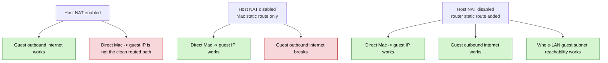

# Hyper-V Routed Guest Subnet Needs Either An Upstream Router Route Or Host NAT

## Problem

Direct controller access to the Hyper-V guest IP and guest outbound internet
egress did not both work at the same time on `hom-lab-ctl-hvh-02`.

## What was happening

The lane had been moved to:

- `guest_network_mode: "routed_private_subnet"`

but direct Mac-to-guest access was still broken while Windows `HyperVGuestNat`
was present.

After removing `HyperVGuestNat`:

- direct `mac-dev -> 192.168.137.10` started working
- guest outbound internet/package access stopped working

## Root cause

The Windows host and the Mac route were not the whole story.

The missing dependency was the upstream router path:

- the router did not know that `192.168.137.0/24` should be reached through
  `192.168.50.158`

That means the design has two different working models:

1. keep Windows host NAT enabled
2. disable host NAT and teach the upstream router the guest subnet

Trying to stay halfway between those models creates confusing behavior.

## Visual summary

## Live proof

What we proved during troubleshooting:

- with `HyperVGuestNat` enabled:
  - guest outbound internet worked
  - direct Mac-to-guest TCP did not
- packet capture on the guest showed:
  - Mac SYN arrived
  - guest SYN-ACK returned
  - the direct path still failed from the client side
- after removing `HyperVGuestNat`:
  - `nc` to `192.168.137.10:22` succeeded from the Mac
  - `curl http://192.168.137.10:8000/api/status/` returned `200`
  - guest `curl https://example.com` and `nc 1.1.1.1 443` failed

## Fix options

### Option 1: keep host NAT

Use this when you want:

- guest outbound internet/package access
- no router change right now

Accept that:

- true direct routed guest-IP access is not the clean final design

### Option 2: disable host NAT and add router static route

Use this when you want:

- direct guest-IP access
- whole-LAN routed-subnet semantics
- clean final topology

Required router change for the GPU lane:

- destination: `192.168.137.0/24`
- next hop: `192.168.50.158`

## Decision rule

If a Hyper-V lane is meant to be a real routed private subnet, the final design
must include the upstream router static route.

If that router change is not available yet, keeping host NAT enabled is the
temporary compatibility choice.

## Durable repo surfaces

- Windows host-side role:
  - `roles/hyperv_networking`
- Mac-only controller route:
  - `roles/hyperv_guest_route_mac`
- Router operator guide:
  - `docs/diagnostics/hyperv-router-static-route-guide.md`
