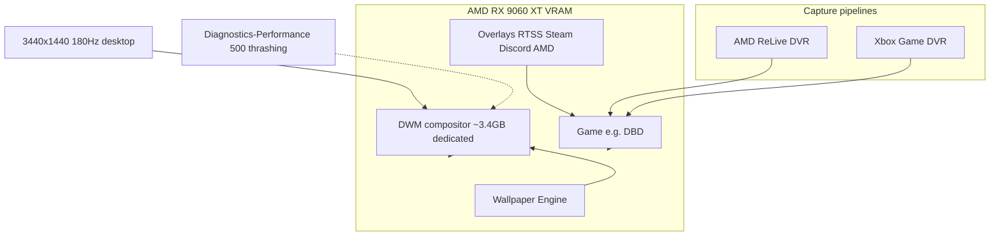

# DESKTOP-C1ACPUM — GPU / FPS troubleshooting

**Inventory host:** `dev-workstation-win`  
**OS hostname:** `DESKTOP-C1ACPUM`  
**LAN IP:** `192.168.50.133`  
**Active console user (gaming):** `ericc`  
**Automation SSH user:** `joshc` (`~/.ssh/id_ed25519_ansible`)

## Evidence collection setup

- **Diagnostics + Eric manual playbook:** [../diagnostics/amd-gpu-windows-desktop--diagnostics.md](../diagnostics/amd-gpu-windows-desktop--diagnostics.md)
- **Ansible deploy:** `playbooks/troubleshoot/deploy_dev_workstation_gpu_diagnostics.yaml` (`roles/gpu_diagnostics_windows`)
- **Artifact collect:** `playbooks/troubleshoot/collect_dev_workstation_gpu_artifacts.yaml`

Related intake/history:

- [on-offs/DESKTOP-C1ACPUM-gpu-fps.md](./on-offs/DESKTOP-C1ACPUM-gpu-fps.md) — **on/off timeline** and tool matrix (**What we got** = pulse evidence per row; see [on-offs/README.md](./on-offs/README.md))
- [troubleshoot-gpu-and-ssh-Check desktop reachability.md](./troubleshoot-gpu-and-ssh-Check%20desktop%20reachability.md) — conversation transcript
- [dev-workstation-win-intermittent-download-slowdown.md](./dev-workstation-win-intermittent-download-slowdown.md) — prior WinRM/session notes

---

## Problem statement

Intermittent **1–5 FPS** in games (notably Dead by Daylight) on an ultrawide desktop:

- **3440×1440 @ 180 Hz**
- **AMD Radeon RX 9060 XT** (~16 GB VRAM — not 4 GB; WMI `AdapterRAM` is wrong)
- **Intel i7-6700K**, 16 GB system RAM

---

## Evidence summary (why we suspect DWM + overlay contention)

### Windows Diagnostics-Performance (authoritative)

Event **500** in `Microsoft-Windows-Diagnostics-Performance/Operational`:

```text
The Desktop Window Manager is experiencing heavy resource contention.
Scenario: Video memory resources are over-utilized and there is thrashing happening as a result.
```

Timestamps observed:

- 2026-05-29 00:38 (during gaming period)
- 2026-05-28 12:14

### What that means in plain language

| Term | Meaning on this PC |
|------|------------------|
| **DWM** | Desktop Window Manager — Windows compositor that draws the desktop, window borders, transparency, multi-monitor scaling, and **hardware-accelerates the desktop** on the same GPU as games. |
| **Video memory thrashing** | GPU VRAM is over-subscribed: too many consumers (DWM + game + overlays + browsers + Wallpaper Engine) fighting for the same pool; the system spends time evicting and reloading allocations instead of rendering frames. |
| **Overlay soup** | Multiple layers hooking or capturing the render path: **AMD ReLive**, **Xbox Game DVR**, **RTSS Present hooks**, **Steam overlay**, **Discord**, optional **AMD Adrenalin overlay**, plus **Wallpaper Engine** on the desktop GPU path. |

This is **not** the same as “GPU at 100%.” DWM thrashing can produce catastrophic frame times while Task Manager still shows moderate GPU utilization — the bottleneck is **allocator/compositor contention**, not only shader load.

### Supporting measurements (idle / between games)

- DWM process often holds **~3.4 GB** dedicated GPU memory (perf counter `GPU Process Memory`) even when DBD is not running.
- Ultrawide **180 Hz** increases compositor work versus 60 Hz.
- Driver reinstall **2026-05-29 ~00:19** and unclean reboot **00:30** precede symptoms — treat driver churn as a confounder until ruled out.

---

## Troubleshooting profile (A/B test — “lean gaming path”)

Applied remotely **2026-05-29** via OpenSSH (`joshc@192.168.50.133`) for the next gaming session.

### Target state for the test

| Layer | Action | Purpose |
|-------|--------|---------|
| Wallpaper Engine | **Off** (process stopped) | Removes constant GPU desktop consumer |
| AMD ReLive DVR | **Off** (`DvrEnabled=0` for `ericc`) | Removes AMD capture pipeline |
| Xbox Game Bar DVR | **Off** (`GameDVR_Enabled=0` — was already off for `ericc`) | Removes Microsoft capture path |
| AMD metrics overlay | **On** (`MetricsOverlayState=1`, `EnableMetricsOverlay=1`) | **Diagnosis only** — FPS/frametime visibility |
| RTSS | **Global profile created** with `OSDShowFramerate` / `OSDShowFrametime`; RTSS restarted | Frametime OSD for diagnosis (verify in-game) |
| Steam / Discord overlays | **Not disabled remotely** | Stop manually if A/B test still stutters |

### Registry / profile changes (`ericc` SID `…-1001`)

```text
BEFORE  DvrEnabled=1  GameDVR_Enabled=0  MetricsOverlayState=1
AFTER   DvrEnabled=0  GameDVR_Enabled=0  MetricsOverlayState=1  EnableMetricsOverlay=1
        GameDetectionForMetricsOverlay=0
```

**RTSS** — created `C:\Program Files (x86)\RivaTuner Statistics Server\Profiles\Global`:

```ini
[Settings]
ShowOnScreenDisplay=1
OSDDrawFrame=1
OSDShowFramerate=1
OSDShowFrametime=1
```

RTSS was restarted after profile write. **Eric must confirm** frametime appears in-game (RTSS UI may still need OverlayEditor layout on some titles).

### AMD overlay hotkey (reference)

- **Ctrl+Shift+O** — toggle AMD performance metrics overlay ([AMD DH3-038](https://www.amd.com/en/resources/support-articles/faqs/DH3-038.html))

---

## How to interpret the next gaming session

1. **If FPS is normal** with the lean profile → strong confirmation that **overlay/capture/desktop load** was the primary cause. Re-enable one layer at a time to find the worst offender.
2. **If FPS still drops to 1–5** with lean profile + metrics visible → capture **AMD overlay FPS/frametime** and/or RTSS at the moment of drop; suspect **driver/game** or **power/thermal** next.
3. **If metrics show good FPS but game feels stuck** → possible **CPU frame pacing** or **network** (DBD-specific); lower priority than VRAM thrashing given Event 500.

---

## Restore / undo (after troubleshooting)

| Item | Restore |
|------|---------|
| AMD ReLive | Adrenalin → ReLive → enable, or `DvrEnabled=1` under `HKU\…\Software\AMD\DVR` for `ericc` |
| Xbox Game DVR | Windows Settings → Gaming → Captures, or `GameDVR_Enabled=1` |
| AMD metrics overlay | Adrenalin → Performance → disable overlay, or `MetricsOverlayState=0` |
| Wallpaper Engine | Start from Steam/user session |
| RTSS Global profile | Delete or edit `Profiles\Global`; restore prior RTSS UI settings |

---

## Repo / one-off automation changes (this effort)

| Change | Path / command |
|--------|----------------|
| SSH-primary host_vars | `inventory/host_vars/dev-workstation-win.yaml` |
| `access_windows` allows SSH transport | `playbooks/access_windows.yaml` |
| Playbook convergence run | `ansible-playbook playbooks/access_windows.yaml -e access_windows_target=dev-workstation-win --limit dev-workstation-win` |
| Host still in offline group | `inventory/inventory.yaml` → `windows_hosts_offline` (not routine deploy scope) |
| Remote scripts (ephemeral) | `artifacts/troubleshooting/apply-fps-troubleshoot-profile.ps1`, `enable-amd-metrics.ps1`, etc. |
| dxdiag artifact | `artifacts/troubleshooting/dev-workstation-dxdiag-20260529.txt` |

**Connection:**

```text
ssh -i ~/.ssh/id_ed25519_ansible joshc@192.168.50.133
ansible -i inventory/inventory.yaml dev-workstation-win -m ansible.windows.win_shell -a "..."
```

---

## Post–AMD reinstall pulse (2026-05-29 ~05:50)

Eric re-logged **4:56 AM**; AMD stack reinstalled **3:34–5:07 AM** (DVR, WVR64, RSX Chatbot, CNext). **DBD was running** during this check.

### Tool reporting status

**Column legend:** **What we got** is the factual evidence from that pulse (paths, registry, events, export lines) — the same material reported in-thread, not interpretation. Full toggle timeline: [on-offs/DESKTOP-C1ACPUM-gpu-fps.md](./on-offs/DESKTOP-C1ACPUM-gpu-fps.md).

| Tool | Running? | What we got |
|------|----------|-------------|
| **AMD Adrenalin** | Yes — `RadeonSoftware.exe`, `AMDRSServ`, `AMDRSSrcExt`, `cncmd` | Writes under `C:\Users\ericc\AppData\Local\AMD\CN\` (`RGStats.db`, `RAG_CNDB_GAME\*.md`). DBD session: **`95th percentile frame time: 0`**. Artifacts: `artifacts/troubleshooting/ericc-amd-*.md` |
| **AMD Chat** | Yes — `AMDChat.exe` ~**6 GB** working set | WER **`RADAR_PRE_LEAK_64`** at 05:11 for `AMDChat.exe` |
| **RTSS** | Yes — `RTSS`, `RTSSHooksLoader64`, `EncoderServer` | Global profile has frametime OSD flags; **no `.log` files** under RTSS install dir |
| **MSI Afterburner** | Yes — restarted 05:37 | **No `.hml` hardware log** in install tree (only old `VCRedistWebSetup.log`) |

### AMD Adrenalin — what it actually output

Pulled `Dead_by_Daylight.md` and `Games_Session_Info.md` to `artifacts/troubleshooting/ericc-amd-*.md`.

**Games Session Info (live):**

```text
Dead by Daylight: running: Yes, last launched: Fri May 29 05:42:54 2026
95th percentile frame time: 0   ← not populated yet
```

**DBD game profile (important after reinstall):**

- **AMD FSR Upscaling: Enabled** (was Disabled in prior baseline) — test disabling if stutter continues.
- Reset Shader Cache: Enabled (Adrenalin export typo “Enbaled”).
- ReLive: reinstall set **`DvrEnabled=1` again** — re-disabled remotely to `0` after this pulse.

**Performance Metrics page (Adrenalin export):**

- **Start Logging: Enabled**; FPS/Latency interval 0.25s; many GPU metrics logging enabled.
- **Metrics overlay display:** registry had `MetricsOverlayState=0` again — re-set to `1` for Eric.
- **Frame Time** metric: `track: No` (logging on but not tracked on overlay list) — enable in Adrenalin Performance → Metrics if frametime needed on-screen.

### Windows events (new since last doc)

| Time | Event |
|------|--------|
| **2026-05-29 03:30** | Diagnostics-Performance **500** — DWM video-memory thrashing (again, after reinstall session) |
| **2026-05-29 05:11** | WER `RADAR_PRE_LEAK_64` — **AMDChat.exe** |
| **2026-05-29 05:21** | WER `RADAR_PRE_LEAK_64` — **RadeonSoftware.exe** |

### DBD log

`C:\Users\ericc\AppData\Local\DeadByDaylight\Saved\Logs\DeadByDaylight.log` — **1.4 MB**, mtime **05:50:41**, locked while game running (could not tail remotely).

### Reinstall reset our lean profile

After AMD reinstall, these reverted until re-applied:

- `DvrEnabled` → was **1**, set back to **0**
- `MetricsOverlayState` → was **0**, set back to **1**

Eric should use **Ctrl+Shift+O** in-game to confirm AMD overlay; RTSS frametime depends on Global profile + in-game hook.

### Adrenalin — Default settings (Eric, UI)

Eric enabled **Default** settings in AMD Adrenalin for the DBD profile after the reinstall pulse. Documented in [on-offs/DESKTOP-C1ACPUM-gpu-fps.md](./on-offs/DESKTOP-C1ACPUM-gpu-fps.md).

**What we got before that change (last export on disk, 05:47:53):** **FSR Upscaling: Enabled** (default for that field is Disabled). Re-pull `Dead_by_Daylight.md` after defaults to record post-change values in the on-offs table.

---

## Still missing (needs in-game drop)

- Frametime/FPS sample **during** a 1–5 FPS episode
- GPU hotspot temperature (Adrenalin or HWiNFO)
- PresentMon trace (not installed)

---

## Diagram: overlay + DWM contention (simplified)



---

## Diagram inventory

- **Architecture/Structure:** host mapping, evidence, troubleshooting profile, repo one-offs (above)
- **Capability routing:** N/A (one-off ops, not a steady-state role)
