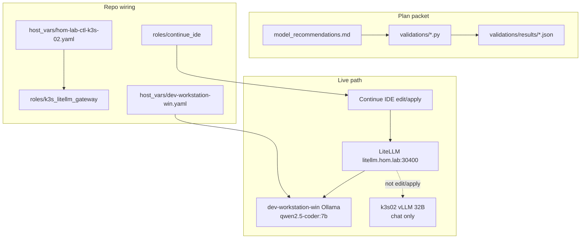
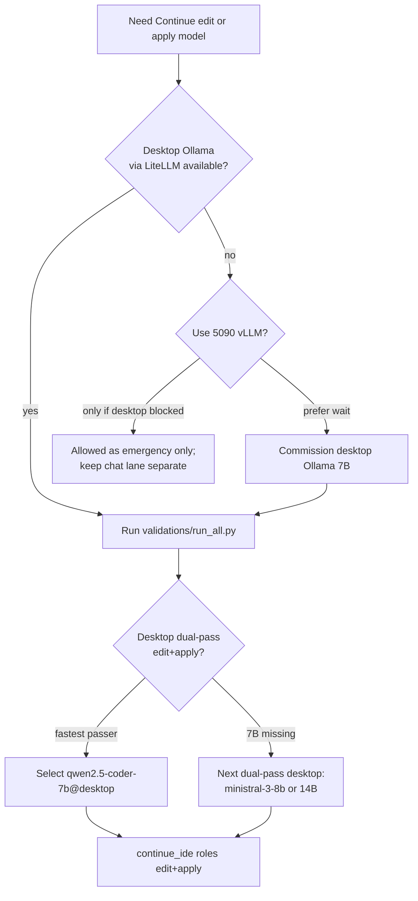
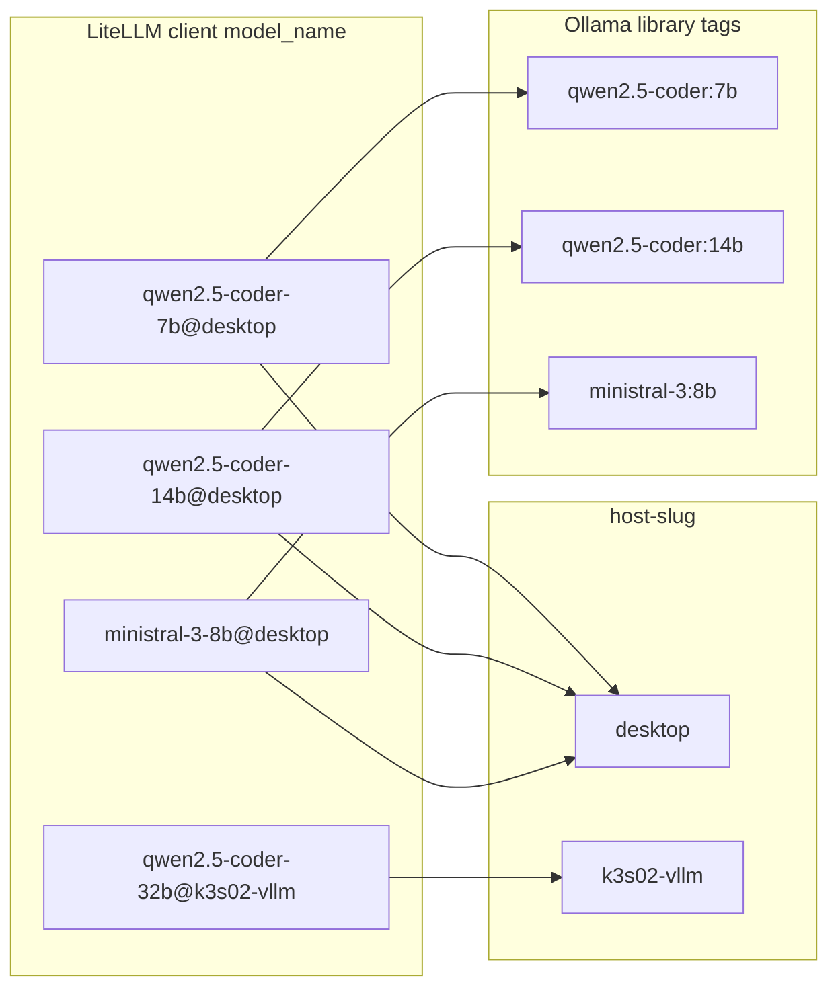

# Continue edit / apply presetup — desktop model selection

## Summary

Select, validate, and document the Continue IDE **edit** and **apply** model
lanes, preferring **`dev-workstation-win`** (desktop Ollama) published through
**LiteLLM**, with vLLM on the 5090 reserved for **chat**.

**Selected:** `qwen2.5-coder-7b@desktop` for both `edit` and `apply`.

Research findings and live metrics:
[model_recommendations.md](./model_recommendations.md).  
Packet validations: [validations/](./validations/).  
Intake wording preserved: [prompt-draft.md](./prompt-draft.md).

## Capability Packet Boundary

| Field | Value |
| --- | --- |
| Capability identifier | `continue_ide_edit_apply_presetup` |
| Owner manifest | this plan folder + `roles/continue_ide` + `roles/k3s_litellm_gateway` continue-edit route |
| Owned files | `docs/plans/2026-03-09--continue-edit-apply-presetup/**` (README, recommendations, validations) |
| Integration anchors | `roles/continue_ide/defaults/main.yml` edit entry; `inventory/host_vars/hom-lab-ctl-k3s-02.yaml` `k3s_litellm_gateway_continue_edit_*`; `inventory/host_vars/dev-workstation-win.yaml` Ollama model list; `inventory/group_vars/continue_ide_hosts/main.yml` research matrix |
| Update behavior | Re-run `validations/run_all.py`; update `model_recommendations.md` metrics; only then change Continue/LiteLLM vars if ranking changes |
| Removal behavior | Delete this plan folder; do **not** tear down `continue_ide` or desktop Ollama unless a separate absent run is requested |

## Apply / Verify / Undo / Change class

| | |
| --- | --- |
| **Apply** | Prefer **reuse**. If route missing: ensure `qwen2.5-coder:7b` on `dev-workstation-win`, LiteLLM continue-edit api_base set, Continue config entry with `roles: [edit, apply]`. Playbooks: `deploy_dev_workstation_ollama_runtime.yaml`, LiteLLM gateway deploy, `deploy_continue_ide.yaml`. |
| **Verify** | `cd docs/plans/2026-03-09--continue-edit-apply-presetup/validations && LITELLM_GATEWAY_ROOT=http://litellm.hom.lab:30400 python3 run_all.py` → `results/summary.json` `ok: true` |
| **Undo** | Revert Continue model entry / LiteLLM continue-edit vars only if this packet introduced them; packet docs alone can be removed without host teardown |
| **Change class** | Research + validation (docs/scripts). Host mutate only if selected model was absent (not required on 2026-09-10) |

## Assumptions / defaults

1. Desktop = inventory host `dev-workstation-win` (RX 9060 XT / Ollama).
2. Client-facing surface is LiteLLM (`litellm.hom.lab`, NodePort **30400** from this controller).
3. vLLM `qwen2.5-coder-32b@k3s02-vllm` remains **chat**, not edit/apply.
4. Commercial Morph/Relace apply models are **out of scope** (self-hosted only).
5. Exact model id is **selected** only after live LiteLLM + functional edit/apply probes (not brainstorm-only).

## Selected model (decision-complete)

| Field | Value | Status |
| --- | --- | --- |
| Client id | `qwen2.5-coder-7b@desktop` | **selected** (live dual-pass winner) |
| Backend | Ollama `qwen2.5-coder:7b` on `dev-workstation-win` | present in inventory |
| Continue roles | `edit`, `apply` | already in `continue_ide` defaults |
| Completion options | `contextLength: 32768`, `maxTokens: 4096`, `temperature: 0.2` | role default |

Rejected for primary edit/apply hot path (still published):

| Model | Reason |
| --- | --- |
| `qwen2.5-coder-14b@desktop` | Passes probes; ~2.8× slower combined dual-pass |
| `ministral-3-8b@desktop` | Passes; slower; keep as operational fallback |
| `qwen2.5-coder-32b@k3s02-vllm` | Faster micro-prompts; wrong placement (chat / 5090) |

## Architecture / Structure Diagram

## Capability Routing Diagram

## Naming / Modeling Diagram

Client id shape follows
`roles/k3s_litellm_gateway/defaults/main/model_client_ids.yml`
(`model@host`). No NetBox object rename in this packet (`netbox_scope: false`).

## Checklist

- [x] Research Continue edit/apply role requirements (smaller/faster than chat)
- [x] Inventory desktop + LiteLLM published routes
- [x] Compare desktop candidates with functional edit + apply probes
- [x] Record recommendation in `model_recommendations.md`
- [x] Add `validations/` Python suite + results artifacts
- [x] Confirm existing Continue/LiteLLM wiring matches selection (no mutate required)
- [ ] Optional: re-apply `deploy_continue_ide.yaml` on operator Continue hosts after any future lane change
- [ ] Optional: promote packet lifecycle via `complete-plan-lifecycle` after operator accepts

## Plan verification receipt

### Obligation inventory

| ID | Source | Obligation | In scope? | Status | Evidence |
| --- | --- | --- | --- | --- | --- |
| O-01 | Prompt | Research suitable edit/apply models on lab infra | yes | pass | `model_recommendations.md` + Continue docs guidance |
| O-02 | Prompt | Prefer `dev-workstation-win` + LiteLLM/vLLM stack | yes | pass | Desktop Ollama via LiteLLM; vLLM kept chat-only |
| O-03 | Prompt | Reuse if already deployed | yes | pass | LiteLLM `/v1/models` lists `qwen2.5-coder-7b@desktop`; Continue defaults already `[edit, apply]` |
| O-04 | Prompt | Implement only if missing | yes | pass | No mutate — route already present |
| O-05 | Prompt | `validations/` scripts per selected model | yes | pass | `validations/{test_*,compare_*,run_all}.py` |
| O-06 | Prompt | Recommendations file in plan folder | yes | pass | `model_recommendations.md` (+ typo pointer) |
| O-07 | Contract Verify | `run_all.py` ok | yes | pass | `validations/results/summary.json` `ok: true` (2026-09-10) |
| O-08 | Metrics | Show edit/apply performance metrics | yes | pass | Dual-pass: 7B combined **12.13s** (edit 6.08 / apply 6.05) |
| O-09 | Diagram gate | Architecture + Routing + Naming + Inventory | yes | pass | Mermaid fences in this README |
| O-10 | NetBox | Declared/Applied/Verified | no | n/a | `netbox_scope: false` |

### Completion gate

- [x] Obligation inventory covers prompt + change contract + diagrams
- [x] In-scope rows are `pass` with evidence (or `n/a`)
- [ ] `lifecycle: implemented` rename deferred until operator runs `complete-plan-lifecycle`

## Diagram gate receipt

| Item | Status |
| --- | --- |
| Architecture/Structure | included — mermaid-fence |
| Capability Routing | included — mermaid-fence (desktop vs emergency vLLM) |
| Naming/Modeling | included — mermaid-fence (`model@host` / Ollama tags) |
| Medium | mermaid-fence (matches sibling Continue client plan style) |

## Diagram Inventory

| Diagram | Included? | Medium | Notes |
| --- | --- | --- | --- |
| Architecture/Structure | yes | mermaid-fence | Packet + roles + LiteLLM + desktop Ollama |
| Capability Routing | yes | mermaid-fence | Selection / fallback / emergency vLLM |
| Naming/Modeling | yes | mermaid-fence | Client ids ↔ host-slug ↔ Ollama tags |
| Sequence (edit vs apply) | no | — | Optional; covered by validations prompts |
| Pack SVG via `create-diagrams` | no | — | Mermaid preferred here for consistency with sibling plan |

## On Deck — user decisions to integrate

| ID | User decision / direction | Target integration | Status |
| --- | --- | --- | --- |
| — | _(none open — intake prompt fully represented above)_ | — | — |

## Related surfaces

| Path | Role |
| --- | --- |
| [model_recommendations.md](./model_recommendations.md) | Selected model + metrics SSOT |
| [validations/README.md](./validations/README.md) | How to re-run probes |
| [../2026-09-01--homelab-local-ai-clients-cursor-kilo/README.md](../2026-09-01--homelab-local-ai-clients-cursor-kilo/README.md) | Broader Continue/OpenCode client plan |
| `roles/continue_ide/defaults/main.yml` | Live Continue model entry |
