# Modular Knowledge Gates With Required Plan Diagrams

## Summary

This plan preserves the Langfuse skill evaluation as a source/product
evaluation and adapts the enforcement pattern into three repo-local
capabilities:

- `ansible-knowledge-gate`
- `netbox-knowledge-gate`
- `project-maturity-router`

The Ansible and NetBox gates stay independently serviceable. The router only
decides when a broad project-maturity request should activate one or both
domain gates.

## Architecture / Structure

Source: [diagrams/architecture-structure.mmd](diagrams/architecture-structure.mmd)

```mermaid
graph TB
    subgraph top_contract ["Top Contract"]
        agents_md["AGENTS.md<br/>modular_gate_contract"]
    end

    subgraph plan_packet ["Plan Packet"]
        plan_readme["README.md<br/>diagrams_and_apply_contract"]
        evaluation_doc["product-evaluation--langfuse-skill.md"]
        extraction_doc["pattern-extraction.md"]
        ansible_capability["capability--ansible-knowledge-gate.md"]
        netbox_capability["capability--netbox-knowledge-gate.md"]
        router_capability["capability--project-maturity-router.md"]
    end

    subgraph discovery_layer ["Skill Discovery"]
        skills_catalog[".cursor/skills/catalog.yml"]
        skills_readme[".cursor/skills/README.md"]
        framework_map["docs/codex_framework/README.md"]
    end

    subgraph skill_layer ["Repo Local Skills"]
        ansible_skill[".cursor/skills/ansible-knowledge-gate"]
        netbox_skill[".cursor/skills/netbox-knowledge-gate"]
        router_skill[".cursor/skills/project-maturity-router"]
    end

    subgraph rule_layer ["Companion Rules"]
        ansible_rule[".cursor/rules/ansible-knowledge-gate.mdc"]
        netbox_rule[".cursor/rules/netbox-knowledge-gate.mdc"]
        router_rule[".cursor/rules/framework-project-maturity-router.mdc"]
    end

    agents_md -->|"bootstraps"| discovery_layer
    plan_readme -->|"documents"| evaluation_doc
    plan_readme -->|"documents"| extraction_doc
    extraction_doc -->|"splits into"| ansible_capability
    extraction_doc -->|"splits into"| netbox_capability
    extraction_doc -->|"splits into"| router_capability

    skills_catalog -->|"discovers"| ansible_skill
    skills_catalog -->|"discovers"| netbox_skill
    skills_catalog -->|"discovers"| router_skill
    skills_readme -->|"explains pattern"| skill_layer
    framework_map -->|"maps active surfaces"| rule_layer

    ansible_skill -->|"paired with"| ansible_rule
    netbox_skill -->|"paired with"| netbox_rule
    router_skill -->|"paired with"| router_rule

    style agents_md fill:#1e3a5f
    style plan_readme fill:#2a2a2a
    style ansible_skill fill:#2d4a2d
    style netbox_skill fill:#4a3f2e
    style router_skill fill:#5a4a1a
```

## Capability Routing

Source: [diagrams/capability-routing.mmd](diagrams/capability-routing.mmd)

```mermaid
graph TB
    subgraph plan_packet ["docs/plans/2026-05-18--knowledge-gate-pattern"]
        product_eval["product_evaluation_langfuse_skill"]
        pattern_extract["pattern_extraction"]
        ansible_spec["capability_ansible_knowledge_gate"]
        netbox_spec["capability_netbox_knowledge_gate"]
        router_spec["capability_project_maturity_router"]
    end

    subgraph repo_skills [".cursor/skills"]
        ansible_skill["ansible_knowledge_gate"]
        netbox_skill["netbox_knowledge_gate"]
        router_skill["project_maturity_router"]
    end

    subgraph rule_layer [".cursor/rules"]
        ansible_rule["ansible_knowledge_gate_rule"]
        netbox_rule["netbox_knowledge_gate_rule"]
        router_rule["framework_project_maturity_router_rule"]
    end

    broad_request["Improve/mature project"] -->|"routes through"| router_skill
    ansible_task["Ansible task"] -->|"triggers"| ansible_skill
    netbox_task["NetBox task"] -->|"triggers"| netbox_skill

    router_skill -->|"activates when applicable"| ansible_skill
    router_skill -->|"activates when applicable"| netbox_skill

    ansible_skill -->|"owns workflow"| ansible_rule
    netbox_skill -->|"owns workflow"| netbox_rule
    router_skill -->|"owns composition"| router_rule

    product_eval -->|"informs"| pattern_extract
    pattern_extract -->|"adapts into"| ansible_spec
    pattern_extract -->|"adapts into"| netbox_spec
    pattern_extract -->|"adapts into"| router_spec

    ansible_spec -->|"implemented by"| ansible_skill
    netbox_spec -->|"implemented by"| netbox_skill
    router_spec -->|"implemented by"| router_skill

    style product_eval fill:#1e3a5f
    style pattern_extract fill:#2a2a2a
    style router_skill fill:#5a4a1a
    style ansible_skill fill:#2d4a2d
    style netbox_skill fill:#4a3f2e
```

## Implementation Flow

Source: [diagrams/implementation-flow.mmd](diagrams/implementation-flow.mmd)

```mermaid
graph TB
    start["Start"] --> preserve_eval["Preserve_Langfuse_evaluation"]
    preserve_eval --> extract_pattern["Extract_reusable_enforcement_pattern"]
    extract_pattern --> split_specs["Write_separate_capability_specs"]
    split_specs --> create_skills["Create_modular_repo_skills"]
    create_skills --> create_rules["Create_companion_enforcement_rules"]
    create_rules --> update_catalog["Register_skills_in_catalog"]
    update_catalog --> verify_triggers["Verify_trigger_scenarios"]
    verify_triggers --> complete["Plan_packet_ready"]

    split_specs --> ansible_path["Ansible_gate_stays_independent"]
    split_specs --> netbox_path["NetBox_gate_stays_independent"]
    split_specs --> router_path["Router_composes_only_when_needed"]

    ansible_path --> verify_triggers
    netbox_path --> verify_triggers
    router_path --> verify_triggers

    style preserve_eval fill:#1e3a5f
    style split_specs fill:#2a2a2a
    style verify_triggers fill:#2d4a2d
```

## Naming And Ownership

Source: [diagrams/naming-ownership.mmd](diagrams/naming-ownership.mmd)

```mermaid
graph TB
    subgraph domain_skills ["Domain Skills"]
        ansible_name["ansible-knowledge-gate"]
        netbox_name["netbox-knowledge-gate"]
    end

    subgraph composition_skill ["Composition Skill"]
        router_name["project-maturity-router"]
    end

    subgraph owned_surfaces ["Owned Surfaces"]
        skill_body["SKILL.md"]
        manifest["capability.yml"]
        readme["README.md"]
        references["references"]
        companion_rule["companion_rule"]
    end

    ansible_name -->|"owns Ansible standards"| owned_surfaces
    netbox_name -->|"owns NetBox standards"| owned_surfaces
    router_name -->|"owns routing only"| owned_surfaces

    style ansible_name fill:#2d4a2d
    style netbox_name fill:#4a3f2e
    style router_name fill:#5a4a1a
```

## Plan Packet Files

- [product-evaluation--langfuse-skill.md](product-evaluation--langfuse-skill.md)
  preserves the original external skill evaluation.
- [pattern-extraction.md](pattern-extraction.md)
  records the reusable enforcement pattern.
- [capability--ansible-knowledge-gate.md](capability--ansible-knowledge-gate.md)
  defines the Ansible-specific capability.
- [capability--netbox-knowledge-gate.md](capability--netbox-knowledge-gate.md)
  defines the NetBox-specific capability.
- [capability--project-maturity-router.md](capability--project-maturity-router.md)
  defines the router/composition capability.

## Apply / Verify / Undo / Change Class

- Apply: add the three repo-local skills, companion rules, catalog entries, and
  this plan packet.
- Verify: validate YAML and Markdown syntax; search for skill/rule discovery;
  test trigger scenarios by inspection.
- Undo: remove the files listed in each skill `capability.yml` `owned_files`
  list and remove catalog entries.
- Change class: repo-local process and documentation enforcement.

## Test Plan

- Search active guidance for `diagram` and confirm stored plans require Mermaid
  diagrams in `docs/plans/README.md` and
  `.cursor/rules/framework-partner-process.mdc`.
- Validate every new `capability.yml` parses as YAML.
- Confirm the new skills appear in `.cursor/skills/catalog.yml`.
- Confirm the new companion rules are listed in the framework capability map.
- Inspect trigger scenarios:
  - Ansible-only work routes to `ansible-knowledge-gate`.
  - NetBox-only work routes to `netbox-knowledge-gate`.
  - broad project-maturity work routes through `project-maturity-router`.
