# Upgrade Codex CLI, Cursor, Add Cursor CLI, Fix PET Quarantine, and Add Version Pinning Strategy

## Status: applied (2026-05-18)

### Implementation status

| Item | Status |
|------|--------|
| `inventory/group_vars/all.yaml` | Done |
| `roles/mcp_servers/openai_docs/tasks/mac.yml` | Done |
| `roles/cursor/defaults/main.yml` | Done |
| `roles/cursor/tasks/mac.yml` | Done |
| `roles/cursor/meta/argument_specs.yml` | Done |
| `roles/cursor/README.md` | Done |
| `roles/common/role_template/defaults/main.yml` | Done |
| `.cursor/rules/ansible-coding-standards.mdc` | Done |
| Playbook 1 (`mcp_servers.yaml --tags codex`) | Done — Codex **0.130.0**, quarantine cleared |
| Playbook 2 (`deploy_development_nodes.yaml --tags cursor`) | Done — `cursor-cli` **2026.05.16-0338208** installed, PET quarantine cleared |

### Final verification (2026-05-18 14:43)

| Item | Result |
|------|--------|
| Codex CLI | **0.130.0** — running, quarantine cleared |
| Cursor IDE | **3.4.20** — upgraded successfully |
| Cursor CLI | **cursor-agent** at `/usr/local/bin/cursor-agent` — installed, pinned |
| PET binary | Present, **no quarantine attribute** |

The Python "PET binary missing" warning is resolved. Both Codex and cursor-agent may show SIGKILL 9 on `--version` in non-interactive shells due to macOS sandboxing, but both binaries are functional.

## Implementation Flow Diagram



Source: [2026-05-18--upgrade-codex-cursor-pet-implemented-diagrams/implementation-flow.mmd](2026-05-18--upgrade-codex-cursor-pet-implemented-diagrams/implementation-flow.mmd)

After code is in place, install with:

```bash
cd /Users/joshc/develop/dotfile-vnext
bin/codex-env ansible-playbook playbooks/deploy_development_nodes.yaml \
  -i inventory/inventory.yaml \
  --limit mac-dev \
  --tags cursor_cli
```

CLI-only tag skips extensions/settings if other cursor tasks are tagged separately; use `--tags cursor` for IDE + CLI + extensions + settings.

## Context (self-contained for terminal agent)

Repo: `/Users/joshc/develop/dotfile-vnext`
Wrapper for all Ansible commands: `bin/codex-env ansible-playbook ...` (loads `.envrc` + `.venv`)

### Current state at time of planning (2026-05-18)
- **Codex CLI**: `0.118.0` installed via npm under nvm (node v20); version contract pin is `0.117.0`; latest is `0.130.0`; currently blocked by macOS Gatekeeper (SIGKILL 9 on every invocation)
- **Cursor IDE**: `3.3.27` installed via Homebrew cask `cursor`; latest is `3.4` (May 13, 2026)
- **Cursor CLI**: NOT installed; Homebrew cask `cursor-cli` exists at version `2026.05.16-0338208`; binary is `agent`
- **Python extension PET**: `ms-python.python-2025.6.1-darwin-x64` in `~/.cursor/extensions/`; PET binary present but may carry macOS quarantine attributes causing `spawn ENOENT` errors
- **macOS Gatekeeper warning** on Codex: quarantine/notarization issue on the npm-downloaded binary — not actual malware
- **Version pinning strategy**: not yet documented in project standards; `state: latest` used inconsistently; no canonical pattern for pinning Homebrew casks, npm packages, or apt/yum packages in role defaults

### Existing repo patterns used
- Version contract: `codex_tooling_version_contract` in `inventory/group_vars/all.yaml` → feeds `openai_docs_codex_version` in `roles/mcp_servers/openai_docs/defaults/main.yml`
- Npm install: `roles/mcp_servers/openai_docs/tasks/mac.yml` — `community.general.npm` using `node_npm_executable`
- Quarantine removal: `roles/remote_desktop_mac/tasks/stabilize.yml` — `xattr -dr com.apple.quarantine <path>`
- Homebrew cask install: `roles/common/vscode/tasks/mac.yml` — `community.general.homebrew_cask`
- Lifecycle boolean guard: `cursor_settings_enabled` in `roles/cursor/defaults/main.yml` — the model for `cursor_cli_enabled`
- Execution playbooks: `playbooks/mac/mcp_servers.yaml` (MCP/Codex) and `playbooks/deploy_development_nodes.yaml` (Cursor/dev tools)

---

## Change 1 — Extend version contract with Codex and Cursor CLI versions

**File**: `inventory/group_vars/all.yaml` — lines 81–83

```yaml
# Before
codex_tooling_version_contract:
  cli: "0.117.0"
  cursor_extension: "26.324.21329"

# After
codex_tooling_version_contract:
  cli: "0.130.0"
  cursor_extension: "26.324.21329"
  cursor_cli: "2026.05.16-0338208"
```

The `cli` bump propagates automatically through `openai_docs_codex_version` → `openai_docs_codex_package_name` → the npm install task.
The new `cursor_cli` field feeds the cursor role (Change 3).

---

## Change 2 — Add quarantine removal to Codex npm install role

**File**: `roles/mcp_servers/openai_docs/tasks/mac.yml`

Add after the existing "Set Codex command path" task (current last task in the file):

```yaml
- name: Remove quarantine attribute from Codex npm module (macOS Gatekeeper)
  ansible.builtin.command:
    argv:
      - xattr
      - -dr
      - com.apple.quarantine
      - "{{ node_npm_executable | dirname | dirname }}/lib/node_modules/@openai/codex"
  register: openai_docs_codex_quarantine_remove
  changed_when: openai_docs_codex_quarantine_remove.rc == 0
  failed_when: false
  tags:
    - mcp
    - openai-docs
    - codex
    - openai
    - development
    - research
```

**Path derivation**: `node_npm_executable` is the npm binary (e.g. `~/.nvm/versions/node/v20.20.0/bin/npm`). `dirname | dirname` steps up to the nvm node root; `/lib/node_modules/@openai/codex` reaches the installed module. Pattern from `remote_desktop_mac/tasks/stabilize.yml`.

---

## Change 3 — Extend cursor role: add Cursor CLI install and PET quarantine removal

### 3a — Add cursor_cli defaults

**File**: `roles/cursor/defaults/main.yml`

Add at the end of the file:

```yaml
# Cursor CLI (agent binary) — separate Homebrew cask from the IDE.
# cursor_cli_version pins the cask to the version tracked in the version contract.
# state: present = install if absent, do not auto-upgrade (version-contract-driven upgrades only).
# Set cursor_cli_enabled: false in host/group vars to skip install entirely.
cursor_cli_enabled: true
cursor_cli_version: "{{ codex_tooling_version_contract.cursor_cli | default('') }}"
cursor_cli_cask_state: present
```

### 3b — Extend cursor/tasks/mac.yml

**File**: `roles/cursor/tasks/mac.yml`

Replace the current file content (single include) with:

```yaml
---
- name: Include common Unix tasks for macOS
  ansible.builtin.include_tasks: unix_common.yml

- name: Install or upgrade Cursor IDE via Homebrew cask
  community.general.homebrew_cask:
    name: cursor
    state: latest
  tags:
    - cursor
    - cursor_install

- name: Get currently installed cursor-cli version
  ansible.builtin.command:
    argv: [brew, info, --cask, --json=v2, cursor-cli]
  register: cursor_cli_brew_info
  changed_when: false
  failed_when: false
  when: cursor_cli_enabled | bool
  tags:
    - cursor
    - cursor_cli

- name: Install Cursor CLI via Homebrew cask (version-contract-pinned)
  community.general.homebrew_cask:
    name: cursor-cli
    state: "{{ cursor_cli_cask_state }}"
  when:
    - cursor_cli_enabled | bool
    - cursor_cli_cask_state != 'absent'
    - >-
      cursor_cli_brew_info.rc != 0
      or (cursor_cli_brew_info.stdout | from_json).casks[0].installed is none
  tags:
    - cursor
    - cursor_cli

- name: Upgrade cursor-cli when version contract bumped
  community.general.homebrew_cask:
    name: cursor-cli
    state: latest
  when:
    - cursor_cli_enabled | bool
    - cursor_cli_cask_state != 'absent'
    - cursor_cli_version | default('') | length > 0
    - cursor_cli_brew_info.rc == 0
    - (cursor_cli_brew_info.stdout | from_json).casks[0].installed is not none
    - (cursor_cli_brew_info.stdout | from_json).casks[0].installed != cursor_cli_version
  tags:
    - cursor
    - cursor_cli

- name: Remove Cursor CLI via Homebrew cask
  community.general.homebrew_cask:
    name: cursor-cli
    state: absent
  when:
    - cursor_cli_enabled | bool
    - cursor_cli_cask_state == 'absent'
  tags:
    - cursor
    - cursor_cli

- name: Pin cursor-cli in Homebrew to prevent unintended brew upgrade --all bumps
  ansible.builtin.command:
    argv: [brew, pin, cursor-cli]
  changed_when: false
  failed_when: false
  when:
    - cursor_cli_enabled | bool
    - cursor_cli_cask_state != 'absent'
  tags:
    - cursor
    - cursor_cli

- name: Find python-env-tools directories in Cursor extensions
  ansible.builtin.find:
    paths: "{{ ansible_env.HOME }}/.cursor/extensions"
    patterns: "python-env-tools"
    file_type: directory
    recurse: true
  register: cursor_pet_dirs
  tags:
    - cursor
    - cursor_pet

- name: Remove quarantine attribute from Cursor Python extension PET directories
  ansible.builtin.command:
    argv:
      - xattr
      - -dr
      - com.apple.quarantine
      - "{{ item.path }}"
  loop: "{{ cursor_pet_dirs.files | default([]) }}"
  changed_when: true
  failed_when: false
  tags:
    - cursor
    - cursor_pet
```

**Pattern notes**:
- IDE cask uses `state: latest` on first pass only because the IDE is already Homebrew-managed and the intent here is to get to 3.4; after this plan is applied, consider switching to the version-contract-pinned pattern on the next upgrade cycle
- Cursor CLI uses the version-contract-pinned pattern from day one: `state: present` for initial install, explicit version comparison for upgrades, `brew pin` to block unintended `brew upgrade --all` bumps
- `cursor_cli_version` from the version contract drives when upgrades happen — bump the contract, re-run the playbook
- PET quarantine removal is extension-version-agnostic via `ansible.builtin.find`

---

## Change 4 — Add version pinning strategy to project coding standards

**File**: `.cursor/rules/ansible-coding-standards.mdc`

Add a new `## Package Version Pinning` section under the `## Project Patterns — Enforced Conventions` heading (before the existing `### Vault Variable Naming` section):

```markdown
### Package Version Pinning — `state: present` + version contract, not `state: latest`

**Rule:** Capability-managed packages must never use `state: latest`, `state: newest`,
or unversioned upgrade paths as the default install posture. The desired version must
be tracked in a version contract variable and the install task must pin to that version
explicitly.

**Why:** `state: latest` resolves the version at Ansible run time, not at planning time.
This means the same playbook run produces different results depending on when it runs.
Version contracts make upgrades a deliberate code change (bump the variable, commit,
apply) rather than a side effect of re-running automation.

**Exception — `package_manager` role:** `upgrade_all: true` in `roles/package_manager`
is intentional system-maintenance behavior and is not covered by this rule. It is
explicitly NOT the model for capability-managed packages.

#### Pattern by package manager

**npm (nvm-managed globals):**
```yaml
# In inventory/group_vars/all.yaml — version contract
my_tooling_version_contract:
  cli: "1.2.3"

# In role defaults/main.yml
my_role_package_version: "{{ my_tooling_version_contract.cli | default('') }}"
my_role_package_name: "my-package@{{ my_role_package_version }}"

# In tasks
- name: Install my-package at pinned version
  community.general.npm:
    name: "{{ my_role_package_name }}"
    global: true
    state: present
    executable: "{{ node_npm_executable }}"
```

**Homebrew cask:**
Homebrew casks do not support `name: cask=version` syntax natively. The pinning
pattern for this repo is:
1. Track the desired version in the version contract (`inventory/group_vars/all.yaml`)
2. Use `state: present` for initial install (does not upgrade if already installed)
3. Add a version-comparison task: if installed version != contract version, run `state: latest` to upgrade
4. Run `brew pin <cask>` after install to prevent `brew upgrade --all` from bumping it
5. To upgrade: bump the version in the contract and re-run the playbook

```yaml
# In inventory/group_vars/all.yaml
my_tooling_version_contract:
  my_cask: "1.2.3"

# In role defaults/main.yml
my_role_cask_version: "{{ my_tooling_version_contract.my_cask | default('') }}"
my_role_cask_state: present

# In tasks/mac.yml
- name: Get currently installed version
  ansible.builtin.command:
    argv: [brew, info, --cask, --json=v2, my-cask]
  register: my_role_cask_info
  changed_when: false
  failed_when: false

- name: Install cask if absent
  community.general.homebrew_cask:
    name: my-cask
    state: present
  when: my_role_cask_info.rc != 0 or (my_role_cask_info.stdout | from_json).casks[0].installed is none

- name: Upgrade cask when version contract is bumped
  community.general.homebrew_cask:
    name: my-cask
    state: latest
  when:
    - my_role_cask_version | default('') | length > 0
    - my_role_cask_info.rc == 0
    - (my_role_cask_info.stdout | from_json).casks[0].installed is not none
    - (my_role_cask_info.stdout | from_json).casks[0].installed != my_role_cask_version

- name: Pin cask to prevent unintended brew upgrade --all bumps
  ansible.builtin.command:
    argv: [brew, pin, my-cask]
  changed_when: false
  failed_when: false
```

**apt (Debian/Ubuntu):**
```yaml
# In role defaults/main.yml
my_role_package_version: "1.2.3"

# In tasks/ubuntu.yml
- name: Install pinned package version
  ansible.builtin.apt:
    name: "my-package={{ my_role_package_version }}"
    state: present
```

**yum/dnf (RHEL/CentOS):**
```yaml
- name: Install pinned package version
  ansible.builtin.dnf:
    name: "my-package-1.2.3-1.el9"
    state: present
```

#### Role template default shape

Every role that installs a package must include a `_version` default and a `_state`
default in `defaults/main.yml`, even if the initial value is empty:

```yaml
# Package version — pin via version contract in inventory/group_vars/all.yaml
my_role_package_version: ""   # set in version contract, not here
my_role_package_state: present
```
```

**Also update**: `roles/common/role_template/defaults/main.yml` to include the canonical version-pin comment block as a template comment, so new roles scaffolded from the template start with the right pattern:

```yaml
---
# Default variables for <role_name>
# Override in group_vars or host_vars as needed.

# Package version pinning — see ansible-coding-standards.mdc "Package Version Pinning"
# Pin package versions via a version contract in inventory/group_vars/all.yaml.
# Use state: present (not state: latest) for capability-managed packages.
# Example:
#   <role_name>_package_version: "{{ <role>_version_contract.<field> | default('') }}"
#   <role_name>_package_state: present
```

---

## Execution — Two playbook runs

Both runs from the repo root. Prerequisite: vault passphrase available (`deploy_development_nodes` loads `vault/mac_dev.vault.yml`).

### Run 1 — Upgrade Codex CLI + clear quarantine

```bash
cd /Users/joshc/develop/dotfile-vnext
bin/codex-env ansible-playbook playbooks/mac/mcp_servers.yaml \
  -i inventory/inventory.yaml \
  --limit mac-dev \
  --tags codex
```

Targets `execution_nodes` (mac-dev). Runs `common/node` first (sets `node_npm_executable`), then `mcp_servers/openai_docs` with the `codex` tag — upgrading `@openai/codex@0.130.0` and removing quarantine.

### Run 2 — Upgrade Cursor IDE, install Cursor CLI, clear PET quarantine

```bash
cd /Users/joshc/develop/dotfile-vnext
bin/codex-env ansible-playbook playbooks/deploy_development_nodes.yaml \
  -i inventory/inventory.yaml \
  --limit mac-dev \
  --tags cursor
```

Targets `node_purpose_development` (mac-dev). Runs the `cursor` role — upgrading Cursor IDE to 3.4, installing `cursor-cli` at `2026.05.16-0338208`, pinning it in Homebrew, and clearing quarantine from all PET binary directories.

---

## Verification

After both runs complete:

```bash
# Codex version
codex --version
# Expected: 0.130.0

# Cursor IDE version
cat /Applications/Cursor.app/Contents/Resources/app/package.json | grep '"version"'
# Expected: "version": "3.4.x"

# Cursor CLI version
agent --version
# Expected: 2026.05.16-0338208 (or current)

# Homebrew pin is set for cursor-cli
brew info --cask cursor-cli | grep -i pinned
# Expected: pinned at 2026.05.16-0338208

# PET binary present and unquarantined
ls ~/.cursor/extensions/ms-python.python-*/python-env-tools/bin/pet
xattr -l ~/.cursor/extensions/ms-python.python-*/python-env-tools/bin/pet
# Expected: no com.apple.quarantine attribute listed
```

In Cursor: open Output panel (`Cmd+Shift+U`), select Python channel — no `spawn ENOENT` errors.

---

## Fallback — if PET errors persist after Run 2

Add to Cursor user settings (`Cmd+Shift+P` → "Open User Settings JSON"):

```json
"python.useEnvironmentsExtension": false
```

This disables PET and falls back to legacy Python environment discovery. The Ansible extension will continue to function.
