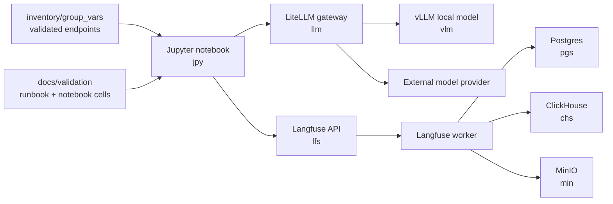

# End-To-End AI DevOps Validation

## Summary

Prove the full AI DevOps path from notebook to model gateway to observability,
and record the validated endpoints and server-lane placement.

## Architecture/Structure Diagram

## Worklist

1. Add a small validation notebook or documented notebook cells.
2. Load runtime variables through `.env`/vault-backed paths without committing
   secrets.
3. Call LiteLLM through an OpenAI-compatible client.
4. Emit Langfuse tracing from the notebook.
5. Record validated endpoints, model route, Langfuse project, and server-lane
   placement.

## Apply / Verify / Undo / Change Class

- Apply: run the validation notebook or read-only validation playbook.
- Verify: imports succeed, LiteLLM returns a response, Langfuse shows the trace.
- Undo: delete validation namespace/test data where applicable; keep docs.
- Change class: validation/read-only except for test trace records.

## Diagram Inventory

Included:

- Architecture/Structure Diagram

Other available diagram types:

- Validation Sequence Diagram
- Endpoint Inventory Diagram
- Secret Flow Diagram
- Server-Lane Placement Diagram
