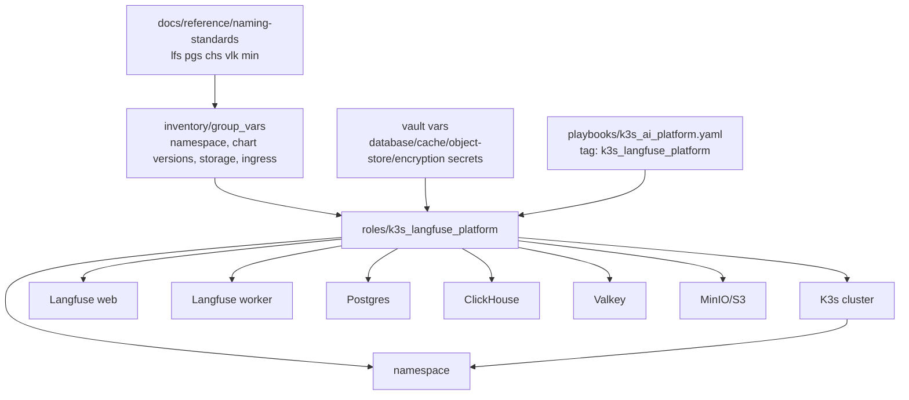

# Langfuse Platform On K3s

## Summary

Deploy Langfuse on K3s with Helm as the observability platform for traces,
prompts, evals, datasets, and experiment visibility.

Proposed schema/resource codes:

- `lfs`: Langfuse
- `pgs`: Postgres
- `chs`: ClickHouse
- `vlk`: Valkey
- `min`: MinIO

## Architecture/Structure Diagram

## Worklist

1. Add a Helm-based `roles/k3s_langfuse_platform` role.
2. Define namespace, release name, chart version, persistence, and exposure.
3. Wire secrets through vault-backed variables.
4. Prefer storage/network lane placement for data-heavy services.
5. Record endpoint and ownership metadata in NetBox after service modeling is
   accepted.

## Apply / Verify / Undo / Change Class

- Apply: run the K3s AI platform playbook with `k3s_langfuse_platform`.
- Verify: web/API reachable, workers healthy, dependencies healthy, SDK trace
  accepted.
- Undo: Helm release removal plus PVC retention/removal policy.
- Change class: idempotent config with persistent data risk.

## Diagram Inventory

Included:

- Architecture/Structure Diagram

Other available diagram types:

- Helm Release Dependency Diagram
- Persistent Data Boundary Diagram
- SDK Trace Flow Diagram
- NetBox Service Endpoint Diagram
