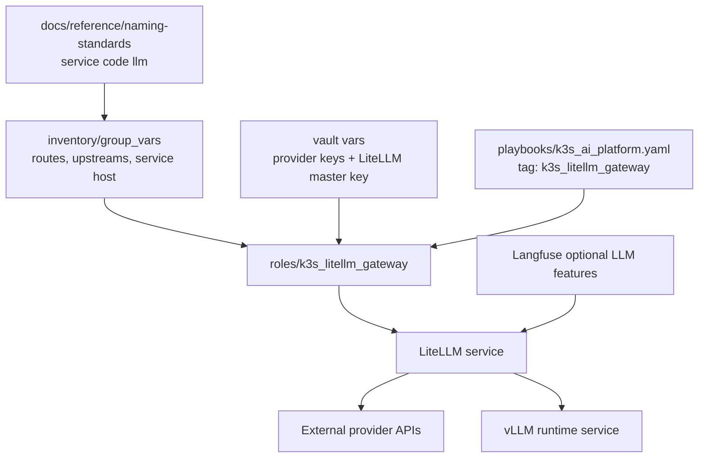

# LiteLLM Gateway

## Summary

Deploy LiteLLM as the OpenAI-compatible gateway for notebook and application
model calls. LiteLLM becomes the stable client endpoint while provider routes
and local vLLM backends can change behind it.

Proposed schema/resource code:

- `llm`: LiteLLM gateway

## Architecture/Structure Diagram

## Worklist

1. Add `roles/k3s_litellm_gateway`.
2. Define model route config, provider secret handling, service, and optional
   ingress.
3. Route Langfuse optional LLM API/playground/eval settings through LiteLLM.
4. Leave vLLM routes additive so app/notebook clients do not change later.

## Apply / Verify / Undo / Change Class

- Apply: run the K3s AI platform playbook with `k3s_litellm_gateway`.
- Verify: gateway service responds to an OpenAI-compatible request.
- Undo: remove Helm release/manifests and provider secrets by state.
- Change class: idempotent config with secret-managed inputs.

## Diagram Inventory

Included:

- Architecture/Structure Diagram

Other available diagram types:

- Model Route Diagram
- Secret Boundary Diagram
- Langfuse Integration Diagram
- Provider Failover Diagram
