# Plan: LiteLLM Gateway Deployment on K3s

## Executive Summary

This plan outlines the deployment of LiteLLM, an OpenAI-compatible API gateway, onto a K3s cluster using Ansible automation. LiteLLM will provide a unified interface for routing requests to various LLM providers and locally served model endpoints, offering intelligent routing, load balancing, and integrated observability via Langfuse. In the bigger lab direction, this packet is the multi-model control plane for agent and IDE workflows rather than the underlying model-serving runtime itself. The deployment will prioritize security with Kubernetes Secrets and Ansible Vault for credential management.

## Goals

- Deploy LiteLLM Gateway to K3s cluster.
- Implement intelligent routing and load balancing for multiple LLM providers.
- Establish one gateway surface for multiple agents, IDE integrations, and model-serving backends.
- Integrate with Langfuse for comprehensive observability.
- Securely manage API keys and sensitive configuration using Kubernetes Secrets and Ansible Vault.
- Establish a robust and scalable solution for LLM inference routing.

## Implementation Plan

### Phase 1: Initial Setup & Core Deployment (Apply)

1.  **Repository Structure:**
    *   Create a new Ansible role `roles/litellm_gateway/` for managing the LiteLLM deployment.
    *   Structure the role with `defaults/`, `tasks/`, `templates/`, `files/`, and `meta/` directories.
    *   Place Ansible playbook `playbooks/deploy_litellm_gateway.yaml` to orchestrate the role.

2.  **Kubernetes Namespace:**
    *   Task in `roles/litellm_gateway/tasks/namespace.yml` to create a dedicated Kubernetes namespace (e.g., `litellm`) for the gateway.

3.  **Secrets Management:**
    *   Define all sensitive API keys and connection strings (e.g., `LITELLM_MASTER_KEY`, `AZURE_API_KEY`, `DATABASE_URL`, `REDIS_PASSWORD`) as Ansible Vault variables in `vault.yml`.
    *   Task in `roles/litellm_gateway/tasks/secrets.yml` to create Kubernetes Secrets from these Vault variables using `kubernetes.core.k8s` module and `stringData`.
        *   **Naming Standard (Ansible Vault):** `vault_litellm_gateway_<field>` (e.g., `vault_litellm_gateway_master_key`).

4.  **Configuration Management:**
    *   Create `roles/litellm_gateway/templates/config.yaml.j2` for the LiteLLM `config.yaml`.
    *   Populate `config.yaml.j2` with `model_list`, `router_settings`, `general_settings`, and `litellm_settings` from research.
    *   Use Jinja2 templating to dynamically inject environment variables (`os.environ/VAR_NAME`) that will be sourced from Kubernetes Secrets.
    *   Task in `roles/litellm_gateway/tasks/configmap.yml` to create a Kubernetes ConfigMap from `config.yaml.j2`.

5.  **LiteLLM Deployment:**
    *   Choose Helm deployment for its configurability and official support.
    *   Task in `roles/litellm_gateway/tasks/deployment.yml` to deploy LiteLLM using `kubernetes.core.helm` module.
    *   Configure `replicaCount` (initially 3 for HA), image repository, tag (pinned to `main-v1.83.0`), resource limits/requests (4 vCPU, 8Gi RAM per pod), and environment variables sourcing from the created secrets.

6.  **Service Exposure:**
    *   Task in `roles/litellm_gateway/tasks/service.yml` to create a Kubernetes Service (`type: ClusterIP` or `LoadBalancer` as needed) to expose the LiteLLM deployment.

### Phase 2: Integration & Advanced Configuration (Verify)

1.  **PostgreSQL Database:**
    *   **Dependency:** Ensure a PostgreSQL database is available and accessible for LiteLLM's key management. This plan assumes an existing or separately deployed PostgreSQL instance. Future plan will cover deploying it to K3s.
    *   Configure `database_url` in LiteLLM config and secrets.

2.  **Redis for Shared State:**
    *   **Dependency:** Deploy a Redis instance to K3s for multi-pod health check coordination and caching.
    *   Configure `redis_host`, `redis_port`, `redis_password` in LiteLLM config and secrets.

3.  **Langfuse Observability:**
    *   Configure `litellm_settings.callbacks: ["langfuse_otel"]` in `config.yaml.j2`.
    *   Ensure `LANGFUSE_PUBLIC_KEY`, `LANGFUSE_SECRET_KEY`, `LANGFUSE_HOST` are set as environment variables via Kubernetes Secrets.

4.  **Routing & Fallback Chains:**
    *   Implement `model_list` entries with `litellm_params` including `rpm` and `tpm` for rate limiting.
    *   Define `router_settings` with `routing_strategy: "simple-shuffle"` and `fallbacks` based on research (e.g., vLLM -> Groq -> Azure OpenAI).
    *   Treat this `model_list` as gateway routing configuration, not as the durable source-of-truth model catalog for the lab.

### Apply / Verify / Undo / Change Class

*   **Apply:** Ansible playbooks (`playbooks/deploy_litellm_gateway.yaml`) will be executed to apply the Kubernetes manifests.
*   **Verify:**
    *   Ansible tasks in `roles/litellm_gateway/tasks/verify.yml` will perform:
        *   Waiting for Kubernetes deployment readiness (`kubernetes.core.k8s_info`).
        *   Health checks against `/health` endpoint using `uri` module.
        *   Log checks for successful startup.
    *   Manual verification by making API calls to LiteLLM Gateway.
*   **Undo:**
    *   Running the Ansible playbook with `state: absent` on relevant `kubernetes.core.k8s` and `kubernetes.core.helm` tasks.
    *   Deletion of the LiteLLM Kubernetes namespace.
*   **Change Class:** Idempotent Configuration. The Ansible role will ensure the desired state is achieved and maintained.

## Dependencies

*   **K3s Cluster:** A functional K3s cluster with `kubectl` access configured.
*   **Ansible:** Local Ansible environment with `kubernetes.core` collection installed.
*   **Helm:** Helm client installed if not relying solely on `kubernetes.core.helm` module.
*   **PostgreSQL:** An accessible PostgreSQL database for LiteLLM's key management (managed or self-hosted).
*   **Redis:** A Redis instance for multi-pod state coordination (managed or self-hosted).
*   **Langfuse:** Langfuse instance (cloud or self-hosted) for observability.

## Architecture/Structure Diagram

```mermaid
graph TD
 subgraph dotfile_vnext [dotfile-vnext Repository]
 subgraph inventory [Inventory Layer]
 version_contract[inventory/group_vars/all.yaml<br/>litellm_version_contract]
 vault[vault.yml<br/>vault_litellm_gateway_master_key]
 end
 
 subgraph roles [Role Layer]
 litellm_gateway_role[roles/litellm_gateway/]
 defaults[defaults/main.yml<br/>litellm_gateway_version]
 tasks[tasks/<br/>namespace.yml, secrets.yml, configmap.yml, deployment.yml, service.yml, verify.yml]
 templates[templates/<br/>config.yaml.j2, deployment.yaml.j2, service.yaml.j2]
 meta[meta/main.yml<br/>dependencies: kubernetes.core]
 end
 
 subgraph playbooks [Playbook Layer]
 deploy_litellm[playbooks/deploy_litellm_gateway.yaml]
 end
 end
 
 subgraph k3s_cluster [K3s Cluster]
 litellm_namespace[Kubernetes Namespace: litellm]
 litellm_secrets[Kubernetes Secret: litellm-secrets]
 litellm_configmap[Kubernetes ConfigMap: litellm-config]
 litellm_deployment[LiteLLM Deployment<br/>3 Replicas]
 litellm_service[LiteLLM Service]
 postgres_db[PostgreSQL Database]
 redis_instance[Redis Instance]
 end
 
 subgraph external [External Resources]
 llm_providers[LLM Providers<br/>Azure OpenAI, Groq, vLLM, etc.]
 langfuse_platform[Langfuse Platform]
 end
 
 deploy_litellm -->|"uses"| litellm_gateway_role
 litellm_gateway_role -->|"defines defaults"| defaults
 litellm_gateway_role -->|"orchestrates"| tasks
 tasks -->|"generates"| templates
 vault -->|"provides secrets"| litellm_secrets
 version_contract -->|"defines version"| litellm_gateway_role
 
 tasks -->|"creates"| litellm_namespace
 tasks -->|"deploys"| litellm_deployment
 tasks -->|"exposes"| litellm_service
 tasks -->|"configures"| litellm_configmap
 litellm_secrets -->|"mounts to"| litellm_deployment
 litellm_configmap -->|"mounts to"| litellm_deployment
 
 litellm_deployment -->|"connects to"| postgres_db
 litellm_deployment -->|"connects to"| redis_instance
 litellm_deployment -->|"routes to"| llm_providers
 litellm_deployment -->|"sends traces to"| langfuse_platform
 
 style dotfile_vnext fill:#2a2a2a
 style k3s_cluster fill:#1e3a5f
 style external fill:#4a3f2e
 style postgres_db fill:#5a4a1a
 style redis_instance fill:#5a4a1a
 style llm_providers fill:#2d4a2d
 style langfuse_platform fill:#2d4a2d
```

## Diagram Inventory

### Diagrams Included
-   **Architecture/Structure Diagram**: Shows repository organization, naming schemes, and integration points

### Additional Diagrams Available On Request
-   **Deployment Flow**: Sequential deployment steps across environments
-   **State Transition Diagram**: Object lifecycle and state changes
-   **Integration Sequence**: Detailed API/service interaction timeline
-   **Network Topology**: Host/cluster/network relationships (when infrastructure is in scope)
