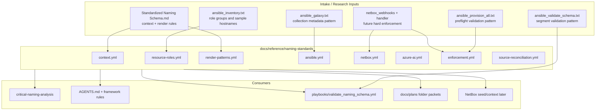
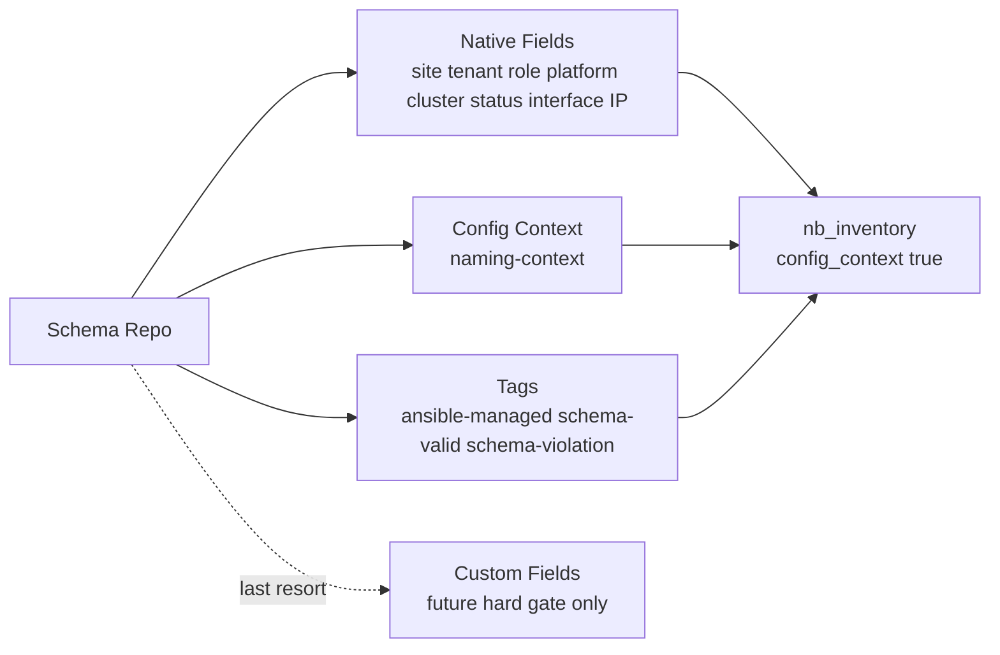
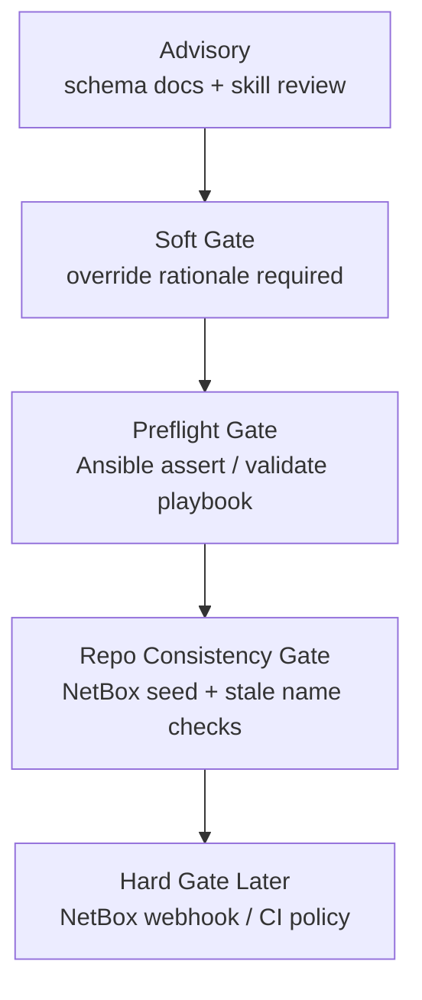

# Naming Schema Repository Integration

## Summary

Create a slim, machine-readable naming schema under
`docs/reference/naming-standards/` and demote older prose-heavy research into
an archive. The schema captures context, render patterns, resource role codes,
Ansible naming conventions, NetBox field mapping, Azure AI resource naming, and
enforcement maturity.

This plan is implemented as a schema and documentation pass only. It does not
apply live NetBox changes and does not run mutating Ansible.

## Architecture/Structure Diagram

## NetBox Field Mapping Diagram

## Enforcement Maturity Diagram

## Key Changes

- Active schema files define context, render patterns, resource role codes,
  Ansible naming, NetBox mapping, Azure AI naming, and enforcement maturity.
- Older reference files are moved under `archive/` with integration suffixes.
- `idx` is canonical; imported `seq`, `sequence`, and `nn` are aliases only.
- `ctl` is the current control-plane domain code, replacing `auth/aut`.
- A non-mutating Ansible validation playbook scaffolds schema preflight behavior.
- Planning rules now require folder packet plans under
  `docs/plans/YYYY-MM-DD--slug/README.md`.

## Test Plan

- Parse active YAML schema files.
- Run Ansible syntax check on `playbooks/validate_naming_schema.yml`.
- Confirm old long-form reference files are no longer in the active schema root.
- Confirm the critical naming skill and framework rules point to the schema.
- Confirm no live NetBox or mutating Ansible actions were run.

## Assumptions

- Existing live NetBox names remain unreconciled until a later NetBox seed pass.
- Candidate role codes are captured for future use but only `integrated` codes
  are enforceable by default.
- Azure provider constraints require fresh official-doc verification before any
  Azure resource implementation.

## Diagram Inventory

Included:

- Architecture/Structure Diagram
- NetBox Field Mapping Diagram
- Enforcement Maturity Diagram

Other diagrams that could be created:

- Schema File Dependency Diagram
- Rename Cleanup Sequence Diagram
- Resource Code Lifecycle Diagram
- NetBox Reconciliation State Diagram
- Ansible Preflight Flow Diagram

## Sources Checked

- `AGENTS.md`
- `.codex/config.toml`
- `docs/codex_framework/README.md`
- `docs/codex_framework/partner_process.md`
- `.cursor/rules/framework-partner-process.mdc`
- `.cursor/rules/framework-netbox-modeling.mdc`
- `.cursor/rules/framework-knowledge-and-research.mdc`
- `.cursor/rules/netbox-knowledge-gate.mdc`
- `.cursor/rules/ansible-knowledge-gate.mdc`
- `/Users/joshc/.codex/skills/critical-naming-analysis/SKILL.md`
- `docs/intake/schema-design-proposal-netbox-ansible-context/`
- `docs/plans/README.md`
- `docs/reference/naming-standards/`
