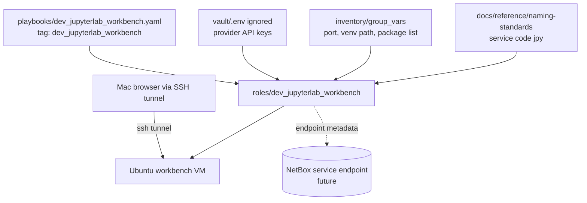

# Remote JupyterLab Workbench

## Summary

Create a lightweight remote JupyterLab workbench on an Ubuntu VM using a Python
venv, not Docker. The workbench supports Langfuse/OpenAI/Anthropic notebook
experiments while keeping provider secrets outside committed plaintext.

Proposed schema/resource codes:

- `jpy`: JupyterLab service/workbench role
- `hom-lab-aix-jpy-01`: candidate rendered service instance when NetBox service
  endpoint naming is adopted

## Architecture/Structure Diagram

## Worklist

1. Add `roles/dev_jupyterlab_workbench`.
2. Install Python venv, JupyterLab, `ipykernel`, `python-dotenv`, `langfuse`,
   `openai`, and `anthropic`.
3. Register the notebook kernel.
4. Prefer SSH tunnel access from the Mac before adding ingress.
5. Add a small validation notebook or documented notebook cells.

## Apply / Verify / Undo / Change Class

- Apply: run the workbench playbook against the selected Ubuntu VM.
- Verify: service starts, tunnel opens, notebook imports succeed.
- Undo: role absent path should remove service files and optionally leave the
  venv/cache by policy.
- Change class: idempotent config.

## Diagram Inventory

Included:

- Architecture/Structure Diagram

Other available diagram types:

- SSH Tunnel Sequence Diagram
- Python Environment Dependency Diagram
- Secret Boundary Diagram
- NetBox Service Endpoint Diagram
