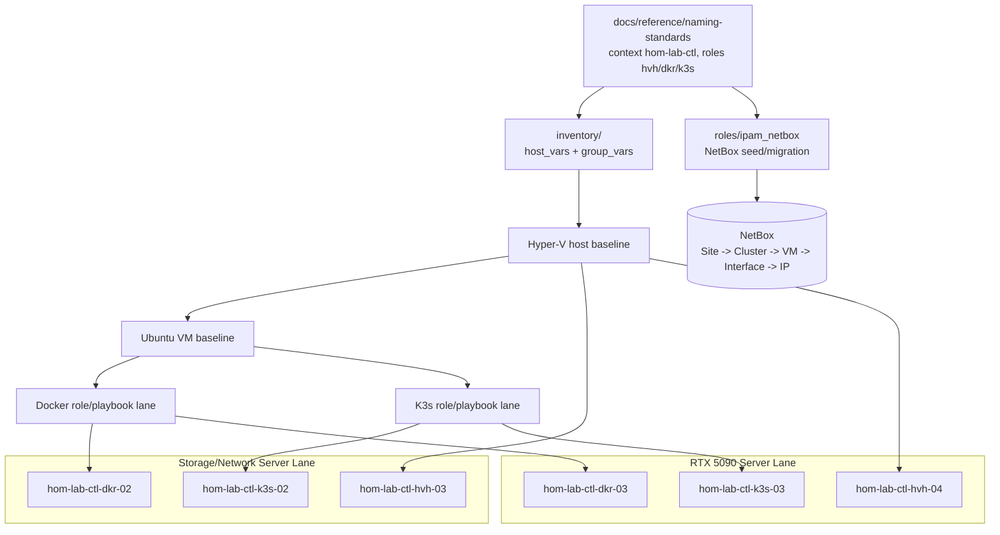

# Upgraded Server Ubuntu/Docker/K3s Baseline

## Summary

Adapt the existing Ubuntu VM, Docker VM, K3s VM, and NetBox modeling work for
the two upgraded server lanes: the storage/network server lane and the RTX 5090
GPU/inference lane.

This plan uses the active naming schema. Initial proposed resources are:

- `hom-lab-ctl-hvh-03`: storage/network Hyper-V host
- `hom-lab-ctl-hvh-04`: RTX 5090 Hyper-V host
- `hom-lab-ctl-dkr-02`: storage/network Docker/service VM
- `hom-lab-ctl-k3s-02`: storage/network K3s VM
- `hom-lab-ctl-dkr-03`: RTX 5090 Docker/service VM
- `hom-lab-ctl-k3s-03`: RTX 5090 K3s GPU VM

## Architecture/Structure Diagram

## Worklist

1. Reconcile inventory and NetBox seed inputs for both upgraded hosts.
2. Generalize Ubuntu baseline inputs so Docker and K3s lanes reuse the same VM
   base without crossing targets.
3. Keep Docker playbooks scoped to `dkr` VMs only.
4. Keep K3s playbooks scoped to `k3s` VMs only.
5. Add read-only target previews before any mutating run.

## Apply / Verify / Undo / Change Class

- Apply: Ansible inventory, NetBox seed/migration tasks, then existing Hyper-V
  Ubuntu/Docker/K3s playbooks by tag.
- Verify: inventory graph, NetBox object checks, SSH reachability, Docker/K3s
  exclusion checks.
- Undo: manual NetBox cleanup plus role-specific absent paths where available.
- Change class: idempotent config with bootstrap VM provisioning steps.

## Diagram Inventory

Included:

- Architecture/Structure Diagram

Other available diagram types:

- NetBox Object Hierarchy Diagram
- Host Targeting Preview Diagram
- Docker/K3s Exclusion Diagram
- Rollback Sequence Diagram
