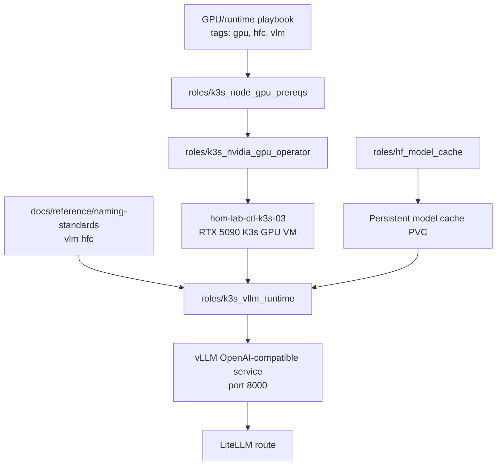

# vLLM Runtime And Hugging Face Cache

## Summary

Deploy the first GPU-backed vLLM runtime and persistent Hugging Face cache,
starting with a small model to prove the GPU, K3s scheduling, cache, service,
and LiteLLM route.

Proposed schema/resource codes:

- `vlm`: vLLM runtime
- `hfc`: Hugging Face cache

## Architecture/Structure Diagram

## Worklist

1. Validate GPU visibility on the RTX 5090 K3s VM.
2. Add GPU prereq/operator roles if the baseline does not already own them.
3. Add `roles/hf_model_cache` and `roles/k3s_vllm_runtime`.
4. Start with a small model such as `Qwen/Qwen3-0.6B`.
5. Add a LiteLLM route to the vLLM service only after the service passes a
   direct API check.

## Apply / Verify / Undo / Change Class

- Apply: run GPU prereq, cache, and vLLM tags against the GPU K3s lane.
- Verify: CUDA test pod works, vLLM serves API, cache persists, LiteLLM route
  responds.
- Undo: remove vLLM deployment/route; retain or remove cache PVC by policy.
- Change class: idempotent config with hardware/runtime prerequisites.

## Diagram Inventory

Included:

- Architecture/Structure Diagram

Other available diagram types:

- GPU Scheduling Diagram
- Model Cache Lifecycle Diagram
- LiteLLM Route Integration Diagram
- Rollback/PVC Retention Diagram
