# vLLM Runtime and HuggingFace Cache Implementation Plan

## Executive Summary

This plan outlines the deployment of vLLM runtime with GPU support and Hugging Face model caching on a K3s Kubernetes cluster, specifically targeting an RTX 5090 GPU. The implementation will leverage Ansible for automation, focusing on NVIDIA driver prerequisites, GPU Operator deployment, and vLLM Helm chart deployment. A Qwen/Qwen3-0.6B model will be used for initial testing.

## Apply / Verify / Undo / Change Class

*   **Apply:** Ansible playbooks will be used to apply the configuration.
    *   `deploy_gpu_infrastructure.yaml`: Installs NVIDIA drivers, configures containerd, and deploys the NVIDIA GPU Operator.
    *   `deploy_vllm_runtime.yaml`: Creates the vLLM namespace, sets up PVCs for model caching, and deploys vLLM via its Helm chart.
*   **Verify:**
    *   NVIDIA driver installation: `nvidia-smi` command output.
    *   GPU Operator deployment: `kubectl get pods -n gpu-operator`, `kubectl get nodes -o json | jq '.items[].status.capacity'`.
    *   vLLM deployment: `kubectl get pods -n vllm-runtime`, `kubectl logs <vllm-pod-name>`, test OpenAI-compatible API endpoint.
    *   Model caching: Observe faster startup times for subsequent vLLM pods.
*   **Undo:** Ansible playbooks with `state: absent` for Kubernetes resources and `state: absent` for installed packages/Helm releases. Manual cleanup of NVIDIA drivers if necessary.
*   **Change Class:** Idempotent configuration and deployment.

## Architecture/Structure Diagram

```mermaid
graph TD
 subgraph dotfile_vnext [dotfile-vnext Repository]
 subgraph inventory [Inventory Layer]
 all_vars[inventory/group_vars/all.yaml<br/>vault_huggingface_token]
 k3s_nodes[inventory/group_vars/k3s_cluster.yaml]
 host_vars[inventory/host_vars/gpu_node.yaml]
 end
 
 subgraph roles [Role Layer]
 nvidia_gpu_driver[roles/nvidia_gpu_driver<br/>Host-level driver install]
 k3s_gpu_node_config[roles/k3s_gpu_node_config<br/>K3s node labeling/config]
 nvidia_gpu_operator_role[roles/nvidia_gpu_operator<br/>Helm chart deployment]
 vllm_runtime[roles/vllm_runtime<br/>Helm chart deployment]
 end
 
 subgraph playbooks [Playbook Layer]
 deploy_gpu_infra[playbooks/deploy_gpu_infrastructure.yaml<br/>tags: gpu_infra]
 deploy_vllm[playbooks/deploy_vllm_runtime.yaml<br/>tags: vllm_runtime]
 end
 end
 
 subgraph external [External Resources]
 k3s_cluster[K3s Cluster<br/>RTX 5090 GPU]
 nvidia_helm_repo[NVIDIA Helm Repo]
 vllm_helm_repo[vLLM Helm Repo]
 huggingface[Hugging Face Hub<br/>Qwen/Qwen3-0.6B]
 end
 
 deploy_gpu_infra -->|"uses"| nvidia_gpu_driver
 deploy_gpu_infra -->|"uses"| k3s_gpu_node_config
 deploy_gpu_infra -->|"uses"| nvidia_gpu_operator_role
 deploy_vllm -->|"uses"| vllm_runtime
 
 nvidia_gpu_driver -->|"installs on"| k3s_cluster
 k3s_gpu_node_config -->|"configures"| k3s_cluster
 nvidia_gpu_operator_role -->|"deploys to"| k3s_cluster
 nvidia_gpu_operator_role -->|"pulls from"| nvidia_helm_repo
 vllm_runtime -->|"deploys to"| k3s_cluster
 vllm_runtime -->|"pulls from"| vllm_helm_repo
 vllm_runtime -->|"downloads model from"| huggingface
 
 all_vars -->|"provides HF_TOKEN"| vllm_runtime
 all_vars -->|"defines versions"| nvidia_gpu_driver
 all_vars -->|"defines versions"| nvidia_gpu_operator_role
 k3s_nodes -->|"targets"| k3s_cluster
 host_vars -->|"targets specific nodes"| k3s_cluster
 
 style all_vars fill:#2a2a2a
 style nvidia_helm_repo fill:#1e3a5f
 style vllm_helm_repo fill:#1e3a5f
 style huggingface fill:#1e3a5f
```

## Detailed Plan

### Phase 1: GPU Infrastructure (Prerequisite)

1.  **NVIDIA Driver Installation (`nvidia_gpu_driver` role):**
    *   **Goal:** Install necessary NVIDIA drivers on the K3s GPU node.
    *   **Tasks:**
        *   Install `nvidia-driver-535` and `nvidia-utils-535` using `ansible.builtin.apt`.
        *   Verify installation with `nvidia-smi`.
    *   **Dependencies:** Ubuntu host, internet access.
    *   **Naming Standards:** Role variables prefixed `nvidia_gpu_driver_`.
    *   **Variable Sources:** `inventory/group_vars/all.yaml` for driver version.

2.  **K3s GPU Node Configuration (`k3s_gpu_node_config` role):**
    *   **Goal:** Label K3s nodes with GPU presence and configure containerd for GPU workloads.
    *   **Tasks:**
        *   Label nodes with `nvidia.com/gpu=present` using `kubernetes.core.k8s`.
        *   Configure `containerd` runtime (if custom configuration beyond GPU Operator is needed).
    *   **Dependencies:** K3s cluster operational, `kubectl` access.
    *   **Naming Standards:** Role variables prefixed `k3s_gpu_node_config_`.

3.  **NVIDIA GPU Operator Deployment (`nvidia_gpu_operator` role):**
    *   **Goal:** Deploy the NVIDIA GPU Operator via Helm to enable GPU resource management in K3s.
    *   **Tasks:**
        *   Add NVIDIA Helm repository using `kubernetes.core.helm_repository`.
        *   Install `gpu-operator` Helm chart, ensuring `driver.enabled=false` (as drivers are pre-installed).
        *   Create `gpu-operator` namespace.
    *   **Dependencies:** Helm CLI, internet access.
    *   **Naming Standards:** Role variables prefixed `nvidia_gpu_operator_`.
    *   **Tag Hierarchies:** `gpu_operator` tag for deployment tasks.

### Phase 2: vLLM Deployment and HuggingFace Cache

1.  **vLLM Runtime Deployment (`vllm_runtime` role):**
    *   **Goal:** Deploy vLLM with Qwen/Qwen3-0.6B model and configure Hugging Face model caching.
    *   **Tasks:**
        *   Create `vllm-runtime` namespace using `kubernetes.core.k8s`.
        *   Create `huggingface-token` Secret for `HF_TOKEN` from Ansible vault.
        *   Create `huggingface-cache` PersistentVolumeClaim (RWX for multi-pod scaling, `local-path` storage class for K3s).
        *   Deploy vLLM Helm chart, configuring image, resources (`nvidia.com/gpu: 1`), and model details.
        *   Map `HF_HOME` and `VLLM_CACHE_ROOT` to `/cache/huggingface` and `/cache/vllm` respectively on the PVC.
    *   **Dependencies:** K3s cluster with GPU Operator, access to Hugging Face (via `HF_TOKEN`).
    *   **Naming Schemes:** Namespace `vllm-runtime`, PVC `huggingface-cache`.
    *   **Variable Sources:** `vault_huggingface_token` from `inventory/group_vars/all.yaml` (or similar vault file).

## Diagram Inventory

### Diagrams Included
- **Architecture/Structure Diagram**: Shows repository organization, naming schemes, and integration points

### Additional Diagrams Available On Request
- **Deployment Flow**: Sequential deployment steps across environments
- **State Transition Diagram**: Object lifecycle and state changes
- **Integration Sequence**: Detailed API/service interaction timeline
- **Network Topology**: Host/cluster/network relationships (when infrastructure is in scope)
