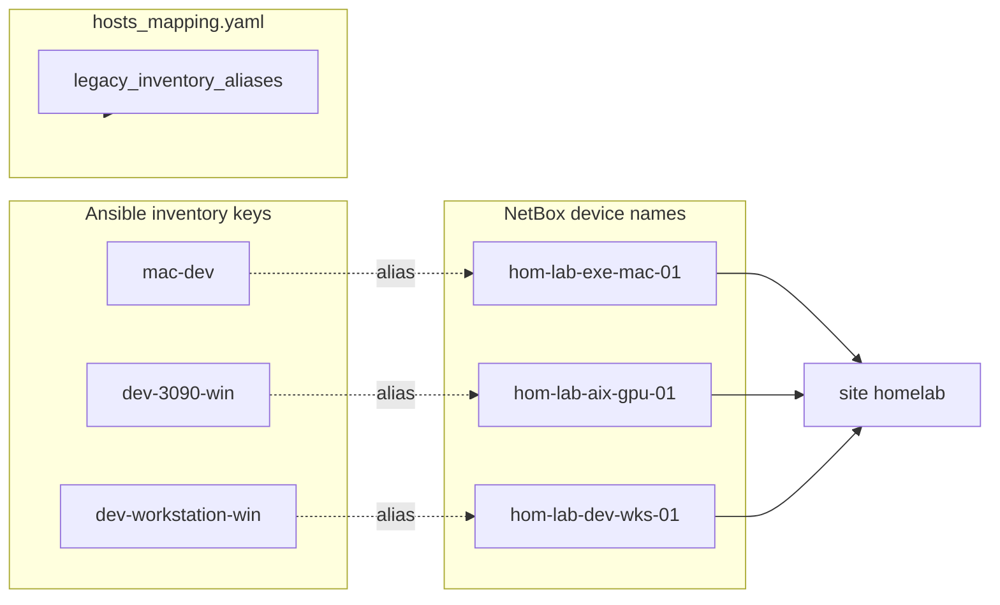
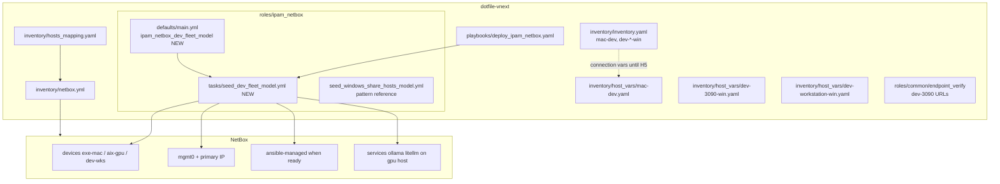

# Edge Dev Host Naming + NetBox Modeling

**Planner/Steward view:** Hyper-V lane hosts already use compact `hom-lab-ctl-*` names in NetBox. This plan is **only** the three edge/dev machines below — not K3s (already seeded), not IPAM prefixes (sibling plan).

---

## Scope

| Inventory key | Proposed NetBox name | Role | Platform (NetBox) | Connection |
|---|---|---|---|---|
| `mac-dev` | `hom-lab-exe-mac-01` | execution-plane Mac controller | `macos-15` (new seed) | Live — Ansible execution node |
| `dev-3090-win` | `hom-lab-aix-gpu-01` | AI/GPU Windows box | `windows-11` or `windows-server-2025` | **Deferred** |
| `dev-workstation-win` | `hom-lab-dev-wks-01` | general dev workstation | `windows-11` | Intermittent |

**Out of scope here:** `hom-lab-ctl-k3s-01/02` (done), IPAM `/24` prefixes, storage-lane `hom-lab-ctl-dkr-01` services, config contexts, H5 static inventory retirement.

---

## Naming / Modeling Diagram



---

## Architecture/Structure Diagram



---

## Phase 0 — Naming gate (blocks all seeds)

**Authority:** `docs/reference/naming-standards/` (`render-patterns.yml`, `context.yml`, `resource-roles.yml`). Use `critical-naming-analysis` skill if disputed.

**Policy:** NetBox **name == slug**. Recommended: **keep inventory keys** (`mac-dev`, etc.); NetBox uses compact names; wire `legacy_inventory_aliases` in `hosts_mapping.yaml`.

**Open decisions:**

1. Register role codes `mac`, `gpu`, `wks` and domains `exe`, `dev` in `resource-roles.yml`, or map to `srv` / `vlm`.
2. Whether to ever rename inventory keys to match NetBox (breaking) — default **no**.
3. NetBox `status` for offline hosts: `planned` vs `offline`.

**Apply:** Analysis + schema doc update.

**Verify:** Name table signed off in this README.

**Undo:** Revert schema docs.

**Change class:** idempotent config.

---

## Phase 1 — Dev fleet NetBox seed

**Apply:**

- `ipam_netbox_dev_fleet_model` in `defaults/main.yml` (devices, roles, platforms, interfaces, tags).
- `tasks/seed_dev_fleet_model.yml` — mirror `seed_windows_share_hosts_model.yml` task order.
- Playbook tags: `ipam_netbox_seed_dev_fleet_model_preview`, `ipam_netbox_seed_dev_fleet_model`.

**IPs (from inventory / hosts_mapping):**

| Device | Source |
|---|---|
| `hom-lab-exe-mac-01` | `hostvars['mac-dev'].host_ip` / `192.168.50.33` |
| `hom-lab-aix-gpu-01` | `192.168.50.191` (physical_node dev-3090) |
| `hom-lab-dev-wks-01` | `hostvars['dev-workstation-win'].host_ip` / `192.168.50.70` |

**Verify:**

```bash
bin/codex-env ansible-playbook playbooks/deploy_ipam_netbox.yaml \
  -e ipam_netbox_api_url=http://127.0.0.1:18000 \
  --tags ipam_netbox_seed_dev_fleet_model_preview
```

Then `--tags ipam_netbox_seed_dev_fleet_model`.

**Undo:** Manual NetBox delete or future absent path.

**Change class:** idempotent seed.

**Depends on:** Phase 0 complete; NetBox API reachable (tunnel OK).

---

## Phase 2 — Offline / deferred posture

**Process:**

1. Model in code even when host is down.
2. Seed `dev-3090-win` as **`planned`** until `ansible_surfaces.state` is not `deferred`.
3. **Tag policy (recommended):** seed with `inventory-staged` first; add `ansible-managed` only when SSH/WinRM verified — controls `nb_inventory` inclusion (`query_filters: tag: ansible-managed`).
4. Connection secrets stay in `host_vars/` / vault until H5.
5. When online: `active` + `ansible-managed` + inventory smoke test.

**Verify:** `ansible-inventory -i inventory/netbox.yml --host hom-lab-exe-mac-01` (or alias resolution documented).

**Undo:** Remove tags / set decommissioning.

**Change class:** operational gate on top of idempotent seed.

---

## Phase 3 — Repo aliases + consistency

- `hosts_mapping.yaml`: `legacy_inventory_aliases` for each compact name.
- `scripts/validate_netbox_repo_consistency.sh`: allowlist new strings.
- `roles/ipam_netbox/README.md`: document dev-fleet tags.

**Verify:** consistency script passes after seed.

**Change class:** idempotent config.

---

## Phase 4 — Edge service objects

| Host | Services | Source |
|---|---|---|
| `hom-lab-aix-gpu-01` | Ollama `:11434`, LiteLLM `:4000` | `roles/common/endpoint_verify/tasks/main.yml` |
| `hom-lab-exe-mac-01` | Optional — skip unless needed | Controller, not service host |

Reuse `netbox_service` loop + Service custom fields from GPU lane seed.

**Verify:** NetBox device page lists services.

**Change class:** idempotent seed.

**When:** After Phase 1 and host connectivity confirmed for GPU box.

---

## Phase 5 — nb_inventory validation

- Expect **+1 to +3** hosts in `nb_inventory` when `ansible-managed` applied (mac-dev first; others when staged).
- `ansible.builtin.ping` on mac-dev; `ansible.windows.win_ping` on Windows surfaces.
- Document `--limit` for hosts still `planned`.

**Does not include H5** (retire `inventory/inventory.yaml`) — see name-alignment plan.

---

## Apply / Verify / Undo / Change class

| Phase | Apply | Verify | Undo | Class |
|---|---|---|---|---|
| 0 Naming | Schema + agreement | Name table locked | Revert docs | config |
| 1 Seed | `seed_dev_fleet_model` | NetBox devices + IPs | Delete objects | idempotent seed |
| 2 Offline | Status + tags | nb_inventory scope | Remove tags | operational |
| 3 Repo | mapping + script | consistency pass | Revert aliases | config |
| 4 Services | service loop on gpu | NetBox UI | Delete services | idempotent seed |
| 5 Inventory | tag + ping | host count + reachability | Remove ansible-managed | verification |

---

## Prerequisites

- Phase 0 naming locked.
- `vault_netbox_api_token` in `vault.yml`.
- NetBox API: `http://127.0.0.1:18000` (tunnel) per `docs/one_off_tasks/investigate_networking_issue.md`.

---

## Diagram Inventory

### Diagrams Included

- **Architecture/Structure Diagram**: inventory, ipam_netbox seed path, NetBox objects.
- **Naming/Modeling Diagram**: inventory key → NetBox name alias mapping.

### Additional Diagrams Available On Request

- **State Transition Diagram**: `planned` → `active` + `ansible-managed`.
- **Deployment Flow**: playbook tag order Phases 1 → 4.
- **Integration Sequence**: nb_inventory pickup after tag flip.
