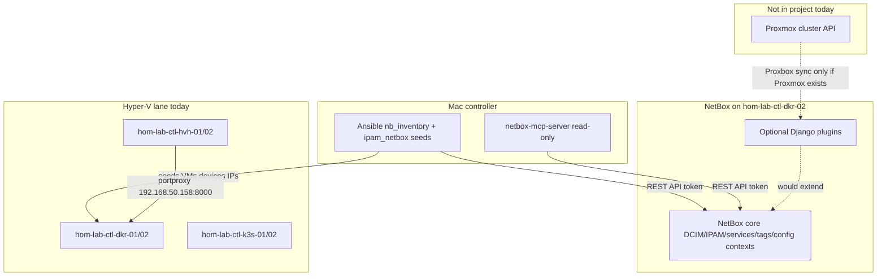
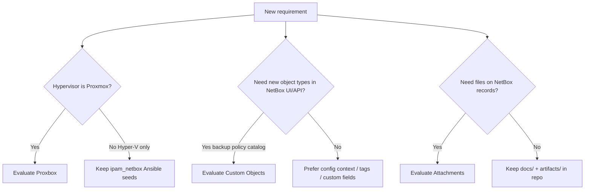

# NetBox application plugins — evaluation (Proxbox, Custom Objects, Attachments)

**Lifecycle:** evaluation / future-state (no install committed)

**Related:**

- Ansible + MCP integration (no Django plugin): [`docs/intake/netbox-jumpstart.md`](../../intake/netbox-jumpstart.md), [`docs/intake/netbox/findings_research.md`](../../intake/netbox/findings_research.md)
- NetBox value roadmap: [`docs/intake/netbox/netbox-value-roadmap.md`](../../intake/netbox/netbox-value-roadmap.md)
- Backup naming contract: `roles/ipam_netbox/defaults/main.yml` (`ipam_netbox_backup_*`) and `roles/ipam_netbox/README.md` (backup section)
- Hyper-V stack (not Proxmox): `hom-lab-ctl-hvh-*`, seeds in `roles/ipam_netbox/`

**Decision default:** Stay on **core NetBox + `netbox.netbox` collection + `netbox-mcp-server`**. Add a NetBox **application** plugin only when one named pain justifies custom image build, migrations, and upgrade testing (`roles/ipam_netbox` Docker path).

---

## Problem statement

Application plugins extend the NetBox **web app and API** with new models and UI. They are often confused with:

| Piece | What it is | This repo |
|-------|------------|-----------|
| `netbox.netbox` Ansible collection | Inventory plugin + modules | **In use** (`requirements.yml`, `inventory/netbox.yml`) |
| `netbox-mcp-server` | Read-only MCP beside NetBox | **In use** (`roles/mcp_servers/netbox`) |
| NetBox Django plugins | Python packages inside NetBox container | **Not installed** — evaluate case-by-case |

This plan captures three candidates discussed for the homelab: **Proxbox**, **Custom Objects**, and **Attachments** — with concrete “what you get” and fit for *this* project.

---

## Architecture / structure diagram



---

## Plugin 7 — Proxbox (Proxmox integration)

### What you get (concrete)

**Proxbox** is a NetBox application plugin that connects to a **Proxmox VE** API and **imports or syncs** virtualization inventory into NetBox:

- Proxmox **clusters** → NetBox cluster objects (or linked metadata)
- **Nodes** → devices or supporting records (depending on plugin version/config)
- **VMs and LXC containers** → NetBox virtual machines
- **Interfaces / bridges** → VM interfaces (where the plugin maps them)
- Periodic or on-demand **sync** so NetBox stays aligned with live Proxmox state

**Example flow (as described earlier):**

1. You create a VM `web-01` in Proxmox on node `pve1`.
2. Proxbox sync runs (scheduled or manual).
3. NetBox gains (or updates) VM `web-01` under the right cluster, with status, vCPU/RAM if mapped, and interfaces.
4. Ansible `nb_inventory` can then target that VM by NetBox role/tag without a hand-written seed task for every new guest.

Official ecosystem reference: [NetBox Labs plugin catalog](https://netboxlabs.com/plugins/) and community write-ups (e.g. Proxbox + Proxmox). Install path is **inside NetBox** (pip + `PLUGINS` + custom Docker image), not Ansible Galaxy.

### How it could be used in *this* project

| Factor | This homelab |
|--------|----------------|
| Hypervisor | **Hyper-V** (`hom-lab-ctl-hvh-*`) — guests are seeded by **`roles/ipam_netbox`** Ansible tasks, not Proxmox API |
| Proxmox present? | **No** — no Proxmox cluster in inventory or naming registry |
| Existing automation | VM/device truth is **code-first seeds** + `ansible-managed` tag + compact hostnames (`hom-lab-ctl-dkr-02`, etc.) |

**Verdict for dotfile-vnext today:** **Not applicable** unless you add a Proxmox cluster later.

**If you add Proxmox later**, Proxbox becomes interesting as a **second virtualization lane**:

- Hyper-V guests: keep Ansible seeds (current pattern).
- Proxmox guests: let Proxbox sync → NetBox → `nb_inventory` groups by tag/role.
- Risk: **two sources of truth** unless you clearly split tags (`hyperv` vs `proxmox`) and never double-model the same guest.

**Concrete homelab scenario (hypothetical):**

```text
New Proxmox cluster "lab-pve" on a dedicated host
  → Install Proxbox in NetBox
  → Configure API URL + token to Proxmox
  → Sync creates VMs with tag proxmox-managed
  → Ansible: --limit tags_proxmox-managed for Proxmox-only playbooks
```

Until then, the equivalent job is already done by:

- `roles/ipam_netbox/tasks/seed_*` for Hyper-V VMs
- `inventory/netbox.yml` for dynamic reads

### Apply / verify / undo (if ever adopted)

| | |
|--|--|
| **Apply** | Add plugin to NetBox image requirements, `PLUGINS`, rebuild `ipam_netbox` image, migrate, configure Proxmox endpoint in `PLUGINS_CONFIG` |
| **Verify** | New VM in Proxmox appears in NetBox after sync; `ansible-inventory -i inventory/netbox.yml --host <vm>` |
| **Undo** | Remove plugin from `PLUGINS`, rebuild image, migrate; Proxmox remains source on hypervisor |
| **Class** | Bootstrap/semi-manual first install; steady-state sync may be idempotent depending on plugin |

---

## Plugin 8 — Custom Objects (NetBox Labs certified)

### What you get (concrete)

**Custom Objects** lets you define **new object types and fields in the NetBox UI** (within product limits) without authoring a full Django plugin. Each type gets:

- Its own menu / list view in NetBox
- Custom fields (text, choice, integer, relations where supported)
- REST API endpoints for automation
- Permissions and change log like core objects

You use it when core models (device, VM, service, prefix, config context) **do not fit** a concept you want to document as first-class data.

### Backup policies — concrete homelab example

Your repo already has a **backup naming contract** in `roles/ipam_netbox/defaults/main.yml`:

```yaml
ipam_netbox_backup_namespace: castle   # path vocabulary (not schema code cst)
ipam_netbox_backup_site: home
ipam_netbox_backup_environment: lab
# ... role, idx, rendered paths under /mnt/... or similar
```

Today that logic lives in **Ansible variables and docs**, not as queryable NetBox rows.

**Custom Object type: `BackupPolicy` (example)**

| Field | Example value | Links to |
|-------|---------------|----------|
| `name` | `cst-hom-lab-ctl-dkr-02-netbox-daily` | — |
| `namespace` | `castle` | path segment (documented exception) |
| `site` | `home` | path segment |
| `environment` | `lab` | path segment |
| `role` | `nbx` | backup role code |
| `retention_days` | `30` | policy |
| `schedule` | `daily 02:00` | operator text |
| `target_vm` | relation → `hom-lab-ctl-dkr-02` | NetBox VM |
| `path_template` | `/mnt/backups/castle/home/lab/...` | matches contract |

**What that buys you:**

- Operators see **which backup policy applies to which VM** in NetBox UI.
- MCP / API queries: “list BackupPolicy for site homelab.”
- Ansible seeds could **create/update** policies via API (future task), same code-first discipline as devices.

**Alternative without plugin:** config context JSON on the VM (`backup: { namespace: castle, ... }`) — you already use config contexts for naming; keeps one less plugin, weaker as a standalone inventory of policies.

### Other concrete examples for this project

| Custom object type | Purpose | Example row |
|--------------------|---------|-------------|
| `PortproxyEndpoint` | Document Windows `netsh portproxy` rows not native in NetBox | `netbox` → `192.168.50.158:8000` → guest `192.168.137.10:8000` on `hom-lab-ctl-hvh-02` |
| `ServiceIdentity` | Hold L4 `logical_service_hostname` before Phase 2 custom field lands | `hom-lab-ctl-nbx-01` for service slug `netbox-web` |
| `GpuWorkloadProfile` | Tie 5090 / vLLM intent to a host | profile `inference-70b` on future edge GPU host |
| `AnsibleCapability` | Map repo capability to NetBox scope | `ipam_netbox` ↔ tag `ansible-managed` + playbook `deploy_ipam_netbox.yaml` |

### Fit for dotfile-vnext

| Pros | Cons |
|------|------|
| Models backup/portproxy/service-identity **next to** VMs | Another NetBox upgrade surface (plugin + migrations) |
| Good for **operator-facing** catalog | Overlaps config contexts + tags if overused |
| API-friendly for later Ansible seeds | Duplicates YAML in `defaults/main.yml` unless you automate sync |

**Verdict:** Consider **after** Phase 2 service metadata (`logical_service_hostname`) is decided. Strongest near-term use case: **backup policy catalog** tied to VMs, if you want NetBox UI as the operator view of `castle/home/lab/...` paths.

---

## Plugin 9 — Attachments

### What you get (concrete)

The **Attachments** plugin adds **file uploads** to NetBox objects (devices, VMs, racks, cables, locations, etc.):

- Upload PDF, PNG, ZIP, config exports, diagrams
- Files stored in NetBox’s configured storage backend
- Shown in object UI tabs; downloadable via API
- Useful for **evidence** and **runbooks** attached to the asset record

**Not** a replacement for git-backed docs in `docs/` — it is **per-object file cabinet** inside NetBox.

### Concrete homelab examples

| Object | Attachment | Why |
|--------|------------|-----|
| `hom-lab-ctl-hvh-02` (device) | PDF export of Hyper-V virtual switch diagram | Field tech view from NetBox |
| `hom-lab-ctl-hvh-02` | `hyper-v-portproxy` troubleshooting excerpt | Link runbook to the host that owns portproxy |
| `hom-lab-ctl-dkr-02` | `docker compose config` snapshot after NetBox deploy | Drift reference |
| `hom-lab-ctl-k3s-02` | Traefik / ingress screenshot or YAML | Service debugging |
| Site `homelab` | Rack photo or floor plan (if you model physical) | DCIM completeness |
| Prefix `192.168.50.0/24` | Spreadsheet of reserved IPs | IPAM hygiene |

**Workflow example:**

1. Open VM `hom-lab-ctl-dkr-02` in NetBox.
2. Attach `netbox-backup-2026-05-27.dump` metadata note (not necessarily the dump itself — large files may belong in backup storage only).
3. Attach small `restore-steps.md` PDF for operators.

### Fit for dotfile-vnext

| Pros | Cons |
|------|------|
| Low conceptual weight | Files in NetBox DB/volume — **backup/restore** must include attachment storage |
| Helps **operators** who live in NetBox UI | Repo docs (`docs/diagnostics/`, `docs/plans/`) remain canonical for agents |
| Good for photos and one-off exports | Does not help Ansible or MCP unless you build fetch workflows |

**Verdict:** **Optional quality-of-life** — install only if you want NetBox-as-portal for files. Do not block Tier 2 IPAM/service work.

---

## Capability routing (when to adopt a plugin)



---

## Comparison summary

| Plugin | Primary value | This project now | Trigger to adopt |
|--------|---------------|------------------|------------------|
| **Proxbox** | Proxmox → NetBox sync | **N/A** (Hyper-V) | Proxmox cluster added to homelab |
| **Custom Objects** | New types (backup policy, portproxy row, etc.) | **Defer** | Operator needs queryable catalog beyond config contexts |
| **Attachments** | Files on devices/VMs/sites | **Defer** | Operators want runbooks/evidence in NetBox UI |

---

## Install cost (any application plugin)

All three require the same operational pattern on your NetBox deployment:

1. Add Python package to NetBox plugin requirements (custom image build).
2. Enable in `configuration/plugins.py` (`PLUGINS`, `PLUGINS_CONFIG`).
3. Run migrations + `collectstatic` + restart workers (`ipam_netbox` role change).
4. Re-test on every `ipam_netbox_version` bump.

See [netbox-docker plugins wiki](https://github.com/netbox-community/netbox-docker/wiki/Using-Netbox-Plugins) and project notes in `docs/intake/netbox/findings_research.md`.

---

## Recommended order (this repo)

1. Finish **core** alignment (seeds, service identity phases, `nb_inventory` shadow compare) — no plugin.
2. If backup visibility in NetBox matters → pilot **Custom Objects** for `BackupPolicy` only.
3. If Proxmox appears → evaluate **Proxbox**; do not mix with Hyper-V seeds without tag discipline.
4. **Attachments** last — nice-to-have.

---

## Apply / verify / undo / change class (this plan)

| | |
|--|--|
| **Apply** | None in this packet — documentation only |
| **Verify** | Reviewer agrees plugin choice matches hypervisor and source-of-truth split |
| **Undo** | N/A |
| **Class** | Planning artifact |

---

## Diagram inventory

### Diagrams included

- **Architecture/structure diagram**: Controller, NetBox core, optional plugins, Hyper-V vs hypothetical Proxmox
- **Capability routing diagram**: Decision flow for when to evaluate each plugin

### Additional diagrams available on request

- **Deployment flow**: Custom NetBox image build + `ipam_netbox` rollout sequence
- **State transition**: BackupPolicy object lifecycle (draft → active → retired)
- **Integration sequence**: Proxbox sync tick vs Ansible seed playbook
