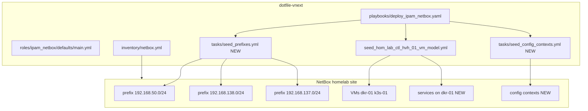

# NetBox IPAM + General WIP Completion

**Planner/Steward view:** Hyper-V lane hosts and GPU-lane services are seeded.

**Parent finish roadmap (active work):** [`docs/plans/2026-05-27--netbox-wip-finish-roadmap-incomplete/README.md`](../2026-05-27--netbox-wip-finish-roadmap-incomplete/README.md)

**Out of scope:** Edge dev hosts — [`edge-dev-host-naming-netbox-incomplete`](../2026-05-27--edge-dev-host-naming-netbox-incomplete/README.md) (deferred).

This plan is the **implementation detail** for IPAM prefixes, storage-lane services, config contexts, and doc refresh.

---

## Problem statement

| Gap | Status |
|---|---|
| Subnet prefixes `192.168.50/138/137` | Not in NetBox — host IPs only |
| Services on `hom-lab-ctl-dkr-01` | VM seeded; no `services:` block |
| Config contexts | `config_context: true` in inventory; nothing seeded |
| Roadmap / WIP docs | Stale `server-225` references |

---

## Architecture/Structure Diagram

---

## Phase 1 — IPAM prefixes

**Meaning:** Parent `/24` objects so host IPs sit under declared subnets (utilization, validation, reporting).

| Prefix | Use |
|---|---|
| `192.168.50.0/24` | LAN management |
| `192.168.138.0/24` | HOM-LAB-HVH-01 guest network |
| `192.168.137.0/24` | HOM-LAB-HVH-02 guest network |

**Apply:**

- `ipam_netbox_prefixes` in defaults.
- `tasks/seed_prefixes.yml` — `netbox.netbox.netbox_prefix`, site `homelab`, tags `ansible-managed`, `homelab`, `infra`.
- Tags: `ipam_netbox_seed_prefixes_preview`, `ipam_netbox_seed_prefixes`.

**Verify:** NetBox → IPAM → Prefixes (three `/24`, utilization visible).

**Undo:** Delete prefix objects.

**Change class:** idempotent seed.

**Independent of:** edge-dev-host plan (can run first).

---

## Phase 2 — Storage-lane service objects

**When:** `stacks_fuzlang_net` (or equivalent) deployed on `hom-lab-ctl-dkr-01`.

**Apply:** Add `services:` to `ipam_netbox_hom_lab_ctl_hvh_01_vm_model` (mirror GPU lane entries: MinIO, Postgres, etc. as applicable).

**Verify:** NetBox VM `hom-lab-ctl-dkr-01` service list.

**Undo:** Delete service objects.

**Change class:** idempotent seed.

---

## Phase 3 — Config contexts

**Goal:** Replace duplicated non-connection `host_vars` over time (feature flags, tuning).

**Apply:**

- `seed_config_contexts.yml` — `netbox.netbox.netbox_config_context` keyed by tags (`execution`, `docker`, `hyperv`, …).
- Playbook tags for preview/apply.

**Verify:** `ansible-inventory -i inventory/netbox.yml --host <host>` shows merged context data.

**Change class:** idempotent seed.

**Depends on:** Tags and devices from existing seeds (edge plan adds more devices later).

---

## Phase 4 — Documentation refresh

- `docs/brainstorming_designs/netbox_wip_capabiilty_usage_planning.md` — dual-plan pointers, done/open tables.
- `docs/intake/netbox/netbox-value-roadmap.md` — replace `server-225-ubuntu`, update Step 2 host table.

**Change class:** docs only.

---

## Apply / Verify / Undo / Change class

| Phase | Apply | Verify | Undo | Class |
|---|---|---|---|---|
| 1 Prefixes | `seed_prefixes` | IPAM UI | Delete prefixes | idempotent seed |
| 2 Storage svc | extend hvh-01 model | NetBox VM services | Delete services | idempotent seed |
| 3 Contexts | `seed_config_contexts` | inventory merge | Delete contexts | idempotent seed |
| 4 Docs | edit markdown | Review links | git revert | docs |

---

## Prerequisites

- NetBox API reachable (`http://127.0.0.1:18000` tunnel).
- `vault_netbox_api_token`.

---

## Diagram Inventory

### Diagrams Included

- **Architecture/Structure Diagram**: prefix seed, storage services, config contexts.

### Additional Diagrams Available On Request

- **Network Topology**: prefix containment for LAN vs guest subnets.
- **Deployment Flow**: recommended order — Phase 1 prefixes before edge host seed (optional).
