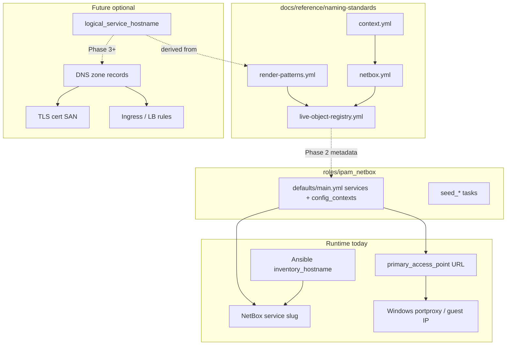
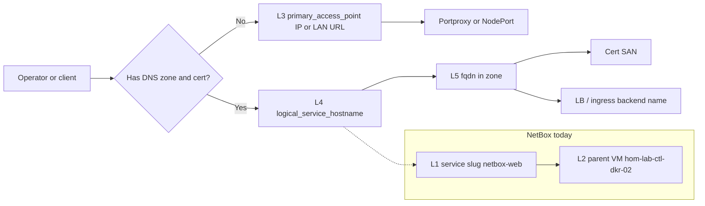

# Service identity layers and DNS-ready naming — future state

**Lifecycle:** future-state (Phase 0 done; Phase 1 **repo done**, NetBox apply pending; Phases 2–4 → dedicated pickup plan)

**Pickup plan (Phases 2–4 + Phase 1 apply):** [`2026-05-27--service-identity-phases-2-4-incomplete/README.md`](../2026-05-27--service-identity-phases-2-4-incomplete/README.md)

**Related completed work:** [`docs/plans/2026-05-27--naming-schema-live-registry-incomplete/README.md`](../2026-05-27--naming-schema-live-registry-incomplete/README.md)

**Schema registry:** [`docs/reference/naming-standards/`](../../reference/naming-standards/) — especially [`live-object-registry.yml`](../../reference/naming-standards/live-object-registry.yml), [`render-patterns.yml`](../../reference/naming-standards/render-patterns.yml)

---

## Problem statement

Homelab naming now has a clear **short host** model (`hom-lab-ctl-dkr-02`) and **short NetBox service slugs** (`netbox-web`), but three gaps create snowflake risk as you add DNS, TLS certs, load balancers, and ingress:

1. **Service identity is ambiguous** — `netbox-web` is not the same concept as a future FQDN or cert SAN; `hom-lab-ctl-nbx-01` exists in schema as an example only, not as assigned metadata.
2. **Context vocabulary drifts by surface** — `homelab-naming-context` uses `namespace: castle` while sibling fields use codes (`hom`, `lab`, `ctl`) and `required_context_tags` expects `namespace: cst`.
3. **No documented layer map** — backup paths use full words (`castle`, `home`); hostnames use codes (`hom`); NetBox tenant slug is `home` — valid if documented, confusing if not.

This plan defines **layers**, **repo changes**, and **phased steps** you can take without forcing DNS or renaming live NetBox objects prematurely.

---

## Naming layers (target model)

You need **both** short slugs and host-style names; they are not alternatives.

| Layer | Field / pattern | Example (NetBox stack) | Used for |
|-------|-----------------|------------------------|----------|
| L1 | NetBox `service.name` (slug) | `netbox-web` | NetBox API, tags, compose/stack identity, human scan in UI |
| L2 | Parent VM `inventory_hostname` | `hom-lab-ctl-dkr-02` | Ansible, SSH, VM placement, cluster membership |
| L3 | `primary_access_point` | `http://192.168.50.158:8000/` | **Today:** how operators and automation reach the service (IP/portproxy) |
| L4 | `logical_service_hostname` (render `service` pattern) | `hom-lab-ctl-nbx-01` | **Future:** DNS label stem, cert SAN, ingress host, LB backend identity |
| L5 | `fqdn` (optional, when zone exists) | `nbx.hom.lab.<zone>` or internal zone | Public or split-horizon DNS; only suffix changes when zone is chosen |
| L6 | `canonical_id` (docs/metadata) | `cst-hom-lab-ctl-service-netbox-01` | Diagrams, backup catalog metadata, long-form labels — not NetBox service.name |

**Rule:** L4 is assigned to the **service endpoint**, not the VM. One VM (`dkr-02`) holds many L1 slugs and many L4 logical names.

**Rule:** Do not rename L1 to L4 in NetBox unless you explicitly want API/object churn; add L4 alongside L1.

---

## Context vocabulary by surface (namespace / tenant)

| Surface | namespace | tenant / site | Notes |
|---------|-----------|---------------|--------|
| Hostname render | (omitted) | `hom` | `hom-lab-ctl-hvh-02` |
| Config context JSON (target) | `cst` | `hom` | Align with `required_context_tags` in `context.yml` |
| Config context JSON (today) | `castle` | `hom` | **Drift** — fix to `cst` |
| NetBox tenant slug | — | `home` | NetBox object slug; not the same as code `hom` |
| Backup path segment | `castle` | `home` | Readable stable paths; document as path vocabulary |
| Canonical ID / diagrams | `cst` | `hom` | `cst-hom-lab-ctl-dia-gpu-topology-01` |

**Target:** One documented table in `context.yml` or `netbox.yml` (`value_by_surface`) so `castle` vs `cst` and `hom` vs `home` are policy, not accidents.

---

## Architecture / structure diagram

---

## Capability routing (when you add DNS / certs / LB)

---

## What “lock in schema” means for your repo

### Phase 0 — Schema/docs only (no NetBox apply, no DNS) — **DONE**

**Repo changes (landed):**

| File | Change |
|------|--------|
| `render-patterns.yml` | Add `service_identity_layers` block documenting L1–L6; clarify `service` pattern = L4 only |
| `netbox.yml` | Add `service_naming_layers` + `value_by_surface` for namespace/tenant |
| `live-object-registry.yml` | Example row under `netbox_services` or new `service_identities`: `netbox-web` → `hom-lab-ctl-nbx-01`, `fqdn: null` |
| `README.md` (naming-standards) | Short “Service and DNS” section pointing at layers |

**What you get:**

- Agents and future-you use **one vocabulary** when adding services (no ad hoc FQDN-shaped NetBox names).
- You can **pre-assign** `hom-lab-ctl-nbx-01` in docs/registry **before** buying a domain or enabling internal DNS.
- **No** change to live URLs, compose files, or Ansible limits until later phases.
- **Flexibility:** Keep using IP/`primary_access_point` today; when DNS is ready, add L5 without renaming L1/L2.

**What you do *not* get yet:** Automatic DNS records, cert issuance, or ingress — those are later phases.

### Phase 1 — Namespace alignment in seeds (small NetBox apply) — **REPO DONE**

**NetBox apply:** Pending when API tunnel is up — see [phases-2-4 plan](../2026-05-27--service-identity-phases-2-4-incomplete/README.md#phase-1-apply-blocked).

**Repo changes (landed):**

- `roles/ipam_netbox/defaults/main.yml`: `homelab-naming-context` `namespace: castle` → `cst`
- `roles/ipam_netbox/tasks/seed_windows_share_hosts_model.yml`: same if present
- Re-seed config context tag `ipam_netbox_seed_config_contexts`

**What you get:**

- Config context matches `required_context_tags` and canonical IDs.
- `nb_inventory` / merged vars show consistent codes.

**Flexibility:** Backup paths can **stay** `castle/home/...` if documented under `value_by_surface` (no backup tree migration).

### Phase 2 — Logical hostname in seed metadata (optional NetBox custom field)

**Repo changes:**

- Decide storage: NetBox custom field `logical_hostname` **or** structured comment / config-context key per service.
- Extend `ipam_netbox` service dicts: e.g. `logical_hostname: hom-lab-ctl-nbx-01` for each GPU/storage service.
- Seed tasks pass field into `netbox_service` module if using custom field.
- Update `live-object-registry.yml` with full L1→L4 map for all nine GPU + seven storage services.

**What you get:**

- NetBox UI/API exposes **stable identity** separate from slug and IP.
- Cert-manager, ACME, or manual cert requests can target L4/L5 consistently.
- LB/ingress Helm values can reference L4 while backends remain IP:port.

**Flexibility:** Slug stays `netbox-web` for operators; automation targeting “the NetBox service identity” uses L4.

### Phase 3 — Internal DNS zone (infrastructure — out of schema-only scope)

**Prerequisites:** Zone choice (e.g. `homelab.local`, split DNS, or real domain).

**Steps (high level):**

1. Document zone in `live-object-registry.yml` and naming README.
2. Add DNS records (router, Windows DNS, or dedicated DNS role) CNAME/A: L4 → L3 target.
3. Optionally model DNS in NetBox (if you adopt IPAM DNS features).
4. Update `primary_access_point` to prefer URL by hostname where resolvable; keep IP in comments as fallback.

**What you get:**

- Browser/curl use names; certs validate against SAN.
- LB listeners can use SNI hostnames.

### Phase 4 — TLS and load balancing

**Steps (high level):**

1. Issue certs for L4 or L5 (not for raw IP).
2. Terminate TLS on `hom-lab-ctl-hvh-02` portproxy, reverse proxy, or K3s ingress using L4 as `server_name` / ingress host.
3. Map existing NodePort services (`langfuse-k3s-web`, etc.) to L4 names in ingress rules.

**Repo touchpoints:** `hyperv_networking`, K3s ingress roles, `stacks_fuzlang_net` / compose published URLs only if you choose hostname-based env vars (optional).

---

## Example: NetBox service (reference row)

| Layer | Value |
|-------|--------|
| L1 slug | `netbox-web` |
| L2 VM | `hom-lab-ctl-dkr-02` |
| L3 access today | `http://192.168.50.158:8000/` (LAN via hvh-02 portproxy) |
| L4 logical | `hom-lab-ctl-nbx-01` |
| L5 fqdn | *(unset until zone exists)* |
| L6 canonical_id | `cst-hom-lab-ctl-service-netbox-01` |

Same pattern for `semaphore-web` → `hom-lab-ctl-sem-01` (role code TBD in `resource-roles.yml`), `langfuse-k3s-web` → `hom-lab-ctl-lfs-01`, etc. — define a **service code table** in Phase 0/2 to avoid per-service snowflakes.

---

## Suggested service role codes (Phase 0 draft — review before locking)

| L1 slug | Proposed L4 logical | Service code in pattern |
|---------|---------------------|-------------------------|
| `netbox-web` | `hom-lab-ctl-nbx-01` | `nbx` |
| `semaphore-web` | `hom-lab-ctl-sem-01` | `sem` (candidate — add to `resource-roles.yml`) |
| `loki-http` | `hom-lab-ctl-log-01` | `log` (candidate) |
| `grafana-web` | `hom-lab-ctl-grf-01` | `grf` (candidate) |
| `postgres-fuzlang` | `hom-lab-ctl-pgs-01` | `pgs` (exists) |
| `langfuse-k3s-web` | `hom-lab-ctl-lfs-01` | `lfs` (exists) |
| `litellm-k3s-gateway` | `hom-lab-ctl-llm-01` | `llm` (exists) |

---

## Apply / Verify / Undo / Change class

| Phase | Apply | Verify | Undo | Class |
|-------|--------|--------|------|--------|
| 0 Schema/docs | Edit naming-standards YAML + README | Read registry; no retired names in active sections | Revert doc commit | Idempotent docs |
| 1 Namespace | Seed config context `cst`; playbook apply tag | `ansible-inventory` host shows merged context; API GET config-context | Revert seed + re-apply `castle` | Idempotent config |
| 2 Logical hostname | Custom field + seed keys | NetBox UI/API; registry row matches | Remove custom field / keys | Idempotent metadata |
| 3 DNS | DNS role/playbook (new or extended) | `dig`/`nslookup` from mac-dev | Remove records | Infra config |
| 4 TLS/LB | Proxy/ingress + certs | HTTPS curl, cert expiry, backend health | Disable vhost/listener | Infra config |

---

## Recommended order for you

1. **Approve Phase 0** — schema lock-in only (low risk, high clarity). Answers “what would change in my repo” without touching runtime.
2. **Phase 1** — fix `namespace: cst` (one-field consistency; aligns with anti-snowflake goal).
3. **Phase 2** — when you are ready to name services for DNS/certs; pick custom field vs comment convention first.
4. **Phases 3–4** — when you have a zone and a termination point (reverse proxy on hvh, or K3s ingress).

**Defer:** Renaming NetBox `service.name` to L4; renaming VMs to service codes; changing backup path roots from `castle/home` without migration plan.

---

## Open decisions (need your call before Phase 2+)

1. **Internal DNS zone** — `homelab.local`, split-horizon real domain, or router-only static names?
2. **L4 storage** — NetBox custom field vs config-context JSON vs seed-only registry until DNS exists?
3. **Service code table** — approve `sem`, `log`, `grf` candidates or reuse existing `resource-roles.yml` only?
4. **TLS termination** — Windows portproxy + reverse proxy on hvh-02 vs K3s ingress vs dedicated proxy VM?

---

## Diagram inventory

### Diagrams included

- **Architecture/Structure Diagram:** Schema docs, ipam seeds, runtime L1–L3, future L4–L6
- **Capability Routing Diagram:** Operator path with/without DNS and certs

### Additional diagrams available on request

- **Deployment Flow:** Phase order and playbook tags for config context + service seed
- **State Transition:** L3 IP-only → L4 logical → L5 fqdn
- **Network Topology:** Portproxy vs direct guest vs future named vhost
- **Integration Sequence:** ACME/cert issuance against L4/L5
