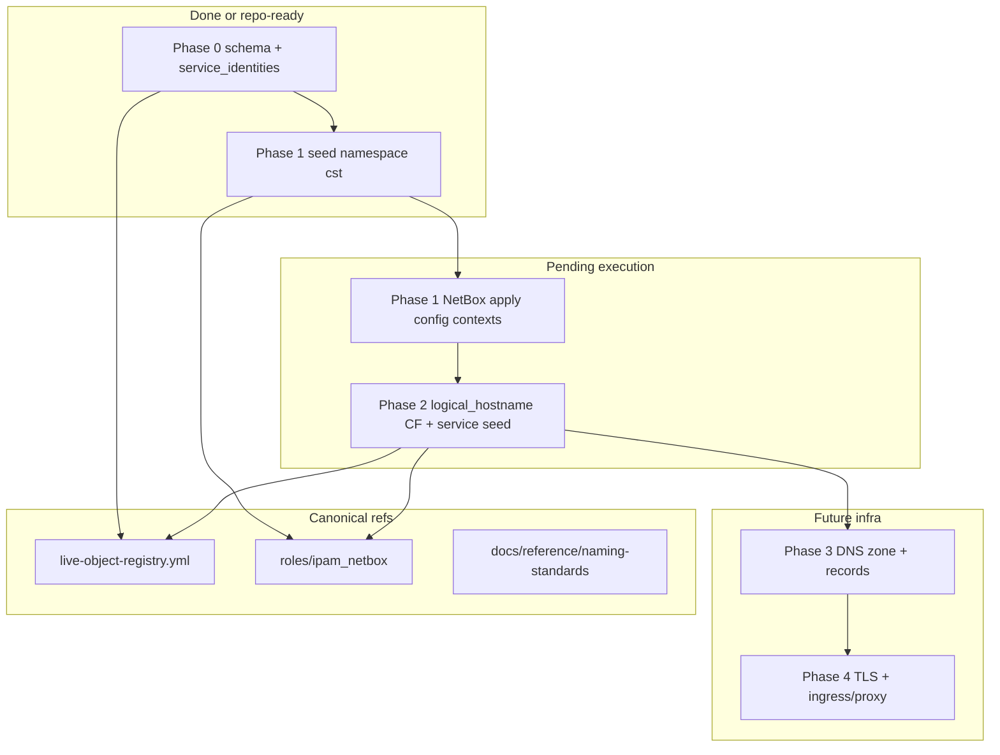

# Service identity — Phases 2–4 (incomplete)

**Lifecycle:** incomplete — pickup after Phase 1 NetBox apply is verified

**Prerequisites (completed or in progress):**

| Item | Status | Reference |
|------|--------|-----------|
| Phase 0 schema layers | Done | [`docs/reference/naming-standards/`](../../reference/naming-standards/), [`render-patterns.yml`](../../reference/naming-standards/render-patterns.yml) `service_identity_layers` |
| L1→L4 registry | Done (docs only) | [`live-object-registry.yml`](../../reference/naming-standards/live-object-registry.yml) → `service_identities` |
| Phase 1 repo (`namespace: cst`) | Done | [`roles/ipam_netbox/defaults/main.yml`](../../../roles/ipam_netbox/defaults/main.yml) |
| Phase 1 NetBox apply | **Pending** | Tunnel/API must be up — see [Phase 1 apply](#phase-1-apply-blocked) below |
| Background plan | Done | [`2026-05-27--service-identity-dns-future-state`](../2026-05-27--service-identity-dns-future-state/README.md) |

---

## Phase 1 apply (blocked)

**Repo change landed:** `homelab-naming-context.data.namespace` is `cst` (was `castle`). Preview tag succeeded with tunnel URL.

**Apply failed** (2026-05-27): `Failed to establish connection to NetBox API` — `http://127.0.0.1:18000` connection refused (SSH tunnel not active).

**When tunnel is up, run:**

```bash
bin/codex-env ansible-playbook playbooks/deploy_ipam_netbox.yaml \
  --tags ipam_netbox_seed_config_contexts \
  -e ipam_netbox_api_url=http://127.0.0.1:18000 \
  --skip-tags ipam_netbox_repo_consistency
```

**Verify:**

- NetBox UI → Config Contexts → `homelab-naming-context` → JSON `namespace` is `cst`
- Or: `bin/codex-env ansible-inventory -i inventory/netbox.yml --host hom-lab-ctl-dkr-02` shows merged context with `namespace: cst` (requires `NETBOX_TOKEN` and working API)

**Undo:** Revert seed to `castle` and re-apply config context tag.

**Note:** Backup paths remain `castle/home/lab/...` per [`netbox.yml`](../../reference/naming-standards/netbox.yml) `value_by_surface` — intentional.

---

## Naming layers (carry into all phases)

| Layer | Field | Example | Phase |
|-------|--------|---------|-------|
| L1 | NetBox `service.name` | `netbox-web` | Live |
| L2 | Parent VM | `hom-lab-ctl-dkr-02` | Live |
| L3 | `primary_access_point` | `http://192.168.50.158:8000/` | Live |
| L4 | `logical_service_hostname` | `hom-lab-ctl-nbx-01` | **Phase 2** |
| L5 | `fqdn` | `nbx.<zone>` TBD | **Phase 3** |
| L6 | `canonical_id` | `cst-hom-lab-ctl-service-netbox-01` | Docs only |

**Rule:** Do not rename L1 to L4. Assign L4 alongside L1.

Full L1→L4 table: [`live-object-registry.yml`](../../reference/naming-standards/live-object-registry.yml) → `service_identities.entries` (16 rows).

---

## Phase 2 — Logical hostname in NetBox metadata

### Goal

Expose L4 names in NetBox (and seeds) so DNS/certs/ingress can target stable identities without renaming `netbox-web`.

### Recommended approach: Service custom field

Repo already seeds Service custom fields: `compose_project`, `deployed_by_role`, `stack_name` ([`seed_custom_fields.yml`](../../../roles/ipam_netbox/tasks/seed_custom_fields.yml)).

**Add:**

1. Custom field `logical_hostname` (type text, object `ipam.service`) in `seed_custom_fields.yml`
2. Per-service `logical_hostname: hom-lab-ctl-...` in `ipam_netbox_hom_lab_ctl_hvh_02_model.services` and `ipam_netbox_hom_lab_ctl_hvh_01_vm_model.services` in [`defaults/main.yml`](../../../roles/ipam_netbox/defaults/main.yml)
3. Pass through existing service seed loops (`custom_fields` merge already wired in `seed_hom_lab_ctl_hvh_02_model.yml` / `seed_hom_lab_ctl_hvh_01_vm_model.yml`)
4. Set `live-object-registry.yml` → `service_identities.not_applied_to_netbox_seeds: false` after apply
5. Promote candidate service codes `sem`, `log`, `grf`, `red` to `integrated` in `resource-roles.yml` when approved

### Alternative (faster, weaker)

Append L4 to `comments` or a single config-context service map — no custom field, harder to query in NetBox API.

### Playbook / tags

```bash
# After custom field defined
bin/codex-env ansible-playbook playbooks/deploy_ipam_netbox.yaml \
  --tags ipam_netbox_seed_custom_fields \
  -e ipam_netbox_api_url=http://127.0.0.1:18000

bin/codex-env ansible-playbook playbooks/deploy_ipam_netbox.yaml \
  --tags ipam_netbox_seed_hom_lab_ctl_hvh_02_model \
  -e ipam_netbox_api_url=http://127.0.0.1:18000

bin/codex-env ansible-playbook playbooks/deploy_ipam_netbox.yaml \
  --tags ipam_netbox_seed_hom_lab_ctl_hvh_01_vm_model \
  -e ipam_netbox_api_url=http://127.0.0.1:18000
```

Storage-lane services are modeled in defaults but confirm live NetBox objects before assuming all 7 storage services exist.

### Apply / Verify / Undo

| | |
|--|--|
| **Apply** | Custom field seed + service re-seed with `logical_hostname` |
| **Verify** | NetBox API/UI: service `netbox-web` on `hom-lab-ctl-dkr-02` has `logical_hostname` = `hom-lab-ctl-nbx-01` |
| **Undo** | Remove custom field values or field definition; registry flag back to docs-only |
| **Class** | Idempotent metadata |

### Blockers

- NetBox API reachable (tunnel or LAN portproxy fixed)
- Vault token / `NETBOX_TOKEN`
- Decision: custom field vs comments-only

### Does not require

DNS, TLS, or compose URL changes.

---

## Phase 3 — Internal DNS

### Goal

Resolve L4 (or L5) hostnames to the same targets as today's L3 `primary_access_point` paths.

### Prerequisites (decisions — record in this plan when chosen)

| Decision | Options | Chosen |
|----------|---------|--------|
| Zone | `homelab.local`, split-horizon public domain, router-only static | _TBD_ |
| DNS authority | Router, Windows DNS on hvh-01, AdGuard/Pi-hole, `/etc/hosts` on mac-dev only | _TBD_ |
| Client view | LAN `192.168.50.x` via portproxy vs direct guest `137.x`/`138.x` | _TBD_ |

### Repo gap

**No** homelab DNS automation role exists today. Phase 3 is either:

- **Manual first** — static records on router/DNS (document in `live-object-registry.yml` under `dns_records`), or
- **New capability** — narrow role/playbook (e.g. `homelab_dns` or extend `hyperv_networking`) once authority is chosen

### Suggested record shape (example, zone `homelab.local`)

| Name | Type | Target | Serves |
|------|------|--------|--------|
| `hom-lab-ctl-nbx-01.homelab.local` | A or CNAME | `192.168.50.158` + port 8000 path | NetBox via portproxy |
| `hom-lab-ctl-lfs-01.homelab.local` | A/CNAME | `192.168.50.158:30000` or guest IP | Langfuse NodePort |

Port in DNS is **not** standard — use SNI/reverse proxy (Phase 4) or document `:port` in operator runbook until proxy exists.

### Wiring after zone exists

1. Set `fqdn` in `live-object-registry.yml` per `service_identities` entry
2. Optionally add NetBox IPAM DNS records (if using NetBox DNS features)
3. Update `primary_access_point` in seeds to prefer `https://<fqdn>/` when Phase 4 TLS is live; keep IP in `comments` as fallback

### Apply / Verify / Undo

| | |
|--|--|
| **Apply** | DNS records at chosen authority + registry `fqdn` fields |
| **Verify** | `dig` / `nslookup` from `mac-dev` resolves L4/L5 to expected IP |
| **Undo** | Remove DNS records |
| **Class** | Infra config |

### Depends on

Phase 2 helpful (stable names); Phase 1 config context not required for DNS itself.

### Related docs

- [`docs/diagnostics/hyperv-router-static-route-guide.md`](../../diagnostics/hyperv-router-static-route-guide.md)
- [`docs/lessons-learned/networking/hyper-v-routed-subnet-needs-router-route-or-host-nat.md`](../../lessons-learned/networking/hyper-v-routed-subnet-needs-router-route-or-host-nat.md)
- [`docs/one_off_tasks/investigate_networking_issue.md`](../../one_off_tasks/investigate_networking_issue.md) — tunnel vs LAN portproxy

---

## Phase 4 — TLS and load balancing

### Goal

HTTPS and optional single-hostname front doors using L4/L5 SANs, not raw IPs.

### Current exposure (no new names required to document)

| Service | L3 today | Publishing path |
|---------|----------|-----------------|
| NetBox | `http://192.168.50.158:8000/` | hvh-02 portproxy → dkr-02:8000 |
| Semaphore | `:3001` | portproxy |
| Loki | `:3100` | portproxy |
| Grafana | `http://192.168.137.10:3000/` | guest only (no LAN portproxy) |
| Langfuse K3s | `:30000` | portproxy |
| LiteLLM | `:30400` | portproxy |

K3s: Traefik in `kube-system` (see [`docs/diagrams/cst-hom-lab-ctl-dia-svcinv-drift-01.md`](../../diagrams/cst-hom-lab-ctl-dia-svcinv-drift-01.md)). Ingress/TLS for Langfuse not finished — [`docs/plans/2026-05-19--langfuse-platform-on-k3s/`](../2026-05-19--langfuse-platform-on-k3s/README.md).

### Termination options (pick one primary per traffic class)

| Class | Option | Repo touchpoints |
|-------|--------|------------------|
| Docker on dkr-02 | Caddy/Traefik container in compose | `stacks_fuzlang_net`, `logging_loki`, `ipam_netbox` |
| K3s services | Ingress + cert-manager + Traefik | K3s roles, Langfuse plan |
| LAN-published via hvh-02 | IIS/HTTP.SYS reverse proxy + TLS, or nginx on Windows | `hyperv_networking`, new Windows proxy role |
| Homelab-wide | External reverse proxy VM | New role — highest cost |

### Suggested order

1. Phase 3 internal DNS for L4 names
2. TLS at the **same layer you terminate HTTP today** (portproxy host or K3s ingress)
3. Do not cert IPs — SAN = L4 or L5 only

### Apply / Verify / Undo

| | |
|--|--|
| **Apply** | Cert issuance + proxy/ingress rules |
| **Verify** | `curl -v https://<fqdn>` valid chain; backend health |
| **Undo** | Disable vhost/listener; revert to L3 IP URLs |
| **Class** | Infra config |

### Blockers

- Phase 3 or explicit SAN decision
- Termination point choice
- Firewall/SNI/portproxy interaction (see Loki/Grafana lessons in NetBox README)

---

## Cross-cutting: NetBox API access

Phases 1–2 need API; 3–4 may not.

| Path | When to use |
|------|-------------|
| `http://127.0.0.1:18000` | SSH tunnel to NetBox (Mac controller) — proven in docs |
| `http://192.168.50.158:8000` | LAN portproxy — when fixed from mac-dev |
| `inventory/netbox.yml` | `NETBOX_TOKEN` in environment; `config_context: true` |

See [`docs/brainstorming_designs/netbox_wip_capabiilty_usage_planning.md`](../../brainstorming_designs/netbox_wip_capabiilty_usage_planning.md) for LAN portproxy and H5 overlay follow-ups.

---

## Architecture / structure diagram



---

## Recommended pickup order

1. **Finish Phase 1 apply** (tunnel up, config context tag)
2. **Phase 2** — custom field + seed all `service_identities` L4 values
3. **Decide Phase 3** zone and authority — document in this README `_TBD_` table
4. **Phase 3 manual DNS** for one service (e.g. NetBox) as pilot
5. **Phase 4 pilot** on that same hostname (HTTPS to NetBox)
6. Roll pattern to K3s ingress services

---

## Diagram inventory

### Diagrams included

- **Architecture/Structure Diagram**: Phase dependencies and repo vs infra work

### Additional diagrams available on request

- **Deployment Flow**: Per-phase playbook tags
- **Network Topology**: DNS + portproxy + guest subnet paths per service
- **State Transition**: L3 IP → L4 logical → L5 fqdn → HTTPS
