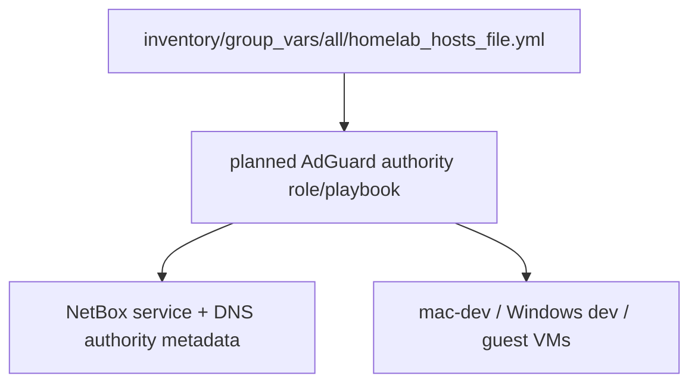
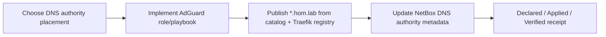

# Homelab DNS authority — AdGuard (future)

**Moved from:** K3s Hyper-V Traefik umbrella — **OP-1/OP-2 cancelled**; authoritative DNS was explicitly out of v1 scope.

**Intake:** [future-state-dns-authority-and-service-entry-architecture.md](../../intake/future-state-dns-authority-and-service-entry-architecture.md)

## Lesser solution in place (v1)

| Need | v1 workaround | Plan |
|------|---------------|------|
| mac operator browsers | `homelab_hosts_file_mac` + portproxy on hvh-02 | [implemented Traefik hosts-file](../2026-05-27--k3s-hyperv-traefik-homelab-hosts-file-implemented/README.md) |
| Guest VM SSH names | `homelab_router_gt6_mac_hosts_workaround` on mac only | [linux/windows incomplete](../2026-05-28--homelab-hosts-file-linux-windows-incomplete/README.md) |
| Guest service-to-service | IPs, K8s DNS, compose names — no hom.lab required | [lesser-solution doc](../../lessons-learned/networking/guest-vm-hom-lab-dns-lesser-solution.md) |

## Architecture/Structure Diagram

## Capability Routing Diagram

## Naming/Modeling Diagram

N/A — this packet consumes existing `hom.lab` and service-identity naming rather than creating a new naming model.

## Mandatory NetBox slice

### Objects affected

- DNS authority service object, operator hostname intent, catalog-backed hostname rows, Traefik-routed service metadata

### Declared / Applied / Verified

- **Declared:** the packet must align catalog-hostname publication, chosen DNS authority, and NetBox DNS authority metadata.
- **Applied:** pending; live DNS authority and the matching NetBox object/service update have not run yet.
- **Verified:** when executed, use `scripts/validate_netbox_repo_consistency.sh`, `artifacts/netbox-service-inventory/latest.json`, and `artifacts/netbox-reconciliation/latest.json`.

### Artifact references

- `artifacts/netbox-service-inventory/latest.json`
- `artifacts/netbox-reconciliation/latest.json`

## Checklist

- [ ] **DNS-A1** — Choose placement VM (utility guest on hvh-01 or hvh-02 LAN IP)
- [ ] **DNS-A2** — Ansible role/playbook for AdGuard Home `present`
- [ ] **DNS-A3** — Publish `*.hom.lab` from `homelab_hosts_file_web_catalog` + Traefik registry
- [ ] **DNS-A4** — Point LAN clients (mac-dev, Windows dev) at AdGuard; retire mac-only hosts rows when stable
- [ ] **DNS-A5** — NetBox document DNS authority object / service

## Plan verification receipt

**Slice:** AdGuard DNS authority  
**Verified at:** pending

| ID | Source | Obligation | In slice scope? | Status | Evidence |
|----|--------|------------|-----------------|--------|----------|
| O-01 | DNS-A1 | Placement VM chosen | yes | pending | pending |
| O-02 | DNS-A2 | Role/playbook implemented | yes | pending | pending |
| O-03 | DNS-A3 | Catalog publication path defined | yes | pending | pending |
| O-04 | DNS-A4 | LAN client cutover verified | yes | pending | pending |
| O-05 | DNS-A5 | NetBox DNS authority metadata updated | yes | pending | pending |

## Diagram gate receipt

- [x] Architecture/Structure: repo paths, external resources, data/control flow, naming scheme, variable SSOT sources, tag/playbook wiring
- [x] Capability Routing: included
- [x] Naming/Modeling: included as N/A with reason
- [x] Diagram Inventory lists every required section above, not only diagrams actually drawn

## Diagram inventory

- Architecture/Structure Diagram
- Capability Routing Diagram
- Naming/Modeling Diagram (N/A)
- Additional diagrams available: client cutover matrix, DNS authority failover flow
