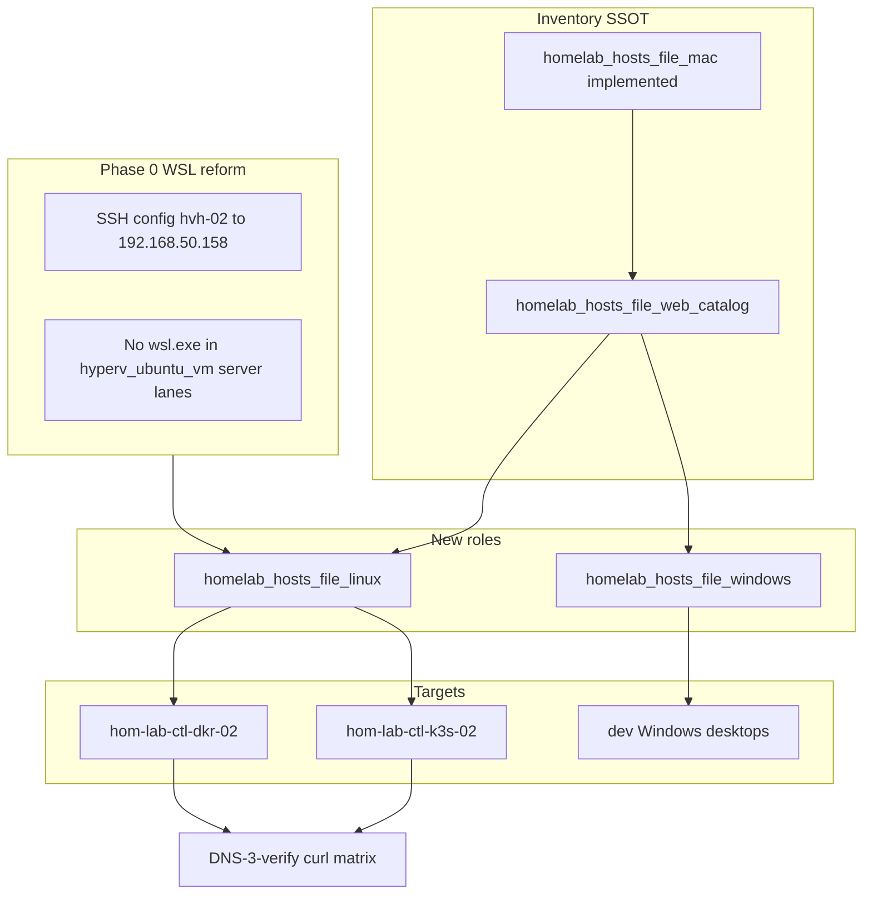

# Homelab hosts file — Linux and Windows (DNS-3 follow-on)

**Prerequisite plan:** [2026-05-28--wsl-scope-reform-incomplete](../2026-05-28--wsl-scope-reform-incomplete/README.md) — **must complete WSL-R0–R3 before DNS-3 apply.**

**Prior art:** [homelab hosts-file implemented (mac)](../2026-05-27--k3s-hyperv-traefik-homelab-hosts-file-implemented/README.md)

These are **Ansible capability roles** (like `homelab_hosts_file_mac`), not NetBox host roles.

| | |
|---|---|
| **Apply** | New roles + playbooks; SSH via OpenSSH on Windows / guest Linux — **not** `wsl.exe` |
| **Verify** | Per-host `getent` / `Resolve-DnsName` + catalog `curl` matrix |
| **Undo** | `homelab_hosts_file_*_enabled: false` |
| **Class** | Idempotent config |

---

## Phase 0 — WSL scope reform prerequisite (blocking)

**Policy:** This project must not use WSL as a server automation path. WSL is desktop-only (optional on one dev machine).

| ID | Requirement | Why it blocks DNS-3 |
|----|-------------|---------------------|
| **WSL-R0** | Guest access uses `ssh joshc@192.168.50.158` (hvh-02) or direct guest `.137.x` — not `wsl.exe` / `bash.exe` | Ansible cannot apply `/etc/hosts` on guests through WSL |
| **WSL-R1** | Fix controller `~/.ssh/config` `hom-lab-ctl-hvh-02` → `HostName 192.168.50.158` (not `DESKTOP-VLLM`) | ProxyJump to guests fails today |
| **WSL-R2** | `hyperv_ubuntu_vm` offline seed default `mount_provider: disabled` on server lanes (done in ansible reform) | Prevents hidden WSL on VM create |
| **WSL-R3** | WSL-centric docs archived; active framework cites OpenSSH path only | Agents must not reintroduce WSL plans |

**Evidence:** [ansible-wsl-reform-report.md](../../archive/wsl-deprecating/ansible-wsl-reform-report.md), [guest-vm-hom-lab-dns-lesser-solution.md](../../lessons-learned/networking/guest-vm-hom-lab-dns-lesser-solution.md)

---

## Phase 1 — Linux guests (`homelab_hosts_file_linux`)

**Targets:** `hom-lab-ctl-k3s-02`, `hom-lab-ctl-dkr-02` (`linux_vm_hosts`)

**Pattern:** Mirror [`roles/homelab_hosts_file_mac/`](../../../roles/homelab_hosts_file_mac/) — consume `homelab_hosts_file_web_catalog` with `linux_hosts_enabled` flag (add to catalog SSOT).

**Apply path:**

1. `roles/homelab_hosts_file_linux/` — defaults, `meta/argument_specs.yml`, tasks writing `/etc/hosts`
2. `playbooks/homelab_hosts_file_linux.yaml` — `--limit hom-lab-ctl-k3s-02,hom-lab-ctl-dkr-02`
3. Connection: inventory SSH to guest IP (`.137.10` / `.137.11`) or ProxyJump via hvh-02

**Verify:**

- `getent hosts langfuse.hom.lab` on each guest → `192.168.50.158` (LAN publish IP for operator URLs)
- `curl -sI` per catalog `verify_url` **from guest** (optional; confirms routing via portproxy)

---

## Phase 2 — Windows dev (`homelab_hosts_file_windows`)

**Targets:** `dev_workstation` / `dev_3090` when provisioned — **not** `hom-lab-ctl-hvh-*` servers.

**Pattern:** `ansible.windows.win_hosts` or idempotent `win_lineinfile` on `C:\Windows\System32\drivers\etc\hosts`

**Gate:** Only hosts with `node_purpose: interactive_desktop` (or explicit `homelab_hosts_file_windows_enabled: true`).

---

## Architecture/Structure diagram

---

## Checklist

- [ ] **WSL-R0–R3** — WSL scope reform gate (parent plan)
- [ ] **DNS-3-L** — Scaffold `homelab_hosts_file_linux` + playbook
- [ ] **DNS-3-W** — Scaffold `homelab_hosts_file_windows` + playbook
- [ ] **DNS-3-SSOT** — Add `linux_hosts_enabled` / `windows_hosts_enabled` to catalog rows
- [ ] **DNS-3-apply** — Apply on k3s-02, dkr-02 (and dev Windows when in scope)
- [ ] **DNS-3-verify** — Evidence per host in plan receipt

---

## Plan verification receipt

**Slice:** DNS-3 linux/windows  
**Verified at:** (pending)

| ID | Obligation | Status |
|----|------------|--------|
| O-01 | WSL-R0–R3 complete | pending |
| O-02 | linux role + apply k3s/dkr | pending |
| O-03 | windows role (desktop only) | pending |
| O-04 | catalog flags + verify matrix | pending |

---

## Diagram inventory

- Architecture/Structure (above)
- [cst-hom-lab-ctl-dia-homelab-hosts-file-01.md](../../diagrams/cst-hom-lab-ctl-dia-homelab-hosts-file-01.md)
