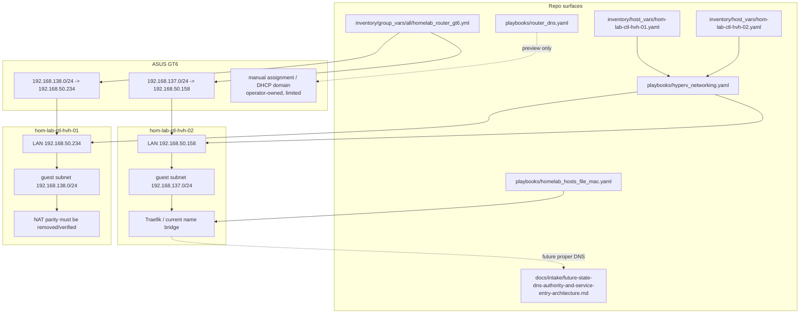
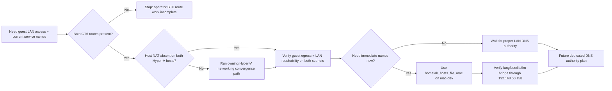
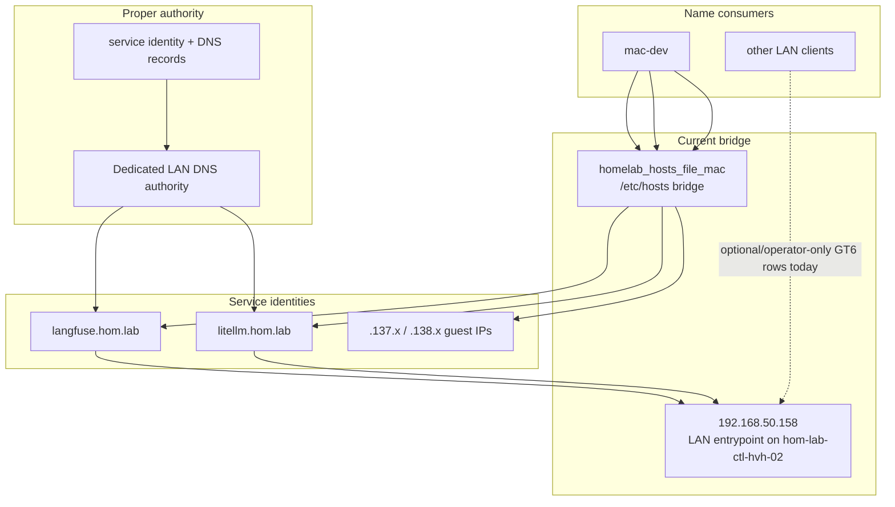

# Hyper-V routed-subnet convergence and Traefik name bridge

## Summary

The GT6 route layer is now operator-complete for both Hyper-V guest lanes:

- `192.168.137.0/24 -> 192.168.50.158`
- `192.168.138.0/24 -> 192.168.50.234`

That removes router-route parity as the main blocker. The immediate repo-owned
work is now:

1. keep both lanes on the same routed private subnet design
2. remove or confirm the absence of host NAT on both Hyper-V hosts
3. verify guest egress and LAN reachability on both subnets
4. preserve the current Traefik hostname bridge without treating GT6 manual DNS
   rows as the long-term architecture

## Current state

### Route layer

| Lane | Hyper-V host | Host LAN IP | Guest subnet | GT6 route state |
|---|---|---|---|---|
| GPU | `hom-lab-ctl-hvh-02` | `192.168.50.158` | `192.168.137.0/24` | operator-applied |
| Storage | `hom-lab-ctl-hvh-01` | `192.168.50.234` | `192.168.138.0/24` | operator-applied |

### Host convergence truth

| Host | Desired model | Repo host var today | Meaning |
|---|---|---|---|
| `hom-lab-ctl-hvh-02` | `guest_network_mode: routed_private_subnet`, `guest_outbound_nat_enabled: false` | `false` | reference lane already aligned |
| `hom-lab-ctl-hvh-01` | `guest_network_mode: routed_private_subnet`, `guest_outbound_nat_enabled: false` | `true` | convergence lane still needs validation and likely removal of NAT |

### Naming bridge truth

| Concern | Current practical path | Not the long-term answer |
|---|---|---|
| `mac-dev` resolves guest VMs | `playbooks/homelab_hosts_file_mac.yaml` | GT6 cannot hold `.137.x` or `.138.x` guest rows |
| `langfuse.hom.lab` / `litellm.hom.lab` | current bridge through `192.168.50.158` on `hom-lab-ctl-hvh-02` | GT6 placeholder-MAC service rows are optional/operator-only, not completion blockers |
| Proper LAN DNS | future dedicated authority | do not overload GT6 DHCP/manual assignment as the final DNS model |

## Apply / Verify / Undo / Change class

| | |
|---|---|
| **Apply** | Update SSOT/docs for both GT6 routes; use `playbooks/hyperv_networking.yaml` to converge `hom-lab-ctl-hvh-01` onto routed private subnet without NAT; keep temporary hostname bridge via `playbooks/homelab_hosts_file_mac.yaml` |
| **Verify** | Confirm both GT6 routes are documented, verify `HyperVGuestNat` absent on both hosts, verify active guests on `192.168.137.0/24` and `192.168.138.0/24` have outbound LAN/internet and are reachable from LAN by IP, verify current Traefik hostname bridge still works |
| **Undo** | Remove GT6 static routes manually if rollback is required; restore host NAT through the owning Hyper-V networking automation if routed-no-NAT convergence fails; remove temporary hosts-file entries by disabling `homelab_hosts_file_mac` |
| **Change class** | mixed: docs/SSOT updates plus idempotent infrastructure convergence |

## Checklist

### Router + SSOT

- [x] **R-1** — Record both GT6 static routes as operator-applied in repo SSOT
- [x] **R-2** — Update current-state/intake docs so route parity is no longer described as future work
- [x] **R-3** — Keep router service-name rows (`langfuse`, `litellm`) explicitly optional, not plan blockers

### Host-side convergence

- [ ] **H-1** — Read-only verify current NAT state on `hom-lab-ctl-hvh-02`
- [ ] **H-2** — Read-only verify current NAT state on `hom-lab-ctl-hvh-01`
- [ ] **H-3** — If NAT is still present on `hom-lab-ctl-hvh-01`, remove it through the owning Hyper-V networking path
- [ ] **H-4** — Align repo host vars so both Hyper-V hosts declare `guest_outbound_nat_enabled: false`
- [ ] **H-5** — Update docs that still treat mixed NAT/routed posture as acceptable current design

### Routed-subnet verification

- [ ] **V-1** — Verify `192.168.137.10` guest egress and LAN reachability
- [ ] **V-2** — Verify `192.168.137.11` guest egress and LAN reachability
- [ ] **V-3** — Verify `192.168.138.10` guest egress and LAN reachability
- [ ] **V-4** — Verify any active `192.168.138.x` guest needed by current services behaves symmetrically

### Name bridge

- [ ] **N-1** — Keep `mac-dev` temporary name bridge accurate via `homelab_hosts_file_mac`
- [ ] **N-2** — Verify the current Traefik-facing names still front through `192.168.50.158`
- [ ] **N-3** — Leave proper LAN DNS ownership to the future-state intake and do not expand GT6 workaround rows beyond what the router cleanly supports

## Acceptance criteria

- Both GT6 routes are present in repo SSOT and current-state docs as
  operator-complete
- Both Hyper-V hosts use routed private subnets with `guest_outbound_nat_enabled: false`
- Active guests on both guest subnets have outbound LAN/internet access
- LAN clients can reach active guests on both guest subnets by IP
- The current Traefik name bridge still works after host convergence
- The plan does not rely on GT6 placeholder-MAC alias rows to claim completion

## Execution notes

### Existing repo entrypoints

| Surface | Role in this plan |
|---|---|
| [playbooks/hyperv_networking.yaml](../../../playbooks/hyperv_networking.yaml) | host-side routed-subnet convergence |
| [playbooks/homelab_hosts_file_mac.yaml](../../../playbooks/homelab_hosts_file_mac.yaml) | temporary name bridge on `mac-dev` |
| [playbooks/router_dns.yaml](../../../playbooks/router_dns.yaml) | preview-only GT6 local-DNS/operator contract |
| [inventory/group_vars/all/homelab_router_gt6.yml](../../../inventory/group_vars/all/homelab_router_gt6.yml) | router SSOT for static routes and manual rows |
| [inventory/host_vars/hom-lab-ctl-hvh-01.yaml](../../../inventory/host_vars/hom-lab-ctl-hvh-01.yaml) | convergence lane host truth |
| [inventory/host_vars/hom-lab-ctl-hvh-02.yaml](../../../inventory/host_vars/hom-lab-ctl-hvh-02.yaml) | reference lane host truth |

### Scope boundary

This plan owns the immediate network convergence and temporary hostname bridge.
It does not choose the final LAN DNS authority. That decision and its better
implementation paths live in the companion intake:

- [future-state-dns-authority-and-service-entry-architecture.md](../../intake/future-state-dns-authority-and-service-entry-architecture.md)

## Architecture/Structure Diagram

## Capability Routing Diagram

## Naming/Modeling Diagram

## Diagram gate receipt

- [x] Architecture/Structure: repo paths, external resources, data/control flow, naming scheme, variable SSOT sources, tag/playbook wiring
- [x] Capability Routing: included
- [x] Naming/Modeling: included
- [x] Diagram Inventory lists every required section above, not only diagrams actually drawn

## Diagram Inventory

Included:
- Architecture/Structure Diagram
- Capability Routing Diagram
- Naming/Modeling Diagram

Other available diagram types:
- Verification sequence for `hom-lab-ctl-hvh-01` NAT removal and guest reachability
- Traffic-flow comparison for temporary hosts-file bridge vs dedicated DNS authority
- Execution ownership map for router operator steps vs repo-owned Hyper-V convergence
