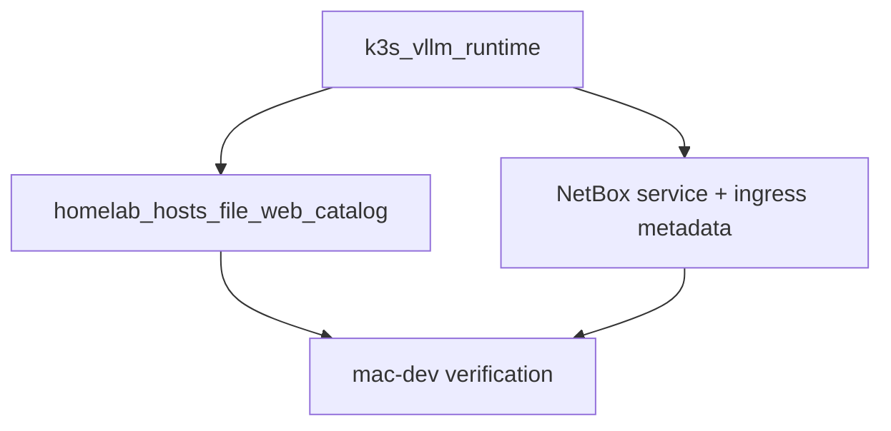
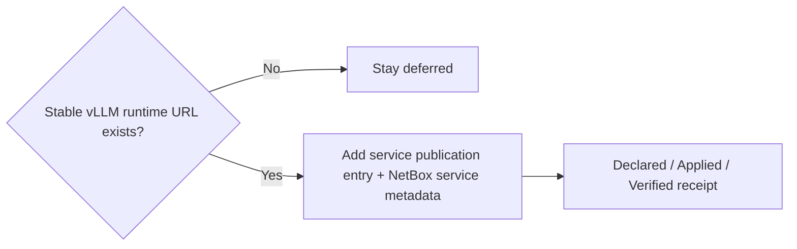

# K3s vLLM — service publication + NetBox (DNS-3e follow-on)

**Moved from:** homelab hosts-file plan — **DNS-3e** (no service publication entry until runtime exists).

## Scope note

- This packet is about publishing one stable vLLM operator endpoint into the hosts-file publication surface and NetBox.
- It is not the long-term multi-model inventory/catalog packet for the lab.
- Reserve `catalog` for the future concept that tracks chosen/downloaded models, roles, and agent-facing model lanes.

## Architecture/Structure Diagram

## Capability Routing Diagram

## Naming/Modeling Diagram

N/A — this packet reuses the existing service-identity and operator-hostname patterns.

## Mandatory NetBox slice

### Objects affected

- vLLM service metadata, ingress metadata, operator hostname publication entry

### Declared / Applied / Verified

- **Declared:** the vLLM publication entry and NetBox service metadata must point at one stable operator URL.
- **Applied:** pending until runtime exists.
- **Verified:** when executed, use `artifacts/netbox-service-inventory/latest.json`, `artifacts/netbox-reconciliation/latest.json`, and the curl evidence for the live endpoint.

### Artifact references

- `artifacts/netbox-service-inventory/latest.json`
- `artifacts/netbox-reconciliation/latest.json`

## Checklist

- [ ] **VLLM-1** — Deploy `k3s_vllm_runtime` and confirm NodePort or Traefik hostname
- [ ] **VLLM-2** — Add endpoint entry to `homelab_hosts_file_web_catalog`
- [ ] **VLLM-3** — NetBox Service + ingress metadata when endpoint is stable
- [ ] **VLLM-4** — mac-dev curl verify

## Plan verification receipt

**Slice:** vLLM service publication + NetBox follow-on  
**Verified at:** pending

| ID | Source | Obligation | In slice scope? | Status | Evidence |
|----|--------|------------|-----------------|--------|----------|
| O-01 | VLLM-1 | Stable runtime URL exists | yes | pending | pending |
| O-02 | VLLM-2 | Publication entry added | yes | pending | pending |
| O-03 | VLLM-3 | NetBox service metadata updated | yes | pending | pending |
| O-04 | VLLM-4 | mac-dev verify succeeds | yes | pending | pending |

## Diagram gate receipt

- [x] Architecture/Structure: repo paths, external resources, data/control flow, naming scheme, variable SSOT sources, tag/playbook wiring
- [x] Capability Routing: included
- [x] Naming/Modeling: included as N/A with reason
- [x] Diagram Inventory lists every required section above, not only diagrams actually drawn

## Diagram inventory

- Architecture/Structure Diagram
- Capability Routing Diagram
- Naming/Modeling Diagram (N/A)
- Additional diagrams available: vLLM route publication flow, operator verification matrix
