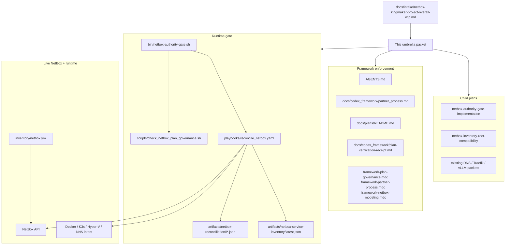
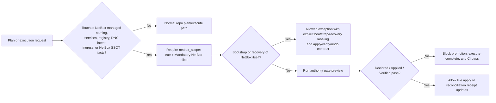
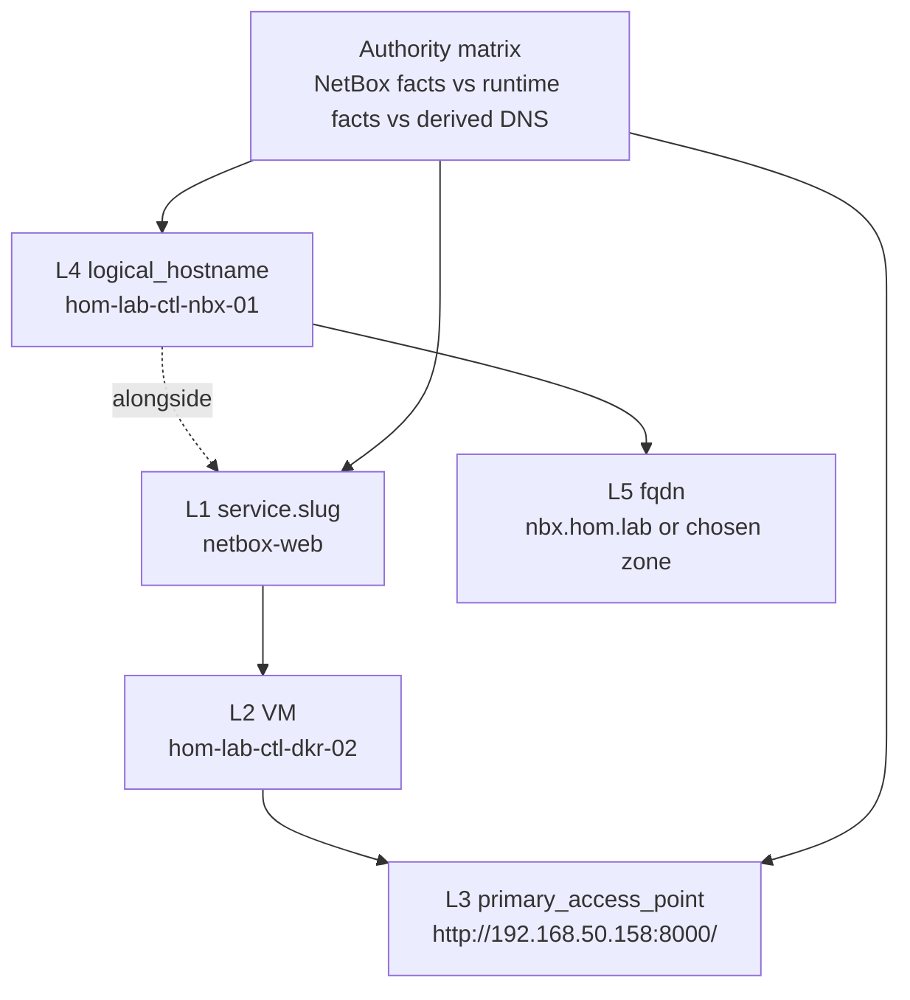

# NetBox authority enforcement and framework extension

**Promoted from:** [netbox-kingmaker-project-overall-wip.md](../../intake/netbox-kingmaker-project-overall-wip.md)

**Design intent:** NetBox becomes blocking for NetBox-scoped work in this repo, but not a universal prerequisite for bootstrap, recovery, or unrelated capabilities.

## Summary

- Keep the current conditional model: NetBox is blocking for `netbox_scope: true` work and for plans that touch naming, services, registry, DNS intent, or ingress metadata.
- Add one repo-local authority gate and one read-only reconciliation playbook so the repo has a concrete execution graph, not narrative-only guidance.
- Stage NetBox-as-inventory-root behind a compatibility child plan; do not break `site.yaml` or current static group routing.
- Preserve the layered service-identity model: L1 NetBox service slug remains distinct from L4 logical hostname.

## Architecture/Structure Diagram

## Capability Routing Diagram

## Naming/Modeling Diagram

## Mandatory NetBox slice

### Objects affected

- Devices, VMs, interfaces, IP addresses, prefixes, config contexts, services, ingress metadata, DNS intent rows, tags, clusters

### Declared / Applied / Verified

- **Declared:** plan packets, framework rules, naming schema, playbooks, and gate scripts align on NetBox-scoped blocking behavior.
- **Applied:** live NetBox apply remains on the existing `ipam_netbox_seed_*` surfaces; this umbrella adds read-only reconciliation and packet enforcement, not a new mutation path.
- **Verified:** `scripts/validate_netbox_repo_consistency.sh`, `artifacts/netbox-service-inventory/latest.json`, `artifacts/netbox-reconciliation/latest.json`, and `artifacts/netbox-reconciliation/latest.inventory-compatibility.json` are the standard receipt surfaces.

### Apply method

- Reuse `netbox.netbox` collection and current `ipam_netbox` seed tasks for live mutation.
- Reuse `pynetbox` controller dependency through existing repo runtime for read-only API checks.
- Use `playbooks/reconcile_netbox.yaml` and `bin/netbox-authority-gate.sh` as the shared enforcement path.

### Promotion gate

- NetBox-scoped plans are not complete until receipt evidence covers Declared, Applied, and Verified surfaces.
- Bootstrap and recovery exceptions are allowed only when explicitly labeled as bootstrap/recovery work and kept out of steady-state completion claims.

## Checklist

- [x] **NF-1** — Promote intake to umbrella packet and add child packets
- [x] **NF-2** — Framework docs and rules aligned on NetBox-scoped blocking behavior plus bootstrap/recovery exception
- [x] **NF-3** — Runtime authority gate and reconciliation playbook added
- [x] **NF-4** — Existing NetBox-scoped plans updated to the new Mandatory NetBox slice shape
- [x] **NF-5** — CI/static enforcement scaffolded for the new packet format

## Child plans

- [netbox-authority-gate-implementation](../2026-05-28--netbox-authority-gate-implementation-incomplete/README.md)
- [netbox-inventory-root-compatibility](../2026-05-28--netbox-inventory-root-compatibility-incomplete/README.md)

## Apply / Verify / Undo / Change class

| | |
|--|--|
| **Apply** | Update framework/docs/plan packets; add `playbooks/reconcile_netbox.yaml`, `bin/netbox-authority-gate.sh`, and static plan governance checks |
| **Verify** | Static packet gate, Ansible syntax/lint, read-only `bin/netbox-authority-gate.sh`, reconciliation artifacts |
| **Undo** | Revert the packet/rule/runtime additions; remove new gate/playbook surfaces |
| **Class** | Idempotent governance + read-only runtime verification |

## Plan verification receipt

**Slice:** umbrella introduction  
**Verified at:** 2026-05-28T17:00:26Z

| ID | Source | Obligation | In slice scope? | Status | Evidence |
|----|--------|------------|-----------------|--------|----------|
| O-01 | NF-1 | Umbrella + child packets exist | yes | complete | This packet plus `docs/plans/2026-05-28--netbox-authority-gate-implementation-incomplete/README.md` and `docs/plans/2026-05-28--netbox-inventory-root-compatibility-incomplete/README.md` |
| O-02 | NF-2 | Framework/rules use one NetBox-scoped blocking rule | yes | complete | `AGENTS.md`, `docs/plans/README.md`, `docs/codex_framework/partner_process.md`, `docs/codex_framework/plan-verification-receipt.md`, `.cursor/rules/framework-plan-governance.mdc`, `.cursor/rules/framework-partner-process.mdc` |
| O-03 | NF-3 | Authority gate and reconciliation playbook exist | yes | complete | `bin/netbox-authority-gate.sh`, `playbooks/reconcile_netbox.yaml`, `artifacts/netbox-reconciliation/latest.json` pass at `2026-05-28T16:59:22Z` |
| O-04 | NF-4 | Existing NetBox-scoped packets updated | yes | complete | Existing NetBox-scoped packets now carry Mandatory NetBox slice + Plan verification receipt sections, including `docs/plans/2026-05-28--homelab-dns-adguard-authority-incomplete/README.md` and `docs/plans/2026-05-28--k3s-vllm-service-publication-incomplete/README.md` |
| O-05 | NF-5 | Static CI/local enforcement exists | yes | complete | `scripts/check_netbox_plan_governance.sh`, `.github/workflows/netbox-authority-gate.yml`, `artifacts/netbox-reconciliation/latest.inventory-compatibility.json` |

## Diagram gate receipt

- [x] Architecture/Structure: repo paths, external resources, data/control flow, naming scheme, variable SSOT sources, tag/playbook wiring
- [x] Capability Routing: included
- [x] Naming/Modeling: included
- [x] Diagram Inventory lists every required section above, not only diagrams actually drawn

## Diagram Inventory

### Diagrams Included

- Architecture/Structure Diagram
- Capability Routing Diagram
- Naming/Modeling Diagram

### Additional Diagrams Available On Request

- Coverage metric flow for Declared / Applied / Verified receipts
- Inventory compatibility map from static groups to NetBox-derived groups
- CI lane split between static packet checks and live secret-backed reconciliation
