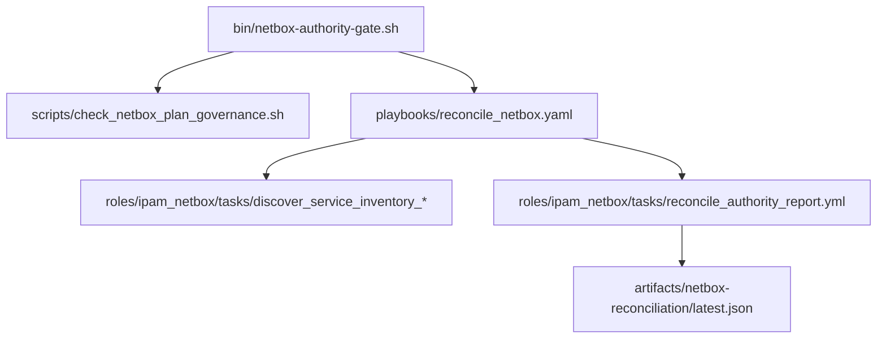
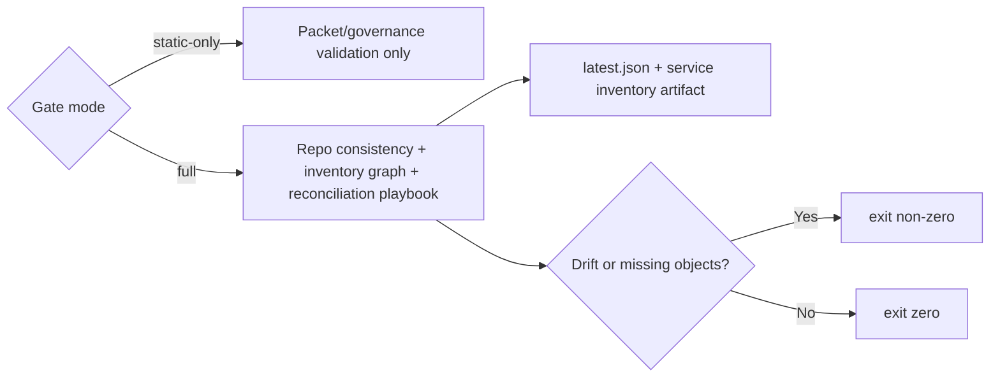

# NetBox authority gate implementation

## Architecture/Structure Diagram

## Capability Routing Diagram

## Naming/Modeling Diagram

N/A — this child plan implements enforcement surfaces, not a new naming model. It consumes the existing L1/L4 split and NetBox schema already documented elsewhere.

## Mandatory NetBox slice

### Objects affected

- Services, ingress metadata, devices, VMs, prefixes, config contexts, NetBox-scoped plan packets

### Declared / Applied / Verified

- **Declared:** `bin/netbox-authority-gate.sh`, `scripts/check_netbox_plan_governance.sh`, and `playbooks/reconcile_netbox.yaml` are the single enforcement path.
- **Applied:** no live NetBox mutation in this child plan; authority checks are read-only and defer mutation to existing `ipam_netbox_seed_*` playbook tags.
- **Verified:** gate output plus `artifacts/netbox-reconciliation/latest.json`, `artifacts/netbox-reconciliation/latest.inventory-compatibility.json`, and `artifacts/netbox-service-inventory/latest.json`.

## Checklist

- [x] **AG-1** — Static plan-governance checker added for `netbox_scope: true` packets
- [x] **AG-2** — Read-only reconciliation playbook added
- [x] **AG-3** — Shared wrapper added and documented
- [x] **AG-4** — Artifact emission and failure conditions wired

## Apply / Verify / Undo / Change class

| | |
|--|--|
| **Apply** | Add wrapper, static checker, reconciliation playbook, role task/template, artifact path |
| **Verify** | `bin/netbox-authority-gate.sh --static-only`; full read-only gate; syntax/lint on touched playbook/role/task files |
| **Undo** | Remove the gate surfaces and revert packet/rule references |
| **Class** | Idempotent local governance + read-only runtime verification |

## Plan verification receipt

**Slice:** authority gate implementation  
**Verified at:** 2026-05-28T17:00:26Z

| ID | Source | Obligation | In slice scope? | Status | Evidence |
|----|--------|------------|-----------------|--------|----------|
| O-01 | AG-1 | Static checker exists | yes | complete | `scripts/check_netbox_plan_governance.sh`; `./bin/netbox-authority-gate.sh --static-only` passed |
| O-02 | AG-2 | Reconciliation playbook exists | yes | complete | `playbooks/reconcile_netbox.yaml`; syntax check + `ansible-lint` passed; full gate passed at `2026-05-28T16:59:22Z` |
| O-03 | AG-3 | Shared wrapper exists | yes | complete | `bin/netbox-authority-gate.sh`, `.github/workflows/netbox-authority-gate.yml`, `roles/ipam_netbox/README.md` |
| O-04 | AG-4 | Artifacts + failure path wired | yes | complete | `artifacts/netbox-reconciliation/latest.json`, `artifacts/netbox-reconciliation/latest.inventory-compatibility.json`, `artifacts/netbox-service-inventory/latest.json` |

## Diagram gate receipt

- [x] Architecture/Structure: repo paths, external resources, data/control flow, naming scheme, variable SSOT sources, tag/playbook wiring
- [x] Capability Routing: included
- [x] Naming/Modeling: included as N/A with reason
- [x] Diagram Inventory lists every required section above, not only diagrams actually drawn

## Diagram Inventory

### Diagrams Included

- Architecture/Structure Diagram
- Capability Routing Diagram
- Naming/Modeling Diagram (N/A)

### Additional Diagrams Available On Request

- Shell-to-playbook execution flow
- Artifact content map for `latest.json`
