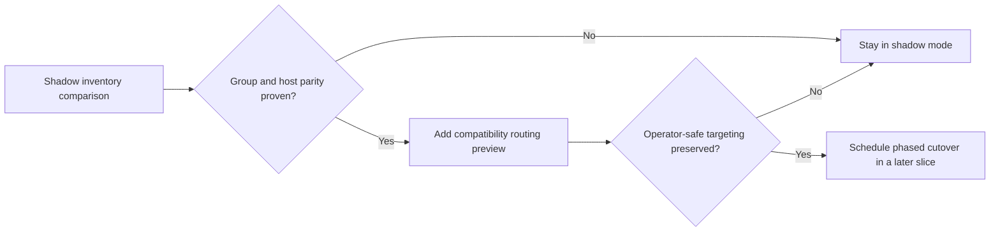
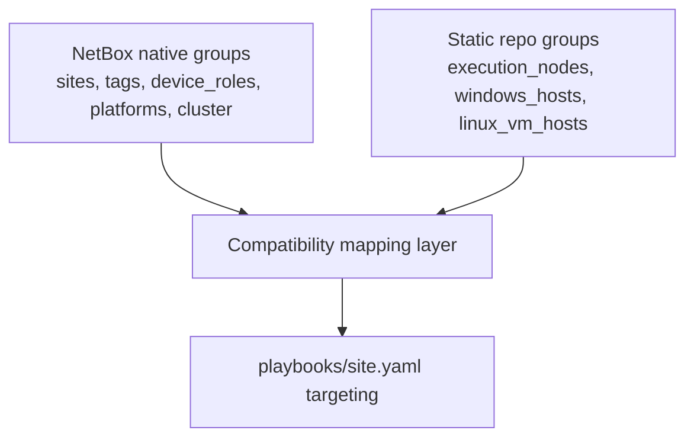

# NetBox inventory root compatibility

## Architecture/Structure Diagram

```mermaid
graph TB
  static["inventory/inventory.yaml<br/>current targeting groups"]
  dynamic["inventory/netbox.yml<br/>shadow inventory"]
  site["playbooks/site.yaml"]
  compat["compatibility mapping and proof receipts"]
  graph["artifacts/netbox-reconciliation/<date>/inventory.graph.txt"]

  dynamic --> graph
  static --> compat
  dynamic --> compat
  compat --> site
```

## Capability Routing Diagram



## Naming/Modeling Diagram



## Mandatory NetBox slice

### Objects affected

- NetBox inventory facts, host coverage, grouping behavior, service-host relationships needed by current targeting

### Declared / Applied / Verified

- **Declared:** `inventory/netbox.yml` stays in shadow/comparison mode until compatibility routing exists.
- **Applied:** no inventory-root cutover in this packet.
- **Verified:** `artifacts/netbox-reconciliation/<date>/inventory.graph.txt` plus `artifacts/netbox-reconciliation/latest.inventory-compatibility.json` and the group-parity receipts in this packet.

## Checklist

- [x] **INV-1** — Record current group dependencies from `playbooks/site.yaml`
- [x] **INV-2** — Capture shadow NetBox inventory graph as receipt artifact
- [x] **INV-3** — Define compatibility strategy for current targeting groups
- [x] **INV-4** — Keep cutover explicitly deferred until parity proof exists

## Compatibility findings

- `execution_nodes` does not exist in NetBox inventory and remains a required static companion overlay because `mac-dev` is not NetBox-managed.
- `windows_hosts` maps cleanly to `device_roles_hvh` in NetBox inventory.
- `linux_vm_hosts` maps cleanly to `is_virtual` in NetBox inventory.
- `docker_clients` needs a compatibility overlay: NetBox `device_roles_hvh` plus static `execution_nodes` membership for `mac-dev`.
- Inventory-root cutover remains intentionally deferred while `cutover_ready: false` in `artifacts/netbox-reconciliation/latest.inventory-compatibility.json`.

## Apply / Verify / Undo / Change class

| | |
|--|--|
| **Apply** | Update packet docs and compatibility requirements only; no inventory cutover |
| **Verify** | Inventory graph artifact from authority gate; task-list evidence from `playbooks/site.yaml` |
| **Undo** | Revert compatibility-plan packet updates |
| **Class** | Docs + read-only inventory analysis |

## Plan verification receipt

**Slice:** inventory-root compatibility  
**Verified at:** 2026-05-28T17:00:26Z

| ID | Source | Obligation | In slice scope? | Status | Evidence |
|----|--------|------------|-----------------|--------|----------|
| O-01 | INV-1 | Current targeting dependencies captured | yes | complete | `playbooks/site.yaml` active inventory surfaces: `execution_nodes`, `windows_hosts`, `linux_vm_hosts`, `docker_clients` |
| O-02 | INV-2 | Shadow inventory graph artifact exists | yes | complete | `artifacts/netbox-reconciliation/2026-05-28/inventory.graph.txt` |
| O-03 | INV-3 | Compatibility strategy documented | yes | complete | `artifacts/netbox-reconciliation/latest.inventory-compatibility.json` plus Compatibility findings in this packet |
| O-04 | INV-4 | Cutover explicitly deferred until parity proof | yes | complete | `artifacts/netbox-reconciliation/latest.inventory-compatibility.json` shows `cutover_ready: false` due to `execution_nodes` / `docker_clients` overlay requirement |

## Diagram gate receipt

- [x] Architecture/Structure: repo paths, external resources, data/control flow, naming scheme, variable SSOT sources, tag/playbook wiring
- [x] Capability Routing: included
- [x] Naming/Modeling: included
- [x] Diagram Inventory lists every required section above, not only diagrams actually drawn

## Diagram Inventory

### Diagrams Included

- Architecture/Structure Diagram
- Capability Routing Diagram
- Naming/Modeling Diagram

### Additional Diagrams Available On Request

- Static-to-NetBox group equivalence matrix
- Host coverage diff by role/platform/tag
