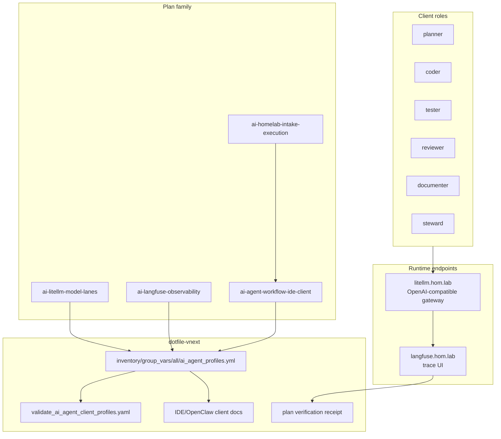
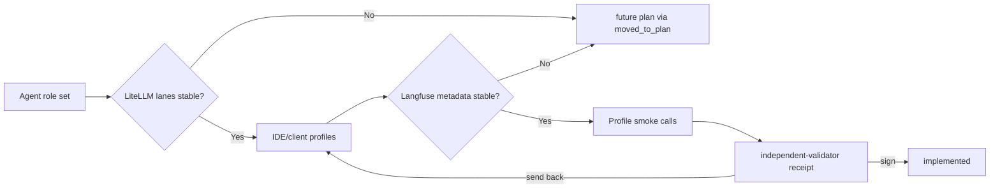
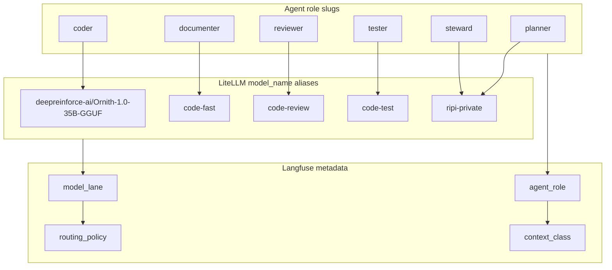

# AI agent workflow + IDE client profiles (WIP)

**Parent program:** [2026-05-29--ai-homelab-intake-execution-incomplete-wip](../2026-05-29--ai-homelab-intake-execution-incomplete-wip/README.md)

This packet turns the friendly agent-role ideas from intake into a concrete
client/runtime contract. It does not create separate agent servers by default.
The first implementation target is IDE/client profile configuration that calls
`litellm.hom.lab` using model-lane aliases and emits Langfuse metadata.
The repo-owned declaration now lives in
`inventory/group_vars/all/ai_agent_profiles.yml`, with read-only validation in
`playbooks/validate_ai_agent_client_profiles.yaml`.

The execution workflow roles from the parent plan are separate:
`coordinator`, `slice-worker`, and `independent-validator` govern plan delivery.
The product roles below are the local AI work roles the IDE/client can use.

---

## Apply / Verify / Undo / Change class

| | |
|---|---|
| **Apply** | Add repo-owned agent role defaults; map each role to a LiteLLM `model_name`; document IDE/OpenClaw client env/profile surfaces; add trace metadata defaults; link NetBox service metadata back to LiteLLM/Langfuse when stable |
| **Verify** | Client profile calls `litellm.hom.lab`; traces show `agent_role`, `model_lane`, `routing_policy`; independent validator confirms all role rows are either implemented or moved to a future plan |
| **Undo** | Revert profile defaults and docs; remove metadata references from NetBox/service docs; do not remove model runtimes |
| **Class** | Idempotent client/profile config; no destructive host actions |

**Doc research status:**

- Official Codex subagent / multi-agent workflow docs reviewed for parallel/specialist workflow guidance.
- LiteLLM and Langfuse docs reviewed through sibling plans for model alias and trace metadata behavior.
- Current IDE/OpenClaw configuration docs remain required before writing app-specific profile files beyond the repo-owned generic declaration.

---

## Architecture/Structure Diagram

---

## Capability Routing Diagram

---

## Naming/Modeling Diagram

---

## Agent Role Defaults

| Agent role | Default lane | Alternate lane | Boundary |
|------------|--------------|----------------|----------|
| `planner` | `ripi-private` | `code-fast` | read/reasoning; no repo write by default |
| `coder` | `deepreinforce-ai/Ornith-1.0-35B-GGUF` | `code-fast` | repo write through IDE/agent tool |
| `tester` | `code-test` | `code-fast` | tests, check commands, focused repair |
| `reviewer` | `code-review` | `ripi-private` | diff review and risk finding; no write by default |
| `documenter` | `code-fast` | `deepreinforce-ai/Ornith-1.0-35B-GGUF` | docs, receipts, implementation notes |
| `steward` | `ripi-private` | `code-review` | promotion, governance, final evidence summaries |

No role is complete unless its default lane exists in the LiteLLM plan as
enabled or formally candidate/blocked with evidence. Missing role work must not
remain as an open obligation in this packet; it must be moved to a named future
plan and linked in the receipt.

---

## Mandatory NetBox slice

### Objects affected

| Object | Current owner | This slice action |
|--------|---------------|-------------------|
| `litellm-k3s-gateway` | LiteLLM plan / `llm` service | Reference supported agent role metadata once aliases are stable |
| `langfuse-k3s-web` | Langfuse plan / `lfs` service | Reference trace metadata contract once smoke traces pass |
| `model_lanes` registry rows | LiteLLM/model catalog plans | Read-only dependency; do not duplicate row ownership here |

### Declared / Applied / Verified

- **Declared:** role defaults in this packet match LiteLLM alias slugs and Langfuse metadata keys.
- **Applied:** client/profile files and service metadata are updated only after dependent lanes are stable.
- **Verified:** smoke calls through `litellm.hom.lab`, trace lookup in `langfuse.hom.lab`, and independent-validator receipt.

### Artifact references

- `artifacts/netbox-service-inventory/latest.json`
- `artifacts/netbox-reconciliation/latest.json`
- `scripts/validate_netbox_repo_consistency.sh`

---

## Checklist

- [x] **A-01** — Official multi-agent/client docs reviewed and URLs recorded
- [x] **A-02** — Agent role defaults stored in a repo-owned profile/config surface, not only in prose
- [x] **A-03** — Each role maps to an existing LiteLLM lane or a candidate/blocked lane with evidence
- [x] **A-04** — IDE/OpenClaw client configuration uses `litellm.hom.lab` as the gateway, not direct per-runtime URLs
- [x] **A-05** — Langfuse metadata defaults include `agent_role`, `model_lane`, `routing_policy`, and `context_class`
- [ ] **A-06** — Smoke call for each implemented role produces a trace
- [ ] **A-07** — Missing or postponed role work is moved to a named future plan with `moved_to_plan`
- [ ] **A-08** — Independent validator signs this packet before implementation is reported complete
- [x] **A-09** — Ansible `cursor` role renders Cursor and Codex-compatible AI profile files

### NetBox (NB-)

- [ ] **NB-01** — Declared: service metadata references match LiteLLM and Langfuse slugs
- [ ] **NB-02** — Applied: NetBox/service docs updated after profile smoke succeeds
- [ ] **NB-03** — Verified: NetBox consistency gate and trace/service lookup evidence recorded

---

## Plan verification receipt

**Slice:** agent workflow + IDE client profiles (WIP)  
**Verified at:** pending

| ID | Source | Obligation | In slice scope? | Status | Evidence |
|----|--------|------------|-----------------|--------|----------|
| O-01 | A-01 | Official docs reviewed | yes | pass | OpenAI Codex subagents docs; LiteLLM/Langfuse docs via sibling research logs |
| O-02 | A-02 | Repo-owned profile/config surface exists | yes | pass | `inventory/group_vars/all/ai_agent_profiles.yml` |
| O-03 | A-03 | Every role maps to a lane or documented blocker | yes | pass | `validate_ai_agent_client_profiles.yaml` pass; artifact `artifacts/troubleshooting/ai-inference-stack-validation-2026-05-29.md` |
| O-04 | A-04 | Client calls gateway, not individual runtimes | yes | pass | `openai_base_url: http://litellm.hom.lab/v1`; validation rejects direct vLLM/localhost runtime URLs |
| O-05 | A-05 | Trace metadata defaults documented | yes | pass | `agent_role`, `model_lane`, `routing_policy`, `context_class` in `ai_agent_profiles.yml` |
| O-06 | A-06 | Smoke traces generated | yes | pending | |
| O-07 | A-07 | Deferred work moved to named future plan if used | yes | pending | |
| O-08 | A-08 | Independent validator signed packet | yes | pending | |
| O-09 | NB-01..NB-03 | NetBox Declared / Applied / Verified | yes | pending | |
| O-10 | A-09 | Cursor/Codex profile files rendered by Ansible | yes | pass | `cursor_ai_profiles` tag applied on `mac-dev`; `artifacts/troubleshooting/cursor-ai-profiles-2026-05-29.md` |

### Summary

- In-scope obligations: 10 - pass: 6, blocked: 0, pending: 4
- Deferred: 0

---

## On Deck - user decisions to integrate

| ID | User decision / direction | Target integration | Status |
|----|---------------------------|--------------------|--------|
| OD-AI-001 | Implement several agent types and model lanes now | Agent role defaults plus LiteLLM lane dependencies | integrated in this packet |
| OD-AI-004 | Coordinator must use independent validator send-back gate | A-08 and parent program receipt | integrated in this packet |

---

## Diagram gate receipt

- [x] Architecture/Structure: plan family to role defaults, gateway, traces
- [x] Capability Routing: role defaults to profiles to validator
- [x] Naming/Modeling: agent role slugs to model lanes and trace metadata
- [x] Diagram Inventory lists required sections

---

## Diagram Inventory

### Diagrams Included

- Architecture/Structure - plan family, repo profile surface, runtime endpoints
- Capability Routing - dependent lanes and validator gate
- Naming/Modeling - agent roles, LiteLLM lanes, Langfuse metadata

### Additional Diagrams Available On Request

- Client Flow - IDE request through LiteLLM to vLLM/cloud provider
- Validation Flow - coordinator to independent validator send-back loop
