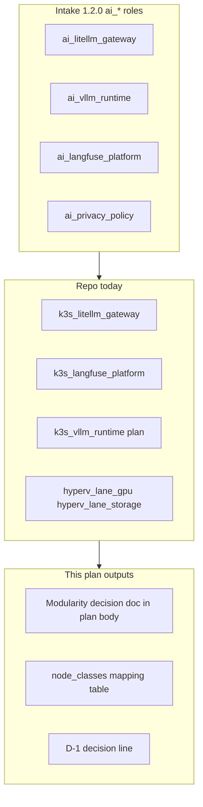
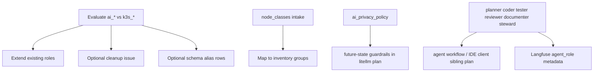

# AI — Ansible modularity + intake gap definitions (incomplete-wip)

**Parent program:** [2026-05-29--ai-homelab-intake-execution-incomplete-wip/](../2026-05-29--ai-homelab-intake-execution-incomplete-wip/README.md)

---

## Intake intent (preserved)

ChatGPT proposed **separate capability roles** (`ai_litellm_gateway`, `ai_vllm_runtime`, …) reflecting modular design. Repo ships **`k3s_*`** roles. This plan **evaluates** whether intake separation implies playbook/role cleanup, captures good names in schema, and closes **glossary gaps** that are not full stacks alone.

---

## Gaps captured (from intake-semantic-vocabulary)

| Gap | Action in this plan | Execute elsewhere |
|-----|---------------------|-------------------|
| **Model catalog** | Reference only | [model-catalog-hf-storage](../2026-05-29--ai-model-catalog-hf-storage-incomplete-wip/README.md) |
| **`node_classes`** | Map to inventory groups doc + optional registry note | This plan |
| **Notion / ripi-private (D-1)** | Decision record + route | litellm / future MCP plan |
| **Cookbook eval patterns** | Reference only | [langfuse-observability](../2026-05-29--ai-langfuse-observability-incomplete-wip/README.md) |
| **`ai_privacy_policy`** | Design privacy router; defer guardrail implement | litellm or future-state |
| **Agent types / workflow profiles** | Preserve several-agent foundation now; define bounded roles and route IDE/client config | agent workflow / IDE client sibling plan |

---

## Architecture/Structure Diagram

---

## Capability Routing Diagram

---

## Naming/Modeling Diagram

N/A for new hostnames. **node_classes** map to existing groups — see checklist **NC-** rows.

---

## Mandatory NetBox slice

Declared / Applied / Verified evidence is required if this slice mutates
registry or NetBox-modeled mapping. If the slice remains doc-only, the receipt
must state reconciliation-only and cite the static artifact references below.

| Contract | This slice |
|----------|------------|
| **Declared** | `node_classes` intake table aligned to `live-object-registry.yml` groups/devices — no new slug without pattern |
| **Applied** | Only if mapping adds seed tasks — else reconciliation-only |
| **Verified** | `validate_netbox_repo_consistency.sh` after any registry edit |

| ID | Obligation |
|----|------------|
| NB-01 | Document mapping: `ai_gpu_primary` → `hyperv_lane_gpu` / hvh-02 (no new NetBox object) |
| NB-02 | If config context for model catalog added later — separate catalog plan owns apply |

### Artifact references

- `artifacts/netbox-reconciliation/latest.json`
- `scripts/validate_netbox_repo_consistency.sh`

---

## Apply / Verify / Undo / Change class

| | |
|---|---|
| **Apply** | Update intake modularity doc; record D-1; add `docs/reference/` or layer-model cross-link for `node_classes`; optional GitHub issue for playbook cleanup |
| **Verify** | Operator sign-off on modularity table; D-1 recorded in parent program |
| **Undo** | Revert doc edits |
| **Class** | Doc / design (no homelab apply required for closure) |

---

## Checklist

- [ ] **M-01** — Publish modularity decision (keep `k3s_*` vs rename pass)
- [ ] **M-02** — `node_classes` → inventory group table in plan or [ai-homelab-layer-model.md](../../../reference/ai-homelab-layer-model.md)
- [ ] **M-03** — **D-1** decision: model-only `ripi-private` vs Notion MCP packet
- [ ] **M-04** — Privacy router: document as future-state dependency of litellm plan
- [ ] **M-05** — Refresh [phase-1-GROUP-B-infra-deployment-synthesis.md](../../../intake/netbox/netbox_ai_infra_impl_planning_wip/phase-1-GROUP-B-infra-deployment-synthesis.md) tangible role names (doc pass)
- [x] **M-06** — Agent type foundation: planner/coder/tester/reviewer/documenter/steward represented in this plan chain or routed to named agent-workflow sibling plan
- [ ] **M-07** — Independent validator signs this slice; any deferred modularity/privacy-router work is moved to a named future plan with `moved_to_plan`
- [ ] **NB-01** — NetBox declared mapping for node_classes (no stray custom fields)
- [ ] **NB-02** — Consistency gate pass if registry touched

---

## Plan verification receipt

**Verified at:** pending

| ID | Source | Obligation | Status | Evidence |
|----|--------|------------|--------|----------|
| O-01 | M-01 | Modularity decision recorded | pending | |
| O-02 | M-02 | node_classes mapped | pending | |
| O-03 | M-03 | D-1 closed or blocked | pending | |
| O-04 | NB-01 | NetBox declared | pending | |
| O-05 | M-06 / OD-AI-001 | Several agent types represented or routed | pass | ai-agent-workflow-ide-client sibling plan |
| O-06 | M-07 / OD-AI-004 | Independent validator signed; deferrals moved out | pending | |

---

## On Deck — user decisions to integrate

| ID | User decision / direction | Target integration | Status |
|----|---------------------------|--------------------|--------|
| OD-AI-001 | Implement several agent types now as foundations, without prematurely building a full orchestration platform | M-06/O-05 and named agent-workflow / IDE client sibling plan | integrated via sibling plan |
| OD-AI-004 | Use independent validator send-back gate before completion | M-07 and receipt O-06 | integrated |

---

## Diagram gate receipt

- [x] Architecture/Structure
- [x] Capability Routing
- [x] Naming/Modeling — N/A with reason
- [x] Diagram Inventory below

---

## Related plans

| Plan | Relationship |
|------|----------------|
| [ai-homelab-intake-execution-incomplete-wip](../2026-05-29--ai-homelab-intake-execution-incomplete-wip/README.md) | **parent program** |
| [ai-litellm-model-lanes-incomplete-wip](../2026-05-29--ai-litellm-model-lanes-incomplete-wip/README.md) | **unblocks** (D-1) |
| [ai-model-catalog-hf-storage-incomplete-wip](../2026-05-29--ai-model-catalog-hf-storage-incomplete-wip/README.md) | model catalog gap |
| [ai-langfuse-observability-incomplete-wip](../2026-05-29--ai-langfuse-observability-incomplete-wip/README.md) | cookbook patterns |
| [ai-agent-workflow-ide-client-incomplete-wip](../2026-05-29--ai-agent-workflow-ide-client-incomplete-wip/README.md) | agent role defaults and client profiles |

---

## Diagram Inventory

- Architecture/Structure — ai_* to k3s_* evaluation
- Capability Routing — decision branches
- Additional: Playbook composition diagram on request
