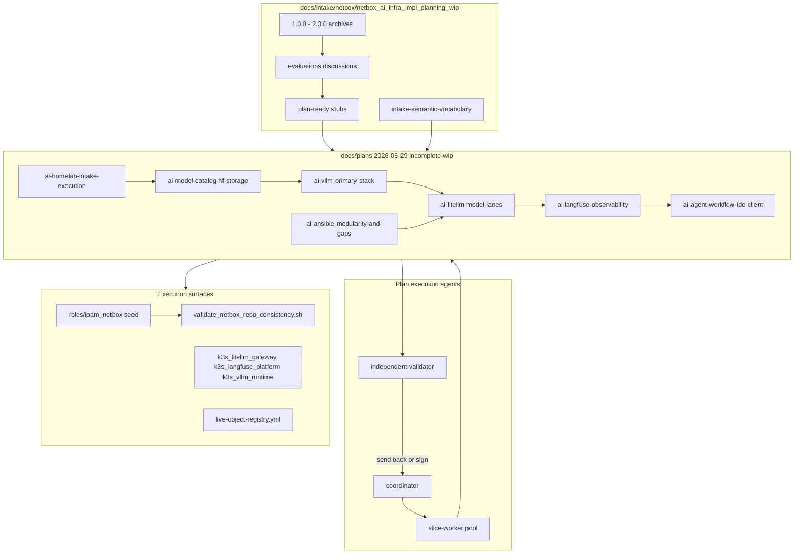
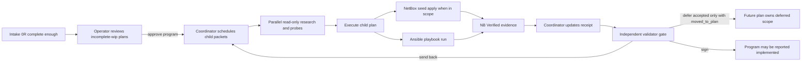
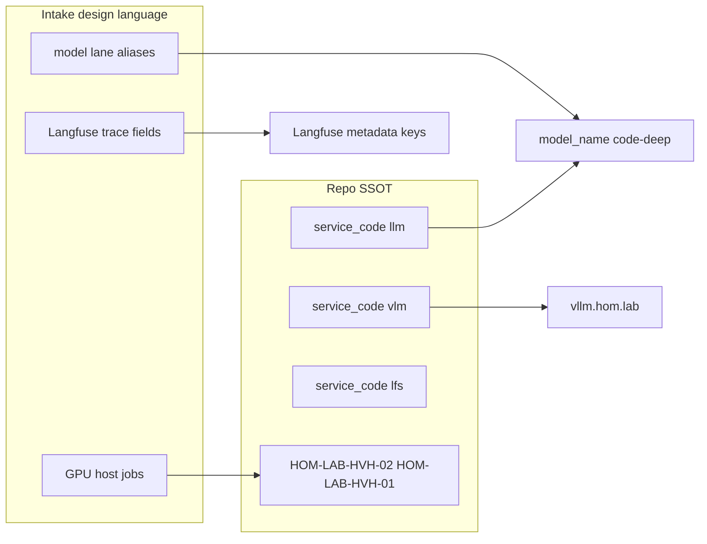

# AI homelab intake — execution program (incomplete-wip)

**Intake workspace:** [docs/intake/netbox/netbox_ai_infra_impl_planning_wip/](../../../intake/netbox/netbox_ai_infra_impl_planning_wip/)  
**Playbook:** [interim_intake_instructions.md](../../../intake/netbox/netbox_ai_infra_impl_planning_wip/interim_intake_instructions.md)  
**Principles:** [wip-intake-principles.md](../../../intake/netbox/netbox_ai_infra_impl_planning_wip/wip-intake-principles.md)  
**Vocabulary:** [intake-semantic-vocabulary.md](../../../intake/netbox/netbox_ai_infra_impl_planning_wip/intake-semantic-vocabulary.md)

This packet is the **roadmap** for work massaged from ChatGPT exports (`1.0.0`–`2.3.0`). Child plans are `-incomplete-wip` until you approve promotion to `lifecycle: incomplete` or execute. **Do not** treat this parent alone as execute-complete.

---

## Intake intent (preserved)

External design described a **modular AI product engineering lab**: model lanes (LiteLLM aliases), vLLM as runner, Langfuse as observability, privacy before cloud routing, multi-GPU **jobs** on named hosts, and bounded agent roles. Reconciliation in the intake folder produced repo truth; these plans are the **build queue**.

Operator decision now captured: **implement several agent types and model lanes now**. That means the program must carry the full model-purpose and agent-role set from the numbered docs. Individual rows can be `candidate`, `blocked`, or `pending research`, but they cannot disappear behind a single `code-deep` first path.

---

## Child plans (execute in dependency order)

| Order | Plan | NetBox | Intake gap / slice |
|-------|------|--------|-------------------|
| 0 | [ansible-modularity-and-gaps-incomplete-wip](../2026-05-29--ai-ansible-modularity-and-gaps-incomplete-wip/README.md) | partial | `ai_*` role evaluation, node_classes, D-1, privacy router |
| 1 | [model-catalog-hf-storage](../2026-05-29--ai-model-catalog-hf-storage-incomplete-wip/README.md) | yes | HF catalog manifest (D-4) |
| 2 | [vllm-primary-stack](../2026-05-29--ai-vllm-primary-stack-incomplete-wip/README.md) | yes | vLLM primary + `vlm` publication |
| 3 | [litellm-model-lanes](../2026-05-29--ai-litellm-model-lanes-incomplete-wip/README.md) | yes | `model_list` + `router_settings` |
| 4 | [langfuse-observability](../2026-05-29--ai-langfuse-observability-incomplete-wip/README.md) | yes | Trace metadata + cookbook patterns |
| 5 | [agent-workflow-ide-client](../2026-05-29--ai-agent-workflow-ide-client-incomplete-wip/README.md) | yes | planner/coder/tester/reviewer/documenter/steward profiles, IDE defaults, trace sidecars |

**Existing related plans (merge at execute, do not duplicate):**

- [2026-05-19--vllm-runtime-and-huggingface-cache/](../2026-05-19--vllm-runtime-and-huggingface-cache/README.md)
- [2026-05-28--k3s-vllm-service-publication-incomplete/](../2026-05-28--k3s-vllm-service-publication-incomplete/README.md)

---

## Multi-agent execution workflow

This section governs how this plan family is implemented. It is about the
planning/build workflow, not the runtime product agent roles in the IDE client
plan.

| Role | Responsibility | Write access |
|------|----------------|--------------|
| `coordinator` | Owns the dependency graph, schedules parallel work, applies repo changes, and updates receipts | yes, through the main implementation thread |
| `slice-worker` | Performs bounded research, read-only probes, or scoped implementation for one child packet | read-only by default; write only when delegated by coordinator |
| `independent-validator` | Reviews the whole plan packet after coordinator claims readiness; can send work back until every obligation is implemented or formally moved | no production mutation; can edit validation notes/receipts when delegated |

**Send-validation rule:** The coordinator cannot report this program as
implemented until `independent-validator` signs the receipt. If the validator
finds planned work still open, it returns the packet to the coordinator. The
only accepted exception is formal deferral: the deferred work must be removed
from the current plan's completion obligations, added to a named future plan,
and linked in the current receipt as `moved_to_plan`.

## Parallel execution matrix

| Workstream | Can run in parallel? | Notes |
|------------|----------------------|-------|
| Model candidate research | yes | Independent of repo mutation; must record current sources and candidate rationale before downloads |
| Langfuse cookbook pattern review | yes | One worker can review official docs while others inspect repo roles |
| NetBox schema/registry comparison | yes | Read-only until a single apply window |
| Host/GPU/share probes | yes | Read-only probes can run before mutation; destructive cleanup remains approval-gated |
| Plan/receipt validation | yes | Validator can review docs while workers prepare evidence |
| NetBox seed apply | no | Serialize with registry edits and receipt updates to avoid drift |
| LiteLLM live model enablement | partly | Candidate rows can be declared in parallel; enabled rows wait for vLLM `api_base` verification |
| Langfuse trace smoke | no | Depends on LiteLLM alias stability and callback config |

---

## Architecture/Structure Diagram

---

## Capability Routing Diagram

---

## Naming/Modeling Diagram

N/A for new compact hostname codes — uses existing schema. New pattern: `model_lane_aliases` in child LiteLLM plan.

---

## Mandatory NetBox slice

Program-level scope for the full intake execution family.

NetBox is **first-class** on this program: every child plan with `netbox_scope: true` must pass **Declared / Applied / Verified** before the program is complete.

| Surface | Program expectation |
|---------|---------------------|
| **Declared** | Child plans + `live-object-registry.yml` + `roles/ipam_netbox/` agree on `llm`, `vlm`, `lfs`, ingress rows |
| **Applied** | `deploy_ipam_netbox.yaml` seed/apply tags OR explicit reconciliation-only status per slice |
| **Verified** | `scripts/validate_netbox_repo_consistency.sh` + `artifacts/netbox-reconciliation/` when objects change |
| **Gate** | `bin/netbox-authority-gate.sh` on packet promotion |

**Bootstrap/recovery:** If NetBox volume is lost, label work bootstrap — not steady-state completion.

### Cross-child NetBox obligations

| ID | Obligation | Owner plan |
|----|------------|------------|
| NB-P01 | Registry rows for new `model_lanes` metadata (if modeled as config context) | litellm |
| NB-P02 | `vllm-k3s-primary` service + `vllm.hom.lab` publication | vllm |
| NB-P03 | Langfuse service metadata + drift note D-3 | langfuse |
| NB-P04 | Storage-lane MinIO/catalog objects when D-4 lands | catalog |

---

## Open decisions (program-wide)

| ID | Question | Affects | Status |
|----|----------|---------|--------|
| D-1 | ripi-private vs Notion MCP | gaps plan, litellm | open |
| D-2 | code-fast local vs Gemini default | litellm router | open |
| D-3 | Langfuse/MinIO placement k3s-02 vs hvh-01 | langfuse, catalog | open |
| D-4 | HF share path on hvh-01 | catalog, vllm | closed/applied: `F:\shares\public\models\huggingface` on `HOM-LAB-HVH-01` |

## Operator decisions already made

| ID | Decision | Required plan effect |
|----|----------|----------------------|
| OD-AI-001 | Implement several agent types and model lanes now | LiteLLM/model-catalog plans carry the full model-purpose set; gaps/agent workflow route carries planner/coder/tester/reviewer/documenter/steward foundations |
| OD-AI-002 | Do not describe `code-deep` as "one first path" in a way that defers the rest | Plans may sequence runtime execution, but must keep full lane/agent scope visible as obligations |
| OD-AI-004 | Add coordinator + independent validator workflow; validator can send work back unless explicitly moved to a future plan | Parent plan owns execution workflow; child receipts must carry validator status before completion |
| OD-AI-005 | Missing Ansible resources are implementation work, not a reason to stop without research/scaffolding/probes | Framework guidance plus vLLM/GPU roles and ordered playbook chain |

---

## Checklist (parent — coordination only)

- [x] **P-01** — Operator reviewed all child `-incomplete-wip` plans (2026-05-29)
- [ ] **P-02** — D-1–D-4 decided or explicitly `blocked` with evidence
- [ ] **P-03** — Each child plan verification receipt shows NetBox **Verified** where in scope
- [ ] **P-04** — Intake folder `_wip.md` updated when a child moves to `implemented`
- [x] **P-05** — Full model-purpose set from numbered docs represented in LiteLLM + catalog receipts, not only `code-deep`
- [x] **P-06** — Several agent types represented in plan chain or named sibling agent-workflow plan before build
- [ ] **P-07** — No child plan uses sequencing language to drop approved scope
- [x] **P-08** — Coordinator / slice-worker / independent-validator workflow documented
- [x] **P-09** — Parallelizable workstreams and serialized gates documented
- [ ] **P-10** — Independent validator signs receipts before any plan is marked implemented
- [ ] **P-11** — Deferred scope, if any, is moved to a named future plan and removed from current completion obligations
- [x] **P-12** — Dependency order encoded in executable Ansible entrypoint, not only prose
- [x] **P-13** — Missing vLLM/GPU scaffolding converted into repo-owned roles/playbooks before reporting blocker

---

## Plan verification receipt

**Program:** ai-homelab-intake-execution-incomplete-wip  
**Verified at:** pending

| ID | Source | Obligation | In scope? | Status | Evidence |
|----|--------|------------|-----------|--------|----------|
| O-01 | P-01 | Operator review of child plans | yes | pass | 2026-05-29 operator sign-off |
| O-02 | D-1–D-4 | Decisions recorded in gaps or child plans | yes | pending | |
| O-03 | NB-P01–P04 | NetBox program obligations via children | yes | pending | |
| O-04 | Child plans | Each child receipt `pass` for in-scope rows | yes | pending | |
| O-05 | P-05 / OD-AI-001 | Full model-purpose set represented | yes | pass | litellm `model_lanes` + catalog manifest/registry rows |
| O-06 | P-06 / OD-AI-001 | Agent type foundations represented or routed | yes | pass | gaps plan + ai-agent-workflow-ide-client packet |
| O-07 | P-07 / OD-AI-002 | Sequencing does not narrow approved scope | yes | pending | child plan review |
| O-08 | P-08 / OD-AI-004 | Coordinator and independent validator workflow documented | yes | pass | this packet, Multi-agent execution workflow |
| O-09 | P-09 / OD-AI-004 | Parallel and serialized work matrix documented | yes | pass | this packet, Parallel execution matrix |
| O-10 | P-10 / OD-AI-004 | Independent validator signed final receipts | yes | pending | |
| O-11 | P-11 / OD-AI-004 | Deferred scope moved to named future plan, if used | yes | pending | |
| O-12 | P-12 / OD-AI-005 | Ansible entrypoint encodes dependency order | yes | pass | `playbooks/deploy_ai_inference_stack.yaml` imports storage/catalog -> GPU -> vLLM -> LiteLLM -> Langfuse -> `validate_ai_agent_client_profiles.yaml`; see `artifacts/troubleshooting/ai-inference-stack-validation-2026-05-29.md` |
| O-13 | P-13 / OD-AI-005 | Missing resources scaffolded before blocker | yes | pass | `k3s_node_gpu_prereqs`, `k3s_vllm_runtime`, `deploy_gpu_infrastructure.yaml`, `deploy_vllm_runtime.yaml` |

### Summary

- In-scope obligations: 13 - pass: 7, blocked: 0, pending: 6
- Deferred: 0

**Completion gate:** All child plans `lifecycle` promoted or verified; parent receipt updated.

---

## On Deck — user decisions to integrate

| ID | User decision / direction | Target integration | Status |
|----|---------------------------|--------------------|--------|
| OD-AI-001 | Implement several agent types and model lanes now | Integrated into parent checklist; child plans must finish full lane/agent rows before build | on-deck until child receipts carry it |
| OD-AI-002 | Stop framing `code-deep` as the only real executable path | LiteLLM, catalog, and vLLM wording/checklists | integrated in child packets |
| OD-AI-003 | Operator reviewed plans — ready for slice-by-slice build when directed | P-01; child `-incomplete-wip` packets current | integrated 2026-05-29 |
| OD-AI-004 | Use a coordinator plus independent validator send-back gate for all planned work | Parent workflow, receipts, and child packet validation rows | integrated in this packet |
| OD-AI-005 | Do not stop at missing resources if docs/MCP research and scaffolding can advance the build | Framework rules, vLLM role scaffolding, ordered Ansible playbook | integrated in this packet |

---

## Diagram gate receipt

- [x] Architecture/Structure: intake folder, child plans, NetBox/ Ansible execution
- [x] Capability Routing: review → execute → NetBox verify
- [x] Naming/Modeling: intake vocab → repo service codes
- [x] Diagram Inventory lists required sections

---

## Diagram Inventory

### Diagrams Included

- Architecture/Structure — intake folder to plans to repo execution
- Capability Routing — operator review and NetBox-first verify path
- Naming/Modeling — model lanes vs service codes

### Additional Diagrams Available On Request

- Deployment Flow — per-child playbook order
- State Transition — lifecycle incomplete-wip → incomplete → implemented
