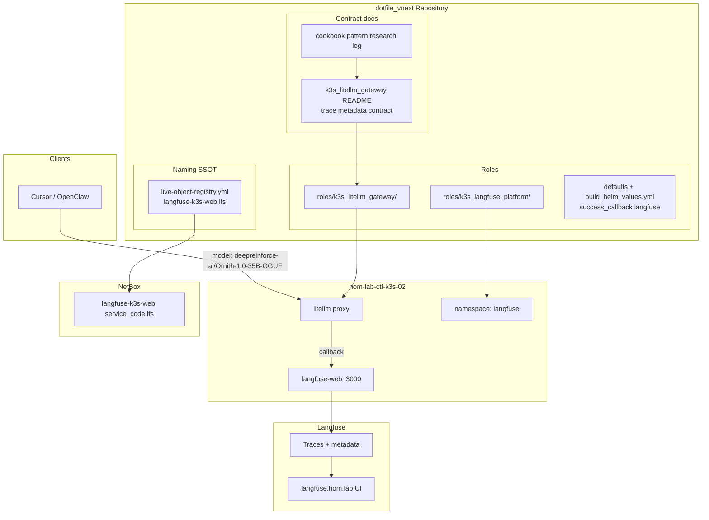
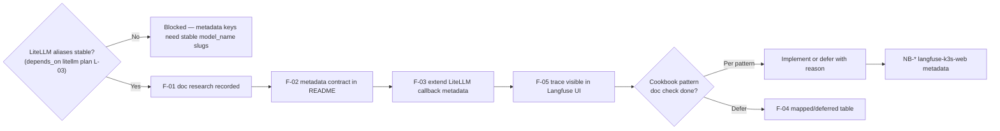
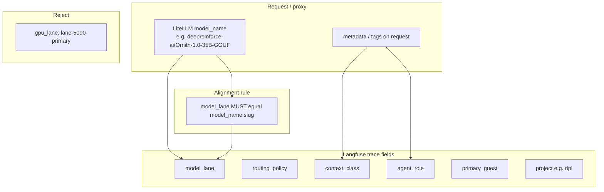

# AI — Langfuse observability + trace metadata (WIP)

**Parent program:** [2026-05-29--ai-homelab-intake-execution-incomplete-wip](../2026-05-29--ai-homelab-intake-execution-incomplete-wip/README.md)

**Promoted from:** `langfuse-observability-reconciliation-evaluation.md`, plan-ready `langfuse-trace-metadata-incomplete.md`, intake **1.4.0** cookbook patterns  
**Layer:** observability only — platform deploy remains `k3s_langfuse_platform` / prior Langfuse plan; LiteLLM routing is depends_on sibling.

| | |
|---|---|
| **Apply** | Document trace metadata contract; extend `k3s_litellm_gateway` callback/metadata propagation; optional Langfuse project/tags via API; role README; per-pattern doc research log before any cookbook-derived Ansible tasks |
| **Verify** | Test completion → Langfuse UI trace with `model_lane`, `routing_policy`, `context_class`, `agent_role` visible; `success_callback: ["langfuse"]` still works |
| **Undo** | Revert gateway env / callback / metadata config |
| **Class** | Idempotent config |

**Mandatory before design tasks:** Langfuse doc-first gate ([wip-intake-principles.md](../../intake/netbox/netbox_ai_infra_impl_planning_wip/wip-intake-principles.md)):

1. Langfuse skill → official docs / `llms.txt`
2. [Langfuse LiteLLM gateway integration](https://langfuse.com/integrations/gateways/litellm)
3. Repo: `roles/k3s_langfuse_platform`, existing `success_callback` in `roles/k3s_litellm_gateway/tasks/build_helm_values.yml`

---

## Architecture/Structure Diagram



---

## Capability Routing Diagram



---

## Naming/Modeling Diagram



**Target metadata contract (per completion):**

```yaml
model_lane: deepreinforce-ai/Ornith-1.0-35B-GGUF          # same string as LiteLLM model_name
routing_policy: local-5090     # from model_info / router
context_class: private-code
agent_role: coder
primary_guest: hom-lab-ctl-k3s-02
project: ripi                  # Langfuse project config
```

**Planned `agent_role` values:** `planner`, `coder`, `tester`, `reviewer`,
`documenter`, `steward`. This slice only defines trace metadata propagation;
the agent workflow / IDE client plan owns client profiles and access boundaries.

---

## Gap — cookbook eval patterns (doc check before tasks)

Intake **1.4.0** treats cookbook entries as **patterns to absorb**, not features to install wholesale. **No Ansible task** for a pattern until that pattern's official doc (or Langfuse skill index entry) is fetched and recorded.

Every cookbook suggestion still gets reviewed. If this slice only absorbs part
of the idea, the research log must keep the knowledge value and a trajectory for
full implementation later.

| Priority | Cookbook pattern (1.4.0) | Repo action now | Doc check before tasks? | Route / trajectory |
|----------|--------------------------|-----------------|-------------------------|--------------------|
| 1 | LiteLLM + Langfuse integration | Extend existing `success_callback` + metadata | yes — gateway integration URL | **this slice (F-03)** |
| 2 | OpenAI-compatible tracing wrappers | Metadata on proxy requests | yes | this slice; later client helper if repeated |
| 3 | Nested traces / multi-step workflow | Capture span naming and parent/child trace idea | yes | follow-on slice for planner→coder→reviewer span continuity |
| 4 | Prompt / version management | Extract as Langfuse prompt-management trajectory | yes — prompt API doc | research → future slice with prompt API tasks |
| 5 | Tool-call observability | Extract tool-call fields for OpenClaw / shell / Ansible | yes | future slice tied to IDE/tool execution telemetry |
| 6 | Evaluation workflows | Preserve compare-lanes idea | yes | defer GROUP-A product future-state; later eval workflow plan |
| 7 | Dataset / eval storage | Preserve private dataset/eval store need | yes | defer GROUP-A; later dataset storage and retention plan |
| 8 | Multi-agent lineage | Preserve `trace_group` / work-item lineage idea | yes | future slice for RIPI/work-item trace grouping |

**Per-pattern research artifact (create at execute):** `docs/plans/2026-05-29--ai-langfuse-observability-incomplete-wip/cookbook-pattern-research-log.md` — one row per pattern: URL fetched, date, knowledge value, implement-now | extract-knowledge | defer-with-trajectory | reject, reason, future owner/prerequisite.

**Reconciliation mapping (evaluation):**

| Intake pattern | Repo action |
|----------------|-------------|
| Trace every agent completion | Already via LiteLLM callback — extend metadata |
| Prompt management in Langfuse | Research prompt API before role tasks |
| Datasets / evals | Defer — product future-state |
| Scores on promotion | Map to `promotion_state` metadata — stub in contract |

**Storage-lane drift:** `langfuse-web` on hom-lab-ctl-dkr-01 vs `langfuse-k3s-web` on k3s-02 — placement decision D-3; do not duplicate observability SSOT until decided.

---

## Mandatory NetBox slice

### Objects affected

| Registry slug | `service_code` | Operator hostname | Notes |
|---------------|----------------|-------------------|-------|
| `langfuse-k3s-web` | `lfs` | `langfuse.hom.lab` | Primary operator path — extend metadata for observability contract |
| `langfuse-web` | `lfs` | storage lane (dkr-01) | Drift / placement — document exception; not primary SSOT for this slice |

Ingress registry: `route_key: langfuse-web` → `netbox_l1_slug: langfuse-k3s-web` (already in `live-object-registry.yml`).

### Declared / Applied / Verified

- **Declared:** `langfuse-k3s-web` / `hom-lab-ctl-lfs-01` rows match `k3s_langfuse_platform` + trace contract docs; no conflicting `gpu_lane` metadata in NetBox.
- **Applied:** `roles/ipam_netbox` seed path updates Langfuse service metadata when contract is stable.
- **Verified:** `scripts/validate_netbox_repo_consistency.sh`; live lookup `langfuse-k3s-web`; curl `langfuse.hom.lab` + trace UI check.

### Artifact references

- `artifacts/netbox-service-inventory/latest.json`
- `artifacts/netbox-reconciliation/latest.json`
- `scripts/validate_netbox_repo_consistency.sh`

---

## Checklist

### Langfuse / trace (F-)

- [x] **F-01** — Doc research recorded with URLs (Langfuse skill, LiteLLM integration, any pattern-specific pages used)
- [x] **F-02** — Metadata keys documented in `k3s_litellm_gateway` README; keys match LiteLLM alias slugs from litellm plan
- [x] **F-03** — `success_callback: ["langfuse"]` preserved; metadata propagation path defined (env + request metadata)
- [x] **F-04** — Cookbook patterns 1.4.0 mapped in research log — each **implement-now**, **extract-knowledge**, **defer-with-trajectory**, or **reject** with reason and future owner/prerequisite when partial
- [ ] **F-05** — Test completion → Langfuse UI shows `model_lane`, `routing_policy`, `context_class`, `agent_role`
- [ ] **F-06** — Reject `gpu_lane` as trace dimension (document in README)
- [ ] **F-07** — Optional `promotion_state` metadata stub documented for future promotion workflow
- [x] **F-08** — Per-pattern doc check completed before any cookbook-derived Ansible tasks (research log)
- [x] **F-09** — `agent_role` metadata supports the planned agent type set or routes missing client/profile work to a named sibling plan
- [ ] **F-10** — Independent validator signs this slice; any deferred observability/client workflow work is moved to a named future plan with `moved_to_plan`

### NetBox (NB-)

- [ ] **NB-01** — Declared: `langfuse-k3s-web` registry + ipam_netbox defaults agree
- [ ] **NB-02** — Applied: seed/apply extends Langfuse web service metadata (observability contract reference)
- [ ] **NB-03** — Verified: `validate_netbox_repo_consistency.sh` pass
- [ ] **NB-04** — Verified: live NetBox + `langfuse.hom.lab` operator path
- [ ] **NB-05** — Document `langfuse-web` (dkr-01) drift / D-3 placement — no silent dual-primary

---

## Plan verification receipt

**Slice:** Langfuse observability + trace metadata (WIP)  
**Verified at:** pending

| ID | Source | Obligation | In slice scope? | Status | Evidence |
|----|--------|------------|-----------------|--------|----------|
| O-01 | F-01 | Doc research URLs recorded | yes | pass | `cookbook-pattern-research-log.md` |
| O-02 | F-02 | Metadata contract matches alias slugs | yes | blocked | depends_on L-03 |
| O-03 | F-03 | success_callback still works | yes | pending | |
| O-04 | F-04 | Cookbook patterns reviewed with disposition + trajectory | yes | pass | `cookbook-pattern-research-log.md` |
| O-05 | F-05 | Trace visible in Langfuse UI | yes | pending | |
| O-06 | F-06 | No gpu_lane trace dimension | yes | pending | |
| O-07 | F-07 | promotion_state stub documented | yes | pending | |
| O-08 | F-08 | Per-pattern doc check before tasks | yes | pass | `cookbook-pattern-research-log.md` |
| O-09 | NB-01–05 | NetBox Declared/Applied/Verified + drift doc | yes | pending | |
| O-10 | Apply contract | Gateway + README changes applied | yes | pending | |
| O-11 | depends_on | litellm model lanes stable | yes | blocked | litellm plan L-03 |
| O-12 | 1.4.0 gate | No SDK/task without doc fetch | yes | pending | research log |
| O-13 | F-09 / OD-AI-001 | Planned agent roles represented in trace metadata contract | yes | pending | |
| O-14 | F-10 / OD-AI-004 | Independent validator signed; deferrals moved out | yes | pending | |

**Completion gate:** F-05 + NB Applied/Verified pass; cookbook log complete for in-scope patterns; blocked rows cleared after litellm plan.

---

## On Deck — user decisions to integrate

| ID | User decision / direction | Target integration | Status |
|----|---------------------------|--------------------|--------|
| OD-AI-001 | Implement several agent types now as foundations | `agent_role` metadata set, F-09/O-13, agent-workflow sibling plan | integrated into metadata contract; client profile work still routed |
| OD-AI-004 | Use independent validator send-back gate before completion | F-10 and receipt O-14 | integrated |

---

## Related plans

| Plan | Relationship |
|------|----------------|
| [ai-homelab-intake-execution-incomplete-wip](../2026-05-29--ai-homelab-intake-execution-incomplete-wip/README.md) | **parent program** |
| [ai-litellm-model-lanes-incomplete-wip](../2026-05-29--ai-litellm-model-lanes-incomplete-wip/README.md) | **depends_on** |
| [ai-ansible-modularity-and-gaps-incomplete-wip](../2026-05-29--ai-ansible-modularity-and-gaps-incomplete-wip/README.md) | agent roles, D-3 cross-note |
| [ai-agent-workflow-ide-client-incomplete-wip](../2026-05-29--ai-agent-workflow-ide-client-incomplete-wip/README.md) | client profiles and agent role defaults |

---

## Diagram gate receipt

- [x] Architecture/Structure: repo paths, k3s_langfuse_platform, k3s_litellm_gateway, registry, NetBox lfs
- [x] Capability Routing: depends_on litellm, doc check gate, cookbook branch
- [x] Naming/Modeling: trace field contract, model_lane alignment, gpu_lane rejection
- [x] Diagram Inventory lists every required section above, not only diagrams actually drawn

---

## Diagram inventory

### Diagrams included

- **Architecture/Structure Diagram** — roles, trace flow, langfuse.hom.lab, NetBox lfs
- **Capability Routing Diagram** — depends_on, research, callback, cookbook per-pattern gate
- **Naming/Modeling Diagram** — trace metadata vs LiteLLM model_name

### Additional diagrams available on request

- **Cookbook absorption timeline** — priorities 1–8 from 1.4.0
- **Multi-step workflow trace** — nested spans planner→coder→reviewer
- **Privacy × context_class matrix** — allowlist vs model lanes (cross-link litellm plan)
