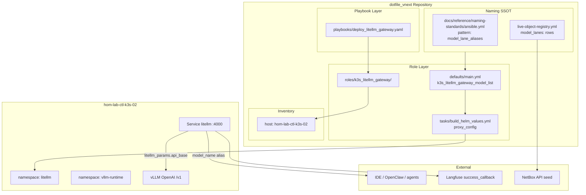
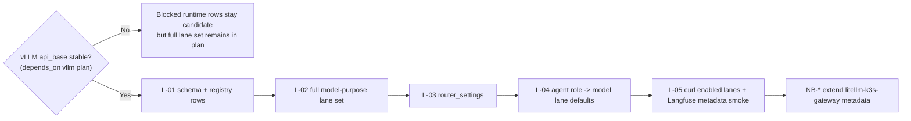
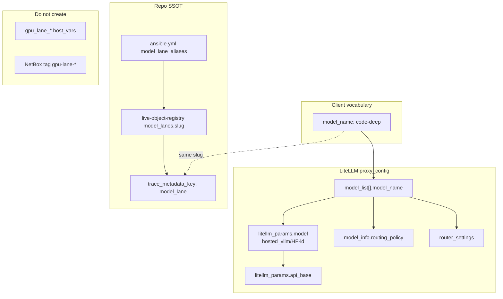

# AI — LiteLLM model lanes + router_settings (WIP)

**Parent program:** [2026-05-29--ai-homelab-intake-execution-incomplete-wip](../2026-05-29--ai-homelab-intake-execution-incomplete-wip/README.md)

**Promoted from:** intake plan-ready `litellm-model-lanes-incomplete.md` and evaluation § Full `proxy_config`  
**Vocabulary:** model **lanes** are client-facing LiteLLM `model_name` aliases (`code-deep`, …); intake **GPU lane** phrases are job provenance only — do not mint `gpu_lane_*` inventory keys.

| | |
|---|---|
| **Apply** | Schema pattern `model_lane_aliases` in `ansible.yml`; registry `model_lanes:` rows for the full lane set; extend `k3s_litellm_gateway_model_list`, `build_helm_values.yml` `proxy_config` (`model_list` + `router_settings`); redeploy `deploy_litellm_gateway.yaml` on hom-lab-ctl-k3s-02 |
| **Verify** | `curl` `http://litellm.hom.lab/v1/chat/completions` for every enabled lane; candidate/blocked lanes have receipt rows explaining missing backend/research; Langfuse trace shows `model_lane` metadata; `scripts/validate_netbox_repo_consistency.sh` |
| **Undo** | Revert `k3s_litellm_gateway_model_list` / helm values; `helm upgrade` with prior config |
| **Class** | Idempotent config |

**Doc research required before execute** (record URLs in receipt):

- [LiteLLM proxy config](https://docs.litellm.ai/docs/proxy/configs) — `model_list`, `router_settings`
- [LiteLLM vLLM provider](https://docs.litellm.ai/docs/providers/vllm) — `hosted_vllm/` prefix

---

## Architecture/Structure Diagram



---

## Capability Routing Diagram



---

## Naming/Modeling Diagram



---

## Reference — model lanes (full planned set)

Canonical slugs from intake `model_aliases` (1.1.0) plus the 1.2.0/1.3.0
`code-test` reviewer/tester need. `code-deep` is one lane in the set, not the
plan by itself. Rows may be `candidate` or `blocked` until model research and
read-only GPU/runtime probes pass; they must still remain visible in this plan.

| `model_name` (client) | Purpose | `routing_policy` | Candidate backend | Status before execute |
|-----------------------|---------|------------------|-------------------|-----------------------|
| `code-deep` | architecture, refactors, hard coding | `local-5090` | hosted vLLM on `hom-lab-ctl-k3s-02` | candidate until research/probe receipt |
| `code-fast` | autocomplete, small edits, repo questions | `local-preferred` | smaller local vLLM/Ollama-compatible backend | candidate until second-runtime decision |
| `code-review` | critique, risk finding, test review | `local-or-azure` | local reviewer model with optional scrubbed cloud leg | candidate until privacy router research |
| `code-test` | test generation and focused test repair | `local-preferred` | reviewer/tester backend | candidate until second-runtime decision |
| `ripi-private` | private planning/governance/conversation | `local-only` | local-only model backend | candidate; D-1 decides Notion MCP separately |
| `embeddings-local` | local retrieval/index embeddings | `local-only` | embedding model backend | candidate until embedding serving research |
| `public-research` | public docs/comparison/research | `azure-allowed` | Gemini/Azure/OpenAI provider via LiteLLM | candidate until current provider research + vault path |
| `experiment` | smoke tests and trial models | `local-only` | small HF model backend | candidate until catalog policy |
| `gpt-4o-mini` | migration fallback | `migration` | OpenAI | keep during migration |
| `default` | migration fallback | `migration` | OpenAI | keep during migration |

## Agent role defaults (planned)

These are client/workflow defaults, not separate deployed "agent servers" unless
a later agent-workflow plan makes them so.

| Agent role | Default model lane | Boundary |
|------------|--------------------|----------|
| `planner` | `ripi-private` or `code-fast` | read/reasoning, no repo write by default |
| `coder` | `code-deep` | branch write through IDE/agent tool |
| `tester` | `code-test` or `code-fast` | test files and commands |
| `reviewer` | `code-review` | diff/review, no write by default |
| `documenter` | `code-fast` | docs/runbooks/receipts |
| `steward` | `ripi-private` | promotion review and evidence summaries |

**Concrete copy target (example row, not the whole plan):**

```yaml
- model_name: code-deep
  litellm_params:
    model: hosted_vllm/Qwen/Qwen2.5-Coder-32B-Instruct-AWQ
    api_base: http://vllm.vllm-runtime.svc.cluster.local:8000/v1
    api_key: none
  model_info:
    routing_policy: local-5090
    vllm_deployment: vllm-k3s-primary
    primary_guest: hom-lab-ctl-k3s-02
```

**Schema target** (`ansible.yml` — pattern ID `model_lane_aliases`, status `candidate` until execute):

- `slug_pattern`: `^[a-z][a-z0-9]*(-[a-z0-9]+)*$`
- `routing_policy_enum`: `local-5090`, `local-only`, `local-preferred`, `local-or-azure`, `azure-allowed`
- `ansible_variable`: `k3s_litellm_gateway_model_list`
- `trace_metadata_key`: `model_lane`

Registry: add `model_lanes:` section with one row per slug (`slug`, `routing_policy`, `primary_guest`, `hf_repo_id`, `litellm_model`, `api_base`) — no `gpu_lane` field.

---

## Mandatory NetBox slice

### Objects affected

| Registry slug | `service_code` | Operator hostname | Extend in this slice |
|---------------|----------------|-------------------|----------------------|
| `litellm-k3s-gateway` | `llm` | `litellm.hom.lab` | Model-lane metadata on service description / custom fields only if native fields insufficient; prefer tags + description for alias catalog reference |

Related (read-only for this slice): `vllm-k3s-primary` / `vlm` — owned by vLLM depends_on plan.

### Declared / Applied / Verified

- **Declared:** `live-object-registry.yml` ingress row `litellm-k3s-gateway` and `netbox_services` entries agree with `roles/k3s_litellm_gateway` + new `model_lanes:` registry rows; no duplicate L1 slug.
- **Applied:** `roles/ipam_netbox` seed/apply path updates gateway service metadata when alias catalog is stable; not repo-only defaults.
- **Verified:** `scripts/validate_netbox_repo_consistency.sh`; `artifacts/netbox-service-inventory/latest.json`; live API lookup for `litellm-k3s-gateway`.

### Artifact references

- `artifacts/netbox-service-inventory/latest.json`
- `artifacts/netbox-reconciliation/latest.json`
- `scripts/validate_netbox_repo_consistency.sh`

---

## Checklist

### LiteLLM / schema (L-)

- [x] **L-01** — Add `model_lane_aliases` pattern to `docs/reference/naming-standards/ansible.yml` (candidate → active on pass)
- [x] **L-02** — Add `model_lanes:` reference instances to `live-object-registry.yml` for the full planned set (`code-deep`, `code-fast`, `code-review`, `code-test`, `ripi-private`, `embeddings-local`, `public-research`, `experiment`, migration rows)
- [ ] **L-03** — Extend `k3s_litellm_gateway_model_list` with every planned lane; enabled rows require live `api_base`, candidate rows require blocker/research receipt
- [ ] **L-04** — Add `proxy_config.router_settings` in `build_helm_values.yml` beside existing `model_list`
- [ ] **L-05** — Keep `gpt-4o-mini` / `default` migration rows; document removal criteria in role README
- [ ] **L-06** — `curl` chat completion for every enabled lane via `litellm.hom.lab`; candidate lanes listed as blocked with evidence
- [ ] **L-07** — Confirm no new `gpu_lane_*` inventory keys or NetBox lane taxonomy
- [ ] **L-08** — Doc research URLs recorded (LiteLLM proxy + vLLM provider)
- [x] **L-09** — Full model-purpose set represented; no approved lane omitted because `code-deep` is first to verify
- [x] **L-10** — Agent role defaults documented or routed to named agent-workflow sibling plan
- [ ] **L-11** — Independent validator signs this slice; any deferred lane/router work is moved to a named future plan with `moved_to_plan`

### NetBox (NB-)

- [ ] **NB-01** — Declared: registry + `roles/ipam_netbox` defaults agree on `litellm-k3s-gateway` / `hom-lab-ctl-llm-01`
- [ ] **NB-02** — Applied: seed/apply extends gateway service metadata (alias catalog reference in description or approved native/tag surface)
- [ ] **NB-03** — Verified: `validate_netbox_repo_consistency.sh` pass + artifact-backed service inventory compare
- [ ] **NB-04** — Verified: live NetBox object lookup for `litellm-k3s-gateway` matches operator hostname `litellm.hom.lab`

---

## Plan verification receipt

**Slice:** LiteLLM model lanes + router_settings (WIP)  
**Verified at:** pending

| ID | Source | Obligation | In slice scope? | Status | Evidence |
|----|--------|------------|-----------------|--------|----------|
| O-01 | L-01 | `model_lane_aliases` pattern in ansible.yml | yes | pass | `docs/reference/naming-standards/ansible.yml` |
| O-02 | L-02 | `model_lanes:` registry rows for full lane set | yes | pass | `live-object-registry.yml` `model_lanes` |
| O-03 | L-03 | Planned lanes represented in `model_list`; enabled lanes have live backends | yes | blocked | depends_on vllm plan V-02 + research/probes |
| O-04 | L-04 | `router_settings` in helm proxy_config | yes | pending | |
| O-05 | L-05 | Migration aliases retained | yes | pending | |
| O-06 | L-06 | curl verify enabled lanes | yes | pending | |
| O-07 | L-07 | No gpu_lane_* SSOT | yes | pending | |
| O-08 | L-08 | Doc research recorded | yes | pending | |
| O-09 | L-09 | Full model-purpose set not omitted | yes | pass | `model_lanes` carries full planned set plus migration rows |
| O-10 | NB-01–04 | NetBox Declared/Applied/Verified | yes | pending | |
| O-11 | Apply contract | deploy_litellm_gateway on k3s-02 | yes | pending | |
| O-12 | Verify contract | Langfuse trace shows model_lane | yes | pending | unblocks langfuse plan |
| O-13 | depends_on | vllm primary stack api_base | yes | blocked | vLLM plan GPU gate blocked: k3s-02 has no `nvidia-smi` and no `nvidia.com/gpu` capacity |
| O-14 | L-10 / OD-AI-001 | Agent role defaults represented or routed | yes | pass | ai-agent-workflow-ide-client sibling packet |
| O-15 | L-11 / OD-AI-004 | Independent validator signed; deferrals moved out | yes | pending | |

**Completion gate:** all in-scope obligations `pass` or explicitly `deferred` with evidence; no `lifecycle: implemented` until NB Applied + Verified and L-03/L-06 pass.

---

## On Deck — user decisions to integrate

| ID | User decision / direction | Target integration | Status |
|----|---------------------------|--------------------|--------|
| OD-AI-001 | Implement several agent types and model lanes now | L-02/L-03/L-09/L-10 and receipt O-02/O-03/O-09/O-14 | integrated into this packet; remains build-blocking until evidence rows pass or block |
| OD-AI-002 | Do not make `code-deep` wording hide the rest of the lane set | Reference table and checklist wording | integrated |
| OD-AI-004 | Use independent validator send-back gate before completion | L-11 and receipt O-15 | integrated |

---

## Related plans

| Plan | Relationship |
|------|----------------|
| [ai-homelab-intake-execution-incomplete-wip](../2026-05-29--ai-homelab-intake-execution-incomplete-wip/README.md) | **parent program** |
| [ai-vllm-primary-stack-incomplete-wip](../2026-05-29--ai-vllm-primary-stack-incomplete-wip/README.md) | **depends_on** |
| [ai-langfuse-observability-incomplete-wip](../2026-05-29--ai-langfuse-observability-incomplete-wip/README.md) | **unblocks** |
| [ai-ansible-modularity-and-gaps-incomplete-wip](../2026-05-29--ai-ansible-modularity-and-gaps-incomplete-wip/README.md) | D-1, privacy router |
| [ai-model-catalog-hf-storage-incomplete-wip](../2026-05-29--ai-model-catalog-hf-storage-incomplete-wip/README.md) | catalog layer (optional) |
| [ai-agent-workflow-ide-client-incomplete-wip](../2026-05-29--ai-agent-workflow-ide-client-incomplete-wip/README.md) | agent role defaults + client profiles |

---

## Diagram gate receipt

- [x] Architecture/Structure: repo paths, external resources, data/control flow, naming scheme, variable SSOT sources, tag/playbook wiring
- [x] Capability Routing: included (depends_on gate, primary vs secondary path)
- [x] Naming/Modeling: included (model lane vs gpu lane rejection)
- [x] Diagram Inventory lists every required section above, not only diagrams actually drawn

---

## Diagram inventory

### Diagrams included

- **Architecture/Structure Diagram** — schema, role, playbook, k3s-02, vLLM backend, Langfuse callback, NetBox
- **Capability Routing Diagram** — depends_on vLLM, schema → primary → router → verify → NetBox
- **Naming/Modeling Diagram** — alias slug, LiteLLM fields, schema pattern, rejected gpu_lane vocabulary

### Additional diagrams available on request

- **Deployment flow** — ordered helm upgrade + curl smoke
- **Privacy × model lane matrix** — `context_class` allowlist vs aliases
- **Multi-layer stack** — catalog → vLLM → LiteLLM → Langfuse (from intake evaluation)
