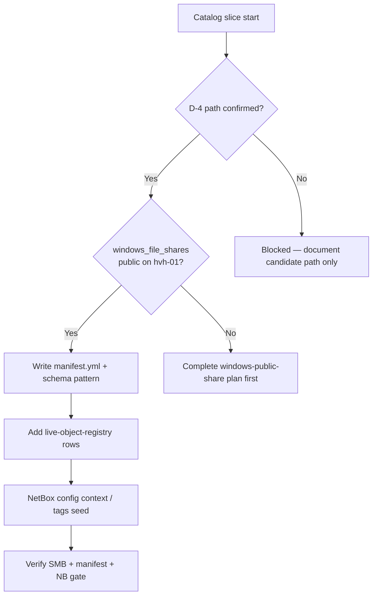
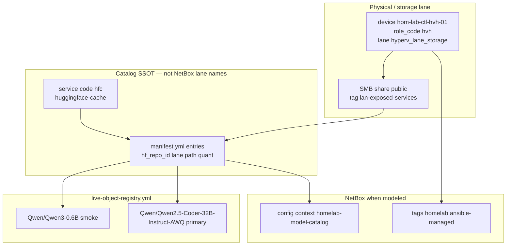

# AI model catalog — Hugging Face storage (storage lane)

**Parent program:** [2026-05-29--ai-homelab-intake-execution-incomplete-wip](../2026-05-29--ai-homelab-intake-execution-incomplete-wip/README.md)

**Planner/Steward view:** Catalog layer only — durable inventory of chosen HF models and where weights live. Runtime (vLLM) and gateway (LiteLLM) read this layer; they do not replace it.

**Intake sources:**

- [plan-ready/model-catalog-storage-incomplete.md](../../intake/netbox/netbox_ai_infra_impl_planning_wip/plan-ready/model-catalog-storage-incomplete.md)
- [capability-requirements-to-resources-evaluation.md §H](../../intake/netbox/netbox_ai_infra_impl_planning_wip/capability-requirements-to-resources-evaluation.md) (model catalog + D-4)
- [intake-semantic-vocabulary.md — Gaps table (model catalog)](../../intake/netbox/netbox_ai_infra_impl_planning_wip/intake-semantic-vocabulary.md)
- [ai-homelab-layer-model.md](../../reference/ai-homelab-layer-model.md) (catalog vs publication vs runtime)
- Intake folder index: [netbox_ai_infra_impl_planning_wip/README.md](../../intake/netbox/netbox_ai_infra_impl_planning_wip/README.md)

---

## Intake intent (preserved)

From intake reconciliation:

- **Model catalog** means a durable inventory of **chosen/downloaded** HF models, their lanes, paths, and operational metadata — not LiteLLM `model_list` rows and not a single vLLM `--model` argument.
- **Physical weights** belong on the **storage lane** (`hom-lab-ctl-hvh-01`) via the public SMB share, not on the 5090 OS disk.
- **vLLM on `hom-lab-ctl-k3s-02`** may read from the share (SMB mount or sync) or from a local PVC; it does not own catalog SSOT.
- Intake vocabulary row **“Model catalog (durable inventory of chosen HF models)”** → `manifest.yml` + registry rows ([intake-semantic-vocabulary.md](../../intake/netbox/netbox_ai_infra_impl_planning_wip/intake-semantic-vocabulary.md) gaps table).

**Operator decision D-4 (blocking path confirm):**

| ID | Question | Candidate answer | Status |
|----|----------|------------------|--------|
| D-4 | Public share path: confirm `F:\shares\public\models` on **hvh-01** as canonical HF root | UNC `\\hom-lab-ctl-hvh-01\public\models\huggingface\` | **repo-declared/applied 2026-05-29** |

D-4 is now implemented as idempotent Windows share desired state for
`hom-lab-ctl-hvh-01`. The existing `public` share was verified first; the
`models` and `models\huggingface` directories were then created and verified.

---

## Scope boundary

| In scope | Out of scope (other packets) |
|----------|------------------------------|
| Share directory layout under `public` | vLLM Helm deploy → [vLLM primary stack plan](../2026-05-29--ai-vllm-primary-stack-incomplete-wip/README.md) |
| `inventory/group_vars/model_catalog/manifest.yml` SSOT | LiteLLM aliases → `litellm-model-lanes` plan-ready stub |
| Naming schema pattern `model_catalog_manifest` | Langfuse trace metadata |
| `live-object-registry.yml` rows per HF repo | Automated bulk download (optional follow-on) |
| NetBox device context / tags for storage lane + `hfc` | GPU operator on k3s-02 |

**Depends on:** [windows-public-share-netbox-naming](../windows-public-share-netbox-naming/README.md) — SMB `public` share on `hom-lab-ctl-hvh-01` must exist and be reachable before catalog verify.

---

## Apply / Verify / Undo / Change class

| | |
|---|---|
| **Apply** | Confirm D-4 path; create `models\huggingface\` layout on hvh-01; add `model_catalog` group_vars manifest with full lane-purpose candidate rows; extend naming schema + registry rows; optional NetBox config context `homelab-model-catalog`; document Linux mount path on guests (`/mnt/homelab-models` or equivalent) |
| **Verify** | SMB path reachable from controller and from `hom-lab-ctl-k3s-02`; manifest carries every planned model-purpose lane as `candidate`/`downloaded`/`served`/`deferred`; no row stronger than `candidate` without research/probe receipt; `playbooks/validate_naming_schema.yml` passes new pattern; NetBox Declared/Applied/Verified receipt |
| **Undo** | Remove manifest group_vars; revert registry/schema additions; remove share subdirs only with explicit operator approval (destructive) |
| **Class** | Idempotent config + bootstrap download (weights download may be semi-manual first pass) |

---

## Architecture/Structure Diagram

```mermaid
graph TB
  subgraph intake [Intake provenance]
    planReady["plan-ready/model-catalog-storage-incomplete.md"]
    semVocab["intake-semantic-vocabulary.md gaps table"]
    capEval["capability-requirements §H + D-4"]
  end

  subgraph repo [dotfile-vnext]
    subgraph schema [Naming SSOT]
      ansibleYml["docs/reference/naming-standards/ansible.yml<br/>pattern: model_catalog_manifest"]
      registry["live-object-registry.yml<br/>model_catalog_entries"]
      rolesYml["resource-roles.yml<br/>hfc huggingface-cache"]
    end

    subgraph inventory [Inventory]
      manifest["inventory/group_vars/model_catalog/manifest.yml"]
      hvh01["host_vars/hom-lab-ctl-hvh-01.yaml"]
      shareGv["windows_file_share_hosts group_vars"]
    end

    subgraph roles [Roles]
      winShares["roles/windows_file_shares"]
      ipam["roles/ipam_netbox<br/>device + config context seed"]
    end

    subgraph playbooks [Playbooks]
      sharePb["playbooks/windows_file_shares.yml"]
      deployNb["playbooks/deploy_ipam_netbox.yaml"]
      validate["playbooks/validate_naming_schema.yml"]
    end
  end

  subgraph external [Managed targets]
    hvh01win["hom-lab-ctl-hvh-01<br/>F:\\shares\\public\\models\\huggingface"]
    k3s02["hom-lab-ctl-k3s-02<br/>reader mount optional"]
    netbox["NetBox API<br/>homelab site"]
  end

  planReady --> manifest
  semVocab --> manifest
  capEval --> hvh01win
  ansibleYml --> manifest
  registry --> manifest
  shareGv --> winShares
  sharePb --> winShares
  winShares --> hvh01win
  manifest --> k3s02
  ipam --> netbox
  deployNb --> ipam
  validate --> ansibleYml

  style planReady fill:#4a3f2e
  style hvh01win fill:#1e3a5f
  style netbox fill:#1e3a5f
```

---

## Capability Routing Diagram

---

## Naming/Modeling Diagram

**Schema targets (declare before inventory write):**

| Pattern ID | File | Purpose |
|------------|------|---------|
| `model_catalog_manifest` | `docs/reference/naming-standards/ansible.yml` *(add)* | Manifest entry shape: `hf_repo_id`, `lane`, `mount_path`, `quant`, `vram_gb`, `status` |
| `model_catalog_entries` | `live-object-registry.yml` *(add section)* | Reference instances tied to manifest rows |

## Model-purpose catalog set

The catalog must represent the full friendly lane set from the numbered docs.
Exact HF IDs remain **candidate** until the expert research/live-probe gate
passes. Do not collapse this plan down to one primary row.

| Lane / purpose | Catalog status before research | Candidate family to research | Notes |
|----------------|--------------------------------|------------------------------|-------|
| `code-deep` | `candidate` | large coding model suitable for 5090 vLLM | Former primary example; not the whole catalog |
| `code-fast` | `candidate` | smaller coding/general model | local-preferred |
| `code-review` | `candidate` | reviewer/risk-finding model | local with optional scrubbed cloud route in LiteLLM |
| `code-test` | `candidate` | test generation / repair model | reviewer/tester lane from infra exports |
| `ripi-private` | `candidate` | private reasoning/planning model | local-only; D-1 keeps Notion MCP separate |
| `embeddings-local` | `candidate` | embedding model | serving shape still needs research |
| `experiment` | `candidate` | smoke/trial model | low-risk testing row |
| `public-research` | `deferred` | cloud provider row, not HF weights by default | tracked in LiteLLM, not downloaded to share unless a local public-research model is chosen |

**Proposed manifest example row (instance, not duplicated YAML in plans):**

- `hf_repo_id`: candidate chosen by research receipt
- `lane`: one of the model lane aliases from the LiteLLM plan
- `storage_host`: `hom-lab-ctl-hvh-01`
- `unc_path`: `\\hom-lab-ctl-hvh-01\public\models\huggingface\`
- `status`: `candidate` until downloaded/served evidence exists
- `smoke_repo`: small HF repo chosen by research receipt

---

## Mandatory NetBox slice

### Objects affected

- **Device:** `hom-lab-ctl-hvh-01` (storage lane Hyper-V host) — already in `live-object-registry.yml`; confirm `netbox_status: active`
- **Service / cache identity:** `hfc` (`huggingface-cache`) — metadata via config context or future service row when weights are installed
- **Config context:** `homelab-model-catalog` *(proposed)* — manifest summary for operators, not duplicate of full `manifest.yml`
- **Tags:** `homelab`, `ansible-managed`, `infra`, `lan-exposed-services` on share-exposed paths

### Declared / Applied / Verified

| Phase | Requirement | Status |
|-------|-------------|--------|
| **Declared** | Packet, `manifest.yml` rows, registry pattern IDs, and `roles/ipam_netbox` seed targets agree on hvh-01 + `hfc` | pending |
| **Applied** | `deploy_ipam_netbox.yaml` seed applies config context / tags; share path exists on host | pending |
| **Verified** | `scripts/validate_netbox_repo_consistency.sh`; live device lookup; artifact `artifacts/netbox-reconciliation/latest.json` | pending |

### Artifact references

- `scripts/validate_netbox_repo_consistency.sh`
- `bin/netbox-authority-gate.sh` (read-only reconciliation)
- `artifacts/netbox-reconciliation/latest.json`
- `artifacts/netbox-service-inventory/latest.json` *(when service rows added)*

---

## Checklist

### Operator / path

- [x] **C-01** — D-4: `F:\shares\public\models` declared for `hom-lab-ctl-hvh-01`
- [x] **C-02** — `models\huggingface\` directory layout created on share

### Repo SSOT

- [x] **C-03** — Add `model_catalog_manifest` pattern to `docs/reference/naming-standards/ansible.yml`
- [x] **C-04** — Create `inventory/group_vars/model_catalog/manifest.yml` with full model-purpose candidate set plus smoke row
- [x] **C-05** — Add `model_catalog_entries` reference instances to `live-object-registry.yml`
- [ ] **C-06** — `playbooks/validate_naming_schema.yml` includes catalog pattern preflight

### Reachability

- [x] **C-07** — UNC path reachable from controller (or documented jump via hvh-01)
- [ ] **C-08** — Read path documented for `hom-lab-ctl-k3s-02` (mount or sync — choice recorded)

### NetBox (**NB-** IDs)

- [ ] **NB-C1** — **Declared:** registry + manifest + packet agree on hvh-01 catalog placement
- [ ] **NB-C2** — **Applied:** NetBox config context `homelab-model-catalog` seeded (or explicit reconciliation-only note)
- [ ] **NB-C3** — **Verified:** `validate_netbox_repo_consistency.sh` pass + live device check for `hom-lab-ctl-hvh-01`
- [ ] **NB-C4** — **Verified:** reconciliation artifact saved under `artifacts/netbox-reconciliation/`

### Downstream

- [ ] **C-09** — vLLM primary plan references manifest row for `Qwen/Qwen2.5-Coder-32B-Instruct-AWQ`
- [x] **C-10** — Expert research/live-probe receipt exists before any model row is marked stronger than `candidate`
- [x] **C-11** — LiteLLM full lane set cross-linked so catalog rows are not only `code-deep`
- [ ] **C-12** — Independent validator signs this slice; any deferred catalog/download work is moved to a named future plan with `moved_to_plan`

---

## Plan verification receipt

**Slice:** catalog + HF storage lane v1  
**Verified at:** pending  
**Verifier:** pending

### Obligation inventory

| ID | Source | Obligation | In slice scope? | Status | Evidence |
|----|--------|------------|-----------------|--------|----------|
| O-01 | C-01 / D-4 | Canonical HF root declared on hvh-01 | yes | pass | `inventory/host_vars/hom-lab-ctl-hvh-01.yaml` `windows_file_shares_extra_directories` |
| O-02 | C-02 | Share subdirectory layout exists | yes | pass | `windows_file_shares.yml` apply created `F:\shares\public\models` + `models\huggingface`; read-only probe returned both `exists: true` |
| O-03 | C-03 | `model_catalog_manifest` in ansible.yml | yes | pass | `docs/reference/naming-standards/ansible.yml` |
| O-04 | C-04 | `manifest.yml` SSOT with full lane-purpose candidate set + smoke repo | yes | pass | `inventory/group_vars/model_catalog/manifest.yml` |
| O-05 | C-05 | Registry reference rows | yes | pass | `live-object-registry.yml` `model_catalog_entries` |
| O-06 | C-06 | Schema preflight passes | yes | pending | |
| O-07 | C-07 | UNC reachability probe | yes | pass | `windows_file_shares.yml` verify passed credentialed `\\localhost\public` check on hvh-01 |
| O-08 | C-08 | k3s-02 read path documented or mounted | yes | pending | |
| O-09 | NB-C1 | NetBox Declared alignment | yes | pending | |
| O-10 | NB-C2 | NetBox Applied seed | yes | pending | |
| O-11 | NB-C3 | NetBox Verified consistency script | yes | pending | |
| O-12 | NB-C4 | Reconciliation artifact | yes | pending | |
| O-13 | depends_on | windows-public-share plan satisfied for hvh-01 `public` | yes | pass | preview showed share `public`, path `F:\shares\public`, folder/share/group/user all exist |
| O-14 | Change contract Verify | Manifest lists every planned lane-purpose row with status and evidence level | yes | pending | |
| O-15 | C-09 | vLLM plan cross-link | no | deferred | downstream packet |
| O-16 | C-10 | Research/probe receipt before stronger-than-candidate rows | yes | pass | exact HF IDs are only `candidate`; Qwen repos verified on Hugging Face 2026-05-29 |
| O-17 | C-11 / OD-AI-001 | Catalog cross-links full LiteLLM lane set | yes | pass | manifest carries code-deep, code-fast, code-review, code-test, ripi-private, embeddings-local, experiment, public-research |
| O-18 | C-12 / OD-AI-004 | Independent validator signed; deferrals moved out | yes | pending | |

### Summary

- In-scope obligations: 15 — pass: 9, pending: 6
- Deferred: 1 (downstream cross-link only)

### Completion gate (required for `lifecycle: implemented`)

- [ ] Every **in-scope** obligation is `pass` OR `blocked`/`fail` with evidence
- [ ] Change-contract **Verify** demonstrated (SMB + manifest listing)
- [ ] `depends_on_plans` satisfied or failure documented
- [x] D-4 path declared/applied with evidence

---

## On Deck — user decisions to integrate

| ID | User decision / direction | Target integration | Status |
|----|---------------------------|--------------------|--------|
| OD-AI-001 | Implement several model lanes now, not only one primary model | Model-purpose catalog set, C-04/C-10/C-11, receipt O-04/O-16/O-17 | integrated into packet; build-blocking until research/probe rows exist |
| OD-AI-002 | Do not let `code-deep` first-path wording defer the rest | Model-purpose table and verify wording | integrated |
| OD-AI-004 | Use independent validator send-back gate before completion | C-12 and receipt O-18 | integrated |

---

## Diagram gate receipt

- [x] Architecture/Structure: repo paths, external resources, data/control flow, naming scheme, variable SSOT sources, tag/playbook wiring
- [x] Capability Routing: included (D-4, share dependency, manifest, NetBox)
- [x] Naming/Modeling: included (hvh-01, hfc, manifest, registry rows)
- [x] Diagram Inventory lists every required section above

---

## Diagram Inventory

### Diagrams Included

- **Architecture/Structure Diagram**: intake → schema → inventory → roles → hvh-01 share + NetBox
- **Capability Routing Diagram**: D-4 gate, share prerequisite, manifest, NetBox verify
- **Naming/Modeling Diagram**: device, `hfc`, manifest, registry instances, NetBox context

### Additional Diagrams Available On Request

- **Deployment Flow**: windows_file_shares → manifest → optional HF prefetch
- **Network Topology**: SMB from k3s-02 to hvh-01 storage lane
- **State Transition Diagram**: manifest row lifecycle (candidate → downloaded → primary)

---

## Reinforcement (from intake planning)

| Gap surfaced | Reinforcement task | Status |
|--------------|-------------------|--------|
| Catalog vs LiteLLM `model_list` confusion | Comment in `k3s_litellm_gateway` defaults pointing at `model_catalog` manifest | **implemented** — `roles/k3s_litellm_gateway/defaults/main.yml` and role README now distinguish route list from catalog manifest |
| D-4 not in operator runbook | Add one-line decision to `hom-lab-ctl-hvh-01` host README or storage lane doc | **implemented** — `inventory/host_vars/hom-lab-ctl-hvh-01.yaml` and `docs/reference/ai-homelab-layer-model.md` now carry the canonical HF root |

---

## Related plans

| Plan | Relationship |
|------|----------------|
| [ai-homelab-intake-execution-incomplete-wip](../2026-05-29--ai-homelab-intake-execution-incomplete-wip/README.md) | **parent program** |
| [windows-public-share-netbox-naming](../windows-public-share-netbox-naming/README.md) | **depends_on** — `public` SMB |
| [2026-05-29--ai-vllm-primary-stack-incomplete-wip](../2026-05-29--ai-vllm-primary-stack-incomplete-wip/README.md) | **unblocks** — runtime reads catalog rows |
| [2026-05-28--k3s-vllm-service-publication-incomplete](../2026-05-28--k3s-vllm-service-publication-incomplete/README.md) | publication only after runtime URL exists |
