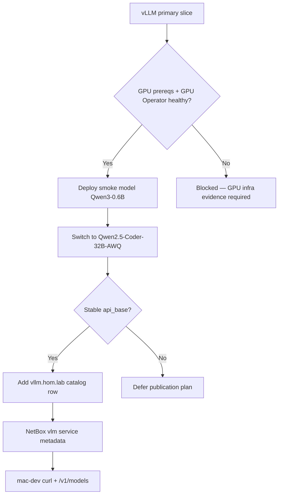
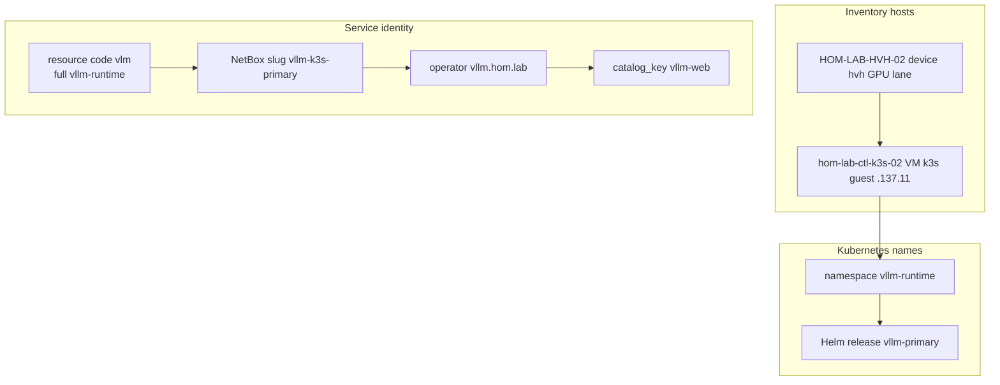

# AI vLLM primary stack — `hom-lab-ctl-k3s-02`

**Parent program:** [2026-05-29--ai-homelab-intake-execution-incomplete-wip](../2026-05-29--ai-homelab-intake-execution-incomplete-wip/README.md)

**Planner/Steward view:** GPU-backed **OpenAI-compatible** inference service on the 5090 path — not a LiteLLM alias and not the durable model catalog. **Heavy coding** is how clients *use* this service via LiteLLM `code-deep` (separate packet). This packet supplies one runtime/backend for the full model-lane program; it does not narrow the program to one lane.

**Intake sources:**

- [plan-ready/vllm-primary-stack-incomplete.md](../../intake/netbox/netbox_ai_infra_impl_planning_wip/plan-ready/vllm-primary-stack-incomplete.md)
- [1.0.0-parent-conversation-context-and-constraints-REFERENCE.md](../../intake/netbox/netbox_ai_infra_impl_planning_wip/1.0.0-parent-conversation-context-and-constraints-REFERENCE.md)
- [intake-semantic-vocabulary.md](../../intake/netbox/netbox_ai_infra_impl_planning_wip/intake-semantic-vocabulary.md)
- [vllm-architecture-discussion.md](../../intake/netbox/netbox_ai_infra_impl_planning_wip/vllm-architecture-discussion.md)
- [ai-homelab-layer-model.md](../../reference/ai-homelab-layer-model.md)
- Intake folder: [netbox_ai_infra_impl_planning_wip/README.md](../../intake/netbox/netbox_ai_infra_impl_planning_wip/README.md)

**Extends (does not replace):**

| Prior plan | What this packet adds |
|------------|----------------------|
| [2026-05-19--vllm-runtime-and-huggingface-cache](../2026-05-19--vllm-runtime-and-huggingface-cache/README.md) | Intake intent, `k3s_vllm_runtime` naming, primary model `Qwen2.5-Coder-32B-AWQ`, catalog cross-read |
| [2026-05-28--k3s-vllm-service-publication-incomplete](../2026-05-28--k3s-vllm-service-publication-incomplete/README.md) | Executable runtime prerequisite before DNS-3e / VLLM-* publication rows |

---

## Intake intent (preserved)

| Intake phrase | Design meaning | Repo deliverable |
|---------------|----------------|------------------|
| Primary deep local reasoning | Largest local model for hard problems on powerhouse GPU | vLLM serves `Qwen/Qwen2.5-Coder-32B-Instruct-AWQ` after smoke `Qwen/Qwen3-0.6B` |
| vLLM primary | Main 5090 OpenAI-compatible inference service | Namespace `vllm-runtime`, stable cluster `api_base`, operator `vllm.hom.lab` |
| Heavy coding | Coding-focused use of same stack | LiteLLM alias `code-deep` → this runtime (owned by the sibling LiteLLM packet) |
| 5090 lane *(provenance only)* | Jobs for powerhouse GPU host | `HOM-LAB-HVH-02` + `hom-lab-ctl-k3s-02` — **not** an inventory group name |

**Not in this slice, but not dropped:** LiteLLM `model_list` aliases, the full model-purpose set, agent role defaults, Langfuse trace metadata, and RIPI product surfaces are carried by named sibling packets. This vLLM packet must not be read as "only implement `code-deep`."

---

## Scope

| Intake job | Concrete deliverable |
|------------|---------------------|
| Primary deep local reasoning | vLLM deployment on k3s-02 with production weights |
| vLLM primary | Helm/runtime role, Service, Traefik or NodePort URL, `vllm.hom.lab` publication row |

**Target host:** `hom-lab-ctl-k3s-02` (`hyperv_lane_gpu`, guest `192.168.137.11`, registry `netbox_status: staged` until verified).

**Role / playbook targets (from intake 04 + 2026-05-19 plan):**

- `roles/k3s_vllm_runtime/` *(scaffolded 2026-05-29)*
- `roles/k3s_node_gpu_prereqs/` *(scaffolded 2026-05-29; prerequisite gate)*
- `roles/k3s_nvidia_gpu_operator/` *(not created yet; current blocker is no GPU device/capacity visible inside the K3s VM)*
- `playbooks/deploy_gpu_infrastructure.yaml`, `playbooks/deploy_vllm_runtime.yaml`, `playbooks/deploy_ai_inference_stack.yaml` *(scaffolded 2026-05-29)*

**Optional catalog dependency:** [model catalog HF storage plan](../2026-05-29--ai-model-catalog-hf-storage-incomplete-wip/README.md) — vLLM may use PVC first; share read is preferred steady-state.

**Sibling obligations:** Before this program builds, the model-catalog and
LiteLLM packets must still represent `code-deep`, `code-fast`, `code-review`,
`code-test`, `ripi-private`, `embeddings-local`, `experiment`, and cloud/public
fallback lanes as candidate/blocked/enabled rows. This runtime may be the first
backend verified, but it is not the full AI lane plan.

---

## Apply / Verify / Undo / Change class

| | |
|---|---|
| **Apply** | GPU prereqs + GPU Operator on k3s-02; deploy `k3s_vllm_runtime` with smoke model then primary AWQ model; wire `HF_TOKEN` from vault; add `homelab_hosts_file_web_catalog` row for `vllm.hom.lab`; seed NetBox `vlm` service metadata slug `vllm-k3s-primary` |
| **Verify** | `nvidia-smi` on GPU node; `kubectl get pods -n vllm-runtime`; OpenAI `GET /v1/models` on cluster URL; curl `vllm.hom.lab` from mac-dev; NetBox Declared/Applied/Verified |
| **Undo** | Helm uninstall; `k3s_vllm_runtime_state: absent`; remove catalog + NetBox rows |
| **Class** | Idempotent deploy |

---

## Architecture/Structure Diagram

```mermaid
graph TB
  subgraph intake [Intake]
    planReady["plan-ready/vllm-primary-stack-incomplete.md"]
    vocab["intake-semantic-vocabulary.md"]
    archDiscuss["vllm-architecture-discussion.md"]
  end

  subgraph prior [Prior plans]
    p19["2026-05-19 vllm-runtime-and-huggingface-cache"]
    p28["2026-05-28 k3s-vllm-service-publication"]
  end

  subgraph repo [dotfile-vnext]
    subgraph inventory [Inventory]
      k3s02["host_vars/hom-lab-ctl-k3s-02.yaml"]
      k3sGv["group_vars/k3s_cluster.yaml"]
      vault["vault HF_TOKEN"]
      catalog["group_vars/model_catalog/manifest.yml optional"]
      hostsCat["homelab_hosts_file_web_catalog"]
    end

    subgraph roles [Roles — target]
      gpuPrereq["k3s_node_gpu_prereqs"]
      gpuOp["k3s_nvidia_gpu_operator"]
      vllmRole["k3s_vllm_runtime"]
      traefik["k3s_traefik_routes optional"]
      ipam["ipam_netbox service seed"]
    end

    subgraph playbooks [Playbooks]
      gpuPb["deploy_gpu_infrastructure.yaml"]
      vllmPb["deploy_vllm_runtime.yaml"]
      hostsPb["homelab_hosts_file_mac.yaml"]
      nbPb["deploy_ipam_netbox.yaml"]
    end

    subgraph schema [Naming]
      vlmCode["resource-roles.yml vlm"]
      registry["live-object-registry.yml ingress + service rows"]
    end
  end

  subgraph cluster [hom-lab-ctl-k3s-02 K3s]
    ns["namespace vllm-runtime"]
    pvc["PVC huggingface-cache"]
    deploy["vLLM deployment vllm/vllm-openai"]
    svc["Service :8000"]
    ingress["Traefik or NodePort"]
  end

  subgraph operator [Operator path]
    mac["mac-dev curl vllm.hom.lab"]
    litellmLater["LiteLLM code-deep future"]
  end

  planReady --> vllmRole
  p19 --> gpuPb
  p28 --> hostsCat
  vocab --> vllmRole
  gpuPb --> gpuPrereq
  gpuPb --> gpuOp
  vllmPb --> vllmRole
  vault --> deploy
  catalog -.->|optional weights path| pvc
  vllmRole --> ns
  deploy --> svc
  svc --> ingress
  ingress --> hostsCat
  hostsPb --> mac
  ipam --> registry
  nbPb --> ipam
  svc --> litellmLater

  style planReady fill:#4a3f2e
  style cluster fill:#1e3a5f
  style mac fill:#2d4a2d
```

---

## Capability Routing Diagram

---

## Naming/Modeling Diagram

**Publication row (target, align with `homelab_hosts_file_web_catalog` pattern):**

| Field | Value |
|-------|-------|
| `catalog_key` | `vllm-web` |
| `hostname` | `vllm.hom.lab` |
| `source` | `k3s_traefik_routes_entries` or `guest_direct` *(per chosen exposure)* |
| `verify_url` | `http://vllm.hom.lab:<port>/v1/models` *(port TBD at deploy)* |

**Registry:** add `ingress_routes` / service instance row for `vllm-k3s-primary` in `live-object-registry.yml` when URL is stable — cite pattern IDs only in implementation.

---

## Mandatory NetBox slice

### Objects affected

- **VM:** `hom-lab-ctl-k3s-02` — promote `netbox_status` from `staged` to `active` when live apply verified
- **Service:** `vlm` — slug `vllm-k3s-primary`, parent VM k3s-02, tags `service-endpoint`, `homelab`, `ansible-managed`
- **Publication alignment:** same operator URL as `homelab_hosts_file_web_catalog` row and NetBox ingress metadata
- **Cluster:** `HOM-LAB-HVH-02` Hyper-V parent (existing registry row)

### Declared / Applied / Verified

| Phase | Requirement | Status |
|-------|-------------|--------|
| **Declared** | Packet, `vlm` code, slug `vllm-k3s-primary`, `vllm.hom.lab`, and catalog row agree | pending |
| **Applied** | `ipam_netbox` seed adds/updates vLLM service metadata; k3s runtime reachable | pending |
| **Verified** | `validate_netbox_repo_consistency.sh`; live service lookup; curl + `/v1/models` artifact | pending |

### Artifact references

- `scripts/validate_netbox_repo_consistency.sh`
- `artifacts/netbox-service-inventory/latest.json`
- `artifacts/netbox-reconciliation/latest.json`
- Playbook/run logs under `artifacts/troubleshooting/` when applicable

---

## Checklist

### GPU infrastructure

- [ ] **V-01** — GPU visible on k3s-02 (`nvidia-smi`, GPU Operator pods healthy)
- [ ] **V-02** — CUDA test pod or equivalent passes

### Runtime

- [ ] **V-03** — `k3s_vllm_runtime` deployed; namespace `vllm-runtime`
- [ ] **V-04** — Smoke model `Qwen/Qwen3-0.6B` serves `/v1/models`
- [ ] **V-05** — Primary model `Qwen/Qwen2.5-Coder-32B-Instruct-AWQ` serves `/v1/models`
- [ ] **V-06** — Stable in-cluster `api_base` documented for LiteLLM

### Publication

- [ ] **V-07** — `homelab_hosts_file_web_catalog` entry `vllm-web` → `vllm.hom.lab`
- [ ] **V-08** — mac-dev curl verify (align with [publication plan](../2026-05-28--k3s-vllm-service-publication-incomplete/README.md) VLLM-4)

### NetBox (**NB-** IDs)

- [ ] **NB-V1** — **Declared:** `vlm` / `vllm-k3s-primary` / `vllm.hom.lab` consistent across packet, registry, catalog
- [ ] **NB-V2** — **Applied:** NetBox service metadata seeded on k3s-02 VM
- [ ] **NB-V3** — **Verified:** `validate_netbox_repo_consistency.sh` pass
- [ ] **NB-V4** — **Verified:** live NetBox service object + `artifacts/netbox-service-inventory/latest.json`

### Cross-plan

- [ ] **V-09** — [2026-05-28 publication plan](../2026-05-28--k3s-vllm-service-publication-incomplete/README.md) obligations unblocked (VLLM-1..4)
- [ ] **V-10** — Optional: manifest row from [catalog plan](../2026-05-29--ai-model-catalog-hf-storage-incomplete-wip/README.md) referenced in role defaults
- [ ] **V-11** — Cross-plan check: vLLM sequencing does not narrow the program to one model lane; full lane set remains in catalog/LiteLLM receipts
- [ ] **V-12** — Independent validator signs this slice; any deferred runtime/publication work is moved to a named future plan with `moved_to_plan`
- [x] **V-13** — `k3s_node_gpu_prereqs` and `k3s_vllm_runtime` Ansible roles scaffolded with lifecycle interfaces
- [x] **V-14** — Ordered orchestration playbook `deploy_ai_inference_stack.yaml` created for catalog -> GPU -> vLLM -> LiteLLM -> Langfuse -> agent profile validation

---

## Plan verification receipt

**Slice:** vLLM primary runtime + publication + NetBox v1  
**Verified at:** pending  
**Verifier:** pending

### Obligation inventory

| ID | Source | Obligation | In slice scope? | Status | Evidence |
|----|--------|------------|-----------------|--------|----------|
| O-01 | V-01 | GPU prereqs healthy on k3s-02 | yes | blocked | `deploy_gpu_infrastructure.yaml` failed: `nvidia_smi_rc: 2`, `kubernetes_gpu_capacity: ""`, no PCI NVIDIA output |
| O-02 | V-02 | CUDA test pass | yes | pending | |
| O-03 | V-03 | vLLM namespace/runtime deployed | yes | pending | |
| O-04 | V-04 | Smoke model `/v1/models` | yes | pending | |
| O-05 | V-05 | Primary AWQ model `/v1/models` | yes | pending | |
| O-06 | V-06 | Documented `api_base` for gateway | yes | pending | |
| O-07 | V-07 | `vllm.hom.lab` catalog row | yes | pending | |
| O-08 | V-08 | mac-dev curl verify | yes | pending | |
| O-09 | NB-V1 | NetBox Declared | yes | pending | |
| O-10 | NB-V2 | NetBox Applied | yes | pending | |
| O-11 | NB-V3 | NetBox Verified script | yes | pending | |
| O-12 | NB-V4 | Service inventory artifact | yes | pending | |
| O-13 | depends_on | 2026-05-19 GPU foundation | yes | pending | |
| O-14 | optional | Catalog manifest reference | no | deferred | optional dependency |
| O-15 | V-09 | Publication plan unblocked | no | deferred | sibling packet |
| O-16 | Change contract Verify | OpenAI API + operator curl | yes | pending | |
| O-17 | V-11 / OD-AI-002 | Runtime sequencing does not drop full model-lane scope | yes | pending | catalog/litellm child receipts |
| O-18 | V-12 / OD-AI-004 | Independent validator signed; deferrals moved out | yes | pending | |
| O-19 | V-13 | Runtime/prereq roles scaffolded | yes | pass | `roles/k3s_node_gpu_prereqs`, `roles/k3s_vllm_runtime`; syntax checks in `artifacts/troubleshooting/ai-inference-stack-validation-2026-05-29.md` |
| O-20 | V-14 | Ordered orchestration playbook exists | yes | pass | `playbooks/deploy_ai_inference_stack.yaml`; imports through agent profile validation; syntax check in `artifacts/troubleshooting/ai-inference-stack-validation-2026-05-29.md` |

### Summary

- In-scope obligations: 18 — pass: 2, blocked: 1, pending: 15
- Deferred: 2 (optional catalog, publication sibling)

### Completion gate (required for `lifecycle: implemented`)

- [ ] Every **in-scope** obligation is `pass` OR `blocked`/`fail` with evidence
- [ ] Change-contract **Verify** demonstrated (`/v1/models` + curl output)
- [ ] `depends_on_plans` GPU path satisfied
- [ ] No false `[x]` on checklist without inventory `pass`
- [ ] Full model-lane scope remains represented in sibling catalog/LiteLLM receipts

---

## On Deck — user decisions to integrate

| ID | User decision / direction | Target integration | Status |
|----|---------------------------|--------------------|--------|
| OD-AI-002 | Do not use `code-deep` first-path wording to defer the rest | Scope boundary, sibling obligations, V-11/O-17 | integrated into this packet; verify against sibling receipts before build |
| OD-AI-004 | Use independent validator send-back gate before completion | V-12 and receipt O-18 | integrated |

---

## Diagram gate receipt

- [x] Architecture/Structure: repo paths, external resources, data/control flow, naming scheme, variable SSOT sources, tag/playbook wiring
- [x] Capability Routing: included (GPU gate, smoke → primary, publication, NetBox)
- [x] Naming/Modeling: included (`vlm`, slug, hostname, k8s names)
- [x] Diagram Inventory lists every required section above

---

## Diagram Inventory

### Diagrams Included

- **Architecture/Structure Diagram**: intake + prior plans → roles → k3s-02 → operator verify
- **Capability Routing Diagram**: GPU → smoke → primary → URL → publication → NetBox
- **Naming/Modeling Diagram**: hosts, `vlm`, NetBox slug, `vllm.hom.lab`, Kubernetes names

### Additional Diagrams Available On Request

- **Deployment Flow**: ordered GPU infra then vLLM Helm
- **Integration Sequence**: LiteLLM `code-deep` → vLLM `api_base` (litellm packet)
- **Network Topology**: hvh-02 portproxy / Traefik path to k3s-02

---

## Multi-layer note (intake)

| Layer | This packet | Next packet |
|-------|-------------|-------------|
| Catalog | optional read of HF manifest | [catalog plan](../2026-05-29--ai-model-catalog-hf-storage-incomplete-wip/README.md) |
| **vLLM** | **this plan** | — |
| LiteLLM | — | [litellm-model-lanes incomplete-wip](../2026-05-29--ai-litellm-model-lanes-incomplete-wip/README.md) |
| Langfuse | — | [langfuse-observability incomplete-wip](../2026-05-29--ai-langfuse-observability-incomplete-wip/README.md) |
| Publication | partial (`vllm.hom.lab`) | [2026-05-28 publication](../2026-05-28--k3s-vllm-service-publication-incomplete/README.md) |

---

## Related plans

| Plan | Relationship |
|------|----------------|
| [ai-homelab-intake-execution-incomplete-wip](../2026-05-29--ai-homelab-intake-execution-incomplete-wip/README.md) | **parent program** |
| [ai-model-catalog-hf-storage-incomplete-wip](../2026-05-29--ai-model-catalog-hf-storage-incomplete-wip/README.md) | optional **depends_on** (HF path) |
| [ai-litellm-model-lanes-incomplete-wip](../2026-05-29--ai-litellm-model-lanes-incomplete-wip/README.md) | **unblocks** |
| [2026-05-19--vllm-runtime-and-huggingface-cache](../2026-05-19--vllm-runtime-and-huggingface-cache/README.md) | extends |
| [2026-05-28--k3s-vllm-service-publication-incomplete](../2026-05-28--k3s-vllm-service-publication-incomplete/README.md) | publication |

---

## Reinforcement

| Gap surfaced | Reinforcement task |
|--------------|-------------------|
| `k3s_vllm_runtime` role missing | Scaffold role + `meta/argument_specs.yml` per ansible-coding-standards |
| Publication deferred without runtime | Cross-link this plan as hard prerequisite in publication packet frontmatter |

---

## Operator evidence knobs (when executing)

- `bin/codex-env ansible-playbook … -vvv`
- `-e debug_remote_output=true`
- `-e ansible_troubleshooting_mode=true`
- `--tags` per role when wired (`k3s_vllm_runtime`, `gpu_infra`)
