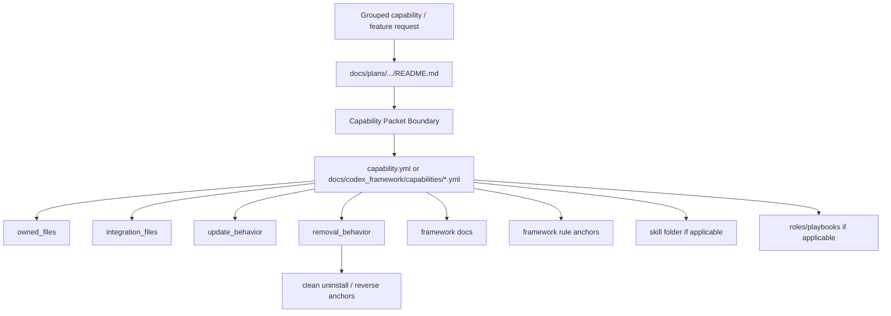
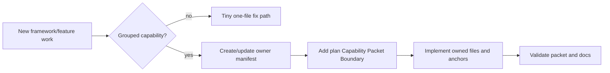
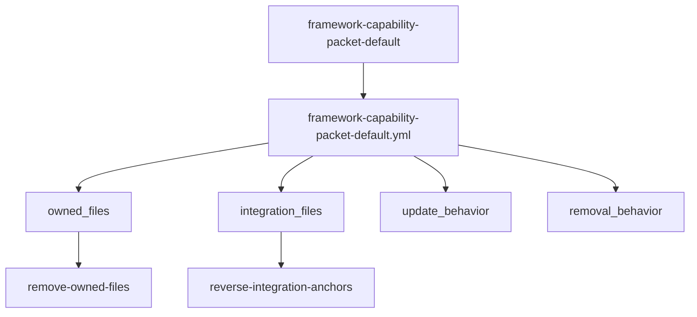

# Framework Capability Packet Default

## Summary

Make manifest-owned, removable capability packets the default pattern for
grouped capabilities, framework extensions, skill families, MCP stacks, and
feature families. This turns the current good precedent into an explicit
framework rule so future plans do not scatter instructions across the project.

## Capability Packet Boundary

| Field | Value |
|-------|-------|
| Capability identifier | `framework-capability-packet-default` |
| Owner manifest | `docs/codex_framework/capabilities/framework-capability-packet-default.yml` |
| Owned files | Owner manifest and this plan packet |
| Integration anchors | `docs/codex_framework/capability_introduction_checklist.md`, `docs/codex_framework/README.md`, `docs/codex_framework/partner_process.md`, `docs/codex_framework/plan-governance-dependencies.md`, `docs/plans/README.md`, `.cursor/rules/framework-plan-governance.mdc` |
| Update behavior | Update owned files and keep integration anchors short |
| Removal behavior | Remove owned files and reverse integration anchors; do not delete broad framework docs or rules |

## Key Changes

- Require grouped capabilities to define a capability manifest with
  `owned_files`, `integration_files`, `update_behavior`, and
  `removal_behavior`.
- Add plan guidance requiring `## Capability Packet Boundary` before
  grouped capability plans proceed to build/execute.
- Promote the pattern in framework docs and plan-governance rule surfaces.
- Preserve the tiny-fix exception: one-file fixes do not need a packet.

## Architecture/Structure Diagram

## Capability Routing Diagram

## Naming/Modeling Diagram

## Checklist

- [x] Update the capability introduction checklist with packet-boundary
  requirements.
- [x] Add framework README guidance naming capability packets as the default.
- [x] Update plan governance so grouped capability plans require a packet
  boundary before build/execute.
- [x] Add a manifest for this governance capability.
- [x] Add validation evidence in the plan verification receipt.

## Plan verification receipt

| ID | Obligation | Status | Evidence |
|----|------------|--------|----------|
| CP-1 | Capability introduction checklist requires manifest, owned files, integration files, update behavior, and removal behavior. | pass | `docs/codex_framework/capability_introduction_checklist.md` |
| CP-2 | Framework README names grouped capabilities as packet-owned instead of scattered edits. | pass | `docs/codex_framework/README.md` |
| CP-3 | Plan governance requires `## Capability Packet Boundary` before grouped capability build/execute. | pass | `docs/plans/README.md`; `.cursor/rules/framework-plan-governance.mdc` |
| CP-4 | This governance change has its own owner manifest. | pass | `docs/codex_framework/capabilities/framework-capability-packet-default.yml` |
| CP-5 | Existing MCP Research Collection Stack remains a valid example. | pass | `docs/codex_framework/capabilities/mcp-research-collection-stack.yml` keeps `owned_files`, `integration_files`, `update_behavior`, and `removal_behavior` |
| CP-6 | Existing manifest-backed skill remains a valid example. | pass | `.cursor/skills/container-orchestration-integration/capability.yml` keeps `owned_files` and `removal_behavior` |
| CP-7 | Transitional older skills are still allowed without claiming completion. | pass | `.cursor/skills/README.md` still states not every existing skill has a `capability.yml` yet |
| CP-8 | YAML validation passes for changed YAML files. | pass | `bin/codex-env python -c ...` parsed this manifest, MCP stack manifest, and container orchestration skill manifest |
| CP-9 | Static text checks locate the new packet-boundary requirement. | pass | `rg -n "Capability Packet Boundary|owned_files|integration_files|update_behavior|removal_behavior" docs/codex_framework docs/plans .cursor/rules/framework-plan-governance.mdc` |

Completion gate:

- [x] Plan body includes capability boundary, diagrams, checklist, and receipt.
- [x] Validation commands have passed.
- [x] No NetBox slice is required; this is framework governance only.

## Diagram gate receipt

- [x] Architecture/Structure: repo paths, data/control flow, packet ownership,
  and rule/doc organization shown.
- [x] Capability Routing: included.
- [x] Naming/Modeling: included for capability identifier and manifest fields.
- [x] Diagram Inventory lists every required section above, not only diagrams
  actually drawn.

## Sources Checked

- `.cursor/skills/README.md`: manifest-backed skill ownership and removal.
- `docs/codex_framework/capabilities/mcp-research-collection-stack.yml`: MCP
  stack capability packet precedent.
- `.cursor/skills/container-orchestration-integration/capability.yml`: skill
  family packet precedent.
- `docs/codex_framework/capability_introduction_checklist.md`: checklist gap
  before this implementation.
- `docs/codex_framework/plan-governance-dependencies.md`: plan governance
  entrypoint.

## Diagram Inventory

Included: Architecture/Structure, Capability Routing, Naming/Modeling.

Available later: capability removal sequence, integration-anchor reversal flow,
plan-promotion gate flow.
