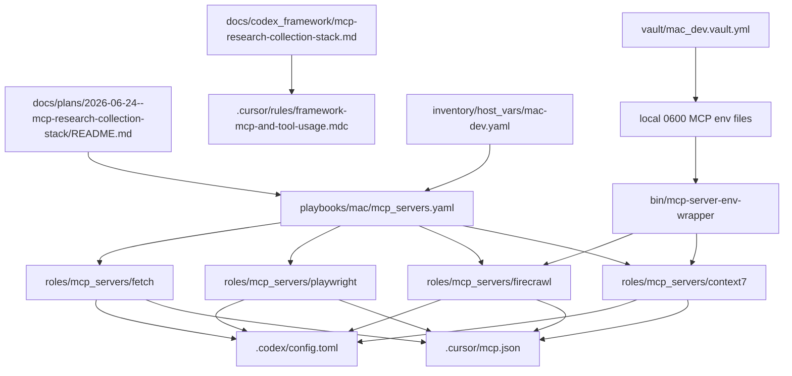
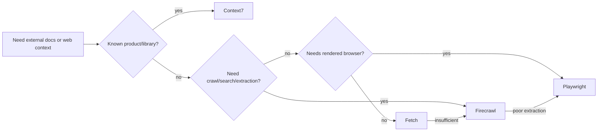
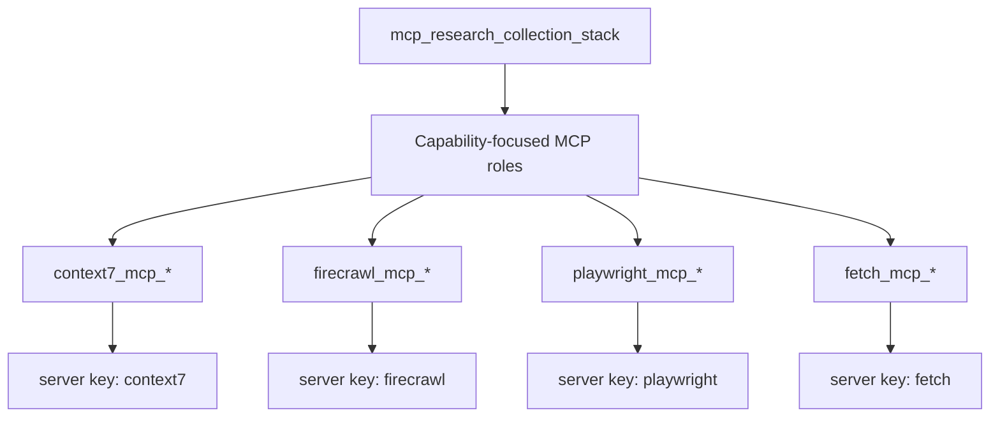

# MCP Research Collection Stack

## Summary

Implement a durable controller-local MCP capability named **MCP Research
Collection Stack** for documentation, web, and rendered-browser context
collection. The capability name describes the job rather than a vendor and keeps
the stack extensible for future research/fetch tools.

## Change contract

| Item | Contract |
|---|---|
| Apply | Run `playbooks/mac/mcp_servers.yaml` against `mac-dev` with tags `context7,firecrawl,playwright,fetch`. |
| Verify | Validate YAML/playbook syntax, lint the changed Ansible content, preview tasks, apply, rerun for idempotence, verify binaries, verify Cursor/Codex server keys, verify no plaintext API keys in tracked config, verify local secret env file modes. |
| Undo | Run the same playbook with the relevant `*_mcp_state=absent` variable for each role that should be removed. |
| Change class | Idempotent controller-local configuration management. |
| Lifecycle control | `context7_mcp_state`, `firecrawl_mcp_state`, `playwright_mcp_state`, and `fetch_mcp_state` use `present|absent`. |

## In-scope surfaces

| Surface | Path |
|---|---|
| Plan packet | `docs/plans/2026-06-24--mcp-research-collection-stack/README.md` |
| Framework guide | `docs/codex_framework/mcp-research-collection-stack.md` |
| Framework rule routing | `.cursor/rules/framework-mcp-and-tool-usage.mdc` |
| MCP role docs | `roles/mcp_servers/README.md`, `roles/mcp_servers/ai.mcp_servers.instructions.md` |
| Playbook | `playbooks/mac/mcp_servers.yaml` |
| Host desired state | `inventory/host_vars/mac-dev.yaml` |
| Roles | `roles/mcp_servers/context7`, `roles/mcp_servers/firecrawl`, `roles/mcp_servers/playwright`, `roles/mcp_servers/fetch` |
| Secret wrapper | `bin/mcp-server-env-wrapper`, `roles/mcp_servers/_shared/tasks/render_env_file.yml` |

## Capability routing

Use the stack in this order:

1. **Context7** for known products, libraries, APIs, SDKs, Terraform providers,
   Kubernetes docs, AWS docs, and vendor docs.
2. **Firecrawl** for documentation ingestion, crawl/search/extraction, or
   collecting pages from multiple sources.
3. **Playwright** when Firecrawl extraction quality is poor, login is required,
   JavaScript rendering is required, screenshots are useful, or browser state
   matters.
4. **Fetch** only as a lightweight fallback for simple pages.

| Purpose | Best Choice |
|---|---|
| General webpage fetching | Fetch |
| Documentation extraction | Firecrawl |
| Browser-rendered sites | Playwright |
| Technical docs / APIs | Context7 |

## Package research

| Server | Package manager | Package | Binary | Current probe result |
|---|---|---|---|---|
| Context7 | npm | `@upstash/context7-mcp` | `context7-mcp` | `npm view` reported version `3.2.2` and matching bin. |
| Firecrawl | npm | `firecrawl-mcp` | `firecrawl-mcp` | `npm view` reported version `3.21.4` and matching bin. |
| Playwright | npm | `@playwright/mcp` | `playwright-mcp` | `npm view` reported version `0.0.76` and matching bin. |
| Fetch | npm | `mcp-fetch-server` | `mcp-fetch-server` | `npm view` reported version `1.1.2` and matching bin. |
| Homebrew | brew | n/a | n/a | `brew search firecrawl context7 playwright mcp-fetch mcp-fetch-server` found no matching formulae or casks. |

## Secret model

`vault_firecrawl_mcp_api_key` and `vault_context7_mcp_api_key` are loaded from
`vault/mac_dev.vault.yml`. The API keys are rendered to local env files with
mode `0600` and are not written into tracked `.cursor/mcp.json` or
`.codex/config.toml`.

Local env files:

```text
~/.config/dotfile-vnext/mcp/env.d/firecrawl.env
~/.config/dotfile-vnext/mcp/env.d/context7.env
```

Tracked client config points at `bin/mcp-server-env-wrapper`, which sources the
local env file and then execs the upstream MCP server binary.

## Checklist

- [x] Add shared secret-safe MCP env wrapper and env-file renderer.
- [x] Add `roles/mcp_servers/context7`.
- [x] Add `roles/mcp_servers/playwright`.
- [x] Add `roles/mcp_servers/fetch`.
- [x] Harden `roles/mcp_servers/firecrawl` so secrets do not render into tracked client config.
- [x] Wire all four roles into `playbooks/mac/mcp_servers.yaml` with independent tags.
- [x] Enable commissioned desired state in `inventory/host_vars/mac-dev.yaml` for Cursor and Codex targets.
- [x] Add framework and MCP role documentation for the ordered routing model.
- [x] Validate YAML and playbook syntax with `bin/codex-env`.
- [x] Run `ansible-lint` on changed MCP roles.
- [x] Run task preview for `mac-dev` with tags `context7,firecrawl,playwright,fetch`.
- [ ] Apply the mac MCP playbook for the four role tags. Blocked for Context7/Firecrawl by empty vault keys.
- [ ] Rerun apply for idempotence. Passed for Playwright/Fetch; blocked for Context7/Firecrawl by empty vault keys.
- [ ] Verify npm binaries resolve. Passed for Playwright/Fetch; pending for Context7/Firecrawl after keys are set.
- [ ] Verify Cursor and Codex configs contain all four server keys and no plaintext API keys. Passed for Playwright/Fetch and secret scan; blocked for Context7/Firecrawl.
- [ ] Verify local secret env artifacts exist with mode `0600`. Blocked for Context7/Firecrawl by empty vault keys.

## Architecture/Structure Diagram



## Capability Routing Diagram



## Naming/Modeling Diagram



## Plan verification receipt

**Slice:** v1  
**Verified at:** 2026-06-24  
**Verifier:** Codex execution run

### Obligation inventory

| ID | Source | Obligation | In slice scope? | Status | Evidence |
|----|--------|------------|-----------------|--------|----------|
| O-01 | Change contract | Apply path exists through `playbooks/mac/mcp_servers.yaml` and four tags. | yes | pass | `playbooks/mac/mcp_servers.yaml` has `context7`, `firecrawl`, `playwright`, and `fetch` role tags. |
| O-02 | Change contract | Verify path covers syntax, lint, preview, apply, idempotence, binaries, config keys, secret hygiene, env-file mode. | yes | blocked | Syntax, task preview, changed-role lint, and playbook+role lint with pre-existing dependency exclusions passed. Playwright/Fetch apply/idempotence passed. Context7/Firecrawl blocked by empty vault keys. See `docs/reports/mcp_server_validations/research_collection_stack/README.md`. |
| O-03 | Change contract | Undo path exists through each role's `*_mcp_state=absent`. | yes | pass | Each role includes `tasks/absent.yml` and role README undo command. |
| O-04 | Checklist | Add shared secret-safe wrapper and env renderer. | yes | pass | `bin/mcp-server-env-wrapper`; `roles/mcp_servers/_shared/tasks/render_env_file.yml`. |
| O-05 | Checklist | Add Context7 role. | yes | pass | `roles/mcp_servers/context7` with npm package `@upstash/context7-mcp`. |
| O-06 | Checklist | Add Playwright role. | yes | pass | `roles/mcp_servers/playwright` with npm package `@playwright/mcp`. |
| O-07 | Checklist | Add Fetch role. | yes | pass | `roles/mcp_servers/fetch` with npm package `mcp-fetch-server`. |
| O-08 | Checklist | Harden Firecrawl secret rendering. | yes | pass | Firecrawl client entries use wrapper/env file; tracked config env contains only non-secret metadata. |
| O-09 | Checklist | Enable commissioned desired state on `mac-dev`. | yes | pass | `inventory/host_vars/mac-dev.yaml` sets all four states to `present` and targets to Cursor/Codex. |
| O-10 | Framework docs | Add ordered usage guidance for agents. | yes | pass | `docs/codex_framework/mcp-research-collection-stack.md`, `.cursor/rules/framework-mcp-and-tool-usage.mdc`, and MCP role docs updated. |
| O-11 | Package research | Prefer package management and confirm npm/brew availability. | yes | pass | `npm view` confirmed package/bin names; `brew search` found no matching formulae/casks. |
| O-12 | Diagram gate | Architecture/Structure, Capability Routing, Naming/Modeling, and Diagram Inventory are present. | yes | pass | Diagram sections below and Diagram gate receipt checked. |
| O-13 | Live preview | Run read-only task preview for `mac-dev` with the four tags. | yes | pass | `--list-tasks --tags context7,firecrawl,playwright,fetch` listed the four role task sets for `mac-dev`. |
| O-14 | Live apply | Apply the mac MCP playbook for the four tags. | yes | blocked | Full four-role apply stopped at Firecrawl assertion: `vault_firecrawl_mcp_api_key` empty. Context7 probe stopped at `vault_context7_mcp_api_key` empty. Playwright/Fetch apply passed with `changed=6`, `failed=0`. |
| O-15 | Idempotence | Rerun apply and verify no second-run changes. | yes | blocked | Playwright/Fetch rerun passed with `changed=0`, `failed=0`; Context7/Firecrawl pending non-empty vault keys. |
| O-16 | Runtime verification | Confirm npm binaries resolve and Cursor/Codex configs contain all four keys. | yes | blocked | `/Users/joshc/.nvm/versions/node/v20.20.0/bin/playwright-mcp` and `mcp-fetch-server` executable; Cursor/Codex contain `playwright` and `fetch`; Context7/Firecrawl pending non-empty vault keys. |
| O-17 | Secret verification | Confirm tracked configs have no plaintext API keys and env files are mode `0600`. | yes | blocked | Tracked `.cursor/mcp.json` and `.codex/config.toml` contain no secret key names. Context7/Firecrawl env files are absent because roles failed before rendering due empty vault keys. |

### Summary

- In-scope obligations: 17 — pass: 13, fail: 0, blocked: 4, pending: 0
- Deferred: 0

### Completion gate

- [ ] Every in-scope obligation is `pass` or `n/a` with reason.
- [ ] Change-contract Verify demonstrated for this slice with command output. Blocked for Context7/Firecrawl until non-empty vault keys are set.
- [x] `depends_on_plans` satisfied or not applicable.
- [x] No in-scope obligation skipped because it was not duplicated in the checklist.
- [x] No unresolved `On Deck` row remains.
- [x] Missing roles/playbooks/resources were researched and scaffolded where clear.
- [x] Dependency order is represented in executable Ansible entrypoints.
- [x] Exact candidate resources are supported by package-manager research or labeled appropriately.

## Diagram gate receipt

- [x] Architecture/Structure: repo paths, external resources, data/control flow, naming scheme, variable SSOT sources, tag/playbook wiring
- [x] Capability Routing: included
- [x] Naming/Modeling: included
- [x] Diagram Inventory lists every required section above, not only diagrams actually drawn

## Diagram Inventory

Included:

- Architecture/Structure Diagram
- Capability Routing Diagram
- Naming/Modeling Diagram

Available later:

- Secret-flow diagram
- Validation sequence diagram
- Client-config rendering diagram
