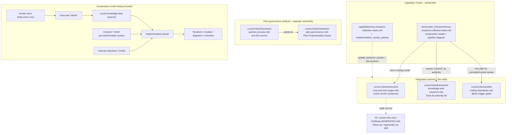
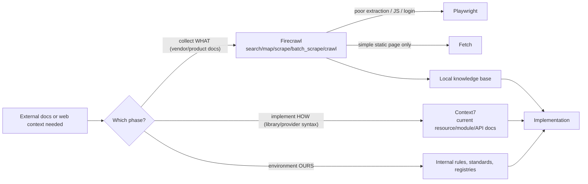

# Research Stack Composition Update

Update the MCP Research Collection Stack framework surfaces to replace either-or
tool routing with a confident phase-based composition model (Firecrawl = WHAT,
Context7 = HOW, internal docs = OURS), wire Context7/Firecrawl into the
enforcement gates that actually drive agent behavior, and close the
"spirit-of-the-rule" proportionality loophole in plan governance.

`scope: doc-only` is explicit: every change is a markdown/mdc/yml documentation
or rule edit. No roles, playbooks, inventory, hosts, or runtime surfaces change.

## Problem

Observed in a live session (2026-07-01, Zerto CMK documentation work):

1. The capability doc `docs/codex_framework/mcp-research-collection-stack.md`
   frames tool choice as a decision tree with one winner. Context7's
   implementation-phase role exists only as a trailing sentence in the Vendor
   Documentation Example. The agent reproduced that framing as "Context7 stays
   on the bench" — wrong emphasis for a workflow where Firecrawl collects the
   vendor requirements and Context7 supplies implementation syntax later in the
   same effort.
2. Context7/Firecrawl are absent from the enforcement gates that drive agent
   behavior: the `@doc` trigger gates in `ansible-coding-standards.mdc`, the
   Track B authority list in `framework-knowledge-and-research.mdc`, and the
   generated MCP briefing. What gates mandate is treated as normal; everything
   else feels optional. That produces reluctance.
3. Separate governance gap surfaced in the same session: the agent reasoned
   about the "spirit" of plan governance to suggest skipping packet ceremony
   for a small slice. No written clause prohibits agent-side proportionality
   downgrades. The user directed that the downgrade decision be explicitly and
   exclusively user-owned.

## Changes

### 1. Rewrite the capability doc's routing model as a composition model

In `docs/codex_framework/mcp-research-collection-stack.md` (the capability
owner per its manifest):

- Add a `## Composition Model — WHAT / HOW / OURS` section near the top, ahead
  of per-tool routing:
  - **Firecrawl** answers "what does the vendor/product require?" (ingestion)
  - **Context7** answers "how do I correctly use this library/provider/module
    to implement it?" (implementation syntax)
  - **Internal docs/rules** answer "how do we implement this in our
    environment?" (standards)
- Add the pipeline diagram: vendor docs → Firecrawl → local knowledge base →
  implementation phase pairing Context7 + internal standards → generated
  Terraform/Ansible/diagrams/docs.
- Recast routing as *phase* routing, not tool competition. Keep the Firecrawl
  escalation ladder (search/map/scrape/batch_scrape/crawl, Playwright fallback)
  unchanged.
- Rewrite the Vendor Documentation Example so the Context7 implementation-phase
  step is a numbered, co-equal stage — not a footnote. Keep Zerto as the worked
  example.
- Add affirmative default triggers: when generating Terraform/Ansible/SDK code
  from collected vendor docs, call Context7 for the exact resources/modules by
  default — no permission-seeking. Calibration note: skip Context7 where model
  knowledge is stable and syntax churn is low (Mermaid example).
- Add a paired-use prompt pattern to Agent Prompt Patterns.

### 2. Thin anchor update in the router rule

In `.cursor/rules/framework-mcp-and-tool-usage.mdc`, update the Research
Collection Stack anchor paragraph (1–2 sentences only, per the manifest's
`update_behavior`): collection tools and implementation-syntax tools are used
together in one workflow, not as alternatives.

### 3. Wire Context7/Firecrawl into the enforcement gates

- `.cursor/rules/framework-knowledge-and-research.mdc` Track B: list Context7
  alongside registered `@doc` sources as an authority for current
  module/provider/library syntax.
- `.cursor/rules/ansible-coding-standards.mdc` `@doc` Trigger Gates: Context7
  is an accepted live path for provider and collection syntax when a registered
  `@doc` is stale or missing; Firecrawl is the collection path for
  vendor/product docs not covered by registered handles.

### 4. Manifest touch-up

In `docs/codex_framework/capabilities/mcp-research-collection-stack.yml`: add
`implementation_syntax_pairing` to `capabilities` so the composition behavior
is machine-visible.

### 5. Plan proportionality — user-owned downgrade (loophole closer)

In `.cursor/rules/framework-plan-governance.mdc`, add a short
`## Plan Proportionality — User-Owned Downgrade` section:

- Full packet governance is the default for every approved plan, regardless of
  size.
- Spirit-of-the-rule, size, effort, or scope reasoning is never a valid
  agent-side basis for skipping a governance step.
- The agent may surface the lightweight option once, briefly, when objective
  signals are present: docs-only change, single capability packet touched, no
  host/runtime mutation, no cross-plan dependencies, completable in one
  session.
- Only an explicit user statement in the current thread authorizes the
  downgrade; the final summary must record that it was user-authorized.

Add a one-line anchor in `.cursor/rules/framework-partner-process.mdc`
(Planning Surface section) pointing at the governance clause. Both additions
stay short so they do not overtake the documents.

### 6. Follow-up (separate slice, not this plan)

Regenerate `.cursor/rules/02--cussorrules-mcp-briefieng-GENERATED.mdc` via the
`generate-mcp-briefing` skill so context7/firecrawl/playwright/fetch appear
with "call when" triggers. Deferred because it is a generated file owned by
that skill's pipeline. Tracked here as `moved_to_plan: follow-up slice`, out of
this plan's completion scope.

## Checklist

- [x] C1 Capability doc composition rewrite (`mcp-research-collection-stack.md`)
- [x] C2 Router rule thin anchor (`framework-mcp-and-tool-usage.mdc`)
- [x] C3a Track B authority wiring (`framework-knowledge-and-research.mdc`)
- [x] C3b `@doc` trigger gate wiring (`ansible-coding-standards.mdc`)
- [x] C4 Manifest capability row (`mcp-research-collection-stack.yml`)
- [x] C5a Proportionality clause (`framework-plan-governance.mdc`)
- [x] C5b Partner-process anchor (`framework-partner-process.mdc`)
- [x] V1 Re-read all edited files; confirm capability-packet boundary respected
      (content in capability doc, thin anchors in rules)
- [x] V2 Confirm no gate contradicts another (Track B vs @doc gates vs stack doc)

## Capability Packet Boundary

| Field | Value |
|-------|-------|
| Capability identifier | `mcp_research_collection_stack` (existing capability being updated) |
| Owner manifest | `docs/codex_framework/capabilities/mcp-research-collection-stack.yml` |
| Owned files | Per manifest `owned_files`; this plan edits `mcp-research-collection-stack.md` and the manifest itself |
| Integration anchors | Per manifest `integration_files`; this plan edits `framework-mcp-and-tool-usage.mdc` (listed) and extends anchors into `framework-knowledge-and-research.mdc` and `ansible-coding-standards.mdc` (gate wiring) |
| Update behavior | `update-owned-files-and-integration-anchors` — content changes land in the capability doc; rule edits stay thin router/authority anchors |
| Removal behavior | Unchanged from manifest; new gate anchors must be reversed if the stack is removed |

Note: changes C5a/C5b (plan proportionality) are plan-governance surfaces, not
part of the MCP stack capability packet. They are governed by
`framework-plan-governance.mdc` ownership, not the stack manifest.

## On Deck — user decisions to integrate

| ID | User decision / direction | Target integration | Status |
|----|---------------------------|--------------------|--------|
| OD-1 | Proportionality downgrade is 100% explicitly the user's call; update guidance to make that the case | Change 5 (C5a/C5b) | integrated |
| OD-2 | Options may be expressed briefly in plans but must not overtake the document | Change 5 wording constraint | integrated |
| OD-3 | Agent should remind user they can explicitly request a smaller implementation | Change 5 surfacing rule | integrated |
| OD-4 | Build with no downgrade; preserve this plan's content durably | This packet (change 6 of conversational plan) | integrated |

## Apply / Verify / Undo / Change class

- **Apply:** markdown/mdc/yml edits to the seven files above, plus this packet.
- **Verify:** re-read edited files; confirm the manifest's owned-files/anchor
  boundary is respected; confirm no gate contradicts another; plan verification
  receipt below.
- **Undo:** git revert of the doc edits and packet.
- **Change class:** idempotent documentation/rule configuration; no host or
  runtime changes.

## Architecture/Structure Diagram

## Capability Routing Diagram

## Naming/Modeling Diagram

N/A — this plan changes no object names, aliases, hierarchy, NetBox metadata,
or naming standards. The capability identifier `mcp_research_collection_stack`
and all server keys remain unchanged.

## Diagram gate receipt

- [x] Architecture/Structure: repo paths, capability-packet vs anchor vs
      governance ownership, data/control flow of the composition pipeline;
      no variable SSOT or playbook wiring changes in scope (doc-only)
- [x] Capability Routing: included (phase-based routing being encoded)
- [x] Naming/Modeling: N/A with reason (no names, aliases, hierarchy, or
      naming standards change)
- [x] Diagram Inventory lists every required section

## Plan verification receipt

Obligation inventory (executed 2026-07-01):

| ID | Obligation | Status | Evidence |
|----|------------|--------|----------|
| C1 | Capability doc composition rewrite | pass | `mcp-research-collection-stack.md`: new `## Composition Model — WHAT / HOW / OURS` section with pipeline mermaid + "Default triggers — act without asking"; `## Routing Model` recast as `## Phase Routing`; Vendor Documentation Example rewritten as Stage 1 (Firecrawl, steps 1–6) / Stage 2 (Context7, steps 7–8) with concrete IAM/KMS example; paired-use prompt pattern added; end Capability Routing diagram replaced with phase-based flow. Placement note: section sits where the old Routing Model sat (after Removal Path), satisfying "ahead of per-tool routing"; the doc was not restructured beyond that. |
| C2 | Router rule thin anchor | pass | `framework-mcp-and-tool-usage.mdc`: two added sentences under the stack anchor — composition within one workflow; "Do not bench a stack tool for the task just because it is wrong for the current phase." Ownership prose still points at capability doc/manifest. |
| C3a | Track B authority wiring | pass | `framework-knowledge-and-research.mdc` Track B now 5 items: item 2 adds Context7 as co-equal authority for current library/provider/collection syntax; item 3 adds Firecrawl-collected vendor docs; training knowledge remains last resort. |
| C3b | `@doc` trigger gate wiring | pass | `ansible-coding-standards.mdc`: paragraph "Research collection stack as live @doc path" appended after the trigger-gate table — Context7 accepted live path when handle stale/missing; Firecrawl for uncovered vendor docs; routing model cross-reference. |
| C4 | Manifest capability row | pass | `mcp-research-collection-stack.yml` `capabilities` list now includes `implementation_syntax_pairing`. |
| C5a | Proportionality clause in plan governance | pass | `framework-plan-governance.mdc`: new `## Plan Proportionality — User-Owned Downgrade` section — default full governance, spirit-of-the-rule reasoning invalid, surface-once rule with objective signals, explicit in-thread user authorization only, user-authorization recorded in final summary. |
| C5b | Partner-process anchor line | pass | `framework-partner-process.mdc` Planning Surface: three-line anchor pointing at the governance clause; "The agent may surface the option once; it never exercises it." |
| V1 | Boundary check (content in capability doc, thin rule anchors) | pass | Re-read all edited files post-edit. Content-bearing changes are in the capability doc + manifest (owned files); rule edits are 2–8 line anchors. C5a/C5b are plan-governance surfaces outside the stack packet, as declared in Capability Packet Boundary. |
| V2 | Gate consistency check | pass | Track B ordering (MCP tools → @doc+Context7 → Firecrawl-collected → rules → training) is consistent with the @doc gate addition ("accepted live path... when stale or missing") and with the stack doc's phase model. No gate mandates Context7 where another prohibits it. Linter: no errors on all 8 files. |
| F1 | MCP briefing regeneration | deferred | moved_to_plan: follow-up slice (generated file, owned by generate-mcp-briefing skill); out of this plan's completion scope with user visibility in conversational plan change 7 |

Completion gate:

- [x] All in-scope rows `pass` with evidence
- [x] On Deck rows all `integrated`
- [x] No `blocked`/`pending` rows remaining in scope (F1 is `deferred` via moved_to_plan, out of scope)

Lifecycle note: `lifecycle: implemented` set with receipt above. Folder rename
to `-implemented` suffix, GitHub tracking issue, and commit are available via
the `complete-plan-lifecycle` skill on request — GitHub/commit operations were
not user-requested in the executing session.

## Diagram Inventory

### Diagrams Included
- **Architecture/Structure Diagram**: edited file surfaces, ownership split
  (capability packet / integration anchors / plan-governance surfaces), and the
  composition pipeline being encoded.
- **Capability Routing Diagram**: phase-based WHAT/HOW/OURS routing flow.
- **Naming/Modeling Diagram**: N/A with explicit reason.

### Additional Diagrams Available On Request
- **Sequence Diagram**: agent tool-call ordering for a Firecrawl-then-Context7 task.
- **State Transition Diagram**: plan lifecycle states for this packet.
- **Deployment Flow**: N/A — no deployment in scope.
