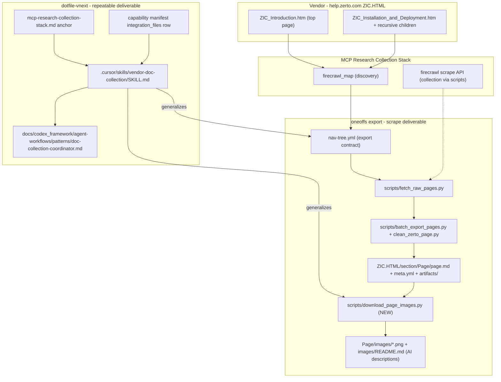
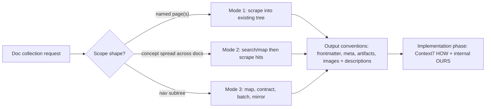

# Vendor Doc Collection — Zerto Tree Offload + Repeatable Skill

Two deliverables:

- **A. The scrape** — complete the ZIC vendor-doc tree offload (Introduction top
  page + full Installation and Deployment branch, recursively) into the existing
  export structure at
  `oneoffs/issue/ca-3081-zerto/docs/reference/export/`, upgraded with a local
  image + AI-description convention.
- **B. The repeatable capability** — a portable `vendor-doc-collection` skill in
  this repo, wired to the MCP Research Collection Stack, plus a reusable
  coordinator/worker agent-workflow doc, so scoped doc offloads are repeatable
  at any scope (single page, concept collection, full tree).

Explicit boundary: **not a full webcrawl.** Collection is nav-tree-contract
scoped. `firecrawl_crawl` only with explicit limits and user awareness.

## Problem

The Zerto export is a good reference library but incomplete (Installation
branch `partial`: License Management, Upgrading, Keycloak reset pending;
Introduction top page out of scope) and images remain vendor URLs — not local,
not AI-searchable. The collection procedure exists only as project-local
scripts + conventions in oneoffs; nothing in the framework makes it repeatable
for the next vendor or the next scope shape.

## Stages

### Stage 0 — Discovery (read-only)

`firecrawl_map` on `help.zerto.com/bundle/ZIC.HTML` to resolve exact slugs for
the Introduction top page and all recursive Installation and Deployment
children. Record resolved scope in `nav-tree.yml` before scraping
(contract-first).

### Stage 1 — Scrape and export (oneoffs)

1. Update `nav-tree.yml`: Introduction top page in scope; installation children
   statuses maintained.
2. Fetch raw markdown per page via `scripts/fetch_raw_pages.py` (Firecrawl API,
   cached with `maxAge`).
3. Extend `scripts/batch_export_pages.py` PAGES; run clean/export; run
   `extract_sidecar_json.py` where pages carry right-rail JSON.
4. Result: every tree node exists as `ZIC.HTML/.../<Page>/page.md` with
   frontmatter (`source_url`, `page_slug`, `exported_at`) + `meta.yml`.

### Stage 2 — Image convention (new)

- New `scripts/download_page_images.py`: parse `page.md` for vendor image URLs,
  download to `<page-folder>/images/`, rewrite links relative, idempotent.
- AI image descriptions per page folder: `images/README.md` — filename, what is
  visible (fields, values, console location), purpose in doc flow.
- Apply to new pages AND backfill already-exported pages.
- Update export `README.md` conventions (replace "screenshots stay as vendor
  URLs").

### Stage 3 — Repeatable framework skill (this repo)

`.cursor/skills/vendor-doc-collection/SKILL.md` with three operation modes:

- Mode 1 — small scope: named page(s) → scrape into existing export tree
- Mode 2 — concept collection: concept spread across docs → search/map then
  scrape hits
- Mode 3 — full tree offload: nav subtree → map, contract, batch scrape, mirror
  hierarchy

Skill encodes: output conventions (nav-tree contract, folder mirror,
frontmatter, meta, artifacts/, images/ + descriptions), image pipeline,
WHAT/HOW/OURS composition pointer to
`docs/codex_framework/mcp-research-collection-stack.md`, the not-a-webcrawl
boundary, and generic script templates. Reference implementation: the oneoffs
export.

Wiring: one-line skill anchor in `mcp-research-collection-stack.md`; row in the
capability manifest `integration_files`.

### Stage 3b — Reusable agent workflow (AGENTS.md §31)

`docs/codex_framework/agent-workflows/patterns/doc-collection-coordinator.md`:
coordinator + per-page workers pattern per the delegation model below.

### Stage 4 — Verification

All tree nodes present with frontmatter; image links resolve locally; images/
dirs have descriptions; nav-tree statuses accurate; skill dry-run against one
already-exported page; receipt below.

## Delegation model (coordinator + cheap-lane workers)

| Work | Executor | Rationale |
|---|---|---|
| Firecrawl map/scrape, raw file writes | Scripts driven by coordinator | Deterministic; keeps MCP/network out of workers |
| Nav-tree contract decisions | Coordinator (strong model) | Export's authority surface |
| Per-page conformance pass | Cheap lane workers, parallel | Template-following, independent units |
| Image download + link rewrite | Script + cheap lane driver | Mechanical |
| Image descriptions | Mid-tier multimodal minimum; coordinator samples | Wrong descriptions poison RAG |
| Skill authoring, workflow doc, receipts, QA | Coordinator (strong model) | Highest-IQ artifacts |

Constraint: readonly subagents have no MCP access — all MCP/network stays in
coordinator + scripts; workers process files on disk only.

## Checklist

- [x] S0 Discovery: resolved slug list for Introduction top page + Installation branch
- [x] S1a nav-tree.yml contract updated
- [x] S1b All in-scope pages exported with frontmatter + meta (License, Upgrading, Keycloak reset, Installation hub, Introduction)
- [x] S2a download_page_images.py written; new pages' images localized
- [x] S2b Image descriptions for new pages; backfill existing pages
- [x] S2c Export README conventions updated
- [x] S3 vendor-doc-collection skill built + stack doc anchor + manifest row
- [x] S3b agent-workflows doc created
- [x] V1 Tree completeness check (every nav-tree in-scope node has page.md)
- [x] V2 Image link resolution + description coverage check
- [x] V3 Skill dry-run against one existing page

## Capability Packet Boundary

| Field | Value |
|-------|-------|
| Capability identifier | `vendor_doc_collection` (skill capability, composes with `mcp_research_collection_stack`) |
| Owner manifest | This packet (skill family is doc-owned; no Ansible manifest — controller-local skill) |
| Owned files | `.cursor/skills/vendor-doc-collection/**`, `docs/codex_framework/agent-workflows/patterns/doc-collection-coordinator.md`, this packet |
| Integration anchors | `docs/codex_framework/mcp-research-collection-stack.md` (skill anchor line), `docs/codex_framework/capabilities/mcp-research-collection-stack.yml` (`integration_files` row) |
| Update behavior | Update skill + workflow doc as a unit; keep stack-doc anchor to one line |
| Removal behavior | Delete owned files; remove the anchor line and manifest row; oneoffs export content is project data, not part of this capability |

## On Deck — user decisions to integrate

| ID | User decision / direction | Target integration | Status |
|----|---------------------------|--------------------|--------|
| OD-1 | Not a full webcrawl; scoped tree/concept/page offloads only | Boundary statement + skill modes | integrated |
| OD-2 | Image handling: download as files + AI descriptions (both patterns) | Stage 2 | integrated |
| OD-3 | Repeatability via skill(s) + framework wiring | Stage 3 | integrated |
| OD-4 | Coordinator + cheaper-model delegation adopted | Delegation model + Stage 3b | integrated |
| OD-5 | Build out the scrape in the oneoffs export location | Stage 1/2 target paths | integrated |

## Apply / Verify / Undo / Change class

- **Apply:** firecrawl MCP calls (read-only web), files in oneoffs export tree,
  skill + workflow doc + anchors in dotfile-vnext.
- **Verify:** Stage 4 checks; per-page spot-read vs vendor page; receipt below.
- **Undo:** git revert in both repos; scraped content is additive.
- **Change class:** idempotent documentation collection + framework capability
  addition; no hosts, no runtime.

## Architecture/Structure Diagram

## Capability Routing Diagram

## Naming/Modeling Diagram

N/A — no NetBox objects, naming-schema codes, or object hierarchy change. Skill
and workflow names follow existing kebab-case skill conventions
(`vendor-doc-collection`, `doc-collection-coordinator`).

## Diagram gate receipt

- [x] Architecture/Structure: repo paths (both repos), external vendor resource,
      data/control flow, script/contract organization; no inventory/tag wiring
      (doc + skill scope)
- [x] Capability Routing: included (three-mode routing)
- [x] Naming/Modeling: N/A with reason
- [x] Diagram Inventory lists every required section

## Plan verification receipt

Executed 2026-07-01. Export root:
`oneoffs/issue/ca-3081-zerto/docs/reference/export/` ("export root" below).

| ID | Obligation | Status | Evidence |
|----|------------|--------|----------|
| S0 | Discovery slug list | pass | `firecrawl_map` returned only exact pages (Zoomin portal, no sitemap); fallback per skill: nav links parsed from scraped hub page `_raw/ZIC_Installation_and_Deployment.raw.md` — full left-nav tree confirmed; Installation children = Prerequisites (+IAM child), Deploying, Connecting, License_Management, Upgrading_Zerto_In-Cloud, Resetting_ZIC_User_Password_Keycloak |
| S1a | nav-tree contract updated | pass | `nav-tree.yml`: introduction branch `partial` with `ZIC_Introduction` node `exported`; installation branch `exported` with all 3 formerly-pending children `exported` + export paths |
| S1b | In-scope pages exported | pass | fetch output: `wrote ZIC_Introduction.raw.md (13224 chars)`, `License_Management.raw.md (14087)`, `Upgrading_Zerto_In-Cloud.raw.md (17401)`; Keycloak page failed JS-hydration (164-char stub), re-scraped via MCP `waitFor: 8000, maxAge: 0` -> full body; batch export output: `exported ZIC.HTML/01-Introduction/ZIC_Introduction` + 3 more; frontmatter check: 0 pages missing frontmatter |
| S2a | Image script + localization | pass | `scripts/download_page_images.py` written; run output: `TOTAL: 27 downloaded, 27 links localized` + 6 Keycloak = 33 PNGs on disk (`find ... -name '*.png' | wc -l` = 33); idempotence re-run: `TOTAL: 0 downloaded, 0 links localized` |
| S2b | Image descriptions + backfill | pass | 3 parallel mid-tier multimodal workers (files-on-disk only, per delegation model); coverage check: 9/9 `images/` dirs have README, 33/33 images described (`## sections == png count` for every dir); coordinator QA sample: Keycloak `002-*.png` description verified against actual image (URL `10.179.72.183`, realms Keycloak/Zerto/Zssp, Create realm button all match); CMK page transcribed real key ARN `arn:aws:kms:eu-central-1:190366208080:key/mrk-00f1...` |
| S2c | Export README conventions | pass | export root `README.md`: images-local convention replaces "screenshots stay as vendor URLs"; status table updated to 2026-07-01; regenerate runbook gains image step + slug filter + waitFor note; `ZIC.HTML/README.md` TOC updated (01-Introduction section, full 02 branch, images row) |
| S3 | Skill + anchors | pass | `.cursor/skills/vendor-doc-collection/SKILL.md` (3 modes, output contract, pipeline, delegation, script templates, not-a-webcrawl boundary); anchor added to `docs/codex_framework/mcp-research-collection-stack.md` (Firecrawl Collection Shape section); manifest row added to `capabilities/mcp-research-collection-stack.yml` `integration_files` |
| S3b | Agent-workflow doc | pass | `docs/codex_framework/agent-workflows/patterns/doc-collection-coordinator.md` (schema-conformant: roles, gates, parallel/serialized, completion + failure rules, status `trial`); registry README pattern list updated |
| V1 | Tree completeness | pass | contract-vs-disk script: 11 exported nodes with export_path, `missing page.md: none`; full inventory = 19 `page.md` files covering Introduction top page + entire Installation branch + prior member/scale/tag pages |
| V2 | Image resolution + description coverage | pass | `rg '!\[..\](https?://)'` across tree: no unlocalized vendor image links (provenance kept in HTML comments); 9/9 dirs description coverage above |
| V3 | Skill dry-run | pass | regenerate-one-page path exercised end-to-end on `Resetting_ZIC_User_Password_Keycloak`: fetch -> stub detected -> MCP waitFor re-scrape -> slug-filtered re-export (other pages untouched) -> image localization -> descriptions |

Completion gate:

- [x] All in-scope rows `pass` with evidence
- [x] On Deck rows all `integrated`
- [x] No `blocked`/`pending` rows remaining in scope

## Diagram Inventory

### Diagrams Included
- **Architecture/Structure Diagram**: both repos, vendor source, pipeline flow
- **Capability Routing Diagram**: three-mode skill routing
- **Naming/Modeling Diagram**: N/A with explicit reason

### Additional Diagrams Available On Request
- **Sequence Diagram**: map → contract → scrape → images pipeline ordering
- **Deployment Flow**: N/A — no deployment in scope
