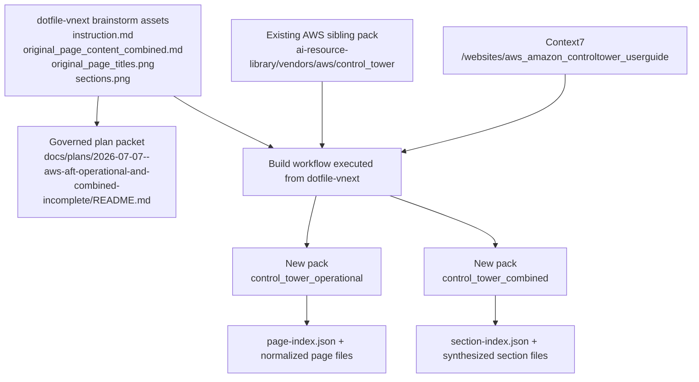
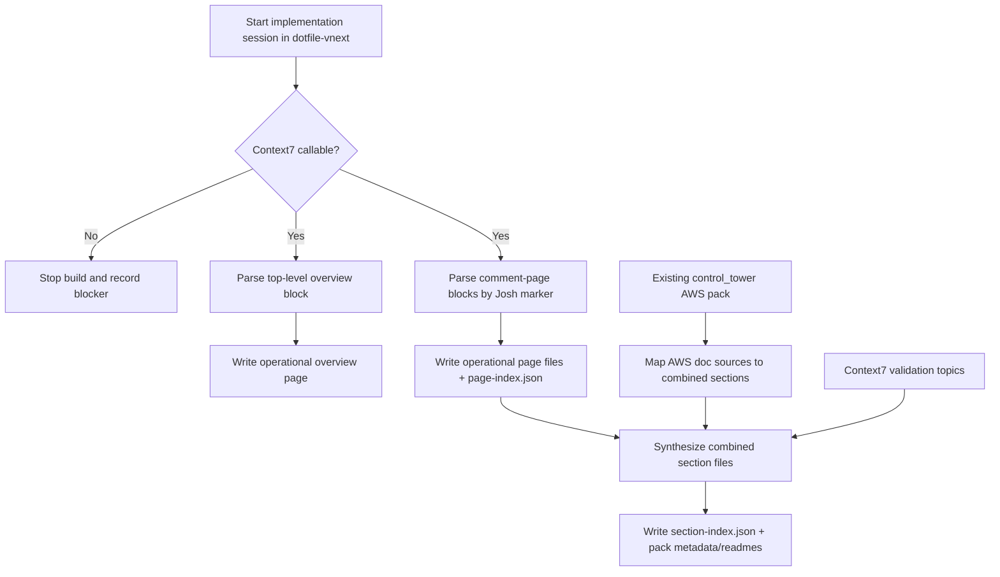
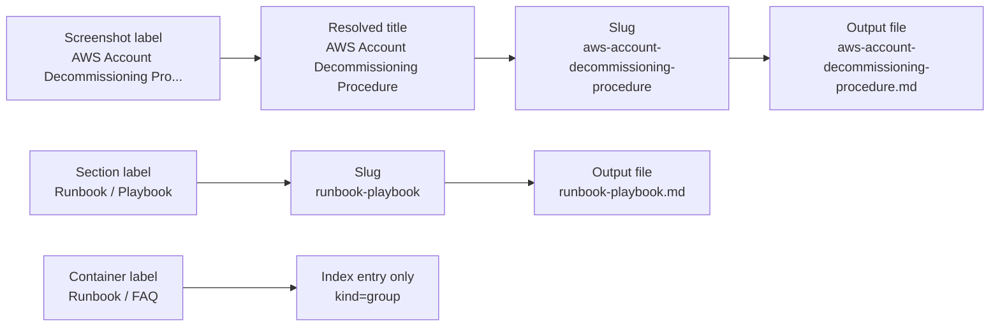

# AWS AFT Operational And Combined Pack Build

## Summary

Promote the current brainstorm into a governed plan packet under `docs/plans/` and implement two new AWS AFT packs in the sibling AI library:

- `/Users/joshc/develop/ai-resource-library/vendors/aws/control_tower_operational`
- `/Users/joshc/develop/ai-resource-library/vendors/aws/control_tower_combined`

Execution is anchored in `dotfile-vnext`, the brainstorm file remains source input only, the existing sibling `control_tower` pack remains the AWS vendor source pack, and the real build root is locked to `/Users/joshc/develop/ai-resource-library/vendors/aws`.

## Capability Packet Boundary

| Field | Value |
|-------|-------|
| Capability identifier | `aws_aft_operational_and_combined_vendor_packs` |
| Owner manifest | None exists today; this packet governs a documentation build rather than a new repo capability manifest |
| Owned files | This packet under `docs/plans/2026-07-07--aws-aft-operational-and-combined-incomplete/README.md`; new artifacts under `ai-resource-library/vendors/aws/control_tower_operational` and `ai-resource-library/vendors/aws/control_tower_combined` |
| Integration anchors | `dotfile-vnext` brainstorm assets, sibling `ai-resource-library/vendors/aws/control_tower`, Context7 library `/websites/aws_amazon_controltower_userguide` |
| Update behavior | Re-runnable regeneration of the two new packs without restructuring the existing `control_tower` pack |
| Removal behavior | Delete the two new pack directories and this plan packet; leave the existing `control_tower` pack untouched |

## Source materials

- Brainstorm reference only: `docs/brainstorming_designs/2026-06-07--external-use-aft-operational-doc/plan-aws-control-tower-operational-and-combined.md`
- Source instruction: `docs/brainstorming_designs/2026-06-07--external-use-aft-operational-doc/instruction.md`
- OneNote export: `docs/brainstorming_designs/2026-06-07--external-use-aft-operational-doc/original_page_content_combined.md`
- Screenshot references: `original_page_titles.png`, `sections.png`
- AWS vendor dependency: `/Users/joshc/develop/ai-resource-library/vendors/aws/control_tower`

## Key changes

- Create a governed packet at `docs/plans/2026-07-07--aws-aft-operational-and-combined-incomplete/README.md` with the implementation contract, diagrams, and verification receipt.
- Retain the pack-regeneration helper at `docs/plans/2026-07-07--aws-aft-operational-and-combined-incomplete/build_aft_packs.py` so the extraction/synthesis path remains with the packet.
- Keep the brainstorm markdown as source material only; do not execute from it as the canonical plan.
- Lock the build output root to `/Users/joshc/develop/ai-resource-library/vendors/aws`.
- Build `control_tower_operational` with the required README, metadata, page index, overview page, and nine operational page files.
- Build `control_tower_combined` with the required README, metadata, section index, and eight synthesized section files.
- Record Context7 library id, query topics, and purpose in both new pack READMEs and metadata files.
- Treat Context7 reachability as a hard build gate.

## Operational extraction contract

- Top export block: lines `1-171` of `original_page_content_combined.md` become `aft-overview-architecture-and-components.md`.
- Comment-page parsing rule: each operational page begins at `- Josh Castillo:`, uses the next nonblank line as its title, and ends immediately before the next `- Josh Castillo:` marker.
- Screenshot title truncation is resolved into exact titles and recorded in `page-index.json`.
- `Runbook / FAQ` is hierarchy metadata only and is recorded as a `group` entry, not emitted as its own page.
- Source-linked diagrams remain remote links only.
- Malformed regions are annotated explicitly, especially the table-wrapped vulnerability-remediation export and the malformed include/exclude example in the scale-runbook page.

## Combined section contract

Required files:
- `overview.md`
- `update-process.md`
- `architecture.md`
- `runbook-playbook.md`
- `security.md`
- `disaster-recovery-multi-region-concerns.md`
- `monitoring-and-alerting.md`
- `costs.md`

Excluded files:
- `key-contacts.md`
- `cmdb-application-service-cis-created.md`
- `documentation-reviewed-and-updated.md`

Every combined file must use this structure:
- `# <Section Title>`
- `## Summary`
- `## Bread operational guidance`
- `## AWS vendor guidance`
- `## Source map`
- `## Gaps and open questions`

## Context7 gate

- Probe result: pass
- Library id: `/websites/aws_amazon_controltower_userguide`
- Query timestamp: `2026-07-08T00:11:05Z`
- Topics:
  - Overview of AWS Control Tower Account Factory for Terraform (AFT)
  - Configure AFT with Existing VPC
  - Provision and update accounts using automation
  - Account Factory for Terraform (AFT) troubleshooting guide
  - Resource considerations for AWS Control Tower Account Factory for Terraform
- Purpose: Validate that the sibling AWS source pack should stay anchored to the AWS Control Tower user guide surface and confirm topic names for overview, architecture, provisioning, troubleshooting, VPC, and cost-oriented sections.

## Checklist

- [x] P1 Create the governed packet under `docs/plans/...`
- [x] P2 Encode the source-root correction so outputs land in the sibling AI library instead of `dotfile-vnext`
- [x] P3 Build `control_tower_operational` files and `page-index.json`
- [x] P4 Build `control_tower_combined` files and `section-index.json`
- [x] P5 Record Context7 evidence and topic usage in the new packs
- [x] V1 Verify screenshot-label mapping and hierarchy/group handling
- [x] V2 Verify every required output file exists and every index entry points at an existing file
- [x] V3 Verify every combined section includes the required body subsections
- [x] V4 Verify malformed-source handling is explicit and diagrams remain source-linked only

## Apply / Verify / Undo / Change class

- Apply: write this plan packet plus the new operational and combined pack artifacts.
- Verify: confirm file existence, index coverage, required section structure, and provenance/Context7 records.
- Undo: delete the two new pack directories and this packet; preserve the sibling `control_tower` pack.
- Change class: deterministic documentation extraction and synthesis; no infrastructure mutation.

## Architecture/Structure Diagram

## Capability Routing Diagram

## Naming/Modeling Diagram

## Test plan

- Verify the governed plan packet satisfies the repo diagram checklist and capability packet boundary requirements.
- Verify the implementation writes pack outputs only under `/Users/joshc/develop/ai-resource-library/vendors/aws/...`.
- Verify every screenshot page label maps exactly once in `page-index.json`, with truncated labels resolved and documented.
- Verify `aft-overview-architecture-and-components.md` comes only from the top export block.
- Verify all required operational and combined files exist and every index entry points to an existing file.
- Verify every combined section includes all five required body subsections plus the title.
- Verify sparse sections are present and call out thin coverage explicitly.
- Verify README/metadata provenance records the OneNote exports, sibling `control_tower` dependency, Context7 library id, and the exact query topics used.
- Verify diagrams remain source-linked only; no local image-download artifact path appears in this slice.
- Verify malformed operational content preserves commands and intent after normalization.

## Assumptions

- The authoritative plan now lives in this packet, not only in the brainstorm folder.
- The correct output root is the sibling AI library under `/Users/joshc/develop/ai-resource-library/vendors/aws`.
- Lowercase slug filenames remain the required naming style for new pack files and index references.
- Existing `control_tower_operational` and `control_tower_combined` directories are treated as target directories, not source-of-truth inputs.
- Diagram handling in this slice preserves source image links and source URLs only; local image capture is deferred.

## On Deck - user decisions to integrate

| ID | User decision / direction | Target integration | Status |
|----|---------------------------|--------------------|--------|
| OD-1 | Fix the wrong build root and write outputs to the sibling AI library | Summary, capability boundary, test plan, output paths | integrated |
| OD-2 | Treat the brainstorm file as source-only and create a governed packet under `docs/plans/` | Summary, source materials, assumptions | integrated |
| OD-3 | Treat Context7 reachability as a hard blocker before implementation | Context7 gate, checklist, verification receipt | integrated |
| OD-4 | Exclude Key Contacts and CMDB outputs from the combined pack | Combined section contract | integrated |

## Diagram gate receipt

- [x] Architecture/Structure included with repo assets, sibling library outputs, existing vendor dependency, and Context7 integration.
- [x] Capability Routing included for the Context7 gate plus operational/combined synthesis path.
- [x] Naming/Modeling included for screenshot-label resolution, slugging, and group-only hierarchy entries.
- [x] Diagram Inventory section included below.

## Plan verification receipt

**Slice:** initial operational + combined pack build
**Verified at:** 2026-07-07
**Verifier:** agent run

### Obligation inventory

| ID | Source | Obligation | In slice scope? | Status | Evidence |
|----|--------|------------|-----------------|--------|----------|
| O-01 | Key changes / P1 | Create governed plan packet | yes | pass | `docs/plans/2026-07-07--aws-aft-operational-and-combined-incomplete/README.md` created with boundary, diagrams, and receipt sections |
| O-02 | Key changes / P2 | Lock the output root to sibling AI library | yes | pass | All pack files written under `/Users/joshc/develop/ai-resource-library/vendors/aws/control_tower_operational` and `/Users/joshc/develop/ai-resource-library/vendors/aws/control_tower_combined`; no `vendors/aws` tree created in `dotfile-vnext` |
| O-03 | Operational extraction contract / P3 | Build operational README, metadata, page index, and required page files | yes | pass | `control_tower_operational` contains README, metadata, `page-index.json`, and 10 markdown content files |
| O-04 | Combined section contract / P4 | Build combined README, metadata, section index, and required section files | yes | pass | `control_tower_combined` contains README, metadata, `section-index.json`, and 8 section markdown files |
| O-05 | Context7 gate / P5 | Record Context7 library id, topics, and purpose | yes | pass | Both new packs include the shared Context7 record in README and `metadata.json` |
| O-06 | Test plan / V1 | Map screenshot labels and hierarchy metadata exactly once | yes | pass | `page-index.json` includes group entries for `Account Factory for Terraform (AFT)` and `Runbook / FAQ`, plus one entry per required operational page with truncated-label resolution notes |
| O-07 | Test plan / V2 | Verify file existence and index references | yes | pass | Verification script confirmed every required pack file exists and every page/section index entry with an output path points to an existing file |
| O-08 | Test plan / V3 | Verify combined section structure | yes | pass | Verification script confirmed every combined file contains `## Summary`, `## Bread operational guidance`, `## AWS vendor guidance`, `## Source map`, and `## Gaps and open questions` |
| O-09 | Test plan / V4 | Make malformed handling explicit and keep diagrams source-linked only | yes | pass | `draft-aft-lambda-vulnerability-remediation.md` includes malformed-source note; `draft-apply-aft-account-global-terraform-at-scale.md` includes malformed-example note; no local image artifacts were created |

### Summary

- In-scope obligations: 9 - pass: 9, fail: 0, blocked: 0, pending: 0
- Deferred: 0

### Completion gate

- [x] Every in-scope obligation is `pass` or `n/a` with reason
- [x] Change-contract Verify demonstrated for this slice
- [x] `depends_on_plans` satisfied or not applicable
- [x] No in-scope obligation skipped because it was not duplicated in `## Checklist`
- [x] No unresolved `On Deck` row remains outside the plan body, checklist, dependency graph, or rejection note
- [x] Missing resources were researched before being treated as blockers
- [x] Dependency order is represented in the implementation flow for this documentation slice
- [x] Brainstormed target roots and parsing rules were replaced with source-backed decisions

## AI-library-entry backfill (2026-07-08)

- Backfill packet: `docs/plans/2026-07-08--ai-library-entry-recent-pack-backfill-incomplete/README.md`
- Packet-local spec: `docs/plans/2026-07-08--ai-library-entry-recent-pack-backfill-incomplete/aws-aft-entry-spec.yml`
- Validator result: `AI_LIBRARY_ENTRY_VALIDATION_OK`
- Remediation shape: no structural rebuild was required after backfill; the operational pack received explicit `full_capture` provenance markers and both pack READMEs now record the validator-backed contract state.

## Diagram Inventory

- Architecture/Structure Diagram: included
- Capability Routing Diagram: included
- Naming/Modeling Diagram: included
- Sequence Diagram: N/A for this slice; the routing diagram is sufficient
- State Diagram: N/A for this slice; no runtime state machine is being introduced beyond documented flow
