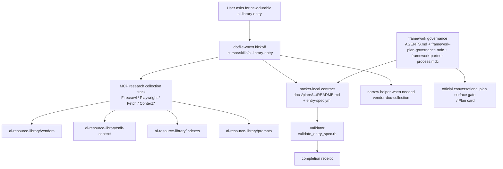
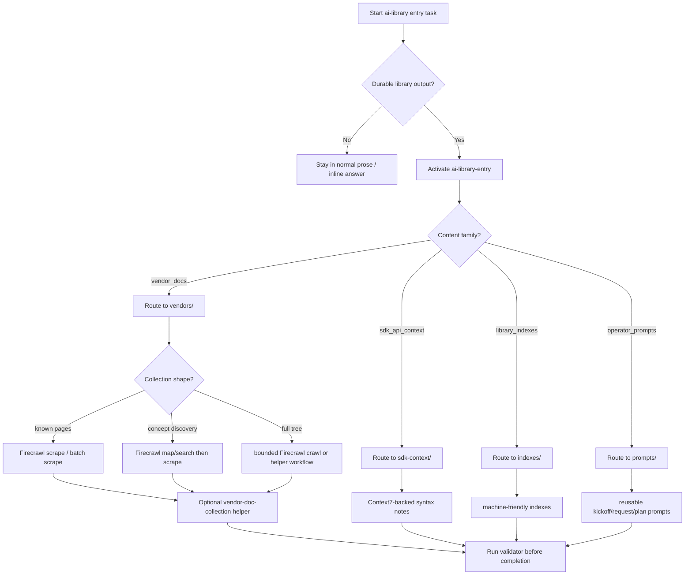
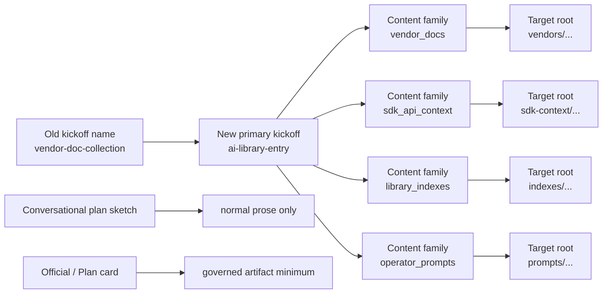

# AI Library Entry Capability + Conversational Plan Governance Repair

## Summary

Create a new governed capability packet for `ai-library-entry` so future
`ai-resource-library` additions start from one repo-native kickoff instead of a
vendor-doc-only helper, and tighten governance for the repo's official
conversational plan surfaces without broadening that rule to ordinary planning
prose.

This implementation family does two things together:

1. Generalizes the old `vendor-doc-collection` kickoff into a broader
   `ai-library-entry` capability that routes durable outputs across
   `vendors/`, `sdk-context/`, `indexes/`, and `prompts/`.
2. Repairs the loophole where an official conversational plan surface
   (`<proposed_plan>` / rendered `Plan` card) could appear without meeting the
   repo's governed-plan minimum.

## Capability Packet Boundary

| Field | Value |
|-------|-------|
| Capability identifier | `ai_library_entry_capability` |
| Owner manifest | `.cursor/skills/ai-library-entry/capability.yml` |
| Owned files | `.cursor/skills/ai-library-entry/**`; `.cursor/rules/framework-ai-library-entry.mdc`; this packet; companion governance/routing updates in `AGENTS.md`, `.cursor/rules/framework-plan-governance.mdc`, `.cursor/rules/framework-partner-process.mdc`, `docs/codex_framework/partner_process.md`, `docs/plans/README.md`, `docs/codex_framework/plan-governance-dependencies.md`; bootstrap/request/plan updates in `ai-resource-library` prompts and subtree READMEs |
| Integration anchors | `ai-resource-library/prompts/entrypoint.md`, request/plan templates, `docs/codex_framework/mcp-research-collection-stack.md`, `docs/codex_framework/capabilities/mcp-research-collection-stack.yml`, `AGENTS.md`, `.cursor/rules/framework-plan-governance.mdc`, `.cursor/rules/framework-partner-process.mdc` |
| Update behavior | Update the kickoff skill, validator, packet contract template, routing docs, and narrow conversational-plan governance together so entry routing and completion gates stay aligned |
| Removal behavior | Remove the `ai-library-entry` owned files, remove bootstrap references that name it as the primary kickoff, reverse the narrow governance language only in the same slice that replaces it, and leave `vendor-doc-collection` only if it is still intentionally retained as a narrower helper |

## Key Changes

### 1. New primary kickoff capability: `ai-library-entry`

- Add manifest-backed `ai-library-entry` as the canonical kickoff for durable
  `ai-resource-library` additions.
- Route work by content family into `vendors/`, `sdk-context/`, `indexes/`,
  and `prompts/`.
- Keep `vendor-doc-collection` as the narrower structured vendor-doc helper
  instead of the user-facing default kickoff.

### 2. Preserve the old skill's Firecrawl model

- Preserve known-page, concept-discovery, and full-tree collection modes.
- Preserve Firecrawl-first routing for live vendor/product/help docs.
- Keep Playwright as JS/browser-state fallback and Fetch as lightweight
  fallback.
- Keep Context7 scoped to implementation syntax and indexed technical-doc
  context, not live vendor-doc collection.

### 3. Add packet-local `entry-spec.yml`

- Add a reusable `entry-spec.yml` template under the new capability.
- Require future entry packets to declare source URLs, output routing, output
  modes, Context7 expectations, asset requirements, and validation rules before
  collection/build work.

### 4. Add a hard validator

- Add a validator that reads `entry-spec.yml` and fails when required outputs,
  provenance, source-to-output mapping, Context7 recording, or asset/index
  declarations are missing.
- Require a pass token of `AI_LIBRARY_ENTRY_VALIDATION_OK`.

### 5. Repair AI-library bootstrap surfaces

- Update `ai-resource-library/prompts/entrypoint.md` to start with
  `ai-library-entry`.
- Add reusable request and kickoff templates so future conversations can start
  the generalized flow correctly.
- Update existing concrete AWS request/plan examples so they are clearly marked
  as legacy examples, not the default kickoff shape.

### 6. Add narrow governance for official conversational plans

- Limit the governance repair to the two official plan classes:
  - stored packets under `docs/plans/**`
  - official conversational plan surfaces such as `<proposed_plan>` or a
    rendered `Plan` card
- Keep ordinary planning prose lightweight and outside this heavy plan surface.
- Explicitly forbid using a plan-card / `<proposed_plan>` surface as a
  design-summary escape hatch.

### 7. Define the conversational-plan minimum

Official conversational plan surfaces now require:

- clear title
- brief summary
- `Capability Packet Boundary` when grouped capability work is proposed
- `Apply / Verify / Undo / Change class`
- `Architecture/Structure Diagram`
- `Capability Routing Diagram`
- `Naming/Modeling Diagram` when names/routes/targets/ownership change
- `Diagram Inventory`
- explicit assumptions/defaults
- decision-complete implementation detail

### 8. Langfuse is the first remediation case

- The Langfuse vendor packet remains the first named consumer that should be
  re-evaluated under `entry-spec.yml` and the new validator.
- This packet does not re-run the Langfuse content slice; it establishes the
  durable kickoff, contract, and guardrails that the remediation slice must use.

## Public Interfaces / Types

- New primary skill: `ai-library-entry`
- Narrow helper retained: `vendor-doc-collection`
- New packet-local contract file: `entry-spec.yml`
- Content-family enum:
  - `vendor_docs`
  - `sdk_api_context`
  - `library_indexes`
  - `operator_prompts`
- Collection-strategy enum:
  - `firecrawl_scrape`
  - `firecrawl_batch_scrape`
  - `firecrawl_map_then_scrape`
  - `firecrawl_search_then_scrape`
  - `firecrawl_crawl_limited`
  - `playwright_fallback`
  - `fetch_fallback`
- Output-mode enum:
  - `full_capture`
  - `structured_summary`
  - `index_record`
  - `sdk_context_note`
  - `operator_prompt`
- Validator pass token:
  - `AI_LIBRARY_ENTRY_VALIDATION_OK`

## Apply / Verify / Undo / Change class

- Apply: add the new skill/manifest/rule/template/validator surfaces in
  `dotfile-vnext`, update framework governance wording for official plan
  surfaces, and update `ai-resource-library` bootstrap/request/plan docs to
  start from `ai-library-entry`.
- Verify: inspect the changed docs and manifests, run the validator against a
  synthetic packet-local `entry-spec.yml`, and confirm the bootstrap surfaces
  point at `ai-library-entry`.
- Undo: remove the `ai-library-entry` skill folder and rule, revert the
  framework wording and prompt changes, and restore any replaced kickoff
  references in the library prompts.
- Change class: repo-governance and library-workflow repair; no host/runtime
  mutation.

## Architecture/Structure Diagram

## Capability Routing Diagram

## Naming/Modeling Diagram

## Test Plan

- Verify the new capability exists as a manifest-backed skill with template,
  validator, and companion rule.
- Verify `vendor-doc-collection` remains present but is no longer the primary
  kickoff named by bootstrap surfaces.
- Verify `ai-resource-library/prompts/entrypoint.md` now routes to
  `ai-library-entry` and mentions packet-local `entry-spec.yml`.
- Verify request/plan templates exist for future conversations.
- Verify official conversational plan governance is explicitly limited to
  `<proposed_plan>` / rendered `Plan` card surfaces and stored `docs/plans/**`
  packets, not ordinary prose planning.
- Verify the validator accepts a conforming synthetic `entry-spec.yml`.
- Verify the packet names Langfuse as the first remediation case.

## Assumptions

- `ai-library-entry` is the long-term primary kickoff name.
- `vendor-doc-collection` remains valuable as a narrower helper and should be
  retained rather than deleted in this slice.
- Governance repair is intentionally narrow and should not expand to every
  planning conversation.
- The packet stays `-incomplete` because it establishes a capability family and
  names follow-on remediation work; the core repair implemented here is still
  complete for this slice.

## Diagram gate receipt

- [x] Architecture/Structure included for two repos, MCP stack, validator, and
      official plan-surface gate
- [x] Capability Routing included for content-family routing and collection
      mode branching
- [x] Naming/Modeling included for kickoff-name change, target-root routing,
      and official-plan-surface modeling
- [x] Diagram Inventory included below

## Plan verification receipt

**Slice:** `ai-library-entry` kickoff capability + official conversational plan governance repair
**Verified at:** 2026-07-08
**Verifier:** agent run

| ID | Obligation | Status | Evidence |
|----|------------|--------|----------|
| O-01 | Add manifest-backed `ai-library-entry` capability | pass | `.cursor/skills/ai-library-entry/{SKILL.md,README.md,capability.yml}` created |
| O-02 | Preserve and adopt the old Firecrawl operating model | pass | `ai-library-entry/SKILL.md` keeps known-page, concept-discovery, and full-tree modes; `vendor-doc-collection/SKILL.md` now explicitly stays as the narrower helper |
| O-03 | Add packet-local `entry-spec.yml` contract template | pass | `.cursor/skills/ai-library-entry/references/entry-spec.template.yml` created |
| O-04 | Add hard validator for entry completion | pass | `.cursor/skills/ai-library-entry/references/validate_entry_spec.rb` created |
| O-05 | Repair AI-library bootstrap surfaces | pass | `ai-resource-library/prompts/entrypoint.md`, `prompts/README.md`, `prompts/request/ai-library-entry-request-template.md`, and `prompts/plans/ai-library-entry-kickoff.md` updated/created |
| O-06 | Demote vendor-doc-only kickoff from primary bootstrap path | pass | `ai-resource-library/prompts/entrypoint.md` now points to `ai-library-entry` first; legacy AWS request/plan examples are marked as examples, not default kickoff |
| O-07 | Add narrow governance for official conversational plan surfaces only | pass | `AGENTS.md`, `.cursor/rules/framework-plan-governance.mdc`, `.cursor/rules/framework-partner-process.mdc`, `docs/codex_framework/partner_process.md`, `docs/plans/README.md`, and `docs/codex_framework/plan-governance-dependencies.md` now distinguish official plan surfaces from ordinary prose |
| O-08 | Name Langfuse as first remediation case | pass | `Key Changes` section of this packet names Langfuse as the first remediation case under the new capability |
| O-09 | Keep MCP stack documentation aligned with the new kickoff | pass | `docs/codex_framework/mcp-research-collection-stack.md` and `docs/codex_framework/capabilities/mcp-research-collection-stack.yml` updated to reference `ai-library-entry` as the primary durable-entry kickoff |
| O-10 | Validator smoke test passes on a conforming synthetic packet-local spec | pass | `ruby .cursor/skills/ai-library-entry/references/validate_entry_spec.rb <synthetic entry-spec.yml>` returned `AI_LIBRARY_ENTRY_VALIDATION_OK` on 2026-07-08 |

## Diagram Inventory

### Diagrams included

- `Architecture/Structure Diagram`
- `Capability Routing Diagram`
- `Naming/Modeling Diagram`

### Other available diagram types

- validation-sequence diagram for `entry-spec.yml` and receipt flow
- content-family-to-subtree ownership matrix diagram
- Langfuse remediation dependency diagram
