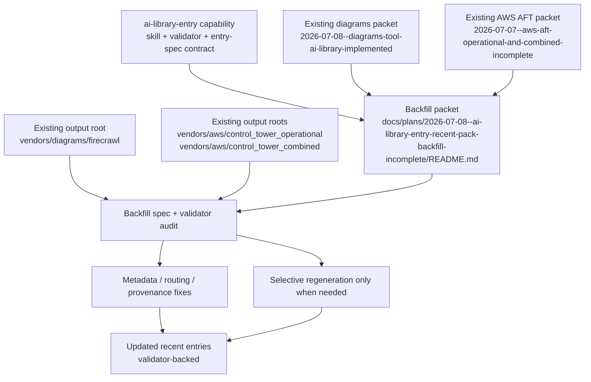
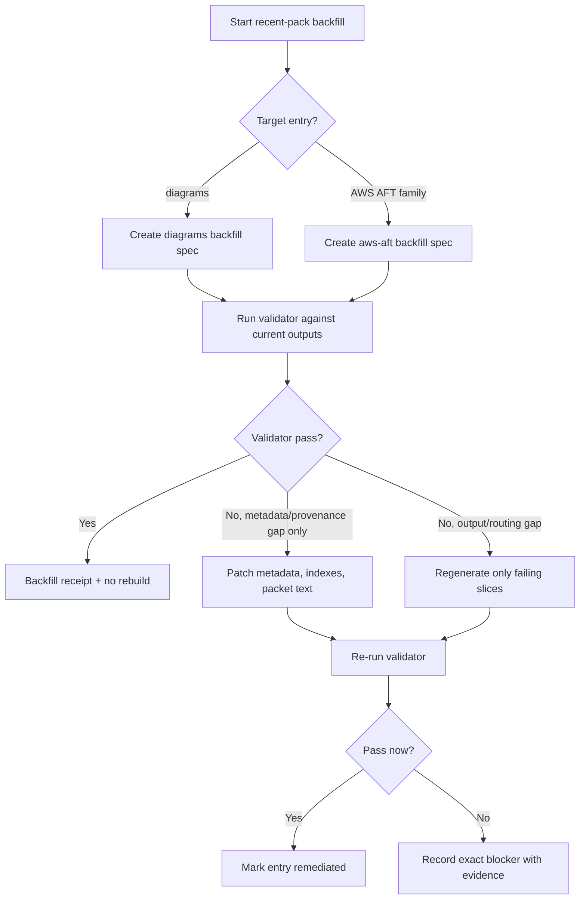
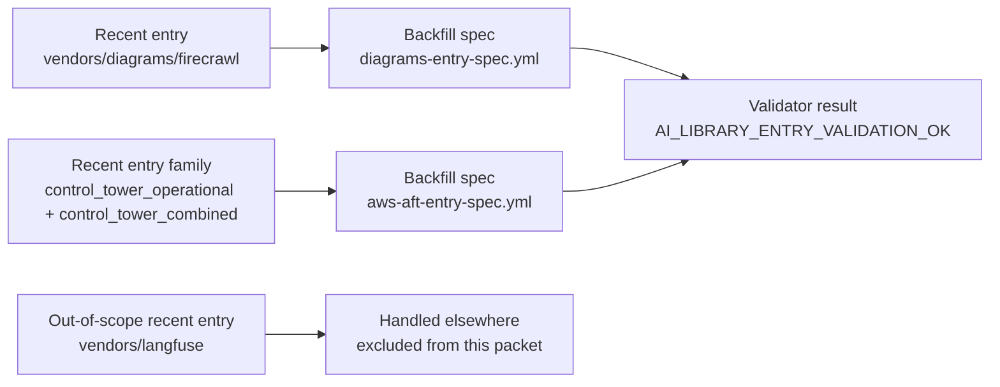

# AI Library Entry Backfill For Recent Packs

## Summary

Implement the remaining non-Langfuse AI-library backfill work so the recent
entries conform to the new `ai-library-entry` kickoff capability,
packet-local `entry-spec.yml` contracting, and validator-based completion
rules.

This plan is intentionally limited to:

- `/Users/joshc/develop/ai-resource-library/vendors/diagrams/firecrawl`
- `/Users/joshc/develop/ai-resource-library/vendors/aws/control_tower_operational`
- `/Users/joshc/develop/ai-resource-library/vendors/aws/control_tower_combined`

Langfuse is explicitly out of scope because it is being processed elsewhere.

This is an execution plan, not just a governance note. The remaining work is:

1. create the packet-local entry specs for diagrams and AWS AFT
2. run the validator against the current outputs
3. patch metadata, packet text, and routing where that is sufficient
4. regenerate only the files that still fail after the contract backfill
5. record validator-backed receipts in the remediated packets

The remediation goal is still not blind rebuild-first churn. Use a
backfill-first path:

1. declare packet-local entry specs for the recent entries
2. validate existing outputs against the new contract
3. regenerate only the slices that fail routing, provenance, completeness, or
   validator checks

## Capability Packet Boundary

| Field | Value |
|-------|-------|
| Capability identifier | `ai_library_entry_recent_pack_backfill` |
| Owner manifest | None; this packet governs a remediation family across existing AI-library entries rather than introducing a new framework manifest |
| Owned files | This packet under `docs/plans/2026-07-08--ai-library-entry-recent-pack-backfill-incomplete/README.md`; packet-local backfill specs created during implementation; targeted updates to the existing diagrams and AWS AFT entry packets and their AI-library outputs when validator/routing remediation requires them |
| Integration anchors | `docs/plans/2026-07-08--ai-library-entry-capability-incomplete/README.md`, `ai-resource-library/prompts/entrypoint.md`, existing diagrams packet, existing AWS AFT packet, and the current output roots under `ai-resource-library/vendors/diagrams` and `ai-resource-library/vendors/aws` |
| Update behavior | Backfill `entry-spec` contracts and validator receipts first; only regenerate content or move outputs where the new capability contract proves the current shape is incomplete or mis-routed |
| Removal behavior | Remove only the remediation-owned packet/spec artifacts and revert any resulting packet/output updates made by this remediation slice; do not remove the underlying diagrams or AWS AFT packs themselves unless a later user request explicitly retires them |

## Source Materials

- `docs/plans/2026-07-08--ai-library-entry-capability-incomplete/README.md`
- `docs/plans/2026-07-08--diagrams-tool-ai-library-implemented/README.md`
- `docs/plans/2026-07-07--aws-aft-operational-and-combined-incomplete/README.md`
- `/Users/joshc/develop/ai-resource-library/vendors/diagrams/firecrawl`
- `/Users/joshc/develop/ai-resource-library/vendors/aws/control_tower_operational`
- `/Users/joshc/develop/ai-resource-library/vendors/aws/control_tower_combined`

## Key Changes

### 1. Remediate the diagrams entry under `ai-library-entry`

- Create the packet-local backfill spec:
  - `docs/plans/2026-07-08--ai-library-entry-recent-pack-backfill-incomplete/diagrams-entry-spec.yml`
- Validate whether the current `vendors/diagrams/firecrawl` output is correctly
  modeled as a pure `vendor_docs` slice or whether any durable material belongs
  in `indexes/`, `sdk-context/`, or `prompts/`.
- Backfill provenance, output declarations, and validator evidence.
- Update the governing packet at
  `docs/plans/2026-07-08--diagrams-tool-ai-library-implemented/README.md` so it
  records the backfill contract and validator evidence.
- Do not rebuild the diagrams pack unless the spec or validator proves concrete
  gaps in outputs, routing, or provenance.

### 2. Remediate the AWS AFT operational + combined entries

- Create the packet-local backfill spec:
  - `docs/plans/2026-07-08--ai-library-entry-recent-pack-backfill-incomplete/aws-aft-entry-spec.yml`
- Cover both existing output roots in one remediation family:
  - `/Users/joshc/develop/ai-resource-library/vendors/aws/control_tower_operational`
  - `/Users/joshc/develop/ai-resource-library/vendors/aws/control_tower_combined`
- Treat the existing sibling `control_tower` pack as a dependency, not a target
  for restructuring.
- Validate the current outputs, provenance, metadata, and index coverage
  against the `ai-library-entry` contract.
- Update the governing packet at
  `docs/plans/2026-07-07--aws-aft-operational-and-combined-incomplete/README.md`
  so it records the backfill contract and validator evidence.
- Regenerate only the files that fail validator-backed checks.

### 3. Add validator-backed receipts to the recent entry family

- Record whether each entry passes the new validator.
- If an entry cannot pass without structural changes, document the exact gap and
  perform the minimum necessary remediation to make it conform.
- Do not claim backfill completion without validator pass evidence.

### 4. Preserve the narrow scope boundary

- Exclude Langfuse entirely from this packet.
- Do not broaden this into a whole-library migration.
- Limit the slice to the recent entries that were identified as the most likely
  consumers of the new capability backfill.

## Remaining Work To Implement

### Slice A - diagrams

Required implementation actions:

- create `diagrams-entry-spec.yml`
- inventory the current diagrams outputs and map them to declared sources
- decide whether any current durable material belongs outside
  `vendors/diagrams/firecrawl`
- patch diagrams provenance or README/index anchors if the validator requires it
- add validator-backed evidence to the diagrams packet

Expected default result:

- no content rebuild if the current pack already satisfies the contract after
  metadata/provenance backfill

### Slice B - AWS AFT operational + combined

Required implementation actions:

- create `aws-aft-entry-spec.yml`
- declare both pack roots and their required outputs in one remediation contract
- validate metadata, page/section indexes, provenance, Context7 recording, and
  output declarations against the new capability
- patch README/metadata/receipt text where that is enough
- selectively regenerate only the operational or combined files that still fail
  after the contract backfill
- add validator-backed evidence to the AWS AFT packet

Expected default result:

- preserve the current output roots and file names unless the validator proves a
  routing or ownership problem

## Required Outputs

This execution slice must produce at least:

- `docs/plans/2026-07-08--ai-library-entry-recent-pack-backfill-incomplete/diagrams-entry-spec.yml`
- `docs/plans/2026-07-08--ai-library-entry-recent-pack-backfill-incomplete/aws-aft-entry-spec.yml`
- updated `docs/plans/2026-07-08--diagrams-tool-ai-library-implemented/README.md`
  with backfill/validator evidence
- updated `docs/plans/2026-07-07--aws-aft-operational-and-combined-incomplete/README.md`
  with backfill/validator evidence
- any required metadata/provenance/index fixes in the affected AI-library output
  roots
- validator pass evidence for diagrams and AWS AFT

## Public Interfaces / Types

- Backfill specs to be created during implementation:
  - `diagrams-entry-spec.yml`
  - `aws-aft-entry-spec.yml`
- Validator pass token:
  - `AI_LIBRARY_ENTRY_VALIDATION_OK`
- Content families expected in scope:
  - `vendor_docs`
  - `library_indexes` when cross-pack or machine-friendly lookup additions are justified
  - `sdk_api_context` only if a current entry already contains durable implementation-context material that belongs outside `vendors/`
  - `operator_prompts` only if the remediation proves a recent entry needs a durable prompt anchor beyond the main bootstrap surfaces

## Apply / Verify / Undo / Change class

- Apply: create packet-local backfill specs, inspect the recent diagrams and AWS
  AFT packs against those contracts, update packet/output metadata as needed,
  and regenerate only the failing slices.
- Verify: run the `ai-library-entry` validator for each backfill spec, confirm
  any declared output moves are reflected on disk, and confirm existing packet
  READMEs/receipts describe the remediated state accurately.
- Undo: revert the backfill packet/specs and any resulting metadata/output
  updates; preserve the original entries unless an explicit retirement request
  is made later.
- Change class: documentation-governance and content-normalization backfill; no
  infrastructure mutation.

## Checklist

- [x] P1 Create `diagrams-entry-spec.yml`
- [x] P2 Create `aws-aft-entry-spec.yml`
- [x] P3 Run validator against diagrams backfill spec
- [x] P4 Run validator against AWS AFT backfill spec
- [x] P5 Update the diagrams packet with contract + validator evidence
- [x] P6 Update the AWS AFT packet with contract + validator evidence
- [x] P7 Apply only the metadata/provenance/index fixes required for validator pass
- [x] P8 Regenerate only the remaining failing slices after backfill-first remediation
- [x] V1 Verify Langfuse remains out of scope for this packet
- [x] V2 Verify diagrams passes without rebuild unless a real gap forces one
- [x] V3 Verify AWS AFT operational and combined outputs pass with only the necessary targeted fixes
- [x] V4 Verify both remediated entries have validator-backed completion evidence

## Architecture/Structure Diagram

## Capability Routing Diagram

## Naming/Modeling Diagram

## Test Plan

- Verify the packet preserves the narrow scope: diagrams plus AWS AFT only,
  with Langfuse explicitly excluded.
- Verify packet-local backfill specs are created for diagrams and AWS AFT.
- Verify the validator is run against both backfill specs.
- Verify diagrams is not rebuilt if the validator can be satisfied with
  metadata/routing backfill alone.
- Verify AWS AFT operational and combined outputs are only regenerated where
  validator-backed gaps exist.
- Verify any new `indexes/`, `sdk-context/`, or `prompts/` outputs are created
  only when the spec proves they belong there.
- Verify existing packets and output READMEs record the remediated state after
  backfill.

## Completion Contract

This slice is not complete until all of the following are true:

- both packet-local backfill specs exist
- the validator has been run for both specs
- both governing packets record validator-backed evidence
- any failing outputs have been either fixed, selectively regenerated, or left
  as explicit blockers with evidence
- no Langfuse work has been pulled into this packet

## Assumptions

- Langfuse is intentionally excluded because it is being handled in another
  thread/process.
- The recent diagrams and AWS AFT entries are the only non-Langfuse entries
  that need immediate `ai-library-entry` backfill planning right now.
- A validator pass with minimal metadata/routing fixes is preferred over full
  regeneration when the current content is already structurally sound.
- The existing diagrams vendor pack and the AWS sibling `control_tower` pack
  remain source-of-truth dependencies, not retirement targets.

## On Deck — user decisions to integrate

| ID | User decision / direction | Target integration | Status |
|----|---------------------------|--------------------|--------|
| OD-1 | Exclude Langfuse from this backfill plan because it is being processed elsewhere | Summary, scope boundary, assumptions, naming/modeling diagram | integrated |
| OD-2 | Create a plan specifically for the recent entries identified above | Summary, key changes, test plan | integrated |

## Diagram gate receipt

- [x] Architecture/Structure included for the capability, existing packets,
      output roots, and selective-remediation path
- [x] Capability Routing included for validator-first backfill and conditional
      regeneration
- [x] Naming/Modeling included for backfill-spec naming and the explicit
      Langfuse exclusion
- [x] Diagram Inventory section included below

## Plan verification receipt

| ID | Obligation | Status | Evidence |
|----|------------|--------|----------|
| O-01 | Create `diagrams-entry-spec.yml` | pass | `docs/plans/2026-07-08--ai-library-entry-recent-pack-backfill-incomplete/diagrams-entry-spec.yml` |
| O-02 | Create `aws-aft-entry-spec.yml` | pass | `docs/plans/2026-07-08--ai-library-entry-recent-pack-backfill-incomplete/aws-aft-entry-spec.yml` |
| O-03 | Run validator for diagrams | pass | `AI_LIBRARY_ENTRY_VALIDATION_OK` from `validate_entry_spec.rb diagrams-entry-spec.yml` |
| O-04 | Run validator for AWS AFT | pass | `AI_LIBRARY_ENTRY_VALIDATION_OK` from `validate_entry_spec.rb aws-aft-entry-spec.yml` |
| O-05 | Update diagrams packet with validator-backed evidence | pass | diagrams packet updated with backfill section and validator receipt |
| O-06 | Update AWS AFT packet with validator-backed evidence | pass | AWS AFT packet updated with backfill section and validator receipt |
| O-07 | Apply only necessary metadata/provenance/index fixes | pass | diagrams gained `metadata.json` and `page-index.json`; AWS AFT operational pages gained `Capture mode: full_capture` and `Collection-tool: onenote-export-normalization` provenance markers |
| O-08 | Regenerate only remaining failing slices | pass | No remaining failing slice required a rebuild after targeted backfill fixes; diagrams passed without rebuild and AWS AFT passed after provenance-only repair |
| O-09 | Keep Langfuse out of scope | pass | No Langfuse paths, specs, or packet updates were included in this remediation slice |

### Receipt summary

- In-scope obligations: 9
- Pass: 9
- Fail: 0
- Blocked: 0

## Diagram Inventory

- Architecture/Structure Diagram: included
- Capability Routing Diagram: included
- Naming/Modeling Diagram: included
- Sequence Diagram: N/A for planning; validator-first routing already captures the remediation order
- State Diagram: N/A for this slice; no new runtime lifecycle surface is introduced beyond packet/backfill status
