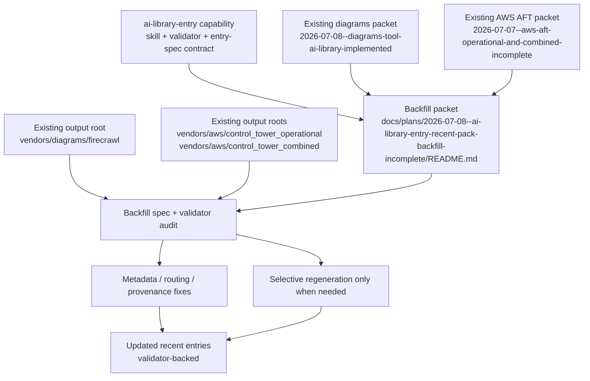
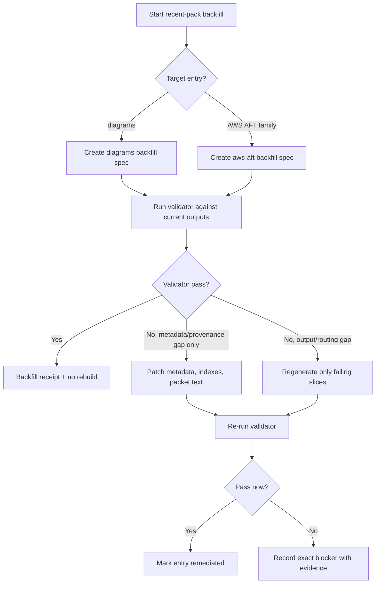
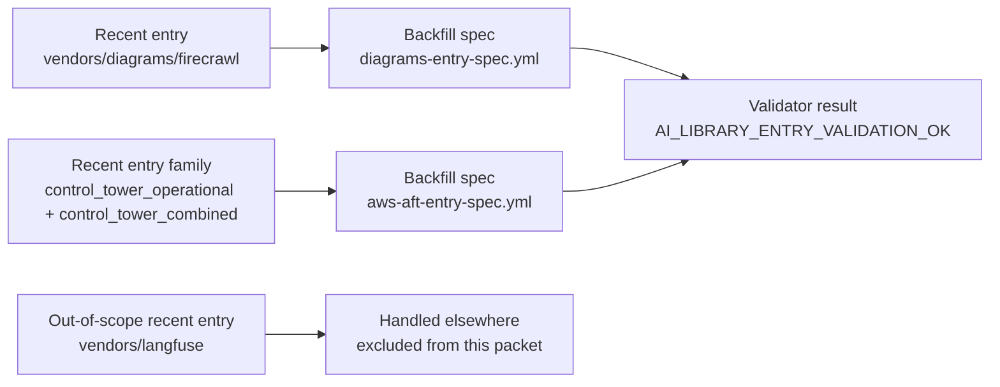

# AI Library Entry Backfill For Recent Packs

## Summary

Backfill the recent non-Langfuse AI-library entries so they conform to the new
`ai-library-entry` kickoff capability, packet-local `entry-spec.yml`
contracting, and validator-based completion rules.

This plan is intentionally limited to:

- `/Users/joshc/develop/ai-resource-library/vendors/diagrams/firecrawl`
- `/Users/joshc/develop/ai-resource-library/vendors/aws/control_tower_operational`
- `/Users/joshc/develop/ai-resource-library/vendors/aws/control_tower_combined`

Langfuse is explicitly out of scope because it is being processed elsewhere.

The remediation goal is not blind rebuild-first churn. Use a backfill-first
path:

1. declare packet-local entry specs for the recent entries
2. validate existing outputs against the new contract
3. regenerate only the slices that fail routing, provenance, completeness, or
   validator checks

## Capability Packet Boundary

| Field | Value |
|-------|-------|
| Capability identifier | `ai_library_entry_recent_pack_backfill` |
| Owner manifest | None; this packet governs a remediation family across existing AI-library entries rather than introducing a new framework manifest |
| Owned files | This packet under `docs/plans/2026-07-08--ai-library-entry-recent-pack-backfill-incomplete/README.md`; packet-local backfill specs created during implementation; targeted updates to the existing diagrams and AWS AFT entry packets and their AI-library outputs when validator/routing remediation requires them |
| Integration anchors | `docs/plans/2026-07-08--ai-library-entry-capability-incomplete/README.md`, `ai-resource-library/prompts/entrypoint.md`, existing diagrams packet, existing AWS AFT packet, and the current output roots under `ai-resource-library/vendors/diagrams` and `ai-resource-library/vendors/aws` |
| Update behavior | Backfill `entry-spec` contracts and validator receipts first; only regenerate content or move outputs where the new capability contract proves the current shape is incomplete or mis-routed |
| Removal behavior | Remove only the remediation-owned packet/spec artifacts and revert any resulting packet/output updates made by this remediation slice; do not remove the underlying diagrams or AWS AFT packs themselves unless a later user request explicitly retires them |

## Source Materials

- `docs/plans/2026-07-08--ai-library-entry-capability-incomplete/README.md`
- `docs/plans/2026-07-08--diagrams-tool-ai-library-implemented/README.md`
- `docs/plans/2026-07-07--aws-aft-operational-and-combined-incomplete/README.md`
- `/Users/joshc/develop/ai-resource-library/vendors/diagrams/firecrawl`
- `/Users/joshc/develop/ai-resource-library/vendors/aws/control_tower_operational`
- `/Users/joshc/develop/ai-resource-library/vendors/aws/control_tower_combined`

## Key Changes

### 1. Remediate the diagrams entry under `ai-library-entry`

- Create a packet-local backfill spec for the diagrams entry.
- Validate whether the current `vendors/diagrams/firecrawl` output is correctly
  modeled as a pure `vendor_docs` slice or whether any durable material belongs
  in `indexes/`, `sdk-context/`, or `prompts/`.
- Backfill provenance, output declarations, and validator evidence.
- Do not rebuild the diagrams pack unless the spec or validator shows concrete
  gaps.

### 2. Remediate the AWS AFT operational + combined entries

- Create a packet-local backfill spec for the AFT remediation family that
  covers both `control_tower_operational` and `control_tower_combined`.
- Treat the existing sibling `control_tower` pack as a dependency, not a target
  for restructuring.
- Validate the current outputs, provenance, metadata, and index coverage
  against the `ai-library-entry` contract.
- Regenerate only the files that fail validator-backed checks.

### 3. Add validator-backed receipts to the recent entry family

- Record whether each entry passes the new validator.
- If an entry cannot pass without structural changes, document the exact gap and
  perform the minimum necessary remediation to make it conform.
- Do not claim backfill completion without validator pass evidence.

### 4. Preserve the narrow scope boundary

- Exclude Langfuse entirely from this packet.
- Do not broaden this into a whole-library migration.
- Limit the slice to the recent entries that were identified as the most likely
  consumers of the new capability backfill.

## Public Interfaces / Types

- Backfill specs to be created during implementation:
  - `diagrams-entry-spec.yml`
  - `aws-aft-entry-spec.yml`
- Validator pass token:
  - `AI_LIBRARY_ENTRY_VALIDATION_OK`
- Content families expected in scope:
  - `vendor_docs`
  - `library_indexes` when cross-pack or machine-friendly lookup additions are justified
  - `sdk_api_context` only if a current entry already contains durable implementation-context material that belongs outside `vendors/`
  - `operator_prompts` only if the remediation proves a recent entry needs a durable prompt anchor beyond the main bootstrap surfaces

## Apply / Verify / Undo / Change class

- Apply: create packet-local backfill specs, inspect the recent diagrams and AWS
  AFT packs against those contracts, update packet/output metadata as needed,
  and regenerate only the failing slices.
- Verify: run the `ai-library-entry` validator for each backfill spec, confirm
  any declared output moves are reflected on disk, and confirm existing packet
  READMEs/receipts describe the remediated state accurately.
- Undo: revert the backfill packet/specs and any resulting metadata/output
  updates; preserve the original entries unless an explicit retirement request
  is made later.
- Change class: documentation-governance and content-normalization backfill; no
  infrastructure mutation.

## Architecture/Structure Diagram

## Capability Routing Diagram

## Naming/Modeling Diagram

## Test Plan

- Verify the packet preserves the narrow scope: diagrams plus AWS AFT only,
  with Langfuse explicitly excluded.
- Verify packet-local backfill specs are created for diagrams and AWS AFT.
- Verify the validator is run against both backfill specs.
- Verify diagrams is not rebuilt if the validator can be satisfied with
  metadata/routing backfill alone.
- Verify AWS AFT operational and combined outputs are only regenerated where
  validator-backed gaps exist.
- Verify any new `indexes/`, `sdk-context/`, or `prompts/` outputs are created
  only when the spec proves they belong there.
- Verify existing packets and output READMEs record the remediated state after
  backfill.

## Assumptions

- Langfuse is intentionally excluded because it is being handled in another
  thread/process.
- The recent diagrams and AWS AFT entries are the only non-Langfuse entries
  that need immediate `ai-library-entry` backfill planning right now.
- A validator pass with minimal metadata/routing fixes is preferred over full
  regeneration when the current content is already structurally sound.
- The existing diagrams vendor pack and the AWS sibling `control_tower` pack
  remain source-of-truth dependencies, not retirement targets.

## On Deck — user decisions to integrate

| ID | User decision / direction | Target integration | Status |
|----|---------------------------|--------------------|--------|
| OD-1 | Exclude Langfuse from this backfill plan because it is being processed elsewhere | Summary, scope boundary, assumptions, naming/modeling diagram | integrated |
| OD-2 | Create a plan specifically for the recent entries identified above | Summary, key changes, test plan | integrated |

## Diagram gate receipt

- [x] Architecture/Structure included for the capability, existing packets,
      output roots, and selective-remediation path
- [x] Capability Routing included for validator-first backfill and conditional
      regeneration
- [x] Naming/Modeling included for backfill-spec naming and the explicit
      Langfuse exclusion
- [x] Diagram Inventory section included below

## Diagram Inventory

- Architecture/Structure Diagram: included
- Capability Routing Diagram: included
- Naming/Modeling Diagram: included
- Sequence Diagram: N/A for planning; validator-first routing already captures the remediation order
- State Diagram: N/A for this slice; no new runtime lifecycle surface is introduced beyond packet/backfill status
