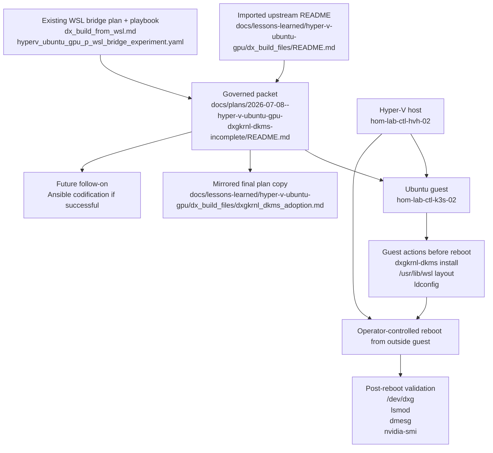
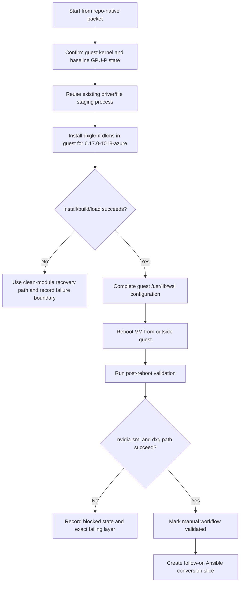
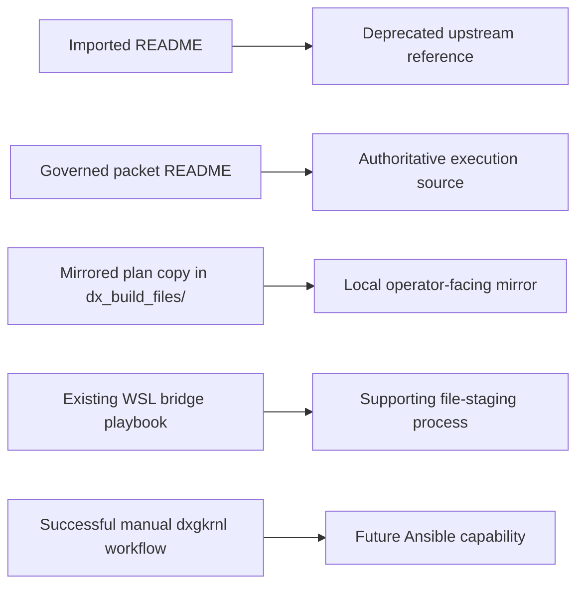

# Hyper-V Ubuntu GPU-P dxgkrnl-dkms Adoption Packet

## Summary

This packet promotes the imported upstream note at `docs/lessons-learned/hyper-v-ubuntu-gpu/dx_build_files/README.md` into a repo-native operator plan for adopting `dxgkrnl-dkms` on `hom-lab-ctl-k3s-02`.

This slice is intentionally manual and evidence-first. It does not automate `dxgkrnl-dkms` with Ansible yet. Instead, it narrows the upstream instructions to the steps that fit this repo:

- reuse the existing WSL bridge/file-staging process as the driver-copy path
- skip upstream Step 2 as a primary workflow
- pin the install target to the guest's current kernel: `6.17.0-1018-azure`
- perform guest-side configuration only until reboot
- reboot from outside the guest
- validate `/dev/dxg`, module load, library resolution, and `nvidia-smi`
- convert the proven workflow to Ansible only if the manual run succeeds

## Capability Packet Boundary

| Field | Value |
|-------|-------|
| Capability identifier | `hyperv_ubuntu_gpu_p_dxgkrnl_dkms_adoption` |
| Owner manifest | None; this is a governed troubleshooting/adoption packet, not a manifest-backed long-lived capability |
| Owned files | This packet README, the mirrored plan copy in `docs/lessons-learned/hyper-v-ubuntu-gpu/dx_build_files/dxgkrnl_dkms_adoption.md`, and the deprecation treatment for `docs/lessons-learned/hyper-v-ubuntu-gpu/dx_build_files/README.md` |
| Integration anchors | Existing `dx_build_from_wsl.md` mirror, `playbooks/troubleshoot/hyperv_ubuntu_gpu_p_wsl_bridge_experiment.yaml`, Hyper-V Ubuntu GPU-P evidence notes, and the live host/guest inventory surfaces |
| Update behavior | Re-runnable operator packet that captures the validated manual workflow and records whether the path is ready for later Ansible conversion |
| Removal behavior | Remove this packet and its mirrored copy; leave the imported upstream README only as an archive/reference document if it is still useful |

## Apply / Verify / Undo / Change Class

| Field | Value |
|---|---|
| Apply | Follow a repo-native operator runbook that confirms baseline GPU-P state, reuses the established file-staging path, installs `dxgkrnl-dkms` inside the guest for `6.17.0-1018-azure`, completes guest `/usr/lib/wsl` configuration, and reboots from outside the guest |
| Verify | Confirm `/dev/dxg`, `dxg` module presence, `dmesg` evidence, loader resolution, and `nvidia-smi` success after reboot |
| Undo | Use the clean-module path plus guest-side `/usr/lib/wsl` and loader cleanup to return to the pre-dxgkrnl experiment state; distinguish this from Hyper-V backup/export recovery |
| Change class | Manual experimental adoption packet with future automation handoff |

## Public Interfaces / Types

- Authoritative packet:
  - `docs/plans/2026-07-08--hyper-v-ubuntu-gpu-dxgkrnl-dkms-incomplete/README.md`
- Mirrored operator-facing plan copy:
  - `docs/lessons-learned/hyper-v-ubuntu-gpu/dx_build_files/dxgkrnl_dkms_adoption.md`
- Deprecated upstream source:
  - `docs/lessons-learned/hyper-v-ubuntu-gpu/dx_build_files/README.md`
- Existing supporting execution surface:
  - `playbooks/troubleshoot/hyperv_ubuntu_gpu_p_wsl_bridge_experiment.yaml`
- Future handoff:
  - if this manual workflow succeeds, create a follow-on slice that converts the validated sequence into repo-owned Ansible automation

## Key Changes

### 1. Replace the imported README with a repo-native execution source

- This packet becomes the authoritative execution source.
- Mirror this packet into `dx_build_files/dxgkrnl_dkms_adoption.md` for local operator pickup.
- Mark the imported `README.md` as deprecated and upstream-only.
- Preserve only the pertinent upstream steps in the packet body.

### 2. Lock the repo-specific execution contract

- Treat upstream Step 1 as mostly already reconciled to repo truth:
  - use current Hyper-V GPU-P evidence rather than blindly replaying the full upstream PowerShell block
  - note any remaining parameter differences only if they matter for the `dxgkrnl-dkms` path
- Treat upstream Step 2 as replaced by the established file-staging workflow:
  - use `dx_build_from_wsl.md` plus `playbooks/troubleshoot/hyperv_ubuntu_gpu_p_wsl_bridge_experiment.yaml` as the source for getting the right files onto the guest
  - do not run the imported `Get-CimInstance` copy flow as the primary repo path
- Treat upstream Step 3 as the new manual action:
  - run `curl -fsSL https://content.staralt.dev/dxgkrnl-dkms/main/install.sh | sudo bash -es`
  - default to the current guest kernel `6.17.0-1018-azure`
  - use `curl -fsSL https://content.staralt.dev/dxgkrnl-dkms/main/install.sh | sudo bash -es -- clean all` as the sanctioned reset path before retry
- Treat upstream Step 4 as guest-side only until reboot:
  - complete `/usr/lib/wsl` move, permissions, symlinks, loader config, and `ldconfig` inside the guest
  - stop there
  - reboot from outside the VM
  - then validate from the repo operator side

### 3. Pin the kernel and define early-stop conditions

- The default target kernel for this packet is `6.17.0-1018-azure`.
- The plan must fail early if the guest kernel no longer falls within the imported Ubuntu 24.04 support range and no validated override is recorded.
- The plan must stop immediately if the guest never reaches the post-reboot `dxg` validation stage.

### 4. Define success, failure, and follow-on automation

- Success for this slice requires:
  - `/dev/dxg` exists after reboot
  - `lsmod` shows the expected `dxg` module path
  - `dmesg` shows the expected initialization evidence
  - loader state resolves the required GPU libraries
  - `nvidia-smi` succeeds
- Failure must classify the blocking layer:
  - host GPU-P configuration
  - guest module build/load
  - guest file/layout
  - post-reboot runtime validation
- If the manual workflow succeeds, the next slice is explicit:
  - codify the validated sequence into Ansible
  - replace manual/ad-hoc execution with repo-owned automation

## Architecture/Structure Diagram

## Capability Routing Diagram

## Naming/Modeling Diagram

## Test Plan

- Verify the packet explicitly marks upstream Step 2 as replaced or narrowed by the existing WSL bridge/file-staging workflow.
- Verify the packet pins installation to `6.17.0-1018-azure`, not to the upstream example kernel string.
- Verify the packet defines the reboot boundary correctly:
  - guest-side config stops before reboot
  - reboot is executed from outside the VM
  - validation runs only after reboot
- Verify the success gate requires:
  - `/dev/dxg`
  - `lsmod`
  - `dmesg`
  - loader/library resolution
  - `nvidia-smi`
- Verify the packet includes the clean-module recovery path and distinguishes experiment cleanup from full VM backup/export recovery.
- Verify the mirrored plan in `dx_build_files/` contains the adopted steps and the imported README is clearly deprecated.
- Verify the packet states that Ansible conversion happens only after a successful manual proof.

## Assumptions And Defaults

- The existing `dx_build_from_wsl` plan and supporting playbook remain the primary source for getting the required library files onto the Ubuntu guest.
- This packet adopts the `dxgkrnl-dkms` path into the repo workflow; it does not replace the whole WSL bridge work.
- The imported README remains useful as source material but should not remain the active runbook after this packet lands.
- The first implementation slice is intentionally manual/operator-oriented; Ansible codification is a later success-triggered slice.

## Diagram gate receipt

- [x] Architecture/Structure: repo paths, external resources, data/control flow, naming scheme, variable SSOT sources, tag/playbook wiring
- [x] Capability Routing: included
- [x] Naming/Modeling: included
- [x] Diagram Inventory lists every required section above, not only diagrams actually drawn

## Plan verification receipt

Execution completed on July 8, 2026 against `hom-lab-ctl-k3s-02`.

Result classification:

- `implemented` for guest DXG exposure, `dxgkrnl-dkms` adoption, and NVIDIA runtime usability

Obligation results:

- Host GPU-P baseline: pass
  - `IovSupport=True` remained the governing host state from the earlier packet chain.
  - The VM rebooted successfully with the GPU partition adapter still attached.
- Kernel target pin: pass
  - Guest kernel remained `6.17.0-1018-azure`.
- `dxgkrnl-dkms` install/build: pass
  - Upstream install script completed successfully.
  - `dkms status` after reboot reported `dxgkrnl/6.6-a07f9ea8a, 6.17.0-1018-azure, x86_64: installed`.
- Guest `/usr/lib/wsl` layout: pass
  - Live WSL library payload was staged from the host and activated under `/usr/lib/wsl/lib`.
  - `/etc/ld.so.conf.d/ld.wsl.conf` and `/etc/environment` were updated.
  - The exact traced DriverStore subtree was populated under `/usr/lib/wsl/drivers/nvmdsi.inf_amd64_e82263d194ad754a`.
- Post-reboot DXG validation: pass
  - `/dev/dxg` existed after reboot.
  - `lsmod` showed `dxgkrnl` loaded.
  - `lspci -nnk` still showed the Microsoft Basic Render device, but it was now bound to kernel driver `dxgkrnl`.
  - `sudo dmesg` showed `dxgkrnl` registering on Hyper-V VMBus during boot.
- Loader/library validation: pass
  - `ldconfig -p` resolved `libdxcore.so`, `libd3d12.so`, `libcuda.so.1`, and `libnvidia-ml.so.1` from `/usr/lib/wsl/lib`.
  - Python `ctypes` loads succeeded for those same libraries.
- `nvidia-smi` validation: pass
  - Guest `strace` proved `nvidia-smi` was trying to open:
    - `/usr/lib/wsl/drivers/nvmdsi.inf_amd64_e82263d194ad754a/libnvidia-ml.so.1`
  - After populating that exact folder, `nvidia-smi` succeeded and reported the RTX 5090.

Five-stage ladder result:

- Stage 1 `Host can partition GPU`: pass
- Stage 2 `VM can receive GPU partition adapter`: pass
- Stage 3 `VM can boot with it attached`: pass
- Stage 4 `Guest exposes usable GPU interface`: pass
- Stage 5 `Guest driver/runtime stack can actually use it`: pass

Validated dependency boundary:

- The `dxgkrnl-dkms` path created `/dev/dxg` and bound the guest render device to `dxgkrnl`, but that alone was not enough for stage 5.
- The decisive missing piece was the NVIDIA DriverStore subtree under:
  - `/usr/lib/wsl/drivers/nvmdsi.inf_amd64_e82263d194ad754a`
- The decisive proof came from guest `strace`, which showed `nvidia-smi` opening that exact path and failing with `ENOENT` before the subtree was copied.
- The next slice should codify that exact folder-transfer rule into repo-owned automation instead of rediscovering it manually.

Cleanup / rollback note:

- This run did not invoke the clean-module rollback path because it improved the system from pre-run stage 3 to stage 5.
- If a future attempt needs to return to the pre-adoption state, use the packet's clean-module path plus guest `/usr/lib/wsl` and loader cleanup rather than assuming a Hyper-V snapshot exists.

## Diagram Inventory

- **Architecture/Structure Diagram**: included
- **Capability Routing Diagram**: included
- **Naming/Modeling Diagram**: included
- **Sequence Diagram**: not included; the routing diagram is sufficient for the ordered manual execution flow
- **State Diagram**: not included; success/failure classification is adequately captured by the routing and test sections
