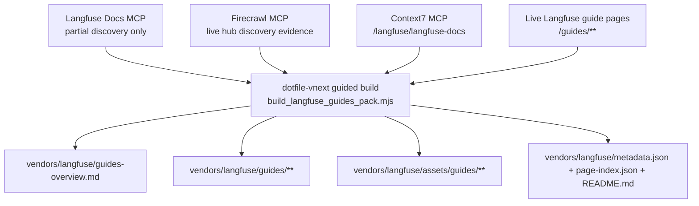
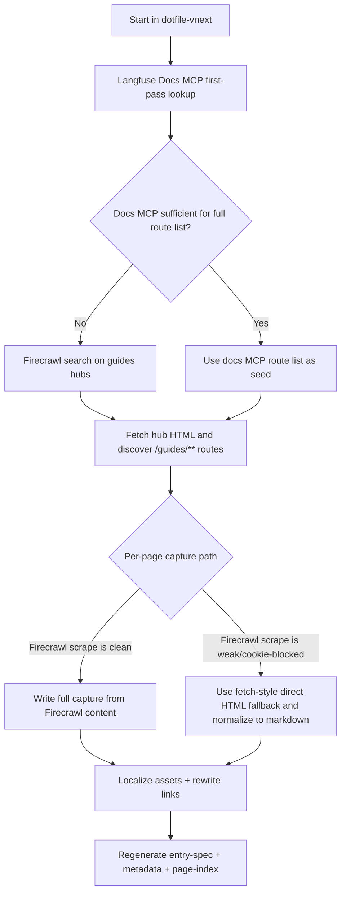
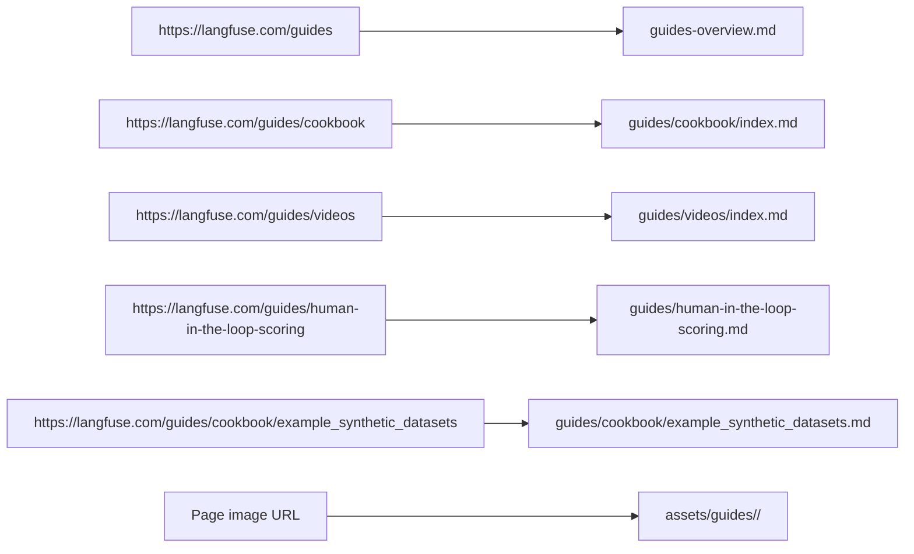

# Langfuse Guides Full Capture

## Summary

Remediate the Langfuse vendor entry so the `/guides` slice is no longer
represented only by overview/synthesis files.

This packet adds a rerunnable full-capture workflow for the Langfuse guides
surface rooted at `https://langfuse.com/guides`, keeps execution in
`dotfile-vnext`, and writes durable outputs under the sibling AI library at:

- `/Users/joshc/develop/ai-resource-library/vendors/langfuse`

This slice keeps the existing Langfuse vendor pack, but changes the guides area
to a hierarchy-backed full-capture subtree:

- upgrade `guides-overview.md` from summary-style output to a full capture of
  the landing page
- add `vendors/langfuse/guides/**` for hub and leaf pages that mirror the
  `/guides/...` URL hierarchy
- add `assets/guides/**` for localized guide images
- update pack metadata and page index so the new guides subtree becomes the
  authoritative durable source for Langfuse guides

## Capability Packet Boundary

| Field | Value |
|-------|-------|
| Capability identifier | `langfuse_guides_full_capture` |
| Owner manifest | None exists today; this is a governed vendor-pack remediation slice |
| Owned files | This packet under `docs/plans/2026-07-08--langfuse-guides-full-capture-incomplete/`; `vendors/langfuse/guides/**`; `vendors/langfuse/assets/guides/**`; updates to `vendors/langfuse/README.md`, `vendors/langfuse/metadata.json`, `vendors/langfuse/page-index.json`, and `vendors/langfuse/guides-overview.md` |
| Integration anchors | `ai-library-entry` capability, existing `vendors/langfuse` pack, Langfuse live docs, Firecrawl MCP, Context7 MCP |
| Update behavior | Re-run the retained helper to rediscover `/guides` routes, refresh captured guide pages, refresh localized guide assets, and regenerate spec/index metadata |
| Removal behavior | Delete the guides subtree, guides assets subtree, and this packet; revert the root vendor-pack metadata/index/readme updates; leave non-guides Langfuse outputs intact |

## Source materials

- Live guides landing page: `https://langfuse.com/guides`
- Live cookbook hub: `https://langfuse.com/guides/cookbook`
- Live videos hub: `https://langfuse.com/guides/videos`
- Live guide leaf pages under `https://langfuse.com/guides/**`

## Research and MCP routing

- First discovery passes use the Langfuse Docs MCP for:
  - partial guide lookup
  - confirming guide groupings
  - determining whether the docs MCP can enumerate the full export set
- Firecrawl is the primary live-doc discovery tool after that:
  - use `firecrawl_search` to confirm public guide surfaces and hub routes
  - use `firecrawl_scrape` as the first full-page capture attempt
- Fetch-style direct HTML fallback is allowed for page-body capture when
  Firecrawl scrape returns weak output such as cookie-overlay content instead of
  the guide body
- Context7 remains required for Langfuse-docs library resolution and
  implementation-context recording in README/metadata/spec

## Key changes

- Add a new governed packet at
  `docs/plans/2026-07-08--langfuse-guides-full-capture-incomplete/README.md`.
- Add a packet-local `entry-spec.yml` for the guides full-capture slice.
- Retain build/debug helper scripts with the packet:
  - `build_langfuse_guides_pack.mjs`
  - `mcp_tool_client.mjs`
- Replace the current summary-oriented `guides-overview.md` with a
  provenance-backed full capture of the landing page.
- Add a hierarchy-backed guides subtree under
  `/Users/joshc/develop/ai-resource-library/vendors/langfuse/guides`.
- Add localized guide assets under
  `/Users/joshc/develop/ai-resource-library/vendors/langfuse/assets/guides`.
- Regenerate `metadata.json` and `page-index.json` so all guide hubs and leaf
  pages are indexed as durable outputs.

## Build contract

### Output root

- Locked root: `/Users/joshc/develop/ai-resource-library/vendors/langfuse`

### Required durable outputs

- `README.md`
- `metadata.json`
- `page-index.json`
- `guides-overview.md`
- `guides/README.md`
- `guides/cookbook/index.md`
- `guides/videos/index.md`
- one full-capture markdown page for every reachable Langfuse docs page under
  `/guides/**` discovered from the hub surfaces during the build

### Required asset root

- `assets/guides/**`

### Content rules

- No summary-only page outputs are allowed for this slice.
- Every guide page must carry provenance:
  - live source URL
  - capture timestamp
  - collection tool or fallback tool
  - normalization notes
  - capture mode `full_capture`
- URL hierarchy must be reflected on disk:
  - `/guides` -> `guides-overview.md`
  - `/guides/cookbook` -> `guides/cookbook/index.md`
  - `/guides/videos` -> `guides/videos/index.md`
  - `/guides/<slug>` -> `guides/<slug>.md`
  - `/guides/<group>/<slug>` -> `guides/<group>/<slug>.md`
- Localized image assets must be rewritten to relative markdown paths and keep
  source provenance comments.
- If a page has embedded external media that is not a normal downloadable image
  asset, keep the destination link and annotate it rather than fabricating a
  local file.

## Context7 gate

- Required: yes
- Expected library id: `/langfuse/langfuse-docs`
- Expected topic areas:
  - Langfuse guides landing surface
  - cookbook-style guide material
  - video/tutorial guide material where indexed
- Purpose: record the indexed Langfuse documentation surface used to validate
  that the guides subtree belongs in the Langfuse vendor pack and to capture
  library-id provenance for future reruns

## Checklist

- [ ] P1 Create the governed packet, packet-local spec, and retained helper scripts
- [ ] P2 Probe Langfuse Docs MCP for initial guide discovery and record whether it is sufficient for full export enumeration
- [ ] P3 Use Firecrawl MCP to confirm public guides hub surfaces and capture search evidence
- [ ] P4 Discover all reachable `/guides/**` URLs from the live hub pages
- [ ] P5 Replace `guides-overview.md` with a full capture of the guides landing page
- [ ] P6 Write full captures for all discovered guide hubs and leaf pages under `vendors/langfuse/guides/**`
- [ ] P7 Localize downloadable guide images under `assets/guides/**`
- [ ] P8 Regenerate `metadata.json`, `page-index.json`, and root README guidance for the guides subtree
- [ ] V1 Run the `ai-library-entry` validator against the packet-local `entry-spec.yml`
- [ ] V2 Verify every declared guide output exists on disk
- [ ] V3 Verify every declared guide asset exists on disk
- [ ] V4 Verify no guide page is labeled `structured_summary`
- [ ] V5 Verify the MCP evidence in README/metadata records Langfuse Docs MCP, Firecrawl MCP, and Context7 usage

## Apply / Verify / Undo / Change class

- Apply: write this packet and retained scripts; refresh the Langfuse vendor pack guides slice under the sibling AI library.
- Verify: run the build helper, run the `ai-library-entry` validator, verify declared page/index/asset outputs, and confirm guide pages are full captures.
- Undo: delete `vendors/langfuse/guides/**` and `vendors/langfuse/assets/guides/**`, revert the root vendor-pack file updates, and delete this packet if the slice is retired.
- Change class: deterministic documentation collection and normalization; no host/runtime mutation.

## Architecture/Structure Diagram

## Capability Routing Diagram

## Naming/Modeling Diagram

## Test plan

- Verify the stored plan packet includes the required capability boundary,
  diagrams, and diagram inventory.
- Verify Langfuse Docs MCP was used for the initial discovery passes and the
  README receipt records that it was insufficient for authoritative full-set
  enumeration.
- Verify Firecrawl MCP evidence exists for guide-surface discovery.
- Verify every page output in this slice is labeled `Capture mode: full_capture`.
- Verify every `/guides/**` URL declared in the generated spec maps to an output
  path and exists on disk.
- Verify `guides-overview.md` is a full capture, not the old summary shape.
- Verify localized assets referenced by guide markdown resolve to real files.
- Verify root `page-index.json` includes the new guides subtree entries.
- Verify Context7 library id and guide topics are recorded in README and
  metadata.

## Assumptions

- This is a remediation slice on the existing Langfuse vendor pack, not a new
  top-level vendor root.
- The existing non-guides Langfuse outputs remain in place unless they must be
  touched to keep root metadata/index/readme truthful.
- `guides-overview.md` is kept for backward compatibility at the pack root, but
  its content is upgraded to a full capture.
- Firecrawl remains the primary live-doc discovery tool even if fetch fallback
  is needed for some page-body captures.

## On Deck — user decisions to integrate

| ID | User decision / direction | Target integration | Status |
|----|---------------------------|--------------------|--------|
| OD-1 | Use `ai-library-entry` for this slice | packet + entry-spec + validator path | integrated |
| OD-2 | Source scope is `https://langfuse.com/guides` and each guide entry under it | guides route discovery + required outputs | integrated |
| OD-3 | No summaries | output modes + build rules + validator expectations | integrated |
| OD-4 | Use Firecrawl and Context7 MCP servers per the skill | MCP routing + retained helper scripts | integrated |
| OD-5 | Attempt Langfuse Docs MCP for the first few searches, then decide whether to continue | research/MCP routing section + receipt obligation | integrated |
| OD-6 | Use multiple agents if possible | evidence gathering during packet setup | integrated |

## Diagram Inventory

- Architecture/Structure Diagram: included
- Capability Routing Diagram: included
- Naming/Modeling Diagram: included
- Other Available Diagram Types: N/A for this slice
