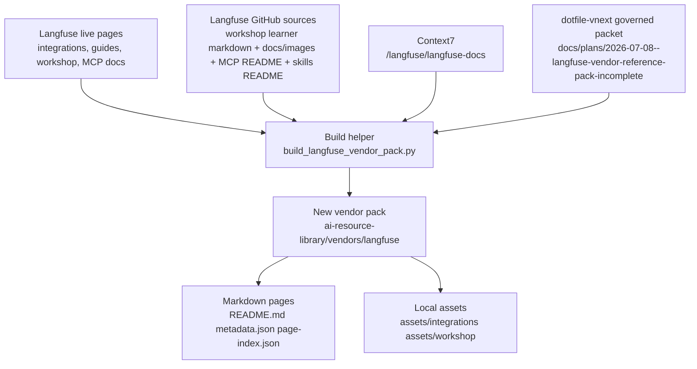
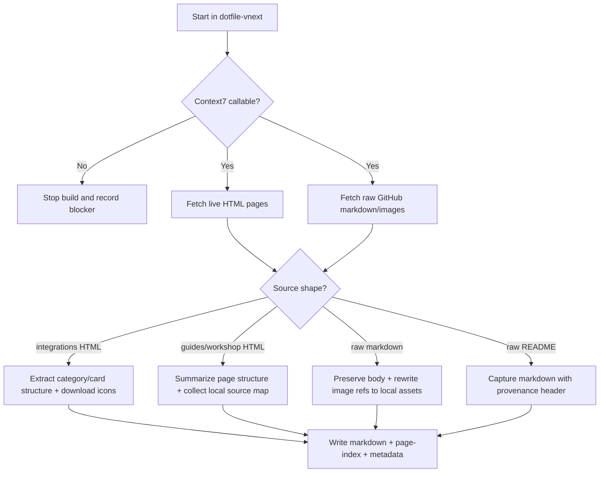
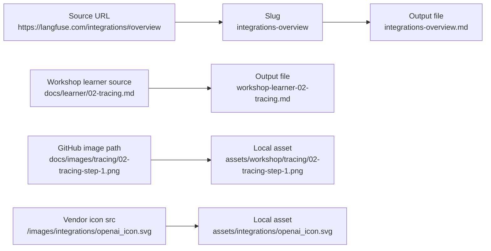

# Langfuse Vendor Reference Pack

## Summary

Build the beginning of a governed Langfuse vendor entry under the sibling AI
library at `/Users/joshc/develop/ai-resource-library/vendors/langfuse`, while
using `dotfile-vnext` as the planning, Context7, and build-control surface.

This slice captures:

- the Langfuse integrations overview page, with downloaded icon assets
- the Langfuse guides index page
- the Langfuse workshop index page
- every learner-module page linked from the workshop modules table
- workshop screenshots/diagrams from the GitHub `docs/images/` tree
- Langfuse MCP-related docs pages
- the Langfuse skills README and the Langfuse web MCP README from GitHub

The result should be a re-runnable vendor reference pack with local markdown,
local media assets, page/index metadata, and an explicit Context7 record.

## Capability Packet Boundary

| Field | Value |
|-------|-------|
| Capability identifier | `langfuse_vendor_reference_pack` |
| Owner manifest | None exists today; this packet governs the initial vendor-doc pack slice |
| Owned files | This packet under `docs/plans/2026-07-08--langfuse-vendor-reference-pack-incomplete/`; `ai-resource-library/vendors/langfuse/**`; one index update in `ai-resource-library/vendors/README.md` |
| Integration anchors | `dotfile-vnext` governed packet + helper, Context7 library `/langfuse/langfuse-docs`, Langfuse live-site pages, Langfuse GitHub workshop image tree |
| Update behavior | Re-run the retained helper to refresh the selected Langfuse pages, lesson files, metadata, and downloaded assets without reshaping the pack root |
| Removal behavior | Delete `vendors/langfuse`, remove the Langfuse row from `vendors/README.md`, and optionally delete this packet if the governed slice is retired |

## Source materials

- Integrations overview: `https://langfuse.com/integrations#overview`
- Guides index: `https://langfuse.com/guides`
- Workshop index: `https://langfuse.com/workshop`
- Workshop learner lessons: `https://langfuse.com/workshop/learner/*`
- Workshop images repo tree: `https://github.com/langfuse/langfuse-workshop/tree/main/docs/images`
- Workshop learner markdown source: `https://raw.githubusercontent.com/langfuse/langfuse-workshop/main/docs/learner/*.md`
- Skills README: `https://raw.githubusercontent.com/langfuse/skills/refs/heads/main/README.md`
- MCP docs pages:
  - `https://langfuse.com/integrations/other/mcp-use`
  - `https://langfuse.com/docs/api-and-data-platform/features/mcp-server`
  - `https://langfuse.com/integrations/developer-tools/vscode`
  - `https://raw.githubusercontent.com/langfuse/langfuse/refs/heads/main/web/src/features/mcp/README.md`

## Key changes

- Create a governed packet at `docs/plans/2026-07-08--langfuse-vendor-reference-pack-incomplete/README.md`.
- Retain the pack-regeneration helper at `docs/plans/2026-07-08--langfuse-vendor-reference-pack-incomplete/build_langfuse_vendor_pack.py`.
- Create a new vendor subtree at `/Users/joshc/develop/ai-resource-library/vendors/langfuse`.
- Update `/Users/joshc/develop/ai-resource-library/vendors/README.md` to advertise the new subtree.
- Materialize a Langfuse pack README, metadata, page index, markdown pages, and local assets.
- Download integration icons to local files and reference them from markdown using standard media paths.
- Download workshop screenshots/diagrams from the GitHub `docs/images/` tree and reconnect learner markdown to those local assets.
- Record Context7 library id, query topics, and purpose in the pack README and metadata.

## Build contract

### Output root

- Locked root: `/Users/joshc/develop/ai-resource-library/vendors/langfuse`

### Required pack files

- `README.md`
- `metadata.json`
- `page-index.json`
- `integrations-overview.md`
- `guides-overview.md`
- `workshop-overview.md`
- `workshop-learner-00-setup.md`
- `workshop-learner-01-base-app.md`
- `workshop-learner-02-tracing.md`
- `workshop-learner-03-prompt-management.md`
- `workshop-learner-04-monitoring.md`
- `workshop-learner-05-dataset.md`
- `workshop-learner-06-experiments.md`
- `workshop-learner-07-evaluation.md`
- `workshop-learner-08-wrap-up.md`
- `langfuse-skills-readme.md`
- `langfuse-mcp-readme.md`
- `mcp-use.md`
- `mcp-server.md`
- `vscode-integration.md`

### Required asset roots

- `assets/integrations/`
- `assets/workshop/`

### Content rules

- Every generated markdown page must include provenance metadata: source URL(s),
  capture date, and normalization notes.
- `integrations-overview.md` must preserve the category structure from the page
  and list the visible items under each category with local icon references when
  Langfuse exposes icon assets.
- When a visible integrations card has no source icon asset in the page HTML,
  keep the entry and annotate that the source rendered without a separate icon file.
- Workshop learner pages should preserve the raw learner markdown body as
  closely as practical, only normalizing image paths to local assets.
- Workshop image assets should remain grouped by lesson/topic directory shape
  from the upstream GitHub tree.
- `page-index.json` must map every generated markdown page to its source URLs
  and relevant asset paths.

## Context7 gate

- Probe result: pass
- Library id: `/langfuse/langfuse-docs`
- Query timestamp: `2026-07-08`
- Topics:
  - `integrations docs under paths like /docs/integrations/*`
  - `general guides and how-to content under content/guides/*`
  - `workshop/tutorial-style cookbook content generated into content/guides/cookbook/* from cookbook/ notebooks`
  - `MCP usage docs in content/docs/docs-mcp.mdx plus Docs MCP examples such as the public MCP server config and agent workflow examples`
- Purpose: Confirm the official Langfuse documentation library that best covers integrations, guides, workshop/tutorial content, and MCP usage docs for this vendor-pack slice.

## Checklist

- [x] P1 Create the governed packet and retain the helper script with it
- [x] P2 Create the `vendors/langfuse` subtree and anchor it from `vendors/README.md`
- [x] P3 Capture the integrations overview with category-preserving markdown plus local icon assets
- [x] P4 Capture the guides/workshop overview pages and every learner lesson page
- [x] P5 Download and reconnect workshop screenshots/diagrams from the GitHub image tree
- [x] P6 Capture the MCP/skills pages and record Context7 evidence in README/metadata
- [x] V1 Verify all required markdown files exist and `page-index.json` points to real files
- [x] V2 Verify local markdown asset references resolve to downloaded files
- [x] V3 Verify every requested source URL is represented in the pack output or metadata
- [x] V4 Verify integrations entries without source icon assets are explicitly annotated rather than silently dropped

## Apply / Verify / Undo / Change class

- Apply: write this packet, update the vendors index, and generate the new Langfuse vendor pack under the sibling AI library.
- Verify: file existence, JSON validity, asset-path resolution, requested-source coverage, and Context7/provenance records.
- Undo: delete `/Users/joshc/develop/ai-resource-library/vendors/langfuse`, revert the `vendors/README.md` anchor line, and delete this packet if the slice is retired.
- Change class: deterministic documentation collection and normalization; no host/runtime mutation.

## Architecture/Structure Diagram

## Capability Routing Diagram

## Naming/Modeling Diagram

## Test plan

- Verify the packet includes the capability boundary, required diagrams, and a plan verification receipt.
- Verify the helper writes output only under `/Users/joshc/develop/ai-resource-library/vendors/langfuse` plus the single vendors index anchor line.
- Verify the integrations page preserves all visible categories and records which entries had downloadable icon files versus source-no-icon entries.
- Verify every learner lesson page exists and any referenced local workshop asset exists on disk.
- Verify the pack README and metadata record the Context7 library id, query topics, and purpose.
- Verify `page-index.json` and `metadata.json` are valid JSON and point only to existing files.
- Verify each requested source URL is represented either by a generated page or by explicit metadata coverage.

## Assumptions

- This is the beginning of a reusable Langfuse vendor entry, so the packet remains `-incomplete` even if this source slice is fully built and verified.
- The pack root for this slice is `ai-resource-library/vendors/langfuse`, not a deeper product-specific subdirectory.
- The guides index page is treated as a curated landing page in this slice; individual guide leaf pages beyond workshop lessons are referenced, not fully materialized.
- Local graphics in this slice come only from downloaded Langfuse integration icons and the workshop GitHub image tree; no manual screenshots are created.

## On Deck — user decisions to integrate

| ID | User decision / direction | Target integration | Status |
|----|---------------------------|--------------------|--------|
| OD-1 | The integrations overview page should keep graphics via downloaded icon references | `integrations-overview.md` + `assets/integrations/` | integrated |
| OD-2 | Workshop learner-module pages should be captured from the workshop page’s learner column | learner markdown outputs + workshop overview | integrated |
| OD-3 | GitHub `docs/images/` assets should be downloaded and connected to the right lesson resources | `assets/workshop/` + rewritten lesson image refs | integrated |
| OD-4 | Context7 should be used when possible to connect the official Langfuse docs surface | Context7 gate + README/metadata records | integrated |
| OD-5 | MCP-related Langfuse pages and raw GitHub READMEs should be included in the new entry | required pack files + page index | integrated |

## Diagram gate receipt

- [x] Architecture/Structure included with live pages, GitHub sources, Context7, packet helper, and sibling-library outputs.
- [x] Capability Routing included for HTML pages, raw markdown, raw README capture, and the Context7 hard gate.
- [x] Naming/Modeling included for output slugs, learner-page mapping, workshop assets, and icon assets.
- [x] Diagram Inventory section included below.

## Plan verification receipt

**Slice:** initial Langfuse vendor-pack build
**Verified at:** 2026-07-08
**Verifier:** agent run

### Obligation inventory

| ID | Source | Obligation | In slice scope? | Status | Evidence |
|----|--------|------------|-----------------|--------|----------|
| O-01 | Key changes / P1 | Create governed packet and retain helper | yes | pass | `docs/plans/2026-07-08--langfuse-vendor-reference-pack-incomplete/README.md` and `build_langfuse_vendor_pack.py` created |
| O-02 | Key changes / P2 | Create `vendors/langfuse` and update vendors index | yes | pass | `/Users/joshc/develop/ai-resource-library/vendors/langfuse` created; `vendors/README.md` now includes `langfuse/` subtree row |
| O-03 | Build contract / P3 | Capture integrations overview with local icon assets | yes | pass | `integrations-overview.md` created with 8 categories; local integration assets written under `assets/integrations/` |
| O-04 | Build contract / P4 | Capture guides/workshop overview and learner lessons | yes | pass | `guides-overview.md`, `workshop-overview.md`, and 9 `workshop-learner-*` files created |
| O-05 | Build contract / P5 | Download workshop images and reconnect lesson refs | yes | pass | 121 total assets written; learner markdown refs rewritten to `assets/workshop/...` and verification passed |
| O-06 | Build contract / P6 | Capture MCP/skills surfaces and record Context7 evidence | yes | pass | `mcp-use.md`, `mcp-server.md`, `vscode-integration.md`, `langfuse-skills-readme.md`, `langfuse-mcp-readme.md`, plus Context7 record in pack `README.md` and `metadata.json` |
| O-07 | Test plan / V1 | Verify required files and page-index coverage | yes | pass | Verification run returned `VERIFY_OK` with 17 page-index entries and all output files present |
| O-08 | Test plan / V2 | Verify local markdown asset references resolve | yes | pass | Verification run confirmed lesson/workshop and page-index asset paths exist on disk |
| O-09 | Test plan / V3 | Verify every requested source URL is represented | yes | pass | Coverage audit returned `requested_sources_missing: []` |
| O-10 | Test plan / V4 | Explicitly annotate integrations entries with no source icon assets | yes | pass | `integrations-overview.md` preserves native no-icon cards with `Source card rendered without a separate icon file.` annotations |

### Summary

- In-scope obligations: 10 - pass: 10, fail: 0, blocked: 0, pending: 0
- Deferred: 0

### Completion gate

- [x] Every in-scope obligation is `pass` or `n/a` with reason
- [x] Change-contract Verify demonstrated for this slice
- [x] `depends_on_plans` satisfied or not applicable
- [x] No in-scope obligation skipped because it was not duplicated in `## Checklist`
- [x] No unresolved `On Deck` row remains outside the plan body, checklist, dependency graph, or rejection note
- [x] Missing resources were researched and scaffolded where clear before being treated as blockers
- [x] Dependency order is represented in the implementation flow for this documentation slice
- [x] Exact candidate resources from brainstormed intake are either source-backed or still marked `pending_research` / `provisional_example`

## Diagram Inventory

- Architecture/Structure Diagram: included
- Capability Routing Diagram: included
- Naming/Modeling Diagram: included
- Sequence Diagram: N/A for this slice; the routing diagram is sufficient
- State Diagram: N/A for this slice; no runtime state machine is introduced
