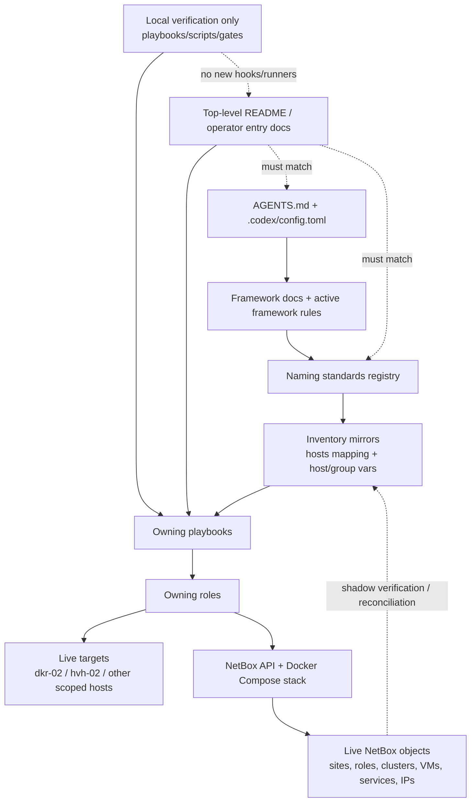
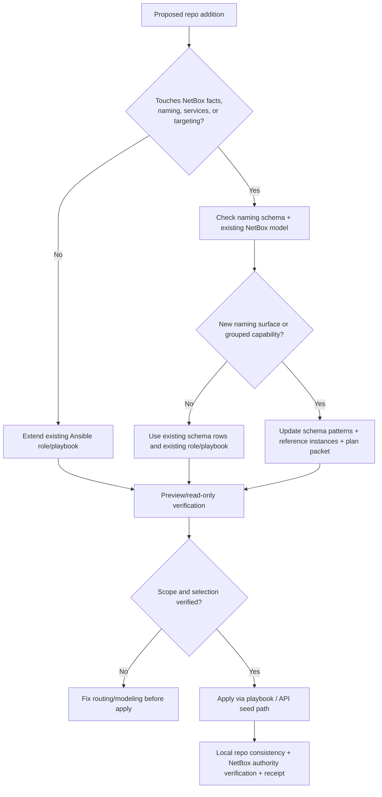
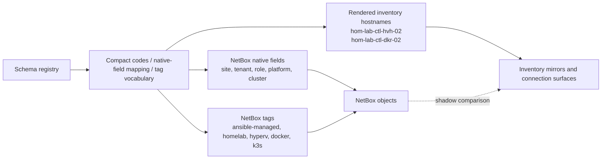

# NetBox + Ansible framework lock-in

## Summary

- Lock the repo to one durable operating model:
  - NetBox owns infrastructure facts and naming intent
  - Ansible owns lifecycle execution and convergence
- Keep `inventory/netbox.yml` in shadow/comparison mode until reconciliation
  evidence supports broader promotion.
- Refresh the top-level operator story so it points at current entrypoints and
  local verification surfaces instead of missing bootstrap playbooks.
- Keep this slice local-first:
  - no new git hooks
  - no new GitHub Actions
  - no new remote CI/runners
  - no new git-enforced automation beyond what already exists

## Capability Packet Boundary

| Field | Value |
|-------|-------|
| Capability identifier | `netbox_ansible_framework_lock_in` |
| Owner manifest | None; this is a framework-alignment slice over existing NetBox + Ansible surfaces |
| Owned files | This packet and targeted updates to active operator-facing docs plus the NetBox service-model alignment needed for reconciliation pass |
| Integration anchors | `README.md`, `roles/ipam_netbox/README.md`, `roles/ipam_netbox/defaults/main.yml`, `roles/ipam_netbox/tasks/seed_hom_lab_ctl_hvh_01_vm_model.yml`, `playbooks/deploy_ipam_netbox.yaml`, `playbooks/reconcile_netbox.yaml`, `inventory/hosts_mapping.yaml`, `docs/reference/connection-surfaces.md`, `docs/reference/naming-standards/live-object-registry.yml` |
| Update behavior | Preserve current lifecycle and connection-surface contracts while tightening docs and verification guidance |
| Removal behavior | Revert this packet and the README alignment changes; leave the NetBox capability intact |

## Public Interfaces / Types

- `ipam_netbox_state: present|absent` remains the NetBox lifecycle control point.
- Future grouped additions that touch NetBox facts, naming, services, registry
  rows, or host targeting must carry:
  - a stored plan packet
  - `netbox_scope: true` when applicable
  - `## Mandatory NetBox slice`
  - `## Plan verification receipt`
- New naming surfaces must update schema/pattern files before inventory mirrors.
- Verification surfaces added or documented by this slice remain local commands,
  playbooks, and scripts rather than new hook or runner enforcement.

## Implementation Changes

- Replaced stale README bootstrap guidance with current steady-state entrypoints:
  `site.yaml`, `deploy_development_nodes.yaml`, `mac/mcp_servers.yaml`,
  `deploy_ipam_netbox.yaml`, and `reconcile_netbox.yaml`.
- Reframed the top-level repo story around the active NetBox-first authority
  model and shadow NetBox inventory posture.
- Added a durable plan packet for this framework lock-in so future additions
  have a clear local-first verification and NetBox-scoped completion contract.
- Realigned the storage-lane service model to current desired state:
  `langfuse-web` stays off on `hom-lab-ctl-dkr-01` while
  `stacks_network_langfuse_compose_enabled: false`, and stale duplicate service
  objects on the wrong VM are removed through the existing preview/apply seed
  path.
- Preserved the existing role/playbook lifecycle interfaces and existing local
  verification surfaces; did not add new hooks, workflows, or runner-only paths.

## Architecture/Structure Diagram

## Capability Routing Diagram

## Naming/Modeling Diagram

## Mandatory NetBox slice

### Objects affected

- Operator-facing authority text for NetBox-managed naming and facts
- Repo-local verification surfaces for NetBox-scoped work
- Packet-level completion contract for future NetBox-aware additions
- Storage-lane NetBox service ownership for `postgres-fuzlang`, `minio-api`,
  `minio-console`, and the disabled `langfuse-web` drift cleanup

### Declared / Applied / Verified

- **Declared:** `README.md`, this packet, the connection-surface contract, and
  existing NetBox playbook/role surfaces now agree on the active authority
  model and shadow inventory posture.
- **Applied:** this slice reuses the existing `deploy_ipam_netbox.yaml`
  lifecycle to apply the storage-lane service-model cleanup, plus the existing
  read-only `reconcile_netbox.yaml` / `netbox-authority-gate.sh` surfaces.
- **Verified:** static plan/governance checks, repo consistency, and the full
  read-only authority reconciliation gate were executed and recorded below.

## Checklist

- [x] **FL-1** — Top-level README aligned to current steady-state entrypoints
- [x] **FL-2** — Missing bootstrap references removed or relabeled as historical
- [x] **FL-3** — NetBox-first authority model documented at the repo entry surface
- [x] **FL-4** — Local verification surfaces documented without adding new hook or runner enforcement
- [x] **FL-5** — Static NetBox authority gate passes
- [x] **FL-6** — Storage-lane NetBox service model reconciled to current desired state
- [x] **FL-7** — Full read-only NetBox authority reconciliation passes
- [x] **FL-8** — No new git hooks, GitHub Actions, or remote runner dependencies introduced

## Apply / Verify / Undo / Change class

| | |
|--|--|
| **Apply** | Align operator/docs entry surfaces to the current framework, preserve existing NetBox lifecycle interfaces, and route future NetBox-aware additions through schema -> plan packet -> preview -> apply -> verification |
| **Verify** | Confirm stale README references are gone or historical, syntax-check active playbooks, run repo consistency, run static NetBox authority gate, and run full read-only authority reconciliation |
| **Undo** | Revert the README and plan packet alignment changes; leave the existing NetBox deployment capability intact |
| **Class** | Framework/process hardening plus documentation and governance alignment |

## Plan verification receipt

**Slice:** framework lock-in  
**Verified at:** 2026-07-08  
**Verifier:** Codex agent run

### Obligation inventory

| ID | Source | Obligation | In slice scope? | Status | Evidence |
|----|--------|------------|-----------------|--------|----------|
| O-01 | FL-1 | Active entrypoints documented in `README.md` | yes | pass | `README.md` now points to `playbooks/site.yaml`, `playbooks/deploy_development_nodes.yaml`, `playbooks/mac/mcp_servers.yaml`, `playbooks/deploy_ipam_netbox.yaml`, and `playbooks/reconcile_netbox.yaml` |
| O-02 | FL-2 | Missing bootstrap playbooks removed from active operator guidance | yes | pass | `README.md` historical section relabels `bootstrap_execution_node`, `boostrap_windows_ssh_via_winrm`, `bootstrap_server_225`, `bootstrap_local`, and `deploy_shell_config` as non-active |
| O-03 | FL-3 | Top-level operator story reflects NetBox facts authority and Ansible execution authority | yes | pass | `README.md` sections `Current Operating Model`, `Active Entry Points`, and `NetBox Transition` |
| O-04 | FL-4 | Local-first verification documented with no new hook/runner path | yes | pass | `README.md` section `Local Verification Surfaces`; no new files under `.github/workflows/`, `.git/hooks/`, or hook config added in this slice |
| O-05 | Verify (contract) | Active NetBox/Ansible entrypoint playbooks syntax-check cleanly | yes | pass | `bin/codex-env ansible-playbook -i inventory/inventory.yaml playbooks/site.yaml --syntax-check`; `playbooks/deploy_development_nodes.yaml --syntax-check`; `playbooks/deploy_ipam_netbox.yaml --syntax-check`; `playbooks/reconcile_netbox.yaml --syntax-check` |
| O-06 | FL-5 | Static NetBox authority gate passes | yes | pass | `bin/netbox-authority-gate.sh --static-only` |
| O-07 | FL-6 | Storage-lane NetBox service model reconciled to current desired state | yes | pass | Preview: `ansible-playbook playbooks/deploy_ipam_netbox.yaml --tags ipam_netbox_seed_hom_lab_ctl_hvh_01_vm_model_preview` showed stale `postgres-fuzlang`, `minio-api`, `minio-console` on `hom-lab-ctl-dkr-02`, then retired `langfuse-web` on `hom-lab-ctl-dkr-01`; apply: `--tags ipam_netbox_seed_hom_lab_ctl_hvh_01_vm_model` removed stale service objects and converged the remaining storage-lane services |
| O-08 | FL-7 | Full read-only NetBox authority reconciliation passes | yes | pass | `bin/netbox-authority-gate.sh`; final summary `pass: true`, `failure_reasons: []`, and artifacts `artifacts/netbox-reconciliation/latest.json`, `artifacts/netbox-reconciliation/latest.inventory-compatibility.json`, `artifacts/netbox-service-inventory/latest.json` |
| O-09 | FL-8 | No new git hooks, GitHub Actions, or remote runner dependencies introduced | yes | pass | Repo changes in this slice are limited to docs, NetBox seed/default surfaces, and the plan packet; no new workflow, hook, or runner files were added |
| O-10 | Frontmatter | `netbox_scope: true` packet includes Mandatory NetBox slice and receipt | yes | pass | This packet includes both required sections |
| O-11 | Depends on plan | Existing NetBox integration direction remains the basis for this slice | yes | pass | `docs/plans/2026-05-08--netbox-naming-and-ansible-integration/README.md` reviewed and this packet preserves its authority split |

### Summary

- In-scope obligations: 11
- Pass: 11
- Fail: 0
- Blocked: 0
- Pending: 0
- Deferred: 0

### Completion gate

- [x] Every in-scope obligation is `pass` or `n/a` with reason
- [x] Change-contract Verify demonstrated for this slice
- [x] `depends_on_plans` satisfied or documented with evidence
- [x] No in-scope obligation skipped because it was not duplicated in `## Checklist`
- [x] No unresolved `On Deck` row remains outside the plan body
- [x] Missing roles/playbooks/resources were researched before being treated as blockers
- [x] Dependency order remains represented in executable Ansible entrypoints
- [x] No brainstormed exact resources were promoted without current repo evidence

## Diagram gate receipt

- [x] Architecture/Structure: repo paths, external resources, data/control flow, naming scheme, variable SSOT sources, tag/playbook wiring
- [x] Capability Routing: included
- [x] Naming/Modeling: included
- [x] Diagram Inventory lists every required section above, not only diagrams actually drawn

## Diagram Inventory

### Diagrams included

- Architecture/Structure Diagram
- Capability Routing Diagram
- Naming/Modeling Diagram

### Additional diagrams available on request

- verification/evidence flow diagram
- NetBox object hierarchy slice for a specific host family
- playbook-to-tag execution map for NetBox seeding and reconciliation
